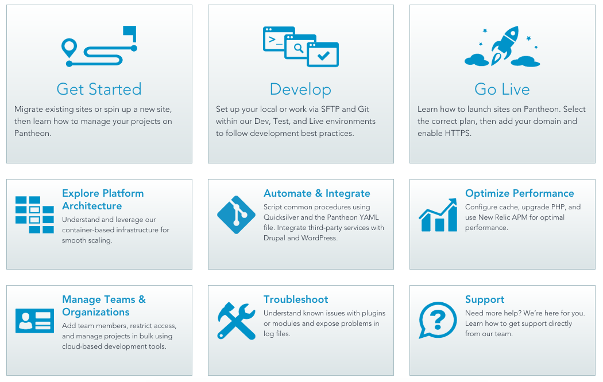

## Platform Improvements
### Terminus Manual and Terminus 1.0 Beta Releases
Terminus 1.0 is now available as a public beta, complete with a [new manual](/terminus). In this release, we’ve updated the command structures and transitioned from a PHP based framework to Symfony Console. You can [compare differences here](/terminus/get-started/legacy). If you find bugs in the latest version, please [submit them along with feature requests here](https://github.com/pantheon-systems/terminus/issues/new?mkt_tok=eyJpIjoiTjJRMk1qRmpNbU5tWm1NMyIsInQiOiJMdzVaRGFCbXY5bEJHa2h4NE5FNlFiejBGdkxNZTFxUGphMUwxWXVocitoRTJoZUlDQVhlUnNaUDlWTjh1ZU5waU1tT3R2OHYzVGk3K2c4SnFzWWJBVm9KdUNSbzNXMFVwR1BIbGt2OUFoUTR1UkN5Q21rc0dUSEh5amo5WHlGaiJ9).

### Documentation and Trailing Relaunch
We've categorized our existing documentation by common user objectives to make resources easier to find. Also included in this relaunch is the groundwork for our all new video training. [Explore introductory videos](https://pantheon.io/docs) and stay tuned for more video content coming soon!

### Privacy Shield Framework Compliance
Pantheon is now [compliant with the Privacy Shield Framework](https://www.privacyshield.gov/participant?id=a2zt0000000TP2CAAW). For more details, see [this blog post](https://pantheon.io/blog/announcing-privacy-shield-framework-compliance) by Sal Hernandez.

### WordPress 4.7 Core Update
WordPress 4.7 has been pushed to all Pantheon Dashboards. This update includes changes to core in addition to Pantheon specific changes. See [WordPress.org](https://wordpress.org/news/2016/12/vaughan/) for a full list of changes to core and review our documentation to see what’s new for Pantheon sites.

### WordPress 4.7 Security Patches
Pantheon has released two security patches for WordPress 4.7. For details, see [WordPress 4.7-p1 - CVE-2016-10033](https://status.pantheon.io/incidents/46rscpq4jk4j) and [WordPress 4.7-p2 - CVE-2016-10045](https://status.pantheon.io/incidents/hbxq7ht52jm0).

### Drupal Core Updates
[Drupal 8.2.4](https://www.drupal.org/project/drupal/releases/8.2.4) and [Drupal 7.53](https://www.drupal.org/project/drupal/releases/7.53) releases have been pushed to all Pantheon Dashboards.

### Upgraded WP-CLI
Upgraded from 0.24.1 to 1.0.0. [Learn more](https://make.wordpress.org/cli/2016/11/29/version-1-0-0/).

### Supported MIME Types
The following [MIME types](/mime-types) have been added to the platform and are now supported:
`application/twbx twbx;`

`application/twb twb;`

## Documentation

### New Articles

[Debug Intermittent PHP 7 Notices](/deprecated-constructor-notices)

[Environment-Specific Configurations for Drupal 9](/environment-specific-config-d9)
