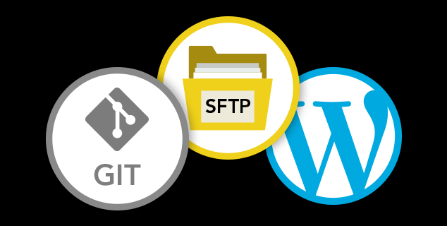

## Platform Improvements

### Custom Upstreams
We’ve opened access to Custom Upstreams for all organizations on Pantheon. Read more about it on our [blog](https://pantheon.io/blog/announcing-new-pantheon-upstream-workflow), or [give it a try](/custom-upstream).

### Terminus 1.6
If you haven’t updated Terminus recently, check out the <a href="/docs/terminus/updates#changelog" data-proofer-ignore>Terminus Changelog</a> to see what’s new and update to the <a href="/docs/terminus/updates#update-to-the-current-release-" data-proofer-ignore>current release</a>.

### WebP Image Support
[WebP](https://developers.google.com/speed/webp/), a new image format created by Google, is now supported by Pantheon’s Global CDN.

### PHP 7.1 & IonCube Decoder
We’ve made [PHP 7.1](http://www.php.net/ChangeLog-7.php#7.1.0) available for all sites.  See our documentation to learn how to [upgrade your PHP version](/php-versions), or learn more in [this blog post](https://pantheon.io/blog/php-71-ioncube-decoder-now-available-all-sites-pantheon).

### WordPress Core Upgrades
[WordPress 4.8.3](https://codex.wordpress.org/Version_4.8.3) has been [pushed](https://github.com/pantheon-systems/WordPress/pull/139) to all WordPress site dashboards. This release is classified as a critical [security release](https://status.pantheon.io/incidents/gd6ls2q28j2h), and we encourage all sites to upgrade immediately.

## Documentation

### [Using Git with SFTP & WordPress](/guides/wordpress-git)
Learn how to use the WordPress dashboard, an SFTP client, and your text editor of choice to work quickly, safely and easily on Pantheon's Git-based platform.
