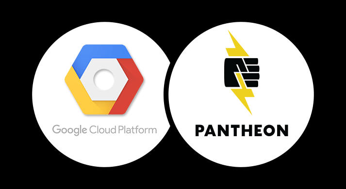

## Pantheon Moves to Google Cloud Platform

Pantheon has switched infrastructure providers from Rackspace to Google Cloud Platform. This switch requires no downtime, as we actually did it *six months ago*! Read the announcement [here](https://pantheon.io/blog/pantheon-moves-google-cloud-platform).

## Platform Improvements

### PHP Upgrades
We've upgraded to PHP [5.6.33](http://php.net/ChangeLog-5.php#5.6.33), [7.0.27](http://php.net/ChangeLog-7.php#7.0.27), [7.1.13](http://php.net/ChangeLog-7.php#7.1.13), and [7.2.1](http://php.net/ChangeLog-7.php#7.2.1). See our documentation to learn how to [upgrade your PHP version](/php-versions).

### WP-CLI Upgrades
WP-CLI on Pantheon has been upgraded to [1.5.0](https://make.wordpress.org/cli/2018/01/31/version-1-5-0-released/), which resolves "Error: Site not found" failures often seen when clearing caches on WordPress Site Networks.

### WordPress Core Upgrade
[WordPress 4.9.3](https://codex.wordpress.org/Version_4.9.3) has been pushed to all WordPress site dashboards.

### Drupal Core Upgrades
[Drupal 8.4.4](https://www.drupal.org/project/drupal/releases/8.4.4) has been pushed to all Drupal 8 site dashboards.

### Registry Rebuild Upgrade
We've upgraded Registry Rebuild on Pantheon to [7.x-2.5](https://www.drupal.org/project/registry_rebuild/releases/7.x-2.5). For details on using this Drush extension, see [Drupal Drush Command-Line Utility](/drush/#registry-rebuild).

### Launch Check Now Supports Drupal 8
Drupal 8 sites now support Launch Check, found in the Status tab of any environment, to report best practice recommendations before going live. For more details, see [Launch Check - Drupal Performance and Configuration Analysis](/drupal-launch-check).

### New Relic PHP 7.2 Support
New Relic on Pantheon has been upgraded to version [7.7.0.203
5.0.199](https://docs.newrelic.com/docs/release-notes/agent-release-notes/php-release-notes/php-agent-770203), which supports PHP 7.2.

### Bug Fixes and Improvements

## Documentation

### [Running WordPress and Drupal as a Backend API](/headless)
Learn the basics of using WordPress or Drupal as a headless API backend.

### [Manage Some Dependencies with Composer](/guides/partial-composer)
Get your feet wet with Composer on WordPress or Drupal 7 before going all in.
