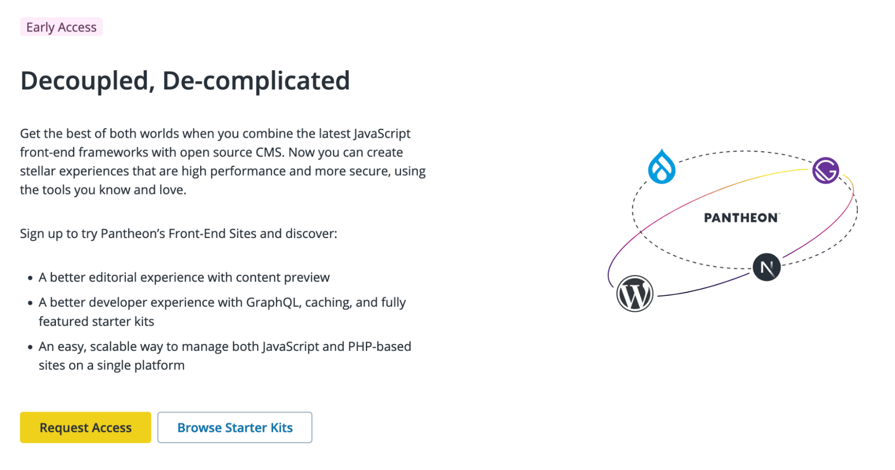

## Feature and Product Release Updates
### Object Cache Pro
WordPress sites can now leverage an upgraded object caching solution on Pantheon! Object Cache Pro is a highly optimized premium WordPress plugin that integrates with Redis for business class performance. [Find out more about our perspective Object Caching from Steve Persch, Director of Developer Experience](https://pantheon.io/blog/pantheon-includes-object-cache-pro-painless-improved-performance).

See Pantheon’s documentation for instructions on [how to enable Object Cache Pro](/object-cache/wordpress). Or join the [#WordPress Slack Channel](http://slackin.pantheon.io) to connect with other customers using Object Cache Pro.

### Front-End Sites Enhancements

We released version 1.0.5 of the [WP Decoupled Preview plugin](https://wordpress.org/plugins/decoupled-preview/) which contains a bug fix specific to WordPress 6.3. WP Decoupled Preview enables content editors to see their changes in the context of a front-end framework (served through [Pantheon's Front-End Sites](/guides/decoupled/overview)) like Next.js. To try this functionality, request access to Front-End Sites and [follow our tutorial for spinning up our WordPress + Next.js starter](/guides/decoupled/wp-nextjs-frontend-starters).

Can you tell we want more teams to sign up for Front-End Sites? If you don't yet have access, as of the last month you'll now see callouts in the site creation flow that lead to Front-End Sites Access:

Thanks to efforts in the last month, once you spin up new codebases in Front-End Sites, you will also find:
- Newly improved readme files in your fresh projects.
- Health checks that fire early in the build process if your Front-End Site may be likely to fail due to missing variables for a back-end CMS
- A better navigation and search functionality for [the Decoupled Kit project documentation](https://decoupledkit.pantheon.io/docs).

Want to chat more about these kinds of sites? Join the [#front-end-frameworks](https://pantheon-community.slack.com/archives/C01DXGMFZFB) Slack Channel.
### WordPress Multisite Search and Replace
WordPress Multisites can now run automated Search and Replace when cloning the database between environments or spinning up new environments.

Subdomain Multisites can use a domain map to define the URLs between environments, or auto-convert to a subdirectory Multisite in non-live environments.

For more information, see Pantheon’s documentation on [Search and Replace](/guides/multisite/search-replace/).Or join the [#WordPress Slack Channel](http://slackin.pantheon.io) to connect with other Pantheon customers & super-users.

### Early Access: Customer Scheduled Jobs
[The Terminus Scheduled Jobs Plugin](/customer-scheduled-cron-jobs) allows you to schedule and automate specific cron jobs according to site requirements without affecting performance.

You can specify the desired frequency (e.g., daily, weekly, monthly, hourly), and the actions to be performed. The system then executes the scheduled jobs automatically based on the provided instructions. Helps with long running jobs by granting a total budget of 300 mins (in a 24 hr period) to run jobs.
### Early Access: Streamlined User Offboarding
Helps Workspace Admins more effectively manage user access by providing the ability to offboard users from multiple sites in a single click.

For more information, see Pantheon’s documentation on [Workspace Offboarding](/workspace-offboarding). Or join the [#WordPress Slack Channel](http://slackin.pantheon.io) to connect with other Pantheon customers & super-users.
## Platform Updates
### PHP Security Updates
Pantheon has deployed PHP versions [8.2.9](https://www.php.net/ChangeLog-8.php#8.2.9), [8.1.22](https://www.php.net/ChangeLog-8.php#8.1.22), and [8.0.30](https://www.php.net/ChangeLog-8.php#8.0.30) to customer sites running on the platform. These releases address vulnerabilities disclosed in [CVE-2023-3823](https://nvd.nist.gov/vuln/detail/CVE-2023-3823) and [CVE-2023-3824](https://nvd.nist.gov/vuln/detail/CVE-2023-3824).

If you are using PHP 8.2, 8.1 or 8.0, there is nothing further that you need to do. If you are still on PHP 7.4 or earlier, though, you should schedule some time to upgrade to a supported version.While the vulnerabilities patched in these latest releases are not reported to affect PHP 7.4, the fact remains that there could be (and probably are) unpatched vulnerabilities in the end-of-life versions. Read more about it in Greg Anderson’s [blog post](https://pantheon.io/blog/php-829-security-release-demonstrates-pantheons-commitment-protecting-your-sites).
### New PHP Defaults
Pantheon has pushed an update to WordPress and Drupal 7 core upstreams which sets PHP 8.1 as the new default PHP version, rather than 7.4.

Please test this core update thoroughly before deploying to the Live environment. If your site requires an older version of PHP, or if you'd like to upgrade to PHP 8.2, see [Pantheon’s documentation on how to manage PHP versions via the pantheon.yml configuration file](/guides/php/php-versions).

### Solr Search for WordPress 2.5.0 Update
We released an update for the [Solr Search for WordPress plugin](https://wordpress.org/plugins/solr-power/) which disables auto-commit by default and allows cron to push solr commits regularly instead.

This drastically improves the performance of large sites and avoids 503 errors related to hard committing on every update. This update is recommended for all WordPress sites currently running the plugin.

You can still enable auto-commit by explicitly setting `SOLRPOWER_DISABLE_AUTOCOMMIT` to `false`.

### Pantheon Advanced Page Cache WordPress Plugin Updates
We released an update for the [Pantheon Advanced Page Cache](https://wordpress.org/plugins/pantheon-advanced-page-cache/) WordPress plugin which adds a filter to allow disabling surrogate keys for posts' taxonomy terms. This can be especially helpful for posts with large numbers of taxonomies (such as WooCommerce products with a large number of global attributes).

For more information, see [Pantheon documentation](/guides/wordpress-configurations/plugins#disable-surrogate-keys-for-taxonomy-terms).
