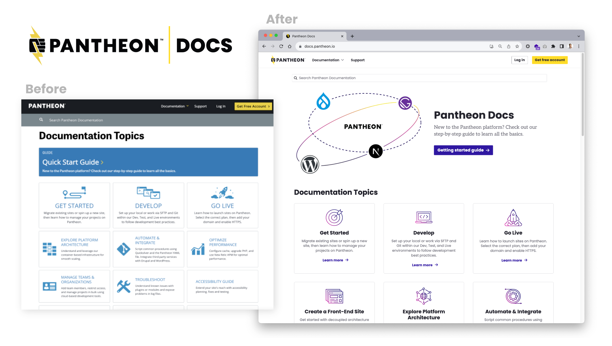

## Feature and Product Release Updates

### Design System Integration: Docs
We're excited to announce that our documentation site has been seamlessly integrated with our brand-new design system. This enhancement brings a fresh and cohesive look to our documentation, providing a unified and visually appealing experience for our users. Explore the updated, improved, and more accessible [Docs site](/) today.

## Platform Updates

### Drupal Security Update
On September 20th, [Drupal core updates were released to address a critical vulnerability in the JSON:API module](https://status.pantheon.io/incidents/vj842n7k7w40). Those updates became immediately available within the Pantheon dashboard for one-click code updates. Additionally, [our engineers updated our CDN to mitigate potential attacks](https://status.pantheon.io/incidents/598zxv2v8l7p).

If you have a Drupal site using JSON:API we suggest you update as soon as possible if you haven't done so already. And even if you aren't using JSON:API, it'll still feel good to apply an update, right? To better understand the nature of security updates, [come watch the Pantheon YouTube Livestream on October 25th](https://www.youtube.com/watch?v=WV2ZSeBOziU).

### PHP Memory Limits Updates
Sometimes you just need more memory to serve your site reliably. To learn more about why we doubled the memory for most site plans, [check out this blog](https://pantheon.io/blog/pantheon-increases-php-memory-limits-performance-and-elite-plans) by Rachel Whitton, Lead Technical Writer here at Pantheon.

To take advantage of the increased memory limit, [contact our customer support team](/guides/support/contact-support/). Or drop by our [regular Zoom-based office hours](http://pantheon.io/developer-community/office-hours).

### Front-End Sites Settings
The Pantheon Front-End Sites Settings page is now available for users of the WordPress for Front-End project. It provides a simplified post install experience where users can copy environment variables for use in the Front-End Sites dashboard, and also test their preview endpoint. Instructions for creating a new WordPress project [can be found here](https://decoupledkit.pantheon.io/docs/backend-starters/decoupled-wordpress/creating-a-new-project).
Want to chat more about these kinds of sites? Join the [#front-end-frameworks](https://pantheon-community.slack.com/archives/C01DXGMFZFB) Slack Channel.

### WPML Improved Edge Caching Compatibility - Cache Hit Ratio Increased 24%
Global CDN now has improved compatibility with the WPML multilingual WordPress plugin. Page variations for each language can be cached at the edge. This update was rolled out automatically for all sites that use the WPML plugin and increased site cache hit ratio by 24% on average.

### PHP 8.1 and 8.2 updated to their latest patch releases
PHP 8.2.11 and 8.1.24 were released on the platform. They contain the latest bug fixes and security releases for PHP. As a reminder, PHP 8.0 will reach End-of-Life on 26 November 2023. For the best performance and security, Pantheon recommends running PHP 8.1 and above.

## Events

### WordPress Performance Office Hours
Optimizing your WordPress site to boost performance can result in higher conversion rates and a better user experience! [Join us Wednesday October 18th, at 2pm EST/11am PST](https://pantheon.zoom.us/j/97643364276) to learn more about how to best configure your site's edge & object caching, scale your database, and troubleshoot slow pages.

Looking to connect with other WordPress developers? Join the Pantheon Community [#WordPress](https://pantheon-community.slack.com/archives/C01DXGMFZFB) Slack Channel.

### Cybersecurity Month Livestream
October is Cybersecurity Awareness Month! [Join us on October 25th for a special YouTube Livestream](https://www.youtube.com/watch?v=WV2ZSeBOziU) as we discuss how security releases play out in the open source ecosystem.
