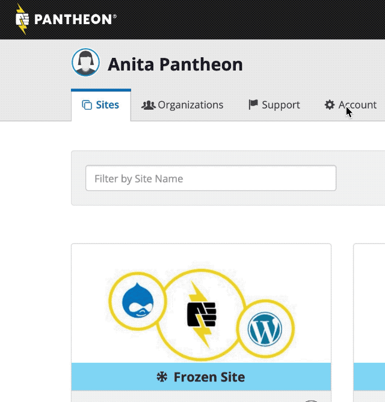

## Access Account Billing

1. Go to the User Dashboard and select ** Account**.
1. Click the **Billing** tab.

Review **credit card profiles** for the sites you pay for and own on Pantheon. Each credit card profile shows billing history (invoices and transactions) for any site(s) using the card as the payment method, as set in the Site Dashboard. To add a new card to your account, refer to [Manage Site Billing in the Site Dashboard](/site-billing).

### Roles & Permissions

The permission to update credit cards and view history is granted only to the role of **Site Owner**. You can see who is assigned this role by clicking ** Team** in the Site Dashboard. Other roles do not have access to billing as described on this page.

<Alert title="Note" type="info">

If you need to assume site and billing ownership, the current Site Owner must [transfer it to you directly](/site-billing#transfer-ownership-and-billing-for-this-site).

</Alert>

## View Invoices

<Partial file="view-invoices.md" />

## View History

1. Go to the User Dashboard and select ** Account**, then click **Billing**.
1. Click **View History** for the credit card profile in question.

The credit card history will show the last 100 transactions.

## Update Card

1. Go to the User Dashboard and select ** Account**, then click **Billing**.
1. Use the **Update Card** button when you would like to:
   * Update an existing card after it has expired
   * Switch billing to a new card for sites in bulk
   * Update billing address

Changes made here will apply across all sites associated with the credit card profile.

## Delete Card

All sites must be disassociated from the card before it can be deleted.

<Alert title="Warning" type="danger">

Deleting a card profile from your account will also delete it's associated billing history (invoices and transactions). Go to **View Invoices** to download past invoices, prior to deleting your credit card profile.

</Alert>

1. For each site associated with the credit card, go to the Site Dashboard and click on the **Billing** tab, then update the payment method shown in [your credit cards](/site-billing#your-credit-cards). Each site on a paid plan must be associated with a card.
1. Go to the User Dashboard and select ** Account**, then click **Billing**.
1. Once the card reports **This card is not paying for any sites.**, click **Delete Card**.
1. Check the box next to **Yes, delete my card.** and click **Delete Card**.

## See Also

- [Billing in the Site Dashboard](/site-billing)
- [New Site Owner FAQs](/site-owner-faq)
- [Manage Plans in the Site Dashboard](/site-plan)
