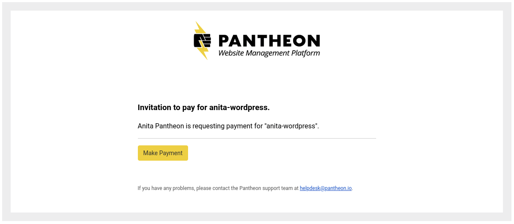
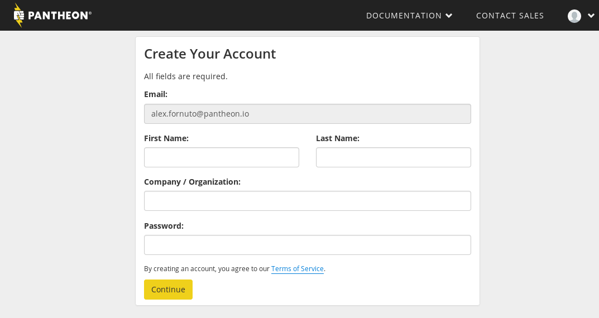
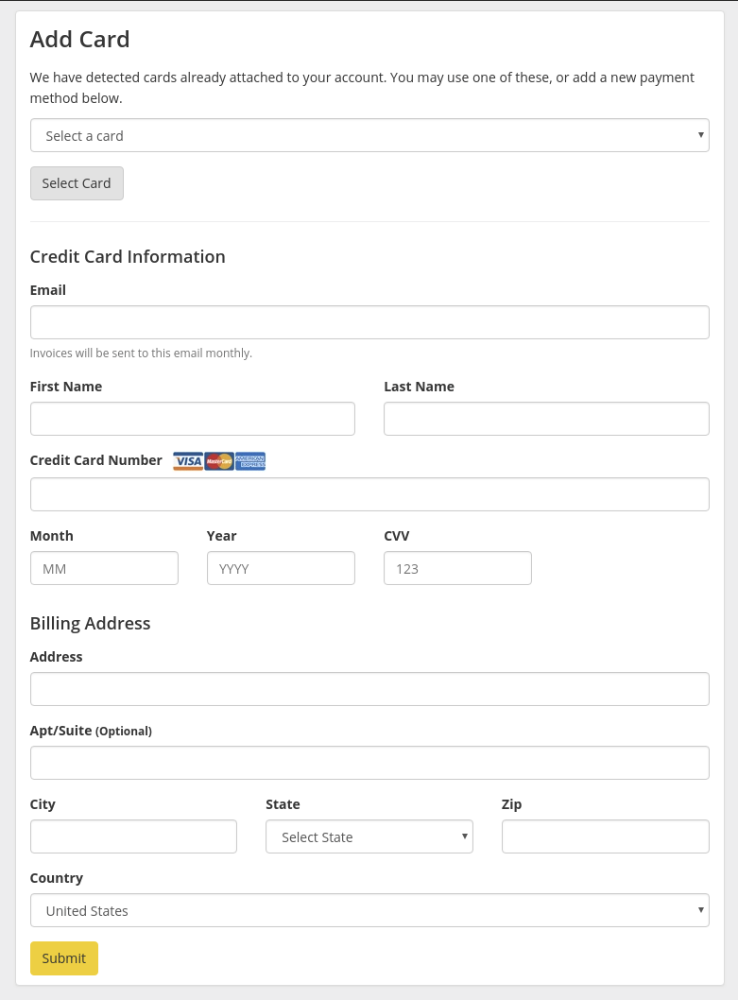

[Partner Agencies](https://pantheon.io/plans/partner-program?docs) on Pantheon receive additional levels of support and [Preferred Pricing](https://pantheon.io/plans/agency-preferred-pricing?docs) for themselves and their clients. This doc explains how to share those benefits by adding a client's site to your Agency.

While many of these steps are followed through the normal course of an Agency-Client relationship. We've collected them here as a quick reference.

## Client Adds Supporting Organization

<Partial file="add-supporting-org.md" />

## Transfer Ownership and Billing for the Site to an Agency

<Partial file="transfer-ownership-billing-steps.md" />

## Send an Invitation to Pay to Share Preferred Pricing

In order to share Preferred Pricing with a new client or to maintain Preferred Pricing through a plan change, the Agency should follow these steps:

<Partial file="invite-to-pay.md" />

## Accepting an Invitation to Pay

1. When a supporting organization is ready to transfer ownership of the site to you, you'll receive an email inviting you to pay for the site:

   

1. When you click on **Make Payment** you'll be brought to one of two pages:

   If you're **not logged in**, you'll be prompted to create a new account:

   

   If you don't already have a Pantheon account, fill out the required fields and click **Continue**.

   If you already have an account, Click on  in the upper right corner, then **My Dashboard** to log in to your account. Then go back to the email and click on **Make Payment** to proceed under your existing account.

1. If you have an account and are logged in, or created an account in the previous step, you'll be asked to use an existing card if one is on file or add a card to use as payment for the site:

   

Once you've accepted the invitation, you will receive invoices at the end of the billing cycle.
