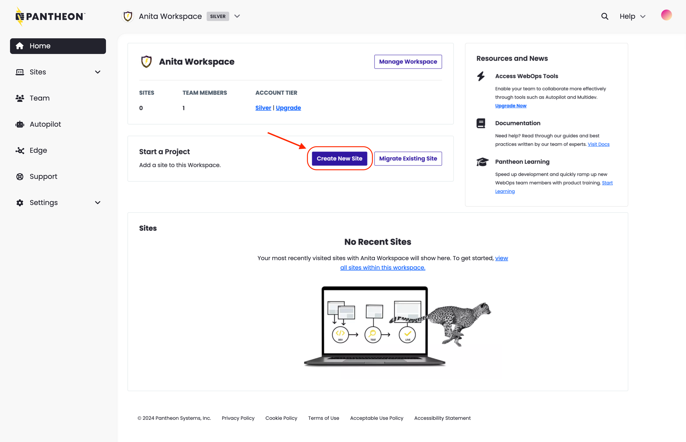

Custom Upstreams act as a scaffold for new sites, allowing developers and site owners of any skill level to kickoff projects at warp speed.

Instead of repeating the same technical work on each individual site, you can build and maintain a common user interface with unified branding and functionality once, in a single source.

## Create the Dev Environment

To create a site using a Custom Upstream:

1. Go to the [Professional Workspace](/guides/account-mgmt/workspace-sites-teams/workspaces#switch-between-workspaces) that contains the Custom Upstream, and select the **Create New Site** button:

   

1. Select **Custom Upstream**.
1. Select the upstream you wish to use.
1. Enter the name and select a region for this site, then click **Continue**. It can take several minutes to create a new site on Pantheon.

   

   <Alert title="Note" type="info" >

   You can navigate away from this page during this process, but later, you'll have to go to the **Sites** tab to access your site. If possible, stay on this tab to simplify accessing the site when the creation is complete.

   </Alert>

1. Click **Visit your Pantheon Site Dashboard** when the process is complete.

   

You've now created the core portion of your Dev environment; now you have to install the CMS.

<Partial file="cms-dev.md" />

You have successfully finished adding a site in its Dev environment. Click **Visit Dev Site** to view your site.

## Initialize the Test environment

<Partial file="test-initialize.md" />

## Create the Test environment

<Partial file="test-initialize.md" />

You have successfully finished adding a site in its Test environment. Click **Visit Test Site** to view your site.

## Create the Live environment

After you [purchase a plan](/guides/getstarted/purchase), you can deploy your site live. But first, you have to create the Live environment.

<Alert title="Warning" type="danger" >

When you complete this step, your site will be live for anyone to see, at the Pantheon URL. For detailed information about launching your site, refer to our [Launch Essentials](/guides/launch/) guide.

</Alert>

<Partial file="live-initialize.md" />

You have successfully finished adding a site in its Live environment. Click **Visit Live Site** to view your site.

At this point, you have a live site with a Pantheon URL, like `http://my-site.pantheonsite.io/`. To change that to a more friendly URL, you'll need to purchase a domain from a DNS provider. Refer to our [Domains on Pantheon Guide](/guides/domains) for more information.
