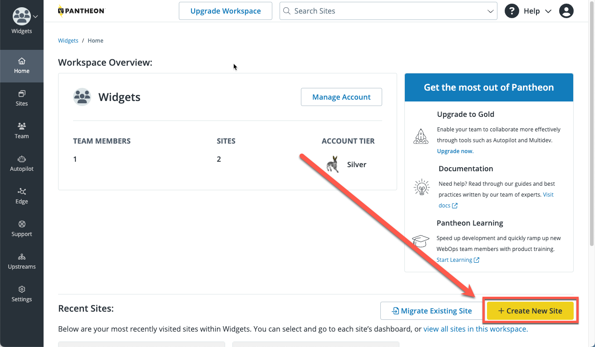

A Pantheon CMS site contains two components: code, and a CMS (Content Management System).  When you create a site, you are creating both of these components in the Dev environment.  Then, when you are ready, you will do the create your Test and Live environments.

## Create the Dev Environment

To create a CMS site:

1. Open the [Workspace](/guides/account-mgmt/workspace-sites-teams/workspaces#switch-between-workspaces) and select the <Icon icon="plus" text="Create New Site"/> button on the lower right side of the page.

   

1. Select **WordPress** or **Drupal**.

   

   If you select Drupal, you will have the option to select the Drupal version you want to use.

   

1. Enter the following information and click **Continue**:
   - Sitename
   - Select a region for this site. 
   - If this site is to be part of a Professional Workspace, select a Workspace from **Choose a Workspace for the Site**. 

   

1. The deployment process begins. It can take several minutes to create a new site on Pantheon.

   

   <Alert title="Note" type="info" >

   You can navigate away from this page during this process, but later, you'll have access the site via the **Sites** tab in your Workspace.

   </Alert>

1. Click **Visit your Pantheon Site Dashboard** when the process is complete.

   

You've now created the core portion of your Dev environment; now you have to install the CMS.

<Partial file="cms-dev.md" />

You have successfully finished adding a site in its Dev environment.  Click **Visit Dev Site** to view your site.

## Create the Test environment

<Partial file="test-initialize.md" />

You have successfully finished adding a site in its Test environment.  Click **Visit Test Site** to view your site.

## Create the Live environment

After you [purchase a plan](/guides/getstarted/purchase), you can deploy your site live.  But first, you have to create the Live environment.

<Alert title="Warning" type="danger" >

When you complete this step, your site will be live for anyone to see, at the Pantheon URL. For detailed information about launching your site, refer to our [Launch Essentials](/guides/launch/) guide.

</Alert>

<Partial file="live-initialize.md" />

You have successfully finished adding a site in its Live environment.  Click **Visit Live Site** to view your site.

At this point, you have a live site with a Pantheon URL, like `http://my-site.pantheonsite.io/`. To change that to a more friendly URL, you'll need to purchase a domain from a DNS provider.  Refer to our [Domains on Pantheon Guide](/guides/domains) for more information.

