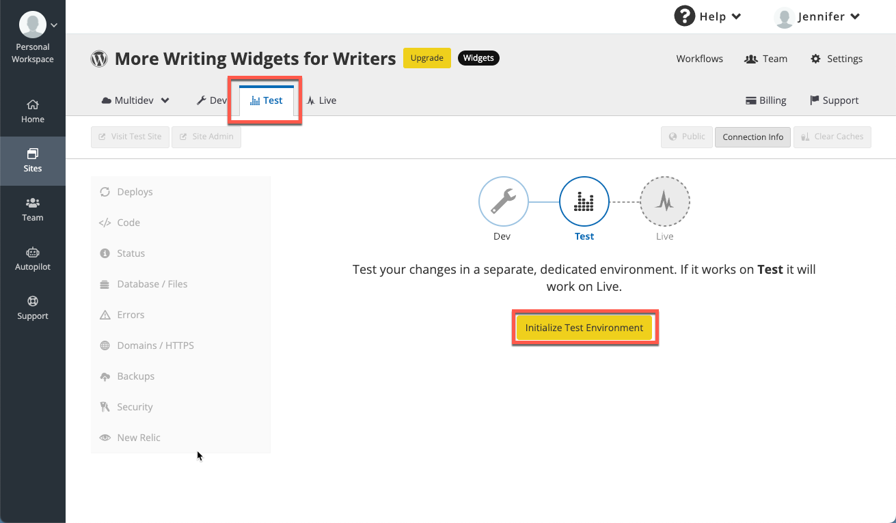
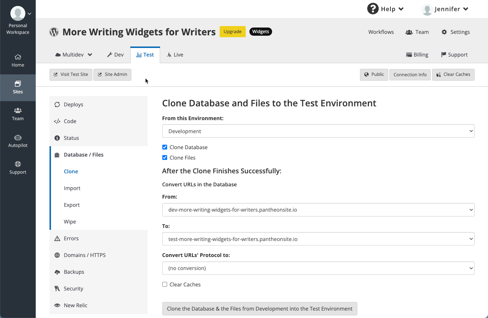
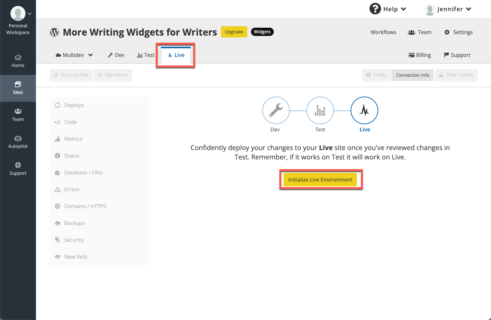

A Pantheon CMS site contains two components: code, and a CMS (Content Management System).  When you create a site, you are creating both of these components in the Dev environment.  Then, when you are ready, you will do the same for your Test and Live environments.

At a high level, this is what you'll be doing:

1. Use the <Icon icon="plus" text="Create New Site"/> button create the Dev environment for your code.
1. Install the CMS for the Dev environment.
1. Initialize the Test environment.
1. Install the CMS for the Test environment.
1. Initialize the Live environment.
1. Install the CMS for the Live environment.

## Create the Dev Environment for Your Code

To create a CMS site:

1. Open your Personal or Professional Workspace dashboard and select the <Icon icon="plus" text="Create New Site"/> button on the lower right side of the page.

   

1. Select **WordPress** or **Drupal**.

   

   If you select Drupal, you will have the option to select the Drupal version you want to use.

   

1. Enter the name and select a region for this site. If this site is to be part of a Professional Workspace, select a Workspace from **Choose a Workspace for the Site**. Click **Continue**. It can take several minutes to create a new site on Pantheon.

   

   <Alert title="Note" type="info" >

   You can navigate away from this page during this process, but later, you'll have to go to the **Sites** tab to access your site.  If possible, stay on this tab to simplify accessing the site when the creation is complete.

   </Alert>

1. Click **Visit your Pantheon Site Dashboard** when the process is complete.

   

You've now created the core portion of your Dev environment; now you have to install the CMS.

## Install the CMS for the Dev Environment

1. Click **Site Admin**. 
   

1. A new browser tab will open, and you will be presented with either a Drupal or WordPress setup screen.
   

1. Enter the information on the screen, and when done, return to the browser tab containing your Site Dashboard.

   <Alert title="Note" type="info">

   Be sure to record your new username and password.

   </Alert>

You have successfully finished adding a site in its Dev environment!

## Initialize the Test environment

This environment is for reviewing the changes made in your Dev environment with the most recent content from your live site.

To create your Test environment:

 1. Go to your Site Dashboard.
 1. Click the <Icon icon="equalizer" text="Test"/> tab, then click **Initialize Test Environment** to create your Test environment.

 

   This takes a few moments.

1. Select the <Icon icon="server" text="Database / Files"/> tab. Keep the default selections and select **Clone the Database & the Files from Development into the Test Environment**.

   

## Install the CMS for the Test environment

1. Click **Site Admin**. A new browser tab will open, and you will be presented with your CMS setup screen.

1. Enter the information on the screen, and when done, return to the browser tab with your Site Dashboard.

  <Alert title="Note" type="info">

  Be sure to record your new username and password.

  </Alert>

Your Test environment is now set up. Test your site thoroughly before proceeding to the next step.

## Initialize the Live environment

After you [purchase a plan](/guides/getstarted/purchase), you can deploy your site live.  But first, you have to create the Live environment.

<Alert title="Warning" type="danger" >

When you complete this step, your site will be live for anyone to see, at the Pantheon URL. For detailed information about launching your site, refer to our [Launch Essentials](/guides/launch/) guide.

</Alert>

To create your Live environment:

1. Go to your Site Dashboard.
1. Click the <Icon icon="equalizer" text="Live"/> tab.
1. Click **Initialize Live Environment** to create your Live environment.

  

1. Select the <Icon icon="server" text="Database / Files"/> tab. Keep the default selections *except* select "Test" from **From this Environment**, then select **Clone the Database & the Files from Test into the Live Environment**.

   

1. You will be prompted to confirm you want to go live.  Type "CLONE", then click **Overwrite This Environment**.

   

Your site is now live at the Pantheon URL.

1. Click **Visit Live Site** to view it.

## Install the CMS for the Live environment

1. Click **Site Admin**.  A new browser tab will open, and you will be presented with your CMS setup screen. Enter the information on the screen, and when done, return to the browser tab with your Site Dashboard.

  <Alert title="Note" type="info">

  Be sure to record your new username and password.

  </Alert>

At this point, you have a live site with a Pantheon URL, like `http://my-site.pantheonsite.io/`. To change that to a more friendly URL, you'll need to purchase a domain from a DNS provider.  Refer to our [Domains on Pantheon Guide](/guides/domains) for more information.

