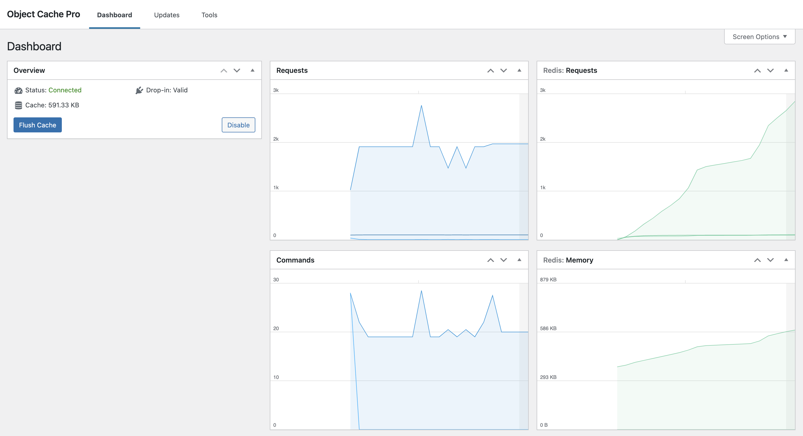

Pantheon's Object Cache performance addon service is an open-source, networked, in-memory, key-value data store based on Redis that can be used as a drop-in caching backend for your Drupal or WordPress website.

## Benefits of Object Cache

Most website frameworks like Drupal and WordPress use databases to cache internal application objects along with queries for normal page requests, which causes increased load-times.

Object Cache remembers, or caches, any queries to the server after a Drupal or WordPress page is loaded for the first time. When another user loads the page, the results are provided from the Object Cache which is stored in memory without querying the database again. This results in much faster page load times, and less server impact on database resources.

### Scalable Performance

Object Cache provides an alternative caching backend that resides in memory rather than a database that stores data on a disk or a solid-state drive (SSD). By eliminating the need to access disks, Object Cache avoids seek time delays and can access data in microseconds. This improves performance for dynamic pages and logged-in users. It also provides a number of other features for developers looking to use it to manage queues, or perform custom caching of their own.

## Object Cache Requirements

Pantheon supports two versions of Redis Object Cache, 2.8 and 6.2 (see [Which versions of Redis are available?](/object-cache/faq#which-versions-of-redis-are-available) and [Specify a Redis Version](/pantheon-yml#specify-a-redis-version) for more information). All plans, except for the Basic plan, can use Object Cache. Sandbox site plans can enable and use Object Cache for development purposes, but if the site plan is upgraded to Basic the feature will be disabled. Object Cache Pro, the premium WordPress plugin, is not available for Sandbox sites, however you may enable Redis for Sandbox sites and use Pantheon's [wp-redis](https://github.com/pantheon-systems/wp-redis) plugin, or any other reputable Redis plugin for WordPress.

| Plans         | Object Cache Support <Popover content="Available across all environments, including Multidevs."/> |
| ------------- | -------------------------------------- |
| Sandbox       | ✔ |
| Basic         | ❌                                 |
| Performance   | ✔ |
| Elite         | ✔ |

## WordPress Object Cache Pro
Object Cache Pro is a highly optimized premium WordPress plugin that integrates with Redis for business class performance. It provides an easy-to-use administration page with analytics to show current benchmarks. Object Cache Pro is specifically optimized for WordPress and popular WordPress plugins, including:

- Query Monitor
- WooCommerce
- Jetpack
- Yoast SEO

### How does WordPress Object Cache Pro work?

WordPress Object Cache Pro reduces page load time and the overall load on Redis by combining Redis commands into server request batches.

Object Cache Pro also optimizes for performance, using compressed data to maintain a small footprint in memory, while avoiding unnecessary Redis reads and writes. Object Cache Pro has been tested extensively against WooCommerce, is fully compliant with the WordPress Object Cache API, and integrates seamlessly into WordPress.

## More Resources

### How-to Guides
- [Enable Object Cache Pro for WordPress](/object-cache/wordpress)
- [Enable Object Cache for Drupal](/object-cache/drupal)
- [Use the Redis CLI](/object-cache/cli)
- [Safely Remove Object Cache](/object-cache/remove)

### References
- [Object Cache Errors](/object-cache/errors)
- [Object Cache FAQs](/object-cache/faq)
