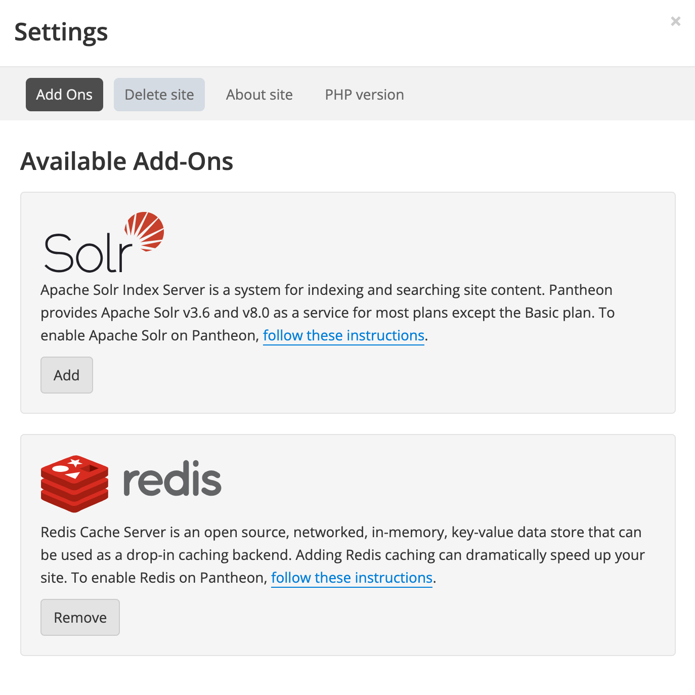

## Before You Begin

Before you can install and activate Object Cache Pro, verify that you have:

- A working site on Pantheon
    - A Performance or Elite site plan is required
    - Redis is enabled for the site
    - The site is running PHP 7.4 or higher

- Terminus installed and authenticated with a machine token to your local machine.
    - Installation instructions can be found [here](https://docs.pantheon.io/terminus/install#install-terminus).
    - Authentication instructions can be found [here](https://docs.pantheon.io/terminus/install#authenticate).

### Activate Redis
You can activate Redis either from the Pantheon dashboard or with Terminus.

#### On the Dashboard

1. Navigate to your **Pantheon Site Dashboard**, select **Settings**, and then select **Add Ons**.

1. Click the **Add** button under **Redis**. It might take a couple of minutes for the Object Cache server to come online. You will see a success message in a green box stating that Redis has been enabled.



#### With Terminus
Run the command below to enable Redis via the command line with Terminus:

```bash{promptUser: user}
terminus redis:enable <site>
```

## Installation and Configuration for non-Composer WordPress Sites

1. Ensure that your site is on a paid Performance or Elite plan. This can be verified by navigating to your **Pantheon Site Dashboard**, selecting **Settings**, selecting **About Site**, and then looking at the **Service Level**.

1. Ensure that your site has Redis enabled via the steps above.

1. Add the Terminus Addon Installer Plugin to your machine.

   	<Alert title="Note" type="info">
    Your local version of Terminus must be 3.2 or higher.
    </Alert>

	```bash
	terminus self:plugin:install terminus-addons-installer-plugin
	```

1. Run the installation workflow to install Object Cache Pro on your development or multidev environment. NOTE: This workflow cannot be run on test or live environments.
    ```bash
    terminus install:run <site>.<environment> ocp
    ```

1. Wait for the workflow to run. The terminus command will only trigger the workflow, but the progress is visible in the **Pantheon Site Dashboard** in the **Workflows** dropdown. This will take some time to complete

  <Alert title="Note" type="info">

  If the workflow text in the dashboard turns red, it did not succeed. Please [create a ticket with support](/guides/support/contact-support/#general-support-ticket) to debug this further.

  </Alert>

1. Once complete, activate the Object Cache Pro plugin from the WordPress Admin or via WP-CLI through Terminus on your development or multidev environment. NOTE: This workflow cannot be run on test or live environments.

	**WordPress Admin:**

	1. Navigate to the **Plugins** page, activate **Object Cache Pro**, then go to the **Object Cache** page in the **Settings** menu. **Note:** WordPress Multisite users will need to go to the **Network Admin Plugins** page and _network activate_ **Object Cache Pro** from there. In order to access the **Network Admin**, you must be logged in as a **Super Admin**.

	**Terminus:**

	1. Open your terminal.
	1. Run the following command:

		```bash{promptUser: user}
		terminus wp -- <site>.<env> plugin activate object-cache-pro
		```

	1. Run the `git pull` command if you did not create the file locally.

	**Note:** WordPress Multisite users will need to append the `--network` flag to network activate the plugin.

1. Navigate to `/wp-admin/options-general.php?page=objectcache` to see the current status of Object Cache Pro on your site as well as live graphs of requests, memory usage, and more.

	<Alert title="Note" type="info">

	 Subsites do not get their own configuration or graphs if you are using WordPress Multisites. Navigate to `/wp-admin/network/settings.php?page=objectcache` to view network-wide configuration and graphs. This is the only screen throughout the network that displays this information.

	 </Alert>

## Installation and Configuration for Composer-Managed WordPress Sites

Refer to the [official Object Cache Pro documentation](https://objectcache.pro/docs/composer-installation) for full configuration instructions.

1. Ensure that your site has Redis enabled via the steps above.

1. Ensure that your site is using Redis version 6.2 or higher.
	1. Open your `pantheon.yml` file and modify the `object_cache` entry or add an `object_cache` entry if there is not one already such that your `pantheon.yml` file includes:

	    ```yaml
        object_cache:
          version: 6.2
        ```
	1. Commit and push this file to your site.

1. Obtain the license token and apply it directly to the Composer `auth.json` to be able to authenticate against Object Cache Pro's Composer repository.
	
	```bash{promptUser: user}
	composer config --auth http-basic.objectcache.pro token $(terminus remote:wp <site>.<env> -- eval "echo getenv('OCP_LICENSE');")
	```
	
	This will pull the Object Cache Pro license token directly into the `auth.json` file. You can open the `auth.json` file locally to ensure that it has a structure that looks like this:
	
		```json
		{
			"http-basic": {
				"objectcache.pro": {
					"username": "token",
					"password": "<LICENSE-TOKEN>"
				}
			}
		}
		```

	<Alert title="Note" type="info">
	
	The `auth.json` file is only necessary for authenticating against the Object Cache Pro Composer repository. For this reason, we recommend adding it to your `.gitignore` so you are not committing secrets to your Git repository. However, excluding it from version control means that anyone else who may want to update Object Cache Pro locally will need to repeat the steps above to generate their own `auth.json` file.
	
	</Alert>

1. Open your `composer.json` file and locate the `repositories` section. If it doesn't exist, add it in the "repositories" section as shown below:

	```json
		repositories: [
			{
				"type": "composer",
				"url": "https://objectcache.pro/repo/"
			}
		],
	```

1. Install Object Cache Pro via Composer using one of the methods listed below.

	**Locally with Composer:**

	Run the command below:

	```bash{promptUser: user}
	composer require rhubarbgroup/object-cache-pro --ignore-platform-reqs
	```

	- The `--ignore-platform-reqs` flag is being passed because Object Cache Pro expects that Redis is running on the machine that the plugin is being installed on. This is likely an untrue assumption on your local machine (but it might be true inside the container or virtual machine you are using for local development, more on that later). The ignore flag allows you to install the plugin while bypassing the platform (local machine) requirements.

	**Locally with Lando:**

	Run the command below inside your development environment where Redis _does_ exist. The Lando machine already has the Redis PHP extension installed. This allows you to run the command without flags. For example, if you're using Lando:

	```bash{promptUser: user}
	lando composer require rhubarbgroup/object-cache-pro
	```

	<Alert title="Note" type="info">

	Using Composer commands locally while requiring Object Cache Pro via Composer necessitates adding the `--ignore-platform-reqs` flag to all local `composer require`, `composer update`, and `composer install` commands.

	</Alert>

1. Commit the changes to your repository:

	```bash{promptUser: user}
	git add composer.* && git commit -m "Require Object Cache Pro"
	```
	
1. Add the license token your `config/application.php` file. Normally, the license key is provided by the platform. However, when you are working locally, Lando (or your local development environment) does not have access to the platform environment variable. However, you can extract it from the `auth.json` created in the previous steps.

1. Open your `config/application.php` file to add configuration values to Object Cache Pro for your site.

1. Locate the `Config::apply()` line at the bottom of the file and add the following code above that line.

	```php
	$token = getenv( 'OCP_LICENSE' ); // Get the license from the Pantheon environment variables.
	
	// If working locally, set $token based on the local auth.json file.
	if ( isset( $_ENV['LANDO'] ) && 'ON' === $_ENV['LANDO'] ) { // Change this if you are not using Lando.
		$auth_json = ABSPATH . '/auth.json';
		if ( file_exists( $auth_json ) ) {
			$auth_json = json_decode( file_get_contents( $auth_json ) );
			$token = $auth_json['http-basic']['objectcache.pro']['password'];
		}
	}
	```

1. Set the Object Cache Pro settings using the license key either from the Pantheon environment or your local `auth.json`. You can put this directly under the `WP_DEBUG` rules so it looks like this:

	```php
		/**
		 * Debugging Settings
		 */
		Config::define('WP_DEBUG_DISPLAY', false);
		Config::define('WP_DEBUG_LOG', false);
		Config::define('SCRIPT_DEBUG', false);
		ini_set('display_errors', '0');

		/**
		 * Object Cache Pro config
		 */
		Config::define( 'WP_REDIS_CONFIG', [
			'token' => $token,
		] );
	```


1. Add Object Cache Pro configuration options after `Config::define( 'WP_REDIS_CONFIG', [` in `config/application.php` for **WordPress (Composer Managed)** sites. The full, recommended contents of the WP_REDIS_CONFIG constant are:

	```php
		'token' => $token,
		'host' => getenv('CACHE_HOST') ?: '127.0.0.1',
		'port' => getenv('CACHE_PORT') ?: 6379,
		'database' => getenv('CACHE_DB') ?: 0,
		'password' => getenv('CACHE_PASSWORD') ?: null,
		'maxttl' => 86400 * 7,
		'timeout' => 0.5,
		'read_timeout' => 0.5,
		'split_alloptions' => true,
		'prefetch' => true,
		'debug' => false,
		'save_commands' => false,
		'analytics' => [
			'enabled' => true,
			'persist' => true,
			'retention' => 3600, // 1 hour
			'footnote' => true,
		],
		'prefix' => "ocppantheon", // This prefix can be changed. Setting a prefix helps avoid conflict when switching from other plugins like wp-redis.
		'serializer' => 'igbinary',
		'compression' => 'zstd',
 		'async_flush' => true,
 		'strict' => true,
	```
	
	Refer to the [Object Cache Pro documentation](https://objectcache.pro/docs/) for detailed explanations of all the configuration settings.
	
1. Make sure you add and `git push` your changes up to your repository before you activate the plugin.

1. Activate the plugin and enable Redis in the plugin. You can activate the Object Cache Pro plugin from the WordPress Admin, locally with WP-CLI, or via Terminus.

	**WordPress Admin:**

	1. Navigate to the **Plugins** page, activate **Object Cache Pro**, then go to the **Object Cache** page in the **Settings** menu.
	1. Ensure that you are in an environment with file write permissions (either SFTP mode, if activating on your Pantheon Dev environment or in a local development environment).
	1. Click the **Enable** button. This will create the `object-cache.php` drop-in file.
	1. Commit the change.

		- Make the commit in SFTP mode if you did this in your Pantheon Dev environment.
		- Commit the file to your repository if you did this locally.

	**WP-CLI:**

	Refer to the [WP-CLI guide](/guides/wp-cli/install-wp-plugins-themes#install-wordpress-plugins) for instructions.

	**Terminus:**

	1. Open your terminal.
	1. Run the following commands:

		```bash{promptUser: user}
		terminus connection:set sftp
		terminus wp -- <site>.<env> plugin activate object-cache-pro
		terminus wp -- <site>.<env> redis enable
		terminus env:commit <site>.<env> --message="Add Object Cache Pro drop-in"
		terminus connection:set git
		```

	1. Run the `git pull` command if you did not create the file locally.

1. Navigate to `/wp-admin/options-general.php?page=objectcache` to see the current status of Object Cache Pro on your site as well as live graphs of requests, memory usage, and more.

	- If you are using WordPress Multisite, subsites do not get their own configuration or graphs. Navigate to `/wp-admin/network/settings.php?page=objectcache` to view network-wide configuration and graphs. This is the only screen throughout the network that displays this information.

## Local configuration with Lando
Lando's [Pantheon recipe](https://docs.lando.dev/plugins/pantheon/) includes Redis in its Docker configuration. However, to get Object Cache Pro to work correctly with Lando locally, you'll need to make a few changes to your Object Cache Pro and Lando configuration.

1. First, in your `.lando.yml` file add the following:

	```yaml
	services:
		cache:
			type: redis:6.0
	```

	- This ensures that the Redis version in your Lando environment matches the 6.x environment on Pantheon. Object Cache Pro will still work with the default version of Redis that is included in the Pantheon Lando recipe, so this step is optional.

1. Next, in your `wp-config.php` (or `config/application.php` for Bedrock-based WordPress Composer sites), find the `WP_REDIS_CONFIG` settings. Lando does not support `igbinary` serialization or `zstd` compression, so you will need to modify these settings for Lando locally. The simplest solution is to store the configuration values to a variable and then modify the variable for Lando environments. For example:

	```php
	$ocp_settings = [
		'token' => $token, // The dynamically fetched token from above.
		'host' => getenv('CACHE_HOST') ?: '127.0.0.1',
		'port' => getenv('CACHE_PORT') ?: 6379,
		'database' => getenv('CACHE_DB') ?: 0,
		'password' => getenv('CACHE_PASSWORD') ?: null,
		// ...the rest of your settings...
		'serializer' => 'igbinary',
		'compression' => 'zstd',
		// ...
	];
	
	if ( isset( $_ENV['LANDO'] ) && 'ON' === $_ENV['LANDO'] ) {
		$ocp_settings['serializer'] = 'php';
		$ocp_settings['compression'] = 'none';
	}
	
	define( 'WP_REDIS_CONFIG', $ocp_settings );
	```
	
	<Alert title="Note" type="info">
	If you don't want to bother with changing the configuration for local environments, you can simply disable Object Cache Pro for Lando and leave the existing configuration:

	```php
	if ( isset( $_ENV['LANDO'] ) && 'ON' === $_ENV['LANDO'] ) {
		define( 'WP_REDIS_DISABLED', true );
	}
	```
	</Alert>
	
Make sure to commit your code back to your environment when you have made the appropriate changes.

## Additional Considerations
- When moving from Dev to Test, and from Test to live with OCP for the first time, note that you _must_ activate the plugin and then flush the cache via `terminus wp <site>.<env> -- cache flush`.
	- If you already have WP-Redis or other Redis plugins installed, these should be disabled before merging code.
    - To summarize, the full order of steps are:
      1. Disable wp-redis or other redis plugins if present
      1. Merge code
      1. Activate OCP
      1. Flush Redis cache
- The `object-cache.php` drop-in file must be created in your development or multidev environment and committed or pushed to live to work.
- When installed as a `mu-plugin` on a WordPress Multisite, Object Cache Pro handles each subsite separately. The dashboard widget applies to the current site and none of the other sites on the network.
  - Flushing the network cache from the network admin will flush all caches across the network.
  - Subsites do not get their own configuration or graphs.
  - If installed on a WordPress Multisite, the Flush cache button in the subsite dashboard widget flushes the cache of the entire network, not just the subsite cache. The default behavior can be modified by [adjusting the `WP_REDIS_CONFIG` settings](https://objectcache.pro/docs/configuration-options/#flushing-networks). Alternatively, you can flush a single site's cache by using the [WP-CLI command](https://objectcache.pro/docs/wp-cli/#multisite-flushing).
  - You must manually click the **Enable Cache** button in the Network Admin Object Cache Pro settings page while in SFTP mode to enable Object Cache Pro. Alternatively, you can use the Terminus commands above and commit the `object-cache.php` drop-in to your repository.
- When working locally with Lando, it's possible that Lando's self-signed SSL certificate will cause issues connecting to the Object Cache Pro license API resulting in a license error. To resolve this, add the following code to a mu-plugin:
	
	```php
	if ( isset( $_ENV['LANDO'] ) && 'ON' === $_ENV['LANDO'] ) {
		add_filter( 'http_request_args', function ( $args ) {
			$args['sslverify'] = false;
			return $args;
		} );	
	}
	```
	
	- You may wish to make this file local-only by adding it to your `.gitignore` file. This error will not cause any issues with the functioning of Object Cache Pro or the behavior of the plugin on Pantheon but it might prevent you from being able to make updates to the plugin locally.

  	<Alert title="Note" type="info">

  	You can use Object Cache Pro's documentation to [hide the dashboard widget](https://objectcache.pro/docs/customizations#dashboard-widget).

  	</Alert>

## More Resources
- [Performance Addons](/addons)
- [Object Cache Overview](/object-cache)


### How-to Guides
- [Enable Object Cache for Drupal](/object-cache/drupal)
- [Use the Redis CLI](/object-cache/cli)
- [Safely Remove Object Cache](/object-cache/remove)


### References
- [Object Cache Errors](/object-cache/errors)
- [Object Cache FAQs](/object-cache/faq)

### See Also
- [Create a WordPress MU-Plugin for Actions and Filters](/guides/wordpress-configurations/mu-plugin)
- [Must Use Plugins](https://wordpress.org/documentation/article/must-use-plugins/)
