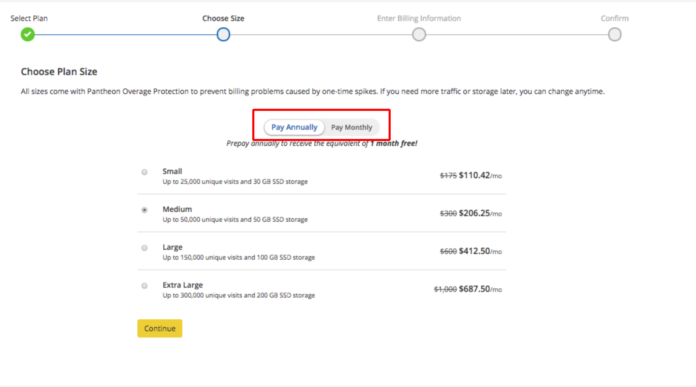
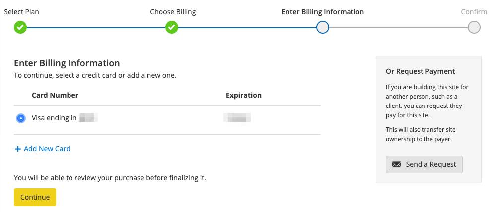
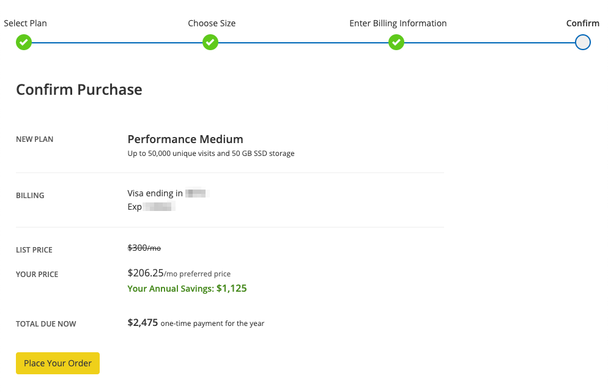
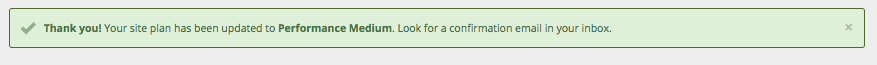

Pantheon now offers annual billing plans for all sites at all plan levels. When you switch to annual billing, you save compared to the monthly cost.

For standard billing information, see [Billing in the Site Dashboard](/site-billing)

## Annual Billing Savings

The table below shows how much sites can save by switching to annual billing. Performance plans receive savings equivalent to at least one month of free service. On a basic plan, the savings are equivalent to two months of free service.

<dl>

<dt>List Price</dt>

<dd>

Set price for new sites that aren't purchased via a qualified agency partner.

</dd>

<dt>Preferred Price</dt>

<dd>

[Preferred Pricing](https://pantheon.io/plans/agency-preferred-pricing) is available to qualified agency partners. Learn more about the [Pantheon Partner Program](https://pantheon.io/partner-program).

</dd>

</dl>

<TabList>

<Tab title="List Price" id="tab-1-anchor" active={true}>

|                    | Basic         | Performance Small | Performance Medium | Performance Large | Performance XL       |
|:------------------ |:------------- |:----------------- |:------------------ |:----------------- |:-------------------- |
| Monthly Price      | $50           | $175              | $300               | $600              | $1,000               |
| Annual Price       | $500          | $1,925            | $3,300             | $6,600            | $11,000              |
| **Annual Savings** | **$100**      | **$175**          | **$300**           | **$600**          | **$1,000**           |

</Tab>

<Tab title="Preferred Price" id="tab-2-id" active={true}>

|                    | Basic   | Performance Small | Performance Medium | Performance Large | Performance XL  |
|:------------------ |:------- |:----------------- |:------------------ |:----------------- |:--------------- |
| Monthly Price      | $35     | $125              | $225               | $450              | $750            |
| Annual Price       | $350    | $1,375            | $2,475             | $4,950            | $8,250          |
| **Annual Savings** | **$70** | **$125**          | **$225**           | **$450**          | **$750**        |

</Tab>

</TabList>

## Considerations

Before switching to annual billing, consider:

 - Sites on monthly plans switching to annual billing (without changing plan size) are invoiced immediately.
 - Sites on annual billing plans that upgrade will be invoiced immediately, and the site will be upgraded immediately.
 - While all site plan downgrades will be effective immediately, no partial refunds will be issued.
 - Annual billing plans will auto-renew at the end of their annual subscription term unless terminated in advance.
 - Annual billing plans switched to monthly billing will be effective after the end of your current annual subscription term.
 - A site grandfathered into Preferred Pricing that is not owned by a qualified partner organization will move to list pricing when the billing plan changes.
   - To regain Preferred Pricing, the Agency should follow the steps to [Add a Client Site](/add-client-site).

## Switch to Annual Billing

1. From the Site Dashboard, click on your site plan, or the billing tab:

    

2. If you're keeping the same plan size and only switching to annual billing, select your current plan:

    

3. Switch the slider to **Pay Annually**:

    

4. Enter or confirm your billing information, then click **Continue**.

    

5. Confirm the purchase, then click on **Place your order**.

    

6. You'll be returned to the dashboard with a confirmation of your site plan change:

    

## See Also

 - [Billing in the Site Dashboard](/site-billing)
 - [Manage Plans in the Site Dashboard](/site-plan)
