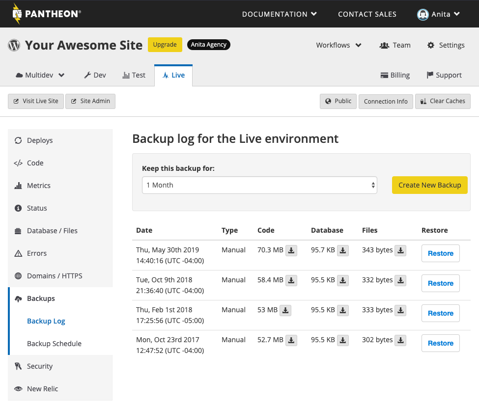
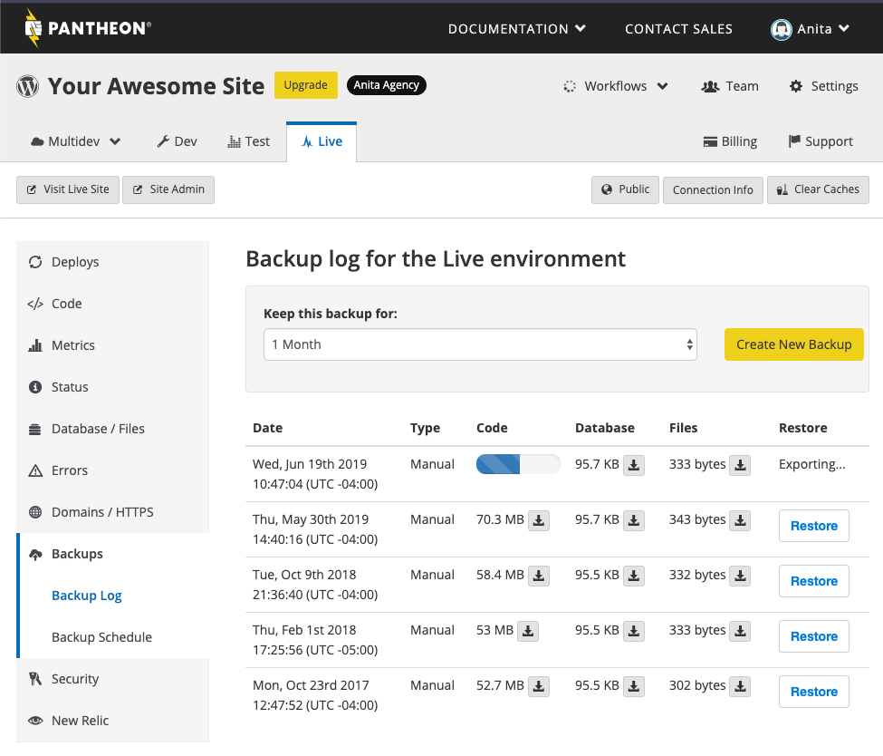
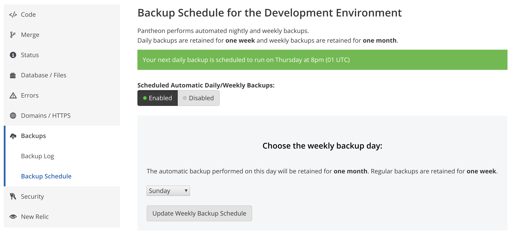
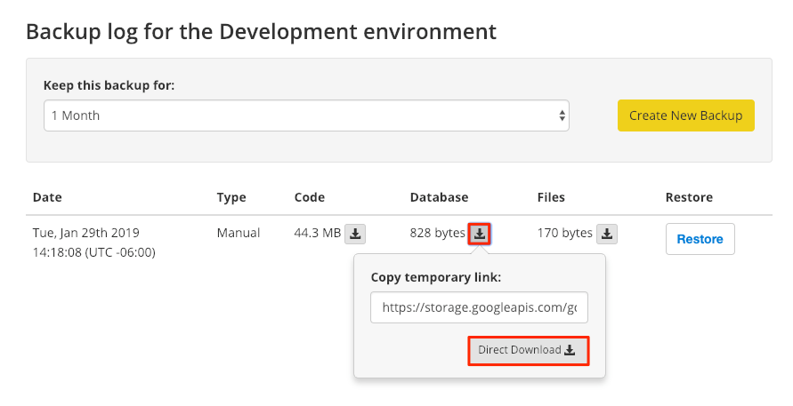

The Backups tab is where you manage all the details for your site's backup. Each backup contains three components: code, database, and files.

- **Code** is anything version controlled and committed via the Site Dashboard. Uncommitted SFTP changes to code are not backed up.
- **Database** is a `mysqldump` of your site's db.
- **Files** images and assets stored in the standard upload path `wp-content/uploads` for WordPress and `sites/all/default/files` for Drupal. Various content generated by your application is not backed up, e.g. generated images from image styles and aggregated CSS and JS assets.

We strongly urge you to backup your site regularly.



<Alert title="Exports" type="export">

This doc offers [Terminus](/terminus) commands, using the variables `$site` and `$env`. Export these variables in your terminal session to match your site name and the correct environment:

```bash{promptUser: user}
export site=yoursitename
export env=dev
```

</Alert>

## Create a Backup

You can create a new backup and set the timing for how long the backup is kept. This should be set for every environment (Dev, Test, Live).

Select the **Backups** tab, and click **Create New Backup**. The status is shown in the progress bar as it's being created, and the jobs workflow shows the number of active jobs. You can continue on with development while the backup is in progress.

<Alert title="Warning" type="danger">

Run backups separately for each environment (Dev, Test, and Live). If you have changes in SFTP mode that you have not committed, the changes will be lost with no way to recover them. The backups are based on the code currently in the Git log.

</Alert>



If you prefer the command line, you can use [Terminus](/terminus) to create backups:

```bash{promptUser: user}
terminus backup:create $site.$env --element=<element> --keep-for=<days>
```

## Backup Schedule and Retention

**Paid sites:** You can enable or disable automatic backups. If enabled, your nightly backup is stored for a week and your weekly backup is stored for a month. You can select the day the weekly backup is run:



Daily backups are scheduled automatically.

**All sites:** You can run manual backups for free, and choose to keep them for one month or six months.

## Access Backups

Backups created on Pantheon are stored offsite on Google Cloud Storage instances, however a full-fledged backup solution is strongly recommended for retention. For example, the following script can be executed from an external cron job to send backups to your own Amazon S3 instance:

<Download file="pantheon-backup-to-s3.sh" />

GITHUB-EMBED https://github.com/pantheon-systems/documentation/blob/main/source/scripts/pantheon-backup-to-s3.sh.txt bash GITHUB-EMBED

### Via the Dashboard

When the backup has finished, the jobs indicator returns to its start state to let you know that the task is complete. You will notice a new backup in your log with three separate archives (code, database, and files).



The newest backup will appear at the top of the list. When the retention period expires for a backup, it will no longer be in the list of available archives.

Click the down arrow next to Code, Database, or Files to access the link for the offsite backup.

<Alert title="Note" type="info">

Some older versions of Google Chrome can cause database backups to be downloaded with an incorrect file extensions (e.g. `.sql` instead of `sql.gz`). You can resolve this problem by updating Google Chrome or by renaming the file using the correct extension.

</Alert>

### Via the Command Line

If you have the temporary URL provided via the Dashboard, you can download it from the command line using [`Wget`](https://www.gnu.org/software/wget/) or [Terminus](/terminus).

#### Unix/MacOS

```bash{promptUser: user}
wget https://storage.googleapis.com/gcs-pantheon-backups/...
```

#### Windows

When using Wget in the Windows Powershell, wrap the URL in double quotes (`"`). The shell doesn't return any output until the download completes:

```bash{promptUser: winshell}
wget "https://storage.googleapis.com/gcs-pantheon-backups/..."
```

#### Terminus

Note that `--element=all` is only available when creating backups and not when downloading:

```bash{promptUser: user}
terminus backup:get $site.$env --element=<code|files|db> --to=path/to/file.tar.gz
```

File and code backups are saved as `.tar.gz`, while database backups are saved as `.sql.gz`. When specifying the file path for `--to`, be sure to use the correct extension.

Select an older archive by running `terminus backup:list $site.$env`, copying the filename, and pasting it in the `--file=<filename>` option when downloading:

```bash{promptUser: user}
terminus backup:get $site.$env --file=<filename> --to=path/to/file.tar.gz
```

Links to backups are signed URLs directly from Google Cloud Storage and will expire. If a link has expired, go back to the Dashboard and get a new link to the archive.

## Restore From an Existing Backup

Each manual and automatic backup can be directly restored to that environment from the Pantheon Dashboard. For detailed instructions, see [Restoring an Environment From a Backup](/restore-environment-backup).

## About Your Code Archives
Code archives contain the full remote Git repository and reflect the state of code for the given environment. Backups created on the Test and Live environments automatically checkout the [`git tag`](https://git-scm.com/book/en/v2/Git-Basics-Tagging) associated with the most recent deployment.

For a clear visual of the Git repo contents, you can use a free tool like [Sourcetree](https://www.sourcetreeapp.com/) to inspect the branches that the repo contains.

<Alert title="Note" type="info">

The `.gitignore` file determines paths ignored by version control and consequently excluded in code archives. To see the default `.gitignore` file refer to Pantheon's upstreams for [WordPress](https://github.com/pantheon-systems/WordPress/blob/default/.gitignore), [Drupal 8](https://github.com/pantheon-systems/drops-8/blob/master/.gitignore), and [Drupal 7](https://github.com/pantheon-systems/drops-7/blob/master/.gitignore).

</Alert>

## Backup Log
The backup log displays a list of existing backups for that environment. You can also create a new backup or restore your site from an existing backup.

## Frequently Asked Questions

### Where are the backups stored?

Backups are currently stored offsite for redundancy on Google Cloud Storage instances.

### How do I restore from my site from a full environment backup?

In the event that you need to get your site to a certain point, you can use a [full backup to restore an environment](/restore-environment-backup).

### How long does a backup take?

This depends on how much content you have. When you are doing a full environment backup, it can take some time depending on the size of your code, database, and files.

### How can I specify the time for my backups to run?

Daily backups are run at a random time during the day. You must have a plan associated with a site to select a specific day for a weekly backup. See [Manage Plans in the Site Dashboard](/site-plan) for details about site plans on Pantheon.

### What time zone is the backup time shown in?

Backups are shown in your time zone.

### Why do my automated backups not always run when I scheduled them to run?

If Pantheon's resources are occupied by other backups, your backup will be placed in a backup queue. The time that the backup is actually run will be shown in the backups label.

### Why is the Drupal module Backup & Migrate not recommended on Pantheon?

As a product in general, Backup & Migrate is perfectly fine and fulfills many site owners’ needs, but it is not recommended within the context of the Pantheon platform. On Pantheon, ​​Backup & Migrate can make your Drupal site work harder for a number of reasons:

- Requires a full Drupal bootstrap
- Monopolizes an appserver process and MySQL process while running
- Backups are written to Valhalla, our Network File System that is not optimized for large files (and explicitly does not work for files above 256MB)
- Does not use mysqldump by default (it is available as an experimental destination)
- Can cause excessively long Drupal cron runs, which blocks other operations if it times out
- Creates monolithic archives by default

Additionally, security vulnerabilities can occur by ignoring interface warnings and configuring backups that are placed in web accessible locations.

In comparison, Pantheon’s backup mechanism:

- Does not require a full, or any, Drupal bootstrap
- Does not utilize an appserver process
- Does not write to Valhalla, so there are no file size limitation. Instead, backups are stored on Google Cloud Storage for black-swan redundancy
- Uses mysqldump for minimal database impact
- Executed using job scheduling, and will wait in the queue if the system is busy and execute as soon as its ready
- Creates distinct archives (code, database, files)
- Secures access to archives through Pantheon authentication (no anonymous users can access)

Additionally, you can manually trigger a full Pantheon backup job for any site environment at any time on your own schedule using [Terminus](/terminus).  Also, you can get download links for retrieval (the links expire and are renewed for additional security).

```bash
terminus backup:get $site.$env --file=<filename> --element=<element>
```
See also <a data-proofer-ignore href="/docs/modules-plugins-known-issues/#backup-and-migrate">Modules and Plugins with Known Issues</a>

### What Can I Do During Backups?

From the Backup Log tab on the Site Dashboard, you can see the status of currently running backups for your code, database, and files:


If your **Code** or **Database** backup is taking an inordinately long time to complete, we suggest you [contact support](/support) to discuss why, and possible solutions. Don't deploy code or change database values during these backups, as it can destroy the integrity of the backup or cause it to fail.

If you have large amounts of static files, this can slow down the **Files** backup. For this and other reasons, we suggest large file repositories be stored on a CDN. Otherwise, during a long file backup, you can still make changes to your code and database, provided those changes don't affect static files.
