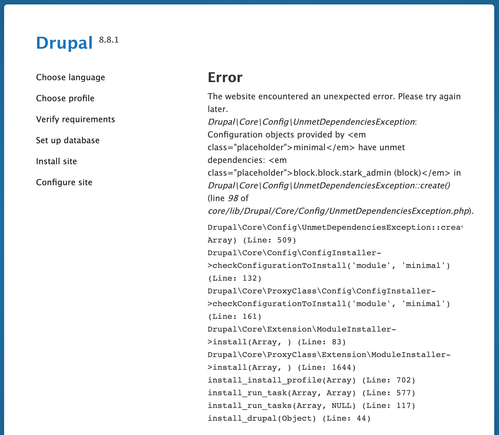

This page is a collection of common troubleshooting tactics, curated from our Customer Success Engineers and the Pantheon community. These procedures can help you solve issues your site may have, or at the very least rule out potential causes.

Like all pages in this project, this is a living document. Please feel free to [add](https://github.com/pantheon-systems/documentation/edit/main/source/content/basic-troubleshooting.md) your expertise to the page to help others.

## Pantheon Dashboard

In general, if the Pantheon Dashboard stops responding, the first step is to refresh the page. But note that doing so after executing a change may cause that process to be run twice (CONFIRM WITH PRODUCT). The next step is to log out and back in to the Site Dashboard. If the problem persists, [contact support](/support/)

### HTTPS Issues

When resolving issues with Pantheon's [HTTPS](/https/) certificates, a good first step is to remove and re-add the domain, which will restart the certificate provisioning process.

### Caching

### Code Changes

If changes to your code don't appear to be showing.

Check that there isn't a .gitignore that may be ignoring those files. (git check-ignore -v path/to/file)
Check composer dependencies. When a composer package has a .gitignore in it or a .git/ folder the platform is going to ignore the files in that folder.

Conflicts

Auto-resolve conflicts checkbox
Deleted README.txt files can cause dashboard conflicts

## WordPress

### White Screen of Death (WSOD)

The **WSOD** is a frustrating issue on WordPress sites, since it provides no useful information on the cause. The first place you should look for information is the [log files](/logs/). See [PHP Errors and Exceptions](https://pantheon.io/docs/php-errors) for more information on the type of errors you may find.

### Disable All Plugins

If your WordPress site exhibits unwanted behavior and you're not sure of the cause, try disabling all your plugins. If the behavior stops, turn the plugins back on one by one, checking after each one to identify the culprit.

### Disable Plugins Incrementally

### Switch Theme to Default Theme

Some themes can cause potential conflicts with Wordpress core, especially after core or plugin updates. To rule out the issue being your theme, switch to a default theme such as Twenty Nineteen.

### Unexpected 404s

There are times the permalink structure in Wordpress is not updated properly, leading to 404 errors. Go to **Settings** > **Permalinks** in your Wordpress Dashboard and click **Save Changes**.

Check that the Wordpress Address and Site Address are properly configured in your Wordpress Dashboard. These can also be overwritten in your wp-config.php file:

```bash
define('WP_HOME', 'https://example.com');
define('WP_SITEURL', 'https://example.com');
```

## Drupal 7

Are you a Drupal 7 wizard? [Help us expand this section](https://github.com/pantheon-systems/documentation/edit/main/source/content/basic-troubleshooting.md).

## Drupal 8

### UnmetDependenciesException when installing Drupal 8

Sometimes when installing Drupal 8, users may see the following error:



This is apparently cause bu a dirty cookie cache in the web browser. Users have reported success by re-installing in private or incognito mode in their browser.

See the [UnmetDependenciesException when installing Drupal 8](https://www.drupal.org/project/drupal/issues/2594351) issue for more information.

Are you a Drupal 8 wizard? [Help us expand this section](https://github.com/pantheon-systems/documentation/edit/main/source/content/basic-troubleshooting.md)

### Twig Debugging

Turn on debugging in twig.

### Displaying Error Messages

```bash
$config['system.logging']['error_level'] = 'verbose';
```

### Using Devel

### Debugging With Drush

```bash
drush rr
```