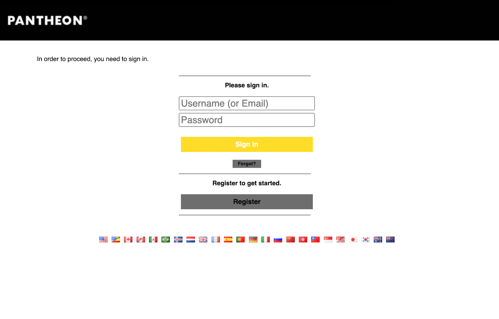
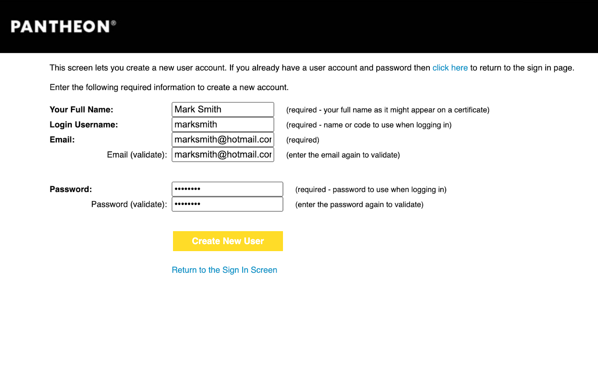
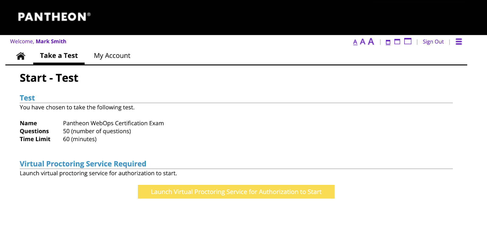
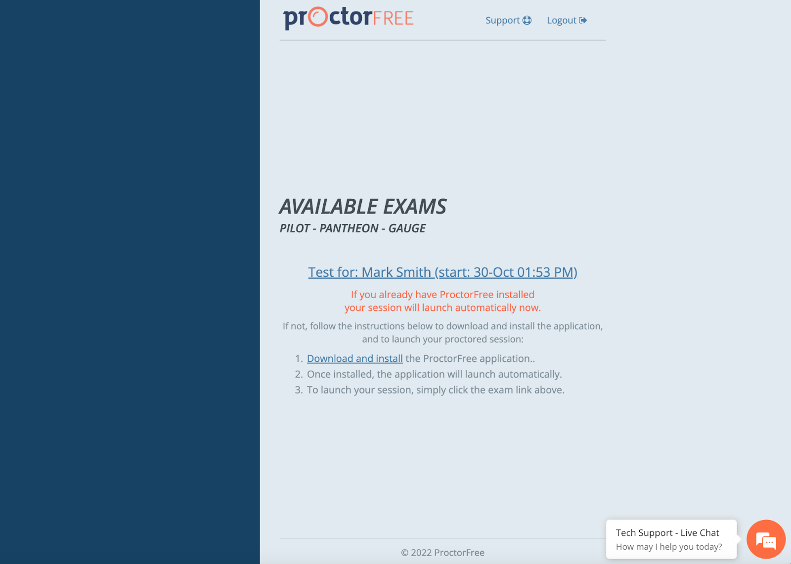
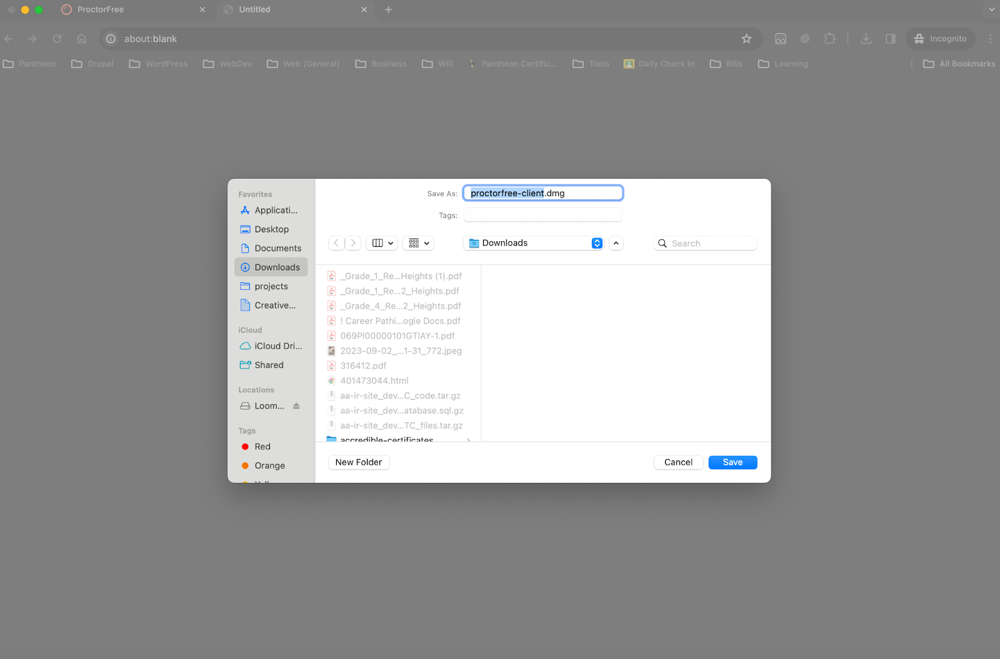
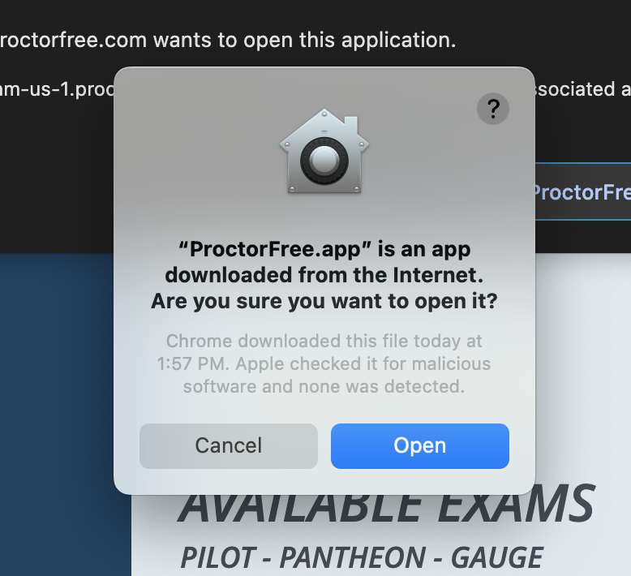
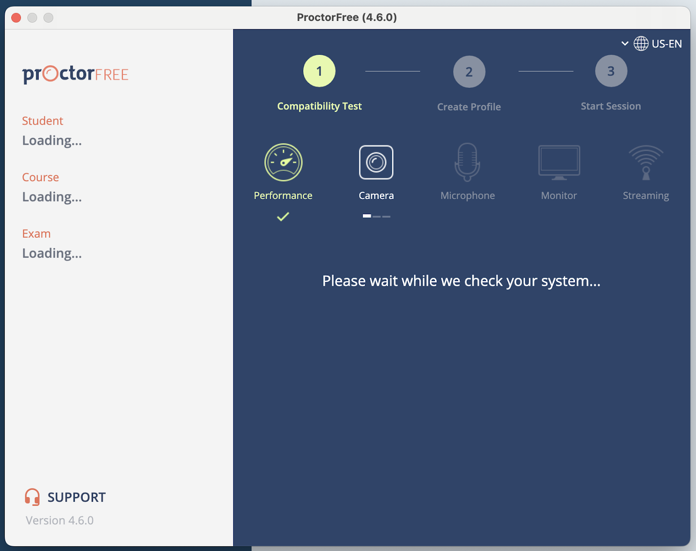
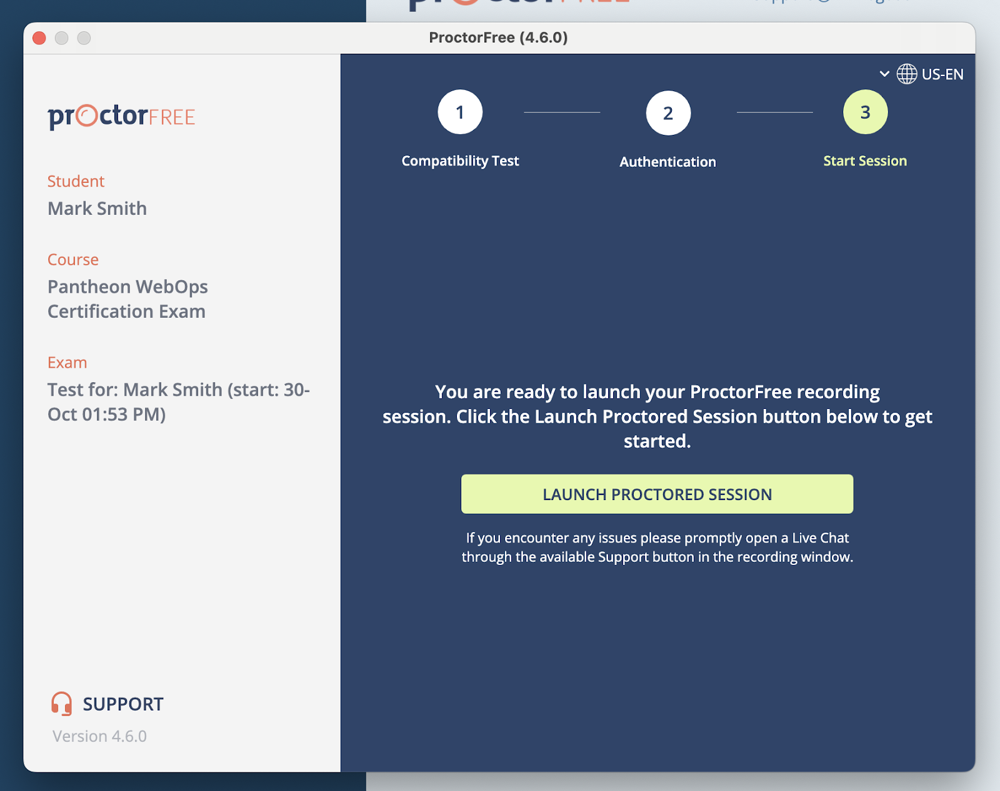

The following directions and instructions were captured by a user on a MacOS device. However, most of the steps here should also be applicable for Windows users. If you run into any technical difficulties or have any questions, you can launch a support session with ProctorFree by clicking the Support Chat icon in the lower right-hand portion of the screen.

|     
 
  | Instructions |
| ----------- | ----------- |
|       | When you receive the link to your exam, you will first see a sign-in screen. If this is your first time logging into the exam engine and you have not been pre-provisioned as a user, you will need to register as a user. If you have already received a username and temporary password, skip to step 4 after logging in Click the “Register” button at the bottom of the screen.  |
|       | Enter your full name, a username of choice, your email address, a confirmation of your email address, and a password of choice.  |
|       | Once you have entered all of the required information, click “Create New User” at the bottom of the form.  |
|       | You will then be redirected to the Start Test screen. At the bottom of the screen is a button to launch the virtual proctoring service. Click that button.  |
|       | Once you are redirected to the ProctorFree launch screen, click the link in the middle of the page to advance to the next page.    If you have any technical issues with the virtual proctoring service, you can open the Support chat window by clicking the icon in the lower right-hand corner of your screen.  |
|       | You will now need to download and install ProctorFree to your machine.    Locate the download and install link in the bottom middle of your screen and click it.   This will download the executable for installing ProctorFree on your local machine.  |
|       | Select a directory to download the executable file to.  |
|       | In your Downloads directory (or wherever the executable was downloaded to), locate the file and double click it.  |
|       | You will then be prompted to drag the application to your Applications folder.   |
|       | Once you have done this, return to the ProctorFree launch screen and select the top link in the middle of your screen (“Test for Mark Smith” in this case).  |
|       | You will then be prompted to open the ProctorFree app. Click “Open ProctorFree App” and continue.  |
|       | You may get an alert from your machine asking if you are sure you would like to download the app from the internet. Select “Open”.  |
|       | ProctorFree will now go through a brief compatibility check for your machine.  |
|       | When you start the microphone test, you may have to speak into the microphone to allow it to register that it is working. “Testing 1-2-3” or similar should be sufficient here.  |
|       | Next, select the web camera that you will use during the exam session. This is typically the default web camera for your device.  |
|       | Once the hardware compatibility check is complete, ProctorFree will authenticate you by snapping a quick screenshot of your face. This will take around 5 seconds, and you will need to keep relatively still.     This screenshot is used during the results validation process after you have taken the exam, allowing the validator to match the picture of your face with the video that is captured of you taking the exam.  |
|       | Now that you have completed the validation and registration process, you are ready to launch your exam.    Click the button labeled “Launch Proctored Session”  |

