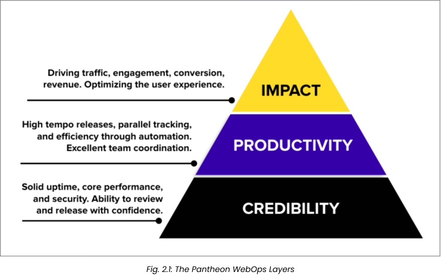

<Alert title="Learning Objectives for This Chapter" type="info" >

**Pantheon WebOps Layers**

* Describe how Pantheon’s features and functionality help teams simply and effectively implement WebOps best practices.
* List some of the specific tools in Pantheon’s WebOps Toolset that allow web teams from Marketing, Development, and IT to successfully implement WebOps out of the box.
* List and describe the three layers of WebOps and how they build off each other to deliver a valuable WebOps experience.

**What Problems Does WebOps Solve?**

* List and describe the building blocks of WebOps on Pantheon.
* Describe the WebOps benefits provided by having Pantheon manage a scalable, secure, performant hosting environment.
* Describe three key benefits of Pantheon’s container-based orchestration layer.
* List four features of Pantheon’s platform that enable WebOps scriptability and automation.

</Alert>

In the previous chapter we reviewed how the competing pressures to deliver more value faster and keep a system stable influence the **people** on a web team and shape their **processes**. This chapter will provide an overview of how Pantheon responds to those pressures to create an optimized **platform** for the plurality of professional web teams.

## CMS Sites

Pantheon's CMS Sites offering runs both WordPress and Drupal sites. To many in our ecosystem, that seems like an odd choice. Why not only focus on one CMS like so many of our competitors? Or why not open it up even more widely to anything using PHP and a database?

Neither of those other options is _wrong._ But the pressures on website operations lead us to prefer this path. Consider the pressure from our customers' customers.

### (Customer's) Customer-first

At Pantheon, one of our four core company values is "customer-first." That leads us to think about our direct customers (web teams) and also _their_ customers (the site visitors). Those site visitors generally do not care at all which CMS or framework generated the site (they care about whether the site meets their needs).

The wide web ecosystem will _always_ be changing and developing better ways of meeting the needs of those customers. It would be unwise of us to overfit Pantheon to only one CMS or framework. We support a handful of frameworks across CMS Sites and Front-End Sites so that we can develop the deep expertise necessary to build a polished platform for a given framework. But not over-specializing so as to limit options when the wider web world moves. In another decade a not-yet-created framework may best serve site visitors's needs.

## What Works for Web Teams

While we can expect the landscape of web tooling to continue to change (and have added our Front-End Sites offering accordingly) the CMS-based website has had remarkable staying power over the multi decade history of the web. Serving our customers (web teams) first, requires us to support the most adopted tools.

WordPress is far and away the most popular website application framework, powering approximately 43% of all sites on the web, and 63% of sites whose content management system we know. Drupal thrives as an enterprise-grade CMS framework whose modularity, content modeling capabilities, integrations, security, and robust developer community make it a popular choice for some of the most complex, mission-critical websites on the web. Both CMS frameworks also excel as backend data sources for “headless” websites where the presentation layer is decoupled from the backend. Front-End Sites on Pantheon allow you to use decoupled architecture to separate your frontend and backend into distinct entities.

Part of what makes WordPress and Drupal so durable is the way they balance the pressures on web teams, particularly by layering concerns as we'll see next.

### Stable Layers

By the end of this section, you should be able to:

* Describe how Pantheon’s features and functionality help teams simply and effectively implement WebOps best practices.
* List some of the specific tools in Pantheon’s WebOps Toolset that allow web teams from Marketing, Development, and IT to successfully implement WebOps out of the box.
* List and describe the three layers of WebOps and how they build off each other to deliver a valuable WebOps experience.

For how overwhelming it can be to approach WordPress and Drupal as decades old communities with thousands of plugins and modules, they have developed some very helpful and clear layers. There are clear lines between code maintained by core committers, code maintained in community plugins/modules, and site specific code. Large organizations frequently insert another layer in the middle. Using conventions pioneered in Drupal distributions or WordPress suites of plugins like WooCommerce a large company or university may have a shared theme and centralized common code in addition to per-site customizations.

[Chapter 10](/certification/study-guide/chapter-10-custom-upstreams) goes into greater detail on Pantheon's Custom Upstream product that enables this layering even more effectively than traditional Multisite configurations.

This practice of layering technology platforms supports more conceptual layering of value. At Pantheon we often think about the efforts of website operations going toward one of three layers of value: Credibility, Productivity, Impact.

Similar in concept to [Maslow’s Hierarchy of Needs](https://en.wikipedia.org/wiki/Maslow's_hierarchy_of_needs), each of these layers builds upon the one below it.

**Impact:** The business impact of your website, which is driven by the quality of the website user experience, depends largely on Marketing’s ability to quickly make changes, measure the impact of those changes, and rapidly iterate on high-value features to improve the user experience over time.

**Productivity:** In order to deliver these impactful changes rapidly enough to meet the needs of Marketing, the Development team needs to maintain a tight feedback loop where they are able to quickly develop features, gather and incorporate feedback from stakeholders, and deploy the approved updates to production. 

**Credibility:** And if the goal of this iterative approach is ultimately to deliver the best user experience for the website, it is only possible if it is delivered on a hosting platform that optimizes website performance, scales to meet the demands of traffic spikes, and eliminates concerns around security and uptime. 

By providing people with a stable technology platform, we intend for them to spend more and more of their time and effort on the higher layers of this pyramid.

To move focus to the top of the pyramid, any web team, on Pantheon or not, needs to find ways to spend less time toiling in repetitive and inefficient tasks. Keep your focus on the goal and work backwards from the value you want. Brush aside or minimize work that's not specific and critical.

With that mindset, let's look at what lies ahead in the rest of this Study Guide, starting with the end.

### Balancing Standardization and Independence

[Chapter 10](/certification/study-guide/chapter-10-custom-upstreams) examines how a central web team can manage shared code using Custom Upstreams to save time for a wider organization running dozens, hundreds, or thousands of sites.

### Automating Repetitive Tasks

Performing code updates is one of the most tedious tasks in website operations where human error adds huge risk. With security updates the stakes are raised. [Chapter 9](/certification/study-guide/chapter-9-automation) shows Pantheon's answers.

**Autopilot** automatically detects, performs, and deploys updates for WordPress and Drupal. Autopilot also features automated visual regression testing (VRT) to ensure that your site's user experience (UX) is consistent while securing your site and implementing new features

* Automatically detects when new updates are available
* Performs the updates in an isolated Multidev environment
* Tests the updates with automated VRT
* Optionally deploys the updates

**Integrated Composer** is a Pantheon platform feature that extends Composer  functionality to WordPress and Drupal's core files, and treats them as a managed dependency. Integrated Composer enables one-click updates from the Dashboard for upstream updates and Composer dependencies on your Composer-managed Pantheon site.

Web teams frequently need to build their own specific automations. Pantheon enables that with our command line interface (Terminus) and hook system (Quicksilver) as you will see in [Chapter 8](/certification/study-guide/chapter-8-extending).

**Terminus** is a command line interface that provides advanced interaction with Pantheon. Terminus enables you to do almost everything in a terminal that you can do in the Dashboard, as well as scripting and much more. Here are just a few of the things you can do with Terminus:

* Create a new site
* Create and delete Multidev environments
* Clone one environment to another
* Check for and apply upstream updates
* Deploy code from one environment to another
* Run Drush and WP-CLI commands
* Perform other operations

**Quicksilver** hooks into platform workflows to automate your Pantheon WebOps workflow. This allows the platform to run selected scripts automatically every hour, or when a team member triggers the corresponding workflow. There is a growing set of example scripts available for review and contributions. Several scripts enable additional functionality, including:

* Chat-ops
* Database sanitization
* Deployment logging
* Automated testing operations with a CI server

#### Productive Collaboration

Moving up to higher levels of value also requires effective collaboration between people.

[Chapter 7](/certification/study-guide/chapter-7-people) shows how to connect with your team on Pantheon, and most critically, how to connect your DNS so that the public can find your site. It covers:

* **Site Security Tab:** Allows users to** **lock down environments to only be accessible using a username/password, allowing for selective sharing of progress.
* **Expert Support: **Pantheon offers a range of Account options that include the features required for mission critical sites, such as 24x7x365 emergency support, debugging assistance, and concierge pre-launch load testing for Diamond Elite sites.
* **Role-base access control:** Users can be automatically provisioned with adherence to** **the principle of least privilege.

Within the workflow of a single site, any number of details can trip up a team on a regular basis or with the occasional disaster. [Chapter 6](/certification/study-guide/chapter-6-deployment) highlights the guardrails Pantheon puts around the workflow of a site as code moves through the deployment pipeline from Multidev environments to Dev to Test to Live.

* **Multidev Environments:** Perhaps the best loved feature of Pantheon, Multidevs provide on-demand sandbox environments that are full clones of your production environment and data. Per-environment configurations allow you to upgrade PHP and CMS versions in-place, allowing you to complete critical maintenance tasks without having to “drop everything right now” to do so.
* With push-button synchronization, you can instantly sync changes across environments on Pantheon. Syncing content, code, and configuration changes between environments can be done in seconds, eliminating the need to copy anything manually between environments. This ensures that your developers are always developing new features and functionality against the very latest version of your marketing team's content.
* **Automated backups: **Developers can move fast without worrying about breaking things, resting assured that a rollback of code, database, and files is only a click away, should they need it.
* **Automated parity between environments: **Consistent provisioning of resources every time eliminates the guesswork and the sentiment that “it worked on my machine!”
* **Immutable codebase for Test and Live environments:** When code only changes through a version control-based deployment pipeline, it is much harder for a bad-actor to deface a live site.

### Fast and Stable Infrastructure

That collaboration depends on Pantheon's founding breakthrough: moving WordPress and Drupal past the model of running on single servers.

[Chapter 5](/certification/study-guide/chapter-5-cms) describes the containerization model that supports highly scaled sites, and perhaps just as importantly, enables teams to move between sites (large and small) without rethinking every detail of their workflow.

With our containerization, you get

* **Automated Resource Provisioning:** Provisioning a suitable environment for your web application used to require manually installing a compatible operating system, runtime, file system, and a database with each new instance. Through container orchestration, Pantheon automates this process, providing a fast, repeatable model that ensures all resources in non-production environments (including local development environments) are identical to those in the production environment.
* **Scaling** server resources up or down to meet the demand of traffic spikes used to be a manual process, but with elastic hosting, scaling is instant and automatic.
* **Infrastructure security** used to be something IT had to worry about and plan for, but Pantheon maintains a secure infrastructure on top of Google Cloud Platform's data centers.
* **Performance optimization** no longer requires painstakingly inspecting metrics and adjusting infrastructure settings, Pantheon manages all of this for you.
* [Chapter 4](/certification/study-guide/chapter-4-edge) examines the CDN Edge layer that serves responses to visitors. With this layer standardized web teams can reach the best possible performance without extra work.
    * Full page caching
    * **Automated HTTPS certificates:** Pantheon automates the provisioning of HTTPS certificates by default, and we manage their renewal as well. This means you never have to worry about certificate expiration. IT likes the security aspect of this, Marketing likes the SEO aspect.

### Get off the ground quickly

Now all of the stuff only matters if you can make a website.

Provisioning a new installation of your CMS application once required several manual steps, but Pantheon provides a push-of-the-button installation of Drupal, WordPress, and Front End Sites for each containerized environment.  

Let's see that process next in [Chapter 3](/certification/study-guide/chapter-3-site-creation).

<Alert title="Chapter 2 Key Takeaways:" type="info" >

* Pantheon is a SaaS-based WebOps and hosting platform for Drupal, WordPress, and React-based frontend applications.
* Pantheon views WebOps through the lens of three distinct layers: Credibility, Productivity, and Impact.
* Each of these building blocks works together to help teams implement the WebOps practices and principles as easily as possible.

</Alert>
