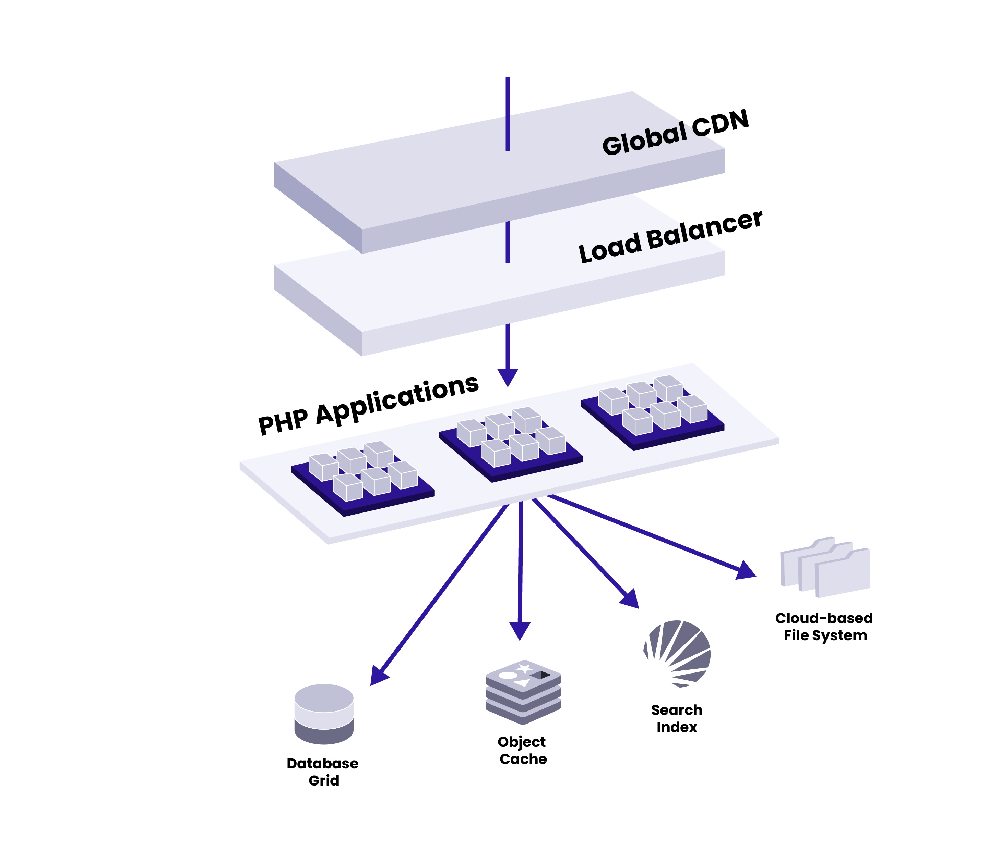

<Alert title="By the end of this chapter, you will be able to:"  type="info" >

* Create a new site on Pantheon through the Pantheon Dashboard.
* List and Describe the different starting states from which you are able to spin up a new site on Pantheon.
* Describe the WebOps Workflow on Pantheon as it relates to Code, Files, and Databases.

</Alert>

In making a new site on Pantheon, you have a few options:
* Selecting the CMS (Drupal or WordPress) you will be using
* Backend (CMS) site vs. Front End Site
* Starting with a fresh CMS install or starting from a Custom Upstream

At the end of this section, you will be able to create a new CMS Site through the Pantheon Dashboard.

## Create a Site

<Alert title="Create a Site in the Pantheon Dashboard"  type="info" >

This section will walk you through the steps of creating a new site on Pantheon through the dashboard. By the end of this activity, you will have a working installation of Drupal or WordPress to start your WebOps development. Creating sites in the Pantheon Dashboard is one of two ways to create a new site on Pantheon. You will learn how to create a site the other way, on the command line through Terminus, in a later section.

</Alert>

A Pantheon CMS site contains three components: code, files, and a database containing the content and configurations of your CMS (Content Management System). When you create a site, you are creating each of these components in the Dev environment. Then, when you are ready, you will create your Test and Live environments.

<Partial file="dashboard-site-creation-1.md" />

### Enable New Relic

<Alert title="Enable New Relic"  type="info" >

Now that we have created our first site on Pantheon, let’s enable New Relic. New Relic® Performance Monitoring offers a wide array of metrics that provide a nearly real-time look into the performance of a web application. New Relic® makes it easy for you to monitor your performance and speed up the support process by helping our support team visualize corresponding performance and symptoms.

</Alert>

<Partial file="new-relic-enabling.md" />

Once New Relic has been successfully enabled on your site, you should see the following:

  

For more information on leveraging the power of New Relic with WebOps on Pantheon, [see this guide](/guides/new-relic).

### Install the CMS

<Alert title="Install the CMS"  type="info" >

As we learned previously, Drupal and WordPress consist of three distinct components: Code (e.g. PHP, JavaScript, CSS), Content (data), and Files (e.g. images). Now that we have provisioned a new site on Pantheon through the dashboard, we will now install the CMS site itself.

**Q: Why was the site not already installed?**

Great question! When a new site is provisioned on Pantheon, WebOps automation creates all of the resources needed for the site, including code and database servers, a site dashboard, etc. Installing Drupal or WordPress requires an additional step - the installation process to configure your site's core settings, themes, plugins, and initial content. We will complete this process here.

</Alert>

There are a few different ways to install a Drupal or WordPress site. These include:

* Site Install Wizard: Initializing the site installation process through the Administrative dashboard. Both CMS’s automatically redirect you to an installation wizard that takes you through the steps of provisioning your new site. This is the process we will follow in this activity.
* Command Line: Drupal (Drush) and WordPress (WP-CLI) both include command line interface tools that include commands to install a new site at the database level. These are drush site:install and wp core install, respectively.
* Existing Site Archive: Pantheon provides many tools and support for manually migrating existing sites to the platform. For more information, [see this guide](/migrate-manual/).

In this section, we will walk through the first method, installing a fresh WordPress site through the WordPress Administrative Dashboard wizard.

1. In your site dashboard, navigate to the Dev tab and click the Site Admin button:

   

1. This will open up a new browser tab containing the WordPress installation process form.

1. You will see a “Success” message once the site has been installed. Once the site has been installed, you will be able to login to your WordPress admin dashboard directly through the Pantheon dashboard’s Site Admin button, or through the standard WordPress login URL (e.g. `https://environment-sitename.pantheonsite.io/wp-login.php`).

Congratulations! You have now successfully installed WordPress on your Pantheon site.

<Alert title="Remember: The Database is Separate for Each Environment"  type="info" >

Note: While code changes are version controlled across environments, and Files are stored in a network-attached filesystem that can sync quickly across environments, the database is separate for each environment. It is important to keep in mind that this site has only been installed on the current environment (Dev in this case). In order to install the site on other environments (e.g. Test, Live, or Multidevs), you will need to either clone the database from your Dev environment to another environment, or install the site in the same manner on one of those other environments.

</Alert>

## Components of a Site: Code & Content

Now that you have created your site through the Pantheon Dashboard, we will discuss the components of a site on Pantheon.

The distinction between code and content is a core facilitator of WebOps practices. Here, we will define the two:

* **Code** refers to anything version controlled by Git which includes core, custom and contributed modules or plugins, themes, and libraries.
* **Content** refers to your site's files and the database. In this context, files are static images and assets stored in the standard upload path wp-content/uploads for WordPress and sites/default/files for Drupal.

### Why distinguish between code and content?

Pantheon is an "opinionated platform". Specifically, we're of the opinion that it makes sense to separate the code and content because there is some level of separation between the people changing each:

* **Content Editors:** Generally speaking, the team members editing content expect to sign into a live environment, make changes, and immediately see the changes on that public site. 
* **Developers:** Web developers and designers changing code often prefer to make their changes in a non-live environment because the risk of breaking the site is too great. Changing code directly in a production environment is a practice we call "Cowboy Coding" and we greatly discourage it.

### Code Moves Up, Content Moves Down

In later chapters, we will talk about environments on Pantheon. There are typically three environments: Dev, Test, and Live.The main process of the Pantheon WebOps workflow is to move code up from Dev to Test to Live and content down from Live to Test to Dev. To facilitate this, we put files into our distributed filesystem, Valhalla, and code on to the application containers.

## Overview of Site Infrastructure

<Alert title="Learning Objectives for This Section"  type="info" >

* Define the three layers of Pantheon's Platform Architecture..
* Describe how Pantheon's Edge Layer corresponds with the WebOps platform layer, aiding the performance and uptime of a website.
* Describe how the containerized infrastructure helps websites scale and helping teams achieve productivity through automation.
* List and Describe the additional services provided by the Pantheon platform that help applications store data and serve files, improve performance for logged-in users, and aid in full site search.

</Alert>

Now that you've made a site, let's look at an architectural overview of what you've got with each environment for each site.

### The Infrastructure that Serves a CMS Site

  

**Pantheon’s container-base platform** runs an integrated set of tools across a distributed and redundant infrastructure. This architecture provides everything needed to build, launch, and manage websites that achieve unmatched performance and reliability. The platform comprises three layers, which include Pantheon’s Global Edge, Runtime Matrix, and Application Services.

### The Edge Layer

  

**Pantheon’s Global Edge** is the exterior layer of the platform, meaning it is the first point of contact for traffic. The Edge Layer has a built-in HTTPS accelerator that serves cached data from virtual memory, allowing responses to be returned without going through the application containers. This keeps resource consumption low, so dynamic requests can be generated with ease during traffic spikes. If cached content is not found, the edge layer will automatically load balance and route requests to the next layer of the platform, our the application containers. On its way back out, the response will be cached for optimal performance. 

### Application Containers

  

**The PHP Application Containers Layer** is where Nginx and PHP workers are fired off in millions of isolated Linux containers. Our robots do all the work by provisioning at the speed of software and at the click of a button, allowing you to go from hundreds of page views to hundreds of millions, without downtime or architectural changes.

Pantheon can also detect failures in the event that an application container is unresponsive or unhealthy, automatically rerouting traffic to a failover container when necessary. Every environment runs on its own container, and all containers within the same application are connected by version control. 

### Application Services

  

**Application Services Layer:** Similar to our application containers, our **database service** is based on a grid model and facilitates horizontal scalability using replication topology. This allows you to spread requests across multiple databases to improve site performance and load times.

An **Object Cache** is provided for sites needing faster performance through Redis. Put simply, Redis helps accelerate the logged in experience of the CMS, such as the content editorial experience or the shopping chart experience.

A **Search Index** is provided for sites faster and more complex search than is possible through the database. CMS Sites interact with Solr using plugins and modules.

Pantheon’s **cloud-based file system,** runs multiple layers of caching and is designed to stay in sync as you work and scale. Files are replicated for high availability.

This architecture provides everything needed to build, launch and manage websites that achieve unmatched performance and reliability.

The next two chapters will dive deeper into these layers of [Edge technology](/certification/study-guide/chapter-4-edge) and [CMS Infrastructure](/certification/study-guide/chapter-5-cms).

<Alert title="Key Takeaways"  type="info" >

* Pantheon comprises three general architectural layers: The Edge Layer, the Runtime Matrix, and the Application Services Layer.
* Each of these three layers works together to deliver Credibility, Productivity, and Impact to the website

</Alert>
