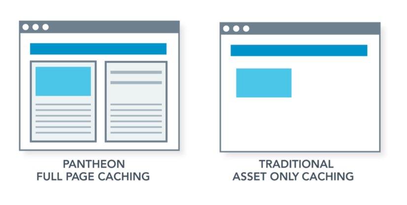

<Alert title="Learning Objectives for Chapter 4"  type="info" >

**Pantheon’s Edge Layer**

* Define the three layers of Pantheon's Platform Architecture.
* Describe how Pantheon's Edge Layer helps improve the performance and uptime of a website.
* List and describe the three distinct layers of Pantheon’s Edge Layer.
* Describe how Pantheon's method for terminating HTTPS helps minimize the performance hit typically associated with HTTPS termination.
* Summarize the requirements for customers who are interested in using Pantheon's Custom HTTPS Certificate Service.
* Describe the concept of whole page caching and its benefits in comparison to other caching strategies.

**Advanced Global CDN**

* Describe the difference between Pantheon’s Global CDN and Advanced Global CDN (AGCDN) and their unique features.
* List some possible methods for implementing redirects on Pantheon.
* Distinguish between configuration options that can be implemented on Pantheon, and configuration options which are locked down.

</Alert>

The Edge is the exterior of Pantheon—the part that directly touches the public Internet. The Edge performs two distinct functions: it improves page load times, helping sites cruise through viral traffic spikes without breaking a sweat through its built-in, ultra-fast Varnish cache automatically enabled for every site. The Edge also knows how to intelligently route and load-balance requests across Application Containers.

In this section, we will learn about Pantheon’s Edge Layer, including our **Global CDN** and **Advanced Global CDN** features, HTTPS termination, and our load balancing tier.

<Alert title="By the end of this section, you should be able to:" type="info" >

* Describe how Pantheon's method for terminating HTTPS helps minimize the performance hit typically associated with HTTPS termination.
* Summarize the requirements for customers who are interested in using Pantheon's Custom HTTPS Certificate Service.
* Describe the concept of whole page caching and its benefits in comparison to other caching strategies.

</Alert>

## Global CDN

Pantheon's Global CDN is a core platform offering that provides improved performance and security for customer sites. Global CDN supports caching to accelerate both static assets and pages served to anonymous visitors . By serving data from cache servers all over the world, website visitors receive a response without having to wait.

### How Does Global CDN Work?

Global CDN takes Pantheon's high-performance page and asset caching system, which uses Varnish, and pushes it out globally. Rather than having requests come all the way to our primary data center, we terminate HTTPS and serve pages from a location much closer to the end-user. This speeds up the time to render a web page significantly.

Our Global CDN allows you to tap into powerful and strategically distributed Points of Presence (POPs) around the globe. Site pages and assets are cached at these POPs. Your site can free up its PHP workers and database to process more dynamic requests by using these POPs. Each POP can handle hundreds of thousands of requests per second, much more than a site's own PHP and database containers.

### Points of Presence Workflow

Every Pantheon site uses Global CDN. This means that every HTTP request from a website visitor first goes to the closest POP to see if there's a regional cache of the content. If the closest POP doesn't have the content, the request will then go to a POP near the origin (i.e. the PHP workers and database). If the content is cached anywhere in the world, the origin POP will have a copy. If neither POP has the appropriate cached data, the request will continue to an application container worker, which will generate responses that may be cached on the way back to the browser.

Global CDN can also improve the availability of your site. For example, if a PHP fatal error breaks your site, anonymous page requests can still be served by POPs, and end-users won't encounter errors or broken pages.

### HTTPS On Pantheon

Many providers require you to terminate your HTTPS in their datacenter, or at the load balancer level. With Pantheon, HTTPS is terminated on our edge layer, so encryption of sensitive information happens as quickly and as close to your sites’ visitors as possible. Pantheon includes fully managed and free HTTPS on a CDN at all account tiers. We obtain and manage high-grade encryption with TLS 1.3 for all of your sites and deploy it worldwide on Global CDN. 

All traffic is encrypted end- to-end from the CDN to the individual application container, with no air gaps in coverage.

### LetsEncrypt Certificates

HTTPS is the secure variant of the HTTP protocol. It creates secure connections by providing authentication and encryption between a browser and website. HTTPS protects the security and data integrity for both your website and your visitors' personal information.

Sites not running under HTTPS are penalized with poor SEO results in Google and alarming user experiences for visitors. Google Chrome now shows a “Not secure” warning for all non-HTTPS websites and Firefox displays a gray lock icon with a red strike-through in the address bar for non-HTTPS sites. The web has standardized on HTTPS, it is no longer an option.

“Cert management” can be tedious, time-consuming, and not a good use of development hours. By default, Pantheon completely automates and manages the certificate hosting and renewal process for our customers. Through our partnership with Let's Encrypt, a free, automated, and open Certificate Authority (CA) that aims to make HTTPS the standard for all websites, Pantheon can now completely automate and manage the certificate hosting and renewal process. Pantheon automatically provisions a Let's Encrypt certificate for your site, and always renews it automatically, for no additional cost. Let's Encrypt issued certs are valid for 90 days and we renew them 30 days before expiration.

### Custom HTTPS Certificates

For customers who require a custom certificate from a certificate authority other than Let’sEncrypt, Pantheon provides a Custom Certificates service. This service is available to contract customers, including Elite, Enterprise, Higher Education, and Resellers. To get started, contact your account manager or our Sales Team.

To add a custom HTTPS certificate to your site, Pantheon must first provide you with a Certificate Signing Request (CSR) file, which is typically generated by our Onboarding Team - this is not a self-service process. Using a Pantheon-generated CSR is a hard requirement, so the CA you choose for your custom HTTPS certificate must accept Pantheon’s CSR format. It should be noted that Pantheon cannot accept custom certificates from the CA GlobalSign, as they do not accept Pantheon’s CSR.

### Response Caching
Reverse-proxy caching is the best practice way to serve commonly requested pages, speeding up the performance of the site and improving page load times. Most webpages consist of dozens of assets that need to be downloaded and processed before a page is fully rendered. A website’s initial page load provides the instructions for the images, fonts, text, CSS, JavaScript, and other assets needed to construct and display the fully rendered webpage.

The key to a high performance caching strategy is to deliver responses for repeat page views from the cache, rather than having to render the page from the CMS or origin data center. The key asset to cache for the fastest load is the actual “html page”—which many hosting and CDN configurations fail to do. And while many CDN solutions only cache static assets such as images, JavaScript files, and stylesheets, Pantheon’s advanced, whole page caching dramatically improves page loads by caching the entire web page—from html, to CSS and assets.

Pantheon’s Edge has a built-in, ultra-fast Varnish cache automatically enabled for every site. Varnish Cache is a powerful, open-source HTTP engine/reverse HTTP proxy that is used to speed up websites by caching (storing) a copy of a webpage the first time a user visits. When the user or any other user revisits the webpage, Varnish serves the cached copy instead of requesting the page from the server again. This reduces the load on the server and improves the website's performance and load times.

When any given HTTP request can be satisfied with a previously served response in the cache, it will be immediately returned to the browser. If not, the request will seamlessly continue to the application containers and the response will be cached on the way back out to the browser.

By serving pages from memory, a response is returned without needing to access either a PHP application container or a database server. This allows pages to be delivered extremely quickly and at scale.

In summary, Pantheon’s Global CDN serves as a reverse proxy for the entire platform, which allows Pantheon to own the configuration and optimization of the Edge Layer so that our customers do not have to. For Marketing teams, this means that website performance optimization is a turnkey solution on Pantheon. Pantheon distributes everything a browser needs to render web pages across our Global Content Delivery Network (CDN). Our integrated approach of deploying page caching, asset caching, and HTTPS certificates is lightyears ahead of the partial cache solutions used by most managed hosting providers.

## Advanced Global CDN

<Alert title="By the end of this section, you should be able to:" type="info" >

* Describe how Pantheon's method for terminating HTTPS helps minimize the performance hit typically associated with HTTPS termination.
* Summarize the requirements for customers who are interested in using Pantheon's Custom HTTPS Certificate Service.
* Describe the concept of whole page caching and its benefits in comparison to other caching strategies.

</Alert>

Because Pantheon’s Global CDN is configured as a platform-wide implementation, bespoke configuration options are not available with Global CDN alone. This is where Pantheon’s Advanced Global CDN (AGCDN) comes into play. AGCDN is a Managed Service that takes Pantheon's offering a step forward, providing a menu of configuration options for customers who require unique optimizations for digital delivery at scale.

In this section, we will learn about the difference between Pantheon’s Global CDN and our Advanced Global CDN managed service. We will also discuss some of the most common use cases for AGCDN.

Each AGCDN service configuration is offered as an annual contract subscription. Customers can add multiple sites to their AGCDN configuration, or conditionally apply specific rules.

Some of the most commonly used features of AGCDN include:

* Domain Masking and Reverse Proxy
* Edge Redirects
* IP Allowlisting and Blocklisting
* Geolocation-based Actions
* Image Optimization. 

AGCDN also encompasses Pantheon’s fully managed Web Application Firewall (WAF) solution.

Let’s dig more into each of these features in a bit more detail.

### Domain Masking and Reverse Proxy

Domain masking runs multiple Pantheon or non-Pantheon applications behind a single domain, using different URL paths. 

This can provide a great deal of flexibility for Marketing teams who are looking to unify their web presence across multiple properties. For example, an enterprise called Acme Corp. with a root domain of acme-corp.com, might have several types of sites, including their flagship site running on Drupal (www.acme-corp.com), a blog site running on WordPress (acme-corp.com/blog), sites for individual product lines running on separate instances of Drupal (acme-corp.com/product-x), or regional sites running a static framework (acme-corp.com/region). In this example, Domain Masking splits the requests for acme-corp.com at the edge and routes them to the appropriate backend applications, providing a unified experience for website visitors.

Another good use case for Domain Masking is when websites are upgraded or rebuilt in new technologies, for example replatforming a Drupal 7 site to Drupal 10. You could implement Domain Masking at the edge to route requests between the current Drupal 7 site and the new Drupal 10 site, path by path, allowing a graceful rollout of the site relaunch and targeted release of individual sections of the site.

### Edge Redirects

Redirects are often implemented at the application level, which can add strain and performance latency to the CMS in some cases. By moving page redirects to the edge with AGCDN, you are able to reduce requests to your CMS and mitigate performance impact on the application. 

AGCDN can combine redirect behavior using Headers (Cookies, Responses, etc.). AGCDN provides redirects for:

* Path
* Domain
* Pattern-based (RegEx)
* Redirects based on Geolocation Information

**A Note about Redirects:** Pantheon does not support managing redirects in `.htaccess` files, because they are ignored by nginx for reduced resource consumption and increased efficiency. This configuration is standard across all Pantheon sites, and modifications to the `nginx.conf` file are not supported.
Using `.htaccess` is generally not recommended - even for sites running Apache. Instead, we suggest handling domain-level redirects by setting a primary domain, and handling page-level redirects in PHP within your site's configuration file.
For more information, see [this documentation page](/guides/redirect).

### IP Allow/Blocklisting

AGCDN also allows you to restrict access to web properties through Access Control Lists (ACLs) that use IP addresses to either allow or deny access.

An IP Blocklist prevents users with specific IPs or in IP ranges from accessing your site. This can be useful when trying to prevent known bad actors from accessing your site. It should be noted, however, that implementing a rules-based Web Application Firewall (WAF) for this purpose is a better approach in most circumstances.

IP Allowlists only allow users with specific IPs or in IP ranges to access your site, blocking everyone else. This can be very useful when you want to restrict website access to specific users or specific locations. A good example is an intranet that is only allowed to be accessed from a corporate office or corporate laptops. 

### Geolocation-based Actions

Geo-based actions have many uses, including serving personalized content or restricting access to certain types of content based on geolocation, or redirecting users to a localized version of the site based on where they are located.

Sending location information to your application is much faster than fetching it from a third-party API. AGCDN enables actions based on the physical location of your user (for example, blocking or redirecting based on country), and can send location information to your application for performant, custom control.

<Alert title="Some examples of Geolocation-based actions" type="info" >

**A multinational distributor of alcohol **uses AGCDN to age gate content on their websites related to alcohol. They use AGCDN’s geolocation data to identify the country of the visitor, and a pop-up form to gather the visitor’s birthday. They then cross-reference the data with a table that references the minimum drinking age in each country, and if the visitor’s birthday places them above the minimum age of the country of origin, they are redirected to the site. If not, they are redirected to a restriction message.

**A US-based non-profit **serves residents of the United States and Canada, exclusively. Their analytics show that virtually no legitimate traffic comes from outside North America. As a security measure, they blocklist traffic that comes from outside North America with AGCDN.

**An international consumer goods company **sells certain products in certain countries, and they are required by law to only display products that are legally available within each country. They use AGCDN to filter out product displays based on where the visitor is accessing the site from.

</Alert>

### Image Optimization

Image Optimization (IO) is an optional feature of AGCDN that speeds up page loads by offloading image transformation to Pantheon’s powerful edge cloud network. This improves the performance of the site, reducing the page load size by intelligently selecting the appropriate image resolution and format based on factors such as device type and connection speed.

AGCDN Image Optimization can automatically convert images to the SEO-friendly WebP format, perform smart image cropping, and even overlay an image with a watermark or other identifier. It also can leverage progressive rendering of images to provide a better user experience. 

Serving from the edge in this way offloads work from your servers and improves your site's performance, especially for customers with slow connections.

### Web Application Firewall

A Web Application Firewall (WAF) provides a crucial layer of security for websites. Operating through a set of rules that describe the known characteristics of bad actors and web security exploits, the WAF inspects each request to determine, in real time, whether or not to allow that request to continue on into your website. This helps keep your website safe from hackers and malicious bots.

If application security is critical to your website, a Web Application Firewall is a must. A WAF is the most effective preventative measure you can take to protect your website against the OWASP Top 10 common vulnerabilities, including SQL Injection, Cross-Site Scripting, and DDoS (Distributed Denial of Service) attacks. A WAF is highly recommended for any site where form data is being collected from your users, including logins, feedback forms, comments, and other user generated content.

Of course, there are many excellent options out there for selecting a WAF, and many of Pantheon’s customers choose to manage their own edge WAF through vendors such as CloudFlare, Akamai, Imperva, and AWS, and point it to their Pantheon properties. However, leveraging Pantheon’s AGCDN with WAF presents several advantages over these options:

* **Pantheon’s WAF is Fully Managed: **Configuring, testing, and deploying a WAF in front of your site can present challenges, and missteps in this configuration process can result in time-consuming errors such as false positives or misguided rule implementations. Pantheon’s WAF is a fully-managed service rather than simply a product, which means that Pantheon’s Professional Services team will set it up, run initial testing to ensure the rules are working as expected, and deploy the service to production, saving you time and potential frustration. 
* **Single Vendor Support: **Selecting another provider can introduce additional complexity, particularly when things inevitably go wrong or unexpectedly. Managing multiple vendors means interfacing with two support teams, spending extra cycles identifying root cause analysis between two systems, and paying two separate bills.** **Pantheon’s Support team provides the same expert level support for our WAF as we provide for our platform and products, which ultimately means a shorter turnaround time to resolve issues that may arise. 
* **Pre-configured Targeted Rulesets: **Pantheon’s WAF comes pre-configured with the most relevant rulesets, including rules targeting the [OWASP Top 10](https://owasp.org/www-project-top-ten/) vulnerabilities, Trustwave’s vulnerabilities, and rules targeting the most common exploits targeting both Drupal and WordPress. The rulesets encompass several hundred individual rules that are being evaluated in real time, protecting your properties against virtually any known exploit on the web.
* **Deployed at the Edge: **There are several application-layer WAF products out there, including [WordFence](https://www.wordfence.com/) and [Drupal Steward](https://www.drupal.org/drupal-security-team/steward). While these are excellent options for providing additional security to your CMS sites, they have the potential to negatively impact the performance of your application by consuming resources. Pantheon’s WAF inspects all traffic at the edge, which does not consume server resources or negatively impact application performance. And because all traffic is coming to your site through Pantheon’s edge layer, leveraging Pantheon’s WAF locks down all requests to your website at a single ingress point from Pantheon’s edge.     

For more information on Pantheon’s WAF, see [this documentation page](/guides/agcdn#agcdn-with-wafio-features).

## Load Balancer

The innermost component of Pantheon’s Edge Layer is the load balancing tier. It is a container request router that accepts requests exclusively from the CDN tier, then intelligently routes and load balances requests across the hundreds of thousands of application containers in the Runtime Matrix. 

In addition to routing requests to the correct application, Our load balancer allows the platform to scale intelligently by leveraging [socket activation](http://0pointer.de/blog/projects/socket-activated-containers.html) technology. That means that it is essentially listening for latency as new containers are spun up, facilitating structured scaling that can meet the demands of unforeseen traffic spikes in seconds.

<Alert title="Chapter 4 Key Takeaways" type="info" >

* Pantheon’s Edge Layer serves two main purposes: HTTPS termination and full-page caching at the edge. Also part of this layer is the load balancer.
* Pantheon’s Global CDN sits in front of all sites on Pantheon, providing performance and uptime benefits by caching full pages of HTML. This differs from poorly configured CDN’s which don't cache HTML responses effectively.
* Because Global CDN is a one-size-fits-all configuration, Pantheon also offers Advanced Global CDN (AGCDN). AGCDN is a fully managed service that allows customers to leverage customized edge logic for various purposes.
* The most commonly used features of AGCDN include domain masking and reverse proxy, edge redirects, IP allowlisting/blocklisting, geolocation-based actions, and image optimization.
* Pantheon’s Web Application Firewall is an optional, fully-managed service that protects Drupal and WordPress applications from some of the most common Layer 3, 4, and 7 attacks, including DDoS, Cross-Site Scripting, SQL Injection, etc. Included are OWASP Top 10, Trustwave, Drupal-specific, and WordPress-specific rulesets.

</Alert>
