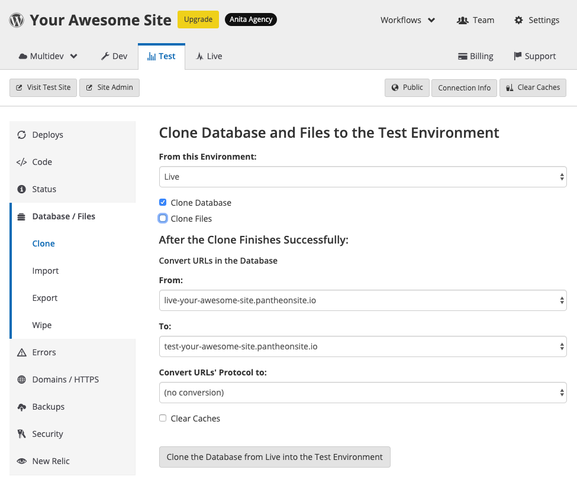
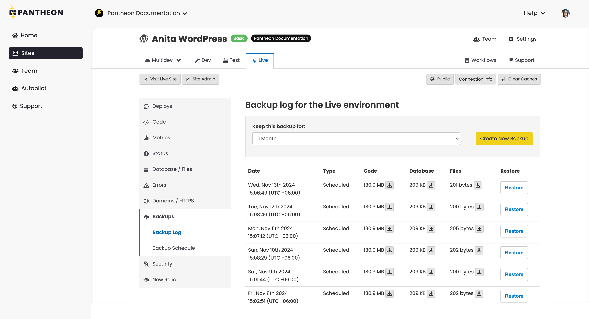

<Alert title="Learning Objectives for This Chapter:"  type="info" >

**Containers on Pantheon**

* List and Describe the ways containerized technology benefits WebOps.
* Describe the timeout policy for Live and non-production environments for paid and unpaid site plans.
* Describe the purpose of the pantheon.yml file.
* Differentiate between which platform options can be configured in your pantheon.yml file, and which cannot.

**Code**

* Describe the git-based workflow on Pantheon.
* Enable local development with a git-based workflow by accessing the connection information in your dashboard.
* Explain why code changes are immutable on Pantheon's Test and Live environments.
* Describe the process for upgrading PHP within a Multidev environment.
* Describe the resources and limits of access SSH keys provide.

**Database**

* Describe how to directly access your MariaDB database connection on Pantheon.
* Describe the two types of backups available on Pantheon.
* Describe how to create an on-demand backup of your code, database and files.
* Explain the reason why it is a good idea to create a backup of your database prior to cloning the database from one environment to another.
* Describe how Pantheon’s WebOps tools, Quicksilver and Terminus, can help automate the process of creating backups.

**Files**

* Delineate which elements of a CMS application on Pantheon are version controlled, and which are not.
* Describe the way that files are stored and accessed on Pantheon.
* Describe the process for making files in Pantheon's File System accessible from the docroot.
* List and Describe the important Pantheon-related files important files that are automatically placed in your application container.

**Additional Application Components**

* Describe some of the common use cases for New Relic on Pantheon.
* Describe the performance benefits of Object Cache for logged in users.
* Describe the benefits of using a REST-based third-party email service on Pantheon, and the limitations of using an SMTP configuration.

</Alert>


Pantheon’s **application containers **are where the action happens: they execute the code for your website. Over a million Linux containers running PHP and NGINX are distributed across a big grid of powerful dedicated machines. These containers are provisioned and managed by our software without any need for manual configuration. 

In this section, we will learn about Pantheon’s container, how we leverage our infrastructure to provide scalability and self-service capabilities, and which configuration options are available for this layer.

The essence of a runtime container is a highly tuned PHP-FPM worker and its connections to the outside world. Incoming requests come via Nginx, which handles requests for static assets and passes dynamic requests to PHP. Runtime containers are "share nothing", but they have connections to services like our cloud-based filesystem for serving uploaded assets and New Relic. 

Pantheon’s platform has been container-based ever since it became Generally Available. We have over one million containers under management. We literally could not exist if we had to manage an EC2 instance for every one of those environments. It would be financial and operational madness. Virtual Machines are too slow, too error-prone, and too inefficient to power a top-flight website management platform.

## Containers on Pantheon


<Alert title="By the end of this section, you should be able to:"  type="info" >

* List and Describe the ways containerized technology benefits WebOps.
* Describe the timeout policy for Live and non-production environments for paid and unpaid site plans.
* Describe the purpose of the pantheon.yml file.
* Differentiate between which platform options can be configured in your Pantheon.yml file, and which cannot.

</Alert>


The primary benefits of containers are efficiency and agility. Containers are orders of magnitude faster to provision, and much lighter-weight to build and define versus methods like omnibus software builds and full Virtual Machine images. Containers in a single OS are also more efficient at resource utilization than running a Hypervisor and guest OSs.

The Runtime Matrix can provision you more containers at the click of a button, whether that’s to scale up the production environment or spin up an environment for a new team member.

**Containerized technology benefits WebOps in the following ways:**


* **Very fast provisioning:** Containers are provisioned via software into already-operating infrastructure. We can add, remove, and redistribute containers in seconds. In fact, when development sites are idle we spin them down and resurrect their containers in real time as the first page requests come in.
* **Simple, high availability:** We run the containers on different underlying hardware. If one host goes down, we can route traffic from the Edge to live application containers running elsewhere.
* **Smooth scaling:** Containers let us take sites from hundreds of pageviews to hundreds of millions of pageviews without any downtime or architectural changes. This is hard when you have a VM-centric hosting architecture. Vertical scale requires reboots to resize, and horizontal scale introduces painful architectural gaps.
* **Machine-precision consistency:** Containers are provisioned automatically on identical infrastructure, and can only be managed via Pantheon's automated tools. There are no gotchas when servers get out of sync.
* **Controlled Costs:** Containers make scaling up much more affordable and granular. Since the resource cost of a small set of processes is so much less than even the tiniest cloud instances capable of running a Drupal installation, you can spread out across many machines without breaking the bank.

Pantheon uses automation to provision new containers in the Runtime Matrix, which means that our customers never have to worry about (or really think about) the container fleet operating beneath their sites on Pantheon. However, from a WebOps perspective, it can be beneficial to understand how Pantheon users do interact with containers on the platform, and how containerization facilitates the delivery of WebOps.

Each application on Pantheon consists of a cluster of containers. The initial number of containers for an application is determined by the expected level of traffic to the site and the site plan associated with the application. See the section on Site Plans for more information.

Every environment for your site (Dev, Test, Live, Multidevs) runs on its own container. At the Performance Medium level and above, the Test and Live environments have multiple containers serving your site. This consistency means that as you move between projects of different sizes you don't need to fully rethinking the architecture or workflow between a small site or a large, high-traffic one.

Pantheon containers spin down (sleep) after ~1 hour of idle time. Live environments on a paid plan will spin down after 12 hours of idle time. Upon receiving a web request, the environments are spun up, usually within 30 seconds.

Attempts to remotely access services (such as MySQL or SFTP connections) will fail on idle containers. Wake the environment and resolve connection errors by loading the home page in your browser or with the [env:wake Terminus command](/terminus/commands/env-wake).


### The Pantheon.yml File

While most of Pantheon’s container configurations are managed by Pantheon in order to standardize and automate guardrails and best practices across the platform, many of Pantheon’s container configurations are managed by code for individual sites. Pantheon exposes a subset of controls that a customer can modify, which are stored in a YAML file that lives in the root of every site. For customers implementing a common codebase for a portfolio of sites, [default configurations can be implemented in a pantheon.upstream.yml](/pantheon-yml#custom-upstream-configurations), and then overridden at an individual site level.

The `pantheon.yml` file provides a way to version-controllable means to configure platform options for any project. Some of the configurable items include PHP version, Drush version, protected paths, nested docroot, and Quicksilver platform hooks.

Items such as Nginx configuration or Varnish settings are not editable.

Your site's `pantheon.yml` configuration file can be found in the root of your site's code repository. If you have a local git clone of your site, this is the project root. When accessing the site over an SFTP connection, look in the code directory.

For more information, see [this documentation page](/pantheon-yml).


## Application Services Layer

Drupal and WordPress applications, like most other web-based CMS frameworks, consist of three distinct components: 

* **Code:** Both Drupal and WordPress are PHP-based application frameworks. PHP provides the runtime that executes the code to do things like rendering the content stored in the database as HTML, integrating with external APIs, and interacting with the Drupal and WordPress hooks to extend functionality.
* **Database:** The database contains the structured data that powers your application. This includes all of the content (posts, nodes, articles, etc.), comments, application configuration, CMS user profiles, content relationships, menus, links, and other critical aspects of your application.
* **Files:** Files are static content not stored in your database, and usually consist of images, documents, or user uploads. 

In this section, we will learn about how Panteon handles code, database, and files for your CMS. We will also learn about the additional application components that are included with your sites on Pantheon.

### Code
<Alert title="By the end of this section, you should be able to:"  type="info" >

* Describe the git-based workflow on Pantheon.
* Enable local development with a git-based workflow by accessing the connection information in your dashboard.
* Explain why code changes are immutable on Pantheon's Test and Live environments.
* Describe the process for upgrading PHP within a Multidev environment.
* Describe the limits of access SSH keys provide.
* List the resources SSH keys provide access to on Pantheon.

</Alert>

Code (PHP, JavaScript, CSS, etc.) is version controlled on Pantheon with Git. This mitigates the risk of a bad code push costing your team time and focus by providing the ability to roll back changes. It also facilitates collaboration and parallel feature development by providing a branching structure, enabling team members to work on different aspects of the project simultaneously without interfering with one another. This branching model allows for the safe testing and integration of new features, making the development process more efficient and less prone to errors.

In this section, we will learn about working with your code on Pantheon.

#### Git-based Workflow

Pantheon uses Git to make sure all code is stored, versioned, and deployed both safely and predictably. Git is an industry-standard, open source version control system that is fast, secure, and reliable, and supports both simple versioning or complex, distributed, non-linear workflows for hundreds of contributors. Every Pantheon application comes with a preconfigured container that stores your Git repository so your code and history are always available. We also give you the power to effortlessly implement a feature branch-based workflow with Multidev environments.

All code changes are committed to the main (or master) branch within the Dev environment. Note that code changes cannot be made directly in the Test or Live environments, which are immutable. Limiting the ability to commit code changes to the Dev environment and below helps prevent bad actors from defacing the site directly.

We will cover Pantheon’s full WebOps Workflow in depth in a later section.


#### SSH Access on Pantheon

Developers access a container directly via a special encrypted SSH interface, and while SSH keys are used to securely authenticate users to give them access to git codeservers, as well as CLI tools like rsync and SFTP,** it should be noted that Pantheon does not provide root level server access to customers.**

SSH keys are a best practice for authentication and provide a more secure way to access your Pantheon features than a simple username and password. SSH keys allow you to stay secure and compliant with security regulations, provided that you follow recommended guidelines to generate, store, manage, and remove your SSH keys. SSH keys provide developers with passwordless access to your application's Git repository, SFTP, and Drush. SSH public keys are uploaded in the Pantheon Dashboard in the Personal Settings section under the SSH Keys tab.

You can take full advantage of Pantheon by loading your public SSH key into your account. You must add your SSH key once for each work environment (laptop, desktop, etc.), no matter how many sites you work on.

We will show you how to create and add an SSH key to your Pantheon site in a later section.

#### PHP Versions

PHP is a scripting language that facilitates server-side web development. The PHP code in your Pantheon account is executed at runtime whenever a request is received from the web server the same way it is on other platforms.

Pantheon’s containerized infrastructure allows you the flexibility to define which version of PHP you would like to run on a per-environment basis. Therefore, Pantheon will never require customers to upgrade their PHP versions on short notice. That being said, upgrading your site's PHP version will improve the security, performance, and supportability of your site. Pantheon recommends upgrading to the latest stable versions of PHP (currently, versions 8.1 and 8.2), but we support PHP versions 5.6 and above on the platform as of the time of this writing.


#### Upgrading your PHP Version

PHP versions can be set using the `pantheon.yml` configuration file in the root of your site's code repository. Configurations made in `pantheon.yml` will override custom settings in `pantheon.upstream.yml`. 

You can use SFTP or Git mode to create or change the `pantheon.yml` file. To set a specific version of PHP on a per-environment basis, update your `pantheon.yml` file in the following manner, then commit the changes and push them up to your Pantheon environment. 

Multidev environments provide the perfect workflow for upgrading PHP versions. Simply create a new Multidev environment from a feature branch to upgrade your PHP version, update and commit your `pantheon.yml` file to the latest PHP version, clone the database and files from one of your permanent environments into the Multidev environment (Live is recommended for this to maintain parity between the production site and your PHP upgrade environment), and work through any issues resulting from syntax changes, all without affecting your production site. This will allow you to upgrade PHP on your own timeframe with no risk.

The following example would update the environmental version of PHP to version 8.1:

   ```yaml:title=pantheon.yml
   api_version: 1

   php_version: 8.1
   ```

For more information, see:

* [Configure Your PHP Version](/guides/php/php-versions?search=pantheon.yml#configure-your-php-version)
* [PHP on Pantheon](/guides/php)


### Database

<Alert title="By the end of this section, you should be able to:"  type="info" >

* Describe how to directly access your MariaDB database connection on Pantheon.
* Describe the two types of backups available on Pantheon.
* Describe how to create an on-demand backup of your code, database and files.
* Explain the reason why it is a good idea to create a backup of your database prior to cloning the database from one environment to another.
* Describe how Pantheon’s WebOps tools, Quicksilver and Terminus, can help automate the process of creating backups.

</Alert>


The database of your CMS contains the structured data that powers your application. Unlike code, the database is not version-controlled on Pantheon. For this reason, it’s important to take advantage of Pantheon’s automated Backups tool, which creates a snapshot of your database (along with the code and files of your application) that can easily be restored if a rollback is needed.

In this section, we will learn about Pantheon’s database service and how it powers your application.

The Pantheon platform provides each site environment with a container that runs MariaDB. MariaDB originated as a fork of MySQL that included enhanced features and performance improvements. MariaDB and MySQL both use the MySQL protocol.


You can use the tools in the Database / Files tab to overwrite the databases on your site's Dev or Test environment with the database on your Live environment. This allows you to pull content from Live into other environments (fig. 4.1):



Note that cloning a database from one environment to another will overwrite the contents of the target environment’s database. It is therefore recommended to create an on demand backup of the existing database before cloning the database between environments. On-Demand Backups are available in the Backups tab of the left sidebar (fig. 4.2):



To create an on demand backup of your code, database, and files, simply click the “Create New Backup” button. The new backup will appear at the top of the list of archived backups once completed. More importantly, the label for the backup will have a “Restore” button next to it that will allow you to roll back your database changes if needed. This protects you from the risk of cloning a database between environments.

####  Backups on Pantheon

On-Demand backups are stored on Pantheon for 1 or 6 months, depending on preference. Backups do count toward the storage limit of your site plan. 

Each backup contains three components:

* **Code**: anything version controlled and committed via the Site Dashboard. Uncommitted SFTP changes to code are not backed up.
* **Database**: a mysql dump of your site's db.
* **Files**: images and assets stored in the standard upload path wp-content/uploads for WordPress and sites/all/default/files for Drupal. Various content generated by your application is not backed up. For example, generated images from image styles and aggregated CSS and JS assets, are not backed up.

In addition to On-Demand backups, Pantheon automatically backs up your site with Automated backups. You can manage your site's backup files in the Backups tab of your dashboard. 

* **All sites: **You can run manual backups for free, and choose to keep them for one month or six months.
* **Paid sites: **You can enable or disable automatic backups. A nightly backup is created and stored for a week and your weekly backup is stored for a month when automatic backups is enabled.

Backups can also be triggered with Pantheon's CLI's [backup:create](/terminus/commands/backup-create) command. That command can be part of a multi-step script that also includes the cloning of the database from one environment to another.

####  Connecting to Your Database

Pantheon provides direct access to your databases through our platform for debugging and importing large databases. Each site environment (Dev, Test, and Live) has a separate database that requires unique credentials. Credentials are automatically included in your site configuration.

You can find the credentials for connecting to your database directly in your Site Dashboard.

Navigate to the environment you want to connect with, and select **Connection Info** to view your Database credentials (fig. 4.3):


The following required fields are provided:

* **Server:** The hostname of the server.
* **Port:** The TCP/IP port number to use for the connection. The platform randomly selects the port number. Port numbers will differ in every environment for each site, and might not match what PHP reports.
* **Username:** The user name to use when connecting to the server.
* **Password:** The password to use when connecting to the server.
* **Database: **The database name to use. This value is `pantheon` and cannot be altered.

### Files

<Alert title="By the end of this section, you should be able to:"  type="info" >

* Delineate which elements of a CMS application on Pantheon are version controlled, and which are not.
* Describe the way that files are stored and accessed on Pantheon.
* Describe the process for making files in Pantheon's File System accessible from the docroot.
* List and Describe the important Pantheon-related files important files that are automatically placed in your application container.

</Alert>

Files are static content not stored in your database, and usually consist of images, documents, or user uploads. Files are distinct from your site's code, and are excluded from version control via Pantheon's .gitignore files (The `.gitignore` file is located at the root of the site's codebase and instructs Git on which paths to ignore).

In this section, we will learn about Pantheon’s file system, how to access your files, and which types of files are included by default.

#### Files and Application Containers

The Pantheon architecture relies on highly available application containers that are seamlessly integrated with our cloud-based file system. This means that your files are not local to the application containers running your site's codebase.
Pantheon creates a symbolic link (symlink) to the files directory in the appropriate location of your docroot:

* WordPress: `wp-content/uploads`
* Drupal: `sites/default/files`

It is important to note that this directory is not part of the document root and is not directly web-accessible. You must create an additional symbolic link from within the document root if you need to make a path in files accessible from the docroot. Non-standard file locations must be symbolically linked to `/files` or moved manually.

#### Accessing Files
You can connect directly to the filesystem with an SFTP client, such as FileZilla, ForkLift, CyberDuck, or WinSCP. To do so, follow these simple steps:

* Copy your connection information into an SFTP client.
* Navigate to the `/files` directory within the SFTP client.

#### Pantheon-Related Files

Pantheon places the files below in your application container because they contain important information:

* `fusedav_version:` shows the version of fusedav being used.
* `fusedav.conf:` is the client configuration file for fusedav. fusedav is software used to mount shared storage (the folder `/files`) to the application container. This folder is where your content-related files (images, attachments, and other things not stored in version control) are kept. For Drupal sites, there is a symlink to it from `sites/default/files`. For WordPress sites, there is a symlink from `wp-content/uploads`.
* `htpasswd`: is used when you want to lock your environment with a username and password. There is a Public button on each environment Dashboard that you can click to add a username and password to your site. This will keep your site hidden while you're working on it.

## Additional Application Components

<Alert title="By the end of this section, you should be able to:"  type="info" >

* Describe some of the common use cases for New Relic on Pantheon.
* Describe the performance benefits of Object Cache for logged in users.
* Describe the benefits of using a REST-based third-party email service on Pantheon, and the limitations of using an SMTP configuration.

</Alert>


Pantheon provides components and tools to expand the functionality and usability of your CMS application. These include New Relic for performance monitoring, a fully managed Solr instance to improve the search functionality on your site, Object Cache to improve the logged-in experience, a failover database server for sites that are using Multizone Failover, and a basic email service to generate administrative emails for things like password resets.
In this section, we will learn about these additional application components.

### New Relic

**New Relic® Performance Monitoring** offers a wide array of metrics that provide a nearly real-time look into the performance of a web application. New Relic® makes it easy for you to monitor your performance and speed up the support process by helping our support team visualize corresponding performance and symptoms.

On Pantheon, most plans come with free New Relic APM Pro, giving you code-level visibility into your website’s performance. You can track releases, investigate query performance, and identify areas for improvement with New Relic's software analytics tool suite.

Your Pantheon New Relic instance also comes with Synthetics, which allows you to monitor your websites, detect and diagnose performance issues, and ensure the optimal function of your business's online presence.

You can follow the [steps in this guide](/guides/pagerduty/monitor/#create-a-monitor) to set up a ping monitor to periodically check your site’s availability.

### Pantheon Search

**Pantheon Search** is a system for indexing and searching site content. Pantheon provides Solr-based search as a service for most plans including Sandbox, on all environments. No permission or action is required from Pantheon to use Pantheon Search.

Currently, Pantheon provides Apache Solr v3.6 and v8.0 as a service for all plans except the Basic plan. For more information, see [Pantheon Search](/solr).


### Object Cache/Redis

**Pantheon's Object Cache** uses Redis, is an open-source, networked, in-memory, key-value data store based on Redis that can be used as a drop-in caching backend for your Drupal or WordPress website.

Most website frameworks like Drupal and WordPress use databases to cache internal application objects along with queries for normal page requests, which causes increased load-times.

While the CDN provides caching to speed up the performance for anonymous users, it does not cache pages when users are logged in. Object Cache speeds up performance for logged-in users by remembering, or caching, results from database queries. When another user loads the page, the results are provided from the Object Cache which is stored in memory without querying the database again. This results in much faster page load times, and less strain on database resources. For more information, see [Object Cache Overview](/object-cache)

### Failover Database Server

The Pantheon Platform has redundancy built-in throughout our containerized infrastructure. In addition, sites with Multizone Failover get a replicated database in an alternative availability zone for even higher availability. For more information, see [this documentation page](/multizone-failover).


### Email

#### Incoming Email

Pantheon does not host inboxes for incoming mail. We recommend using an externally hosted email solution, such as Gmail from [Google Workspace](https://workspace.google.com/).

#### Outgoing Email

Drupal and WordPress both require a configured outgoing email service.

For outgoing emails, we recommend integrating a third-party service provider that supports a REST API configuration. You can use an SMTP configuration, but because SMTP requests are associated with dynamic outgoing IPs there can be negative impacts to deliverability. For a detailed comparison between API configurations and SMTP, see [this related blog post from SendGrid](https://sendgrid.com/blog/web-api-or-smtp-relay-how-should-you-send-your-mail/).

##### REST API Providers

<Partial file="email-rest.md" />

For more information, see [CMS Email Service on Pantheon](/email).
