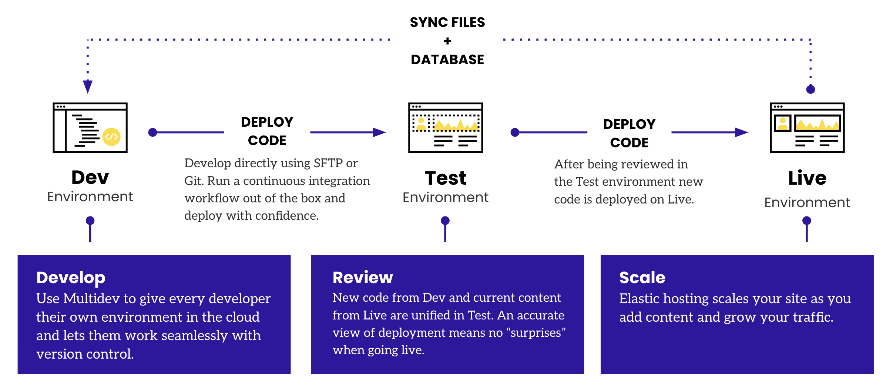

<Alert title="By the end of this chapter, you will be able to:"  type="info" >

* Describe the deployment pipeline for CMS Sites on Pantheon as it relates to Code, Files, and Databases.
* Describe the ways that using Multidevs can boost a development team's efficiency and productivity.
* Describe the opinionated workflow of WebOps on Pantheon, including how code changes make their way from feature branch development to production deployment.
* List the ways a Multidev environment can be created on Pantheon.
* Describe how SFTP mode fits into Pantheon's git-based deployment pipeline.
* Describe the advantages and disadvantages of developing in SFTP mode instead of git mode on Pantheon.
* Connect and sync your existing Pantheon site and repository to an external version control repository to facilitate collaboration between teams.


</Alert>

## Pantheon's Deployment Pipeline: Dev-Test-Live

<figure>

 

 <figcaption align = "center"><b>Fig. 6.1 - Dev-Test-Live Overview</b></figcaption>

 </figure>


Every Pantheon site comes with three permanent environments: Dev, Test, and Live (fig. 6.1). Each environment runs a version of the site on its own container. Separate Dev, Test, and Live environments allow you to develop and test your site without impacting the Live environment's availability to the world. Additional development environments are available with Multidev.

<figure>

 

 <figcaption align = "center"><b>Fig. 6.2 - Dev-Test-Live Basic Workflow</b></figcaption>

 </figure>

 ### Steps for Basic Dev/Test/Live Workflow

 1. **Commit Code in Dev:** Code is writable in the Dev (or a Multidev) environment. In Test and Live, only the git-based deployment pipeline has permission to change code. This is intentional, and supports the WebOps workflow model we've described. Update code in the Dev environment via SFTP or Git.

 1. **Sync Content from Live to Test:** At this point, you will be prompted to clone your content down from the Live environment. This combines the code from Dev and the database and files from Live in the Test environment. It is a WebOps best practice to simulate your eventual deployment to Live as closely as possible. Under the hood, each deployment generates a Git tag.

 1. **Deploy Code from Dev to Test:** When you're ready to test a new set of changes, deploy your code from Dev to Test.

 1. **Evaluate Code Changes Against Synced Content:** In the Test environment, Developer and stakeholders evaluate code changes from Dev against content synced from Live. Each environment has a shareable URL to gather additional stakeholder feedback prior to pushing to Live.

 1. **Deploy Code to Live:** After testing your changes in the Test environment you can move them to the Live environment. Deploying code from Test to Live will immediately update your public website; however, static assets such as images and CSS may still be outdated. To refresh them, check the Clear Caches option when deploying changes to your Live environment.


For more information on the Dev/Test/Live WebOps Workflow, see [this docs page](/pantheon-workflow).


## Multidevs

In addition to the three permanent environments, you also have access to up to 10 additional Multidev environments for most paid applications. Multidevs are on-demand environments that can be spun up or spun down as needed. By managing changes in isolated environments and integrating them systematically, Multidev helps to maintain code integrity, speed up development cycles, and streamline workflows.

Using Multidevs can significantly boost a development team's efficiency and productivity in several ways:

* **Concurrent Feature Development:** Different team members or teams are able to work concurrently on different features or fixes, without interfering with each other's work. Each developer or team can work in their own Multidev environment, test their changes, and then merge their work back into the main codebase when ready.

* **Higher Confidence in Testing:** By providing a sandbox that is an exact replica of the live environment, using Multidevs helps teams catch any issues before changes are pushed live. Creating multiple development environments helps reduce the potential for conflicts and broken code.

* **Cross-Team Collaboration:** Developing in Multidev environments allows developers to share their work in progress with stakeholders for early feedback, thereby reducing rework and improving quality.

Multidev environments are associated with feature branches that have been checked out from the default branch (fig. 6.3). Therefore, when you develop on Multidev environments, you are committing your changes to a feature branch for review and stakeholder approval. In order to push these changes to your default branch, you must merge your feature branch into the main branch, which resides in your dev environment.

<figure>

 

 <figcaption align = "center"><b>Fig. 6.3 - Multidevs must be based on feature branches</b></figcaption>

 </figure>

Multidevs must be associated with git feature branches, and they can be created in the following ways:

* **In the Pantheon Site Dashboard when no feature branch exists:** When you create a new multidev environment in the dashboard, a new feature branch with the same name as the multidev environment will be created in your Pantheon git repository. We will show you how to do this in Activity #5.

* **In the Pantheon Dashboard from a feature branch you have pushed up from your local machine:** If you have an existing local feature branch you are working on, you can push that branch up to your Pantheon Git repository and create a Multidev environment with that existing branch. We will show you how to do this in Activity #8.

* **Using the `terminus multidev:create` command through a command line:** Terminus enables you to do almost everything in a terminal that you can do in the Dashboard, including the creation of Multidev environments. This offers a convenient way to sync your local feature development branch with a new Multidev environment, without having to login to the Dashboard through your browser. We will show you how to do this in Activity #10.

* **Using the `terminus multidev:create` command as part of a script or CI/CD workflow:** By scripting this Terminus command, you can kick off the creation of a new Multidev environment as part of a CI/CD workflow. The Multidev environment then becomes the destination for a build artifact resulting from a build process that executes in an external system (e.g. GitHub Actions, Bitbucket Pipelines, GitLabCI, Jenkins, etc.)

### Creating a Multidev in the Dashboard

Here, we will create a new Multidev environment. There are two ways to create Multidevs: through the dashboard, and using Terminus. Here, we will use the Pantheon Dashboard to create a new Multidev. Later on, we will show you how to use Terminus, Pantheon’s powerful command line interface tool, to create Multidev environments programmatically.

**Note that a paid account plan of Gold or greater is required to use Multidev environments in your WebOps workflow.**

In order to create a new Multidev environment with no existing feature branch, follow these steps:
Locate and select the Multidev tab in your site dashboard:

1. Locate and select the **Multidev** tab in your site dashboard:


2. Select **Multidev Overview**.


3. Click the **Create Multidev Environment** button:


4. You will then be prompted to “Name the New Environment and Git Branch”. This will  create a new feature branch with the same name as your multidev environment. **Note that there is a character limit of 11 for the name of your multidev environment.**

5. We will name our new Multidev environment `basetheme`, which will create a new feature branch of the same name in our Pantheon Git repository. Select the permanent environment (i.e. Dev, Test, or Live) from which you would like to clone your database and files (usually Live to get the most recent content), then click **Create Environment**:


6. You should now see a new Multidev environment being created in the dashboard:


Congratulations! You have successfully created your first Multidev Environment!

<figure>

 

 <figcaption align = "center"><b>Fig. 6.4 - Your new Multidev environment for the basetheme feature branch</b></figcaption>

 </figure>

 We will now sync the database from the Dev environment to the new Multidev environment. Recall that this is a requirement to sync the data between environments.

 7. Click on the name of the Multidev (“basetheme” in this case), and it will bring you to the dashboard of your new on-demand environment. Notice how the site dashboard for your Multidev environment looks identical to the dashboard of your permanent environments (Dev, Test, and Live).

8. Because cloning the database from one environment to another will overwrite the destination database, let’s first create a backup of the existing database. While this is not really necessary with a fresh installation that has no existing data, it is considered best practice to prevent unwanted overwriting of your site’s important data. Select the **Backups** menu item from the left navigation menu, and click **Create New Backup**.


9. In your Backup Log, you should now see an entry for your new backup:


10. Now that our database is saved, we can restore it if needed. We can now open the **Database/Files** tab on the left navigation bar. Select Clone, and select the desired information.

Congratulations! You have successfully cloned your database from your Dev environment to your new Multidev environment. We are now ready to continue development on our site!
For more information, see [this documentation page](/guides/multidev).

### Connect with SSH

<Alert title="Tutorial #6: Enable SSH Access"  type="info" >

In this section, we will create an SSH key and enable it on Pantheon through your dashboard. In order to complete the activities in the following sections, it is necessary to create and upload a valid SSH key to your Pantheon account. This section will walk you through the process of creating and uploading an SSH key.
</Alert>

SSH keys are a best practice for authentication and offer more security than a simple password. SSH keys allow you to stay secure and compliant with security regulations, provided that you follow recommended guidelines to generate, store, manage, and remove your SSH keys.

You can take full advantage of Pantheon by loading your public SSH key into your account. You must add your SSH key once for each work environment (laptop, desktop, etc.), no matter how many sites you work on.

<Alert title="Note on SSH Access"  type="danger" >
Pantheon does not provide access to a shell environment over SSH. These directions allow you to have passwordless access if you configure Git, SFTP, or Drush to use SSH keys.
</Alert>

SSH keys provide a secure and convenient way for users to interact with a Pantheon site. SSH does not provide root access to the server.

In this section, we will walk through the process of generating SSH keys and adding a public key to your Pantheon dashboard. First, you will generate a pair of keys on your local development machine.

#### Mac Users

1. Open your terminal and enter the following command to generate a key:

     ```shell{promptUser:user}
      ssh-keygen -t rsa
     ```

    Do not edit the default location of ~/.ssh/id_rsa unless you have a reason to change it. If the command says the key already exists, you can either overwrite it, or continue to the next step with your existing key.

    **Multiple SSH Keys**

    If you have multiple SSH keys for different purposes and want to tell all of your Pantheon sites to use a specific key, you can configure your local ssh setup to use one key for all Pantheon servers. Follow the instructions here: https://web.berkeley.edu/web-hosting-pantheon/hosting-your-site-pantheon/special-topics-pantheon-sites/using-ssh-keys

2. **Set a passphrase for better security.** We recommend using a passphrase, but it can conflict with some tools.

3. **Copy the contents of `~/.ssh/id_rsa.pub` to your clipboard after the files are created.** MacOS users can cat the file to the terminal and copy the output:

    ```shell{promptUser:user}
    cat ~/.ssh/id_rsa.pub
    ```

4. **Run eval to start the SSH agent.** The Agent pid output confirms that the agent started:

    ```shell{promptUser:user}
    eval `ssh-agent`
    Agent pid 86810
    ```

5. Add the newly created key to the ssh-agent:

    ```shell{promptUser:user}
    ssh-add ~/.ssh/id_rsa
    ```

#### Windows Users:

1. Open your terminal and enter the following command to generate a key:

    ```shell{promptUser:user}
    ssh-keygen -t rsa
    ```
2. Do not edit the default location of `~/.ssh/id_rsa` unless you have a reason to change it. If the command says the key already exists, you can either overwrite it, or continue to the next step with your existing key.

3. Set a passphrase for better security. We recommend using a passphrase, but it can conflict with some tools. Copy the contents of `~/.ssh/id_rsa` to your clipboard after the files are created.

    ```shell{promptUser:user}
    type .ssh\id_rsa.pub
    ```
4. Run `start-ssh-agent` to start the SSH agent. The output confirms the agent has started. Enter the passphrase, if it was previously set.

    ```bash
    C:\Users\user> start-ssh-agent
                   Removing old ssh-agent sockets
    C:\Users\user> Enter passphrase for /c/Users/[user]/.ssh/id_rsa:
                   Identity added: /c/Users/[user]/.ssh/id_rsa ([user@machine_name])
    ```

5. Paste the copied public key into the box, and click **Save**.
    <figure>

    

    <figcaption align = "center">Adding SSH Keys</figcaption>

    </figure>


Your computer is now set up to securely connect to the Pantheon Git server.

To [add your SSH Key](/ssh-keys#add-ssh-key---new-dashboard) to Pantheon, follow these steps:

1. **Log in to your Pantheon Dashboard.** In your Personal Workspace, you should see an avatar icon in the upper right-hand corner of your screen:

    <figure>

    

    <figcaption align = "center">Avatar Icon</figcaption>

    </figure>

2. **Select Personal Settings** from the dropdown:

    <figure>

    

    <figcaption align = "center">Select "Personal Settings"</figcaption>

    </figure>

3. Select “SSH Keys” on the left navigation bar, then click “Add New Key”:

    <figure>

    

    <figcaption align = "center">Add New Key</figcaption>

    </figure>


### Connecting to Git on Pantheon

<Alert title="Tutorial #7: Make Your First Code Commit"  type="info" >

In this section, we will walk through the steps of connecting your local development machine to your code server on Pantheon using Git. We will cover SFTP mode in a separate section.

</Alert>

To interact with your site’s codebase, you will eventually need to clone your codebase to your local machine, make changes, commit those changes, and push them back up to your Pantheon site.

<Alert title="Prerequisite for this activity:"  type="danger" >

You will need to create and upload a valid SSH key to your account dashboard. See the previous section on SSH Access for instructions on how to do this. Alternatively, you can follow the instructions on [this documentation page](/ssh-keys#add-ssh-key---new-dashboard).

</Alert>

To connect your site’s Git repository with your local machine, follow these steps:

1. Log in to Pantheon and load the Site Dashboard for the site you want to work on.

2. If the site is in SFTP mode, switch it to Git Mode (While in SFTP mode, the filesystem is writable via SFTP as well as by the CMS. When in Git Mode, only Git operations, like pushes from your local repository, can trigger changes to code):

    <figure>

    

    <figcaption align = "center">Toggling between SFTP and Git Modes</figcaption>

    </figure>

3. Now that you have switched the site to Git mode, click on the Clone with Git button. This will open up a dialogue box that displays your Pantheon Git code server address:

    <figure>

    

    <figcaption align = "center">Clone with Git Button</figcaption>

    </figure>

4. Copy the Git link and paste it into your command line, then hit enter:

    ```shell{promptUser:user}
    git clone ssh://codeserver.dev.3ac7fcaa-86ee-4c2e-945a-a2a59f86cec1@codeserver.dev.3ac7fcaa-86ee-4c2e-945a-a2a59f86cec1.drush.in:2222/~/repository.git -b master new-wordpress-example-site
    ```
5. Change into the directory of your cloned site:
     ```shell{promptUser:user}
     cd new-wordpress-example-site
     ```

6. Once in the directory, you should notice that you are working from the `master` branch:
    ```shell{promptUser:user}
    ~/Documents/Pantheon/certification/new-wordpress-example-site git:(master)
    ```

As mentioned previously, all code commits to `master` are pushed to the Dev environment. Test and Live are immutable to code changes. Feature branches will correspond to individual Multidev environments.

We are now going to install the popular [Yoast SEO](https://wordpress.org/plugins/wordpress-seo/) plugin by downloading the plugin to our local machine. We will then commit that directory locally to our master branch, then push that change up to our Dev environment on Pantheon.

<Alert title="A Note on Inclusive Language"  type="danger" >

Pantheon recognizes the need and has made the decision to standardize on main rather than master for branch naming conventions. Our engineering team is in the process of making this switch. However, the “main” branch on Pantheon is currently `master`. For more information, see [our documentation page on Inclusive Language](/inclusive-language).

</Alert>

1. Visit the [Yoast SEO](https://wordpress.org/plugins/wordpress-seo/) project homepage and download the package to your local machine.

2. Now that the plugin directory has been downloaded to our Downloads folder, let's copy the contents of that plugin to our WordPress site's local directory in the wp-content/plugins folder:

    ```shell{promptUser:user}
    cp -r ~/Downloads/wordpress-seo wp-content/plugins
    ```
3. We will now add the plugin to our local git instance, then commit the plugin into the repository:

    ```shell{promptUser:user}
    git add wp-content/plugins/wordpress-seo
    git commit -m 'Yoast SEO Plugin'
    ```
4. We can now push this change up to our site on Pantheon:

    ```shell{promptUser:user}
    git push -u origin master
    ```
5. Once the change has been pushed, you can now revisit your Pantheon Site Dashboard in your browser. The new commit (along with your commit message) should now be visible in the Commit Log section of your dashboard:

    <figure>

    

    <figcaption align = "center">Our New Commit of the Yoast SEO Plugin</figcaption>

    </figure>

Congratulations! You have now connected to your Pantheon site’s Git repository, cloned the repository locally, made and committed a change to a file in the repository, and pushed the change up to your Pantheon site. This standard workflow is fundamental to how you will interact with your application’s code on Pantheon.


### Local Development

Git also provides a good way to streamline your website operations if you like to develop locally. You can develop locally, commit, and push to master to deploy code into your Pantheon Development environment (fig. 6.5):

<figure>


<figcaption align = "center"><b>Fig 6.5: Local Development Workflow</b></figcaption>

</figure>

All changes you make are periodically committed locally and pushed to the remote. Your changes are sent up the pipeline to your Live environment when you commit. Git allows you to quickly revert changes without the risk of restoring the entire environment from a backup if a bug makes it past your automated testing.

You can use the connection information in your dashboard (see fig. 6.6) and copy it into your terminal to clone the repository to your local environment. This also syncs your local with the remote version of the code. All changes you make are periodically committed locally and pushed to the remote.

<figure>


<figcaption align = "center"><b>Fig 6.6: Connection Info Button</b></figcaption>

</figure>

Git allows you to create a parallel version or branch of your current codebase and maintain the current version while you build the new one. This is useful if you're working on more than one version of the code, for example both the current and future version of your website. You can push this new version of your website to the Pantheon platform, and then build an environment around it with Multidev (fig. 6.7):

<figure>


<figcaption align = "center"><b>Fig 6.7: Multidev Workflow</b></figcaption>

</figure>

Each Multidev is associated with a feature branch in your Pantheon Git repository. When we created a new Multidev (called `basetheme`) in the Pantheon Dashboard previously, a new feature branch of the same name was dynamically created. We can now pull this feature branch down to our local environment and develop on it locally.


<Alert title="Tutorial #8: Create a Multidev from a Feature Branch"  type="info" >

In this section, we will show you how to create a Multidev environment from an existing local branch. This is especially convenient for developers who are working locally on a feature - such as an updated landing page layout or a new branding exercise - and would like a cloud-based, dedicated sandbox environment to share progress with stakeholders from Marketing or other teams.
</Alert>

1. To start, we only have a `master` branch on our local machine to work from. By doing a git pull from Pantheon, we should now see the `basetheme` branch we created earlier when we spun up the new Multidev environment in the dashboard:

    ```shell{promptUser:user}
    /Users/stevebresnick/Documents/Pantheon/certification/new-wordpress-example-site git:(master)
    git pull
    ```

2. Now that we have synced our local environment with the branches in our Pantheon environment, let’s create a new local branch called `php-upgrade`. As the name suggests, we will use this branch to upgrade the PHP version of our site using a Multidev environment.

    Pantheon lets you [configure your PHP version](/guides/php/php-versions#configure-your-php-version) per environment, which means that you never have to worry about an unforeseen impact to your production site when you upgrade PHP. To check which version of PHP a particular environment is running, select “Settings” in the upper righthand corner of your Site Dashboard, then select “PHP Version”:

    Working from your local workstation within the directory containing the local git version of your website on Pantheon, create a new branch called `php-upgrade`:

    <figure>

    

    </figure>

    Working from your local workstation within the directory containing the local git version of your website on Pantheon, create a new branch called php-upgrade:

    ```shell{promptUser:user}
    /Users/stevebresnick/Documents/Pantheon/certification/new-wordpress-example-site git:(master)
    git checkout -b php-upgrade
    ```
    You will then get the following message:
    ```bash
    Switched to a new branch 'php-upgrade'
    ```
    And you will then see that you are on the php-upgrade branch:
    ```shell{promptUser:user}
    /Users/stevebresnick/Documents/Pantheon/certification/new-wordpress-example-site git:(php-upgrade)
    ```

3. Now that we are in the php-upgrade branch, we will update our pantheon.yml file to upgrade to PHP version 8.1:

    ```yml:title=pantheon.yml
    # Put overrides to your pantheon.upstream.yml file here.
    # For more information, see: https://pantheon.io/docs/pantheon-yml/
    api_version: 1

    # Enable Integrated Composer for this site
    build_step: true

    # Upgrade version of PHP to 8.1
    php_version: 8.1
    ```

4. After saving our file, we will commit our updates to the local feature branch:

    ```shell{promptUser:user}
    git add pantheon.yml
    git commit -m ‘webops certification upgrade PHP example’
    ```

5. Then, push your updates to Pantheon:

    ```shell{}
    git push
    ```

6. If the feature branch does not yet exist on your Pantheon site, you will get the following prompt, and will need to follow the directions provided:

    ```bash
    fatal: the current branch php-upgrade has no upstream branch. To push the current branch and set the remote as upstream, use

        git push -set-upstream origin php-upgrade
    ```

7. Once you have pushed the feature branch up to the Pantheon site, select the “Git Branches” side tab under the Multidev tab. This will open up a list of feature branches that are not currently associated with a Multidev environment:

    <figure>

    

    </figure>

8. Scroll down and you should see your php-upgrade branch as one of the options. Click the “Create Environment” button to create a new Multidev environment associated with that feature branch.

    <figure>

    

    </figure>

9. You will be prompted to clone Database and Files from a permanent environment. Dev is already selected. Click Create Environment:

    <figure>

    

    </figure>

10. Now, when you select Settings in the upper righthand corner of your Site Dashboard, then select PHP Version you should see that your php-upgrade Multidev environment is running PHP version 8.1, whereas the other environments are running PHP 7.4:

    <figure>

    

    </figure>

Congratulations! You have now successfully created a new Multidev environment from an existing feature branch that only existed in your local development environment previously. Creating Multidev environments for specific feature branches provides endless possibilities for developing, testing and deploying updates to your site, while mitigating the risk that these changes will have unforeseen consequences on your Live environment.

<Alert title="Local Development Options on Pantheon"  type="info" >

While many devevelopers (paricularly in the WordPress space) enjoy the convenience of using SFTP to push files up to their sites on Pantheon, local development has a number of advantages, especially if continuous internet access is a concern. Pantheon provides powerful local development tools, including Terminus and Multidev. Pantheon's platform can also be integrated with:

* Lando
* Jenkins
* JetBrains PhpStorm for WordPress
* JetBrains PhpStorm for Drupal
* Drush
* WP-CLI

For more information on Local Development options on Pantheon, see [this documentation page](/guides/local-development).
</Alert>

### SFTP Mode

Pantheon provides two development modes: Git mode and SFTP mode. SFTP mode allows you to develop directly on Pantheon.

SFTP development provides advantages when working with Git and/or local development is not the best option for you or your team. SFTP mode is especially useful when:
* a remote collaborator (or client) needs to see changes immediately
* a platform-specific problem requires debugging

SFTP mode works with all standards-compliant SFTP clients, including many GUI tools and IDEs. We have specific guides on how to use some popular developer tools with Pantheon in our Documentation.

You can switch between SFTP and Git modes in your Dev environment. This prevents you from accidentally overwriting changes from a different source.

To enable SFTP mode, do the following in your site dashboard:

1. Navigate to your Dev environment.

2. Click SFTP next to the Development Mode toggle to enable SFTP mode (fig. 6.8):

    <figure>

    

    <figcaption align = "center"><b>Fig 6.8: SFTP Mode</b></figcaption>

    </figure>

#### Making Changes Using SFTP

There are a couple important things to note about making changes using SFTP mode. You cannot use Git to push changes remotely with SFTP mode enabled. You must commit your changes in the comment box located above the commit log to push changes to the Test and Live environments. Commit early and commit often. Keep in mind:

* SFTP changes to code that have not been committed are not saved in backups, and are not included in deployments as these updates are not part of your code repository.

* Changing your site's connection mode from SFTP to Git will discard all uncommitted file changes. Commit your updates before toggling the connection mode if you want to keep your work.

* Containers are migrated as a regular part of maintenance. This can delete uncommitted changes.

* You won't be able to save anything that's been excluded from version control via .gitignore.

#### Committing Changes via SFTP Mode

To commit changes to your codebase when in SFTP mode, follow these steps:

1. Make a change to your code. There will be a message on the Dashboard, below the comment box, letting you know you have uncommitted changes.

2. Click the notification message to expand the listing of pending changes.

3. Write a helpful commit message to go with your changes. This makes it easier for other developers to understand changes you've made.

4. Click Commit when your message is ready.

    <figure>

    

    </figure>


Large sets of code changes that take longer than two minutes to commit may timeout and fail. To resolve this, temporarily remove some of your code changes (new modules or plugins), and then try again.

#### Discarding and Abandoning SFTP Changes

You can discard and abandon SFTP changes that you don't want to commit. This is a useful action when you have several changes you want to undo and you don't want to manually revert the changes. Follow these steps:

1. Toggle the Connection Mode from SFTP to Git to permanently discard all SFTP changes that have not been committed.

2. Toggle back to SFTP mode when you're ready to resume SFTP development.

## Chapter Summary

In this chapter, you have learned all about the Pantheon WebOps workflow. We learned about the different environments on Pantheon, including Dev-Test-Live, our permanent environments. We also explored Multidevs, which are powerful on-demand containerized environments that can be used for various purposes, including testing new features, upgrading in place, and allowing development teams to work on many features in parallel. Finally, we showed you how to enable SSH access to your Git repository on Pantheon, as well as how to set up multiple remotes to facilitate a workflow that includes the standard versioning platforms that many development teams enjoy.

In the next chapter, we will learn about managing website portfolios on Pantheon at scale.
