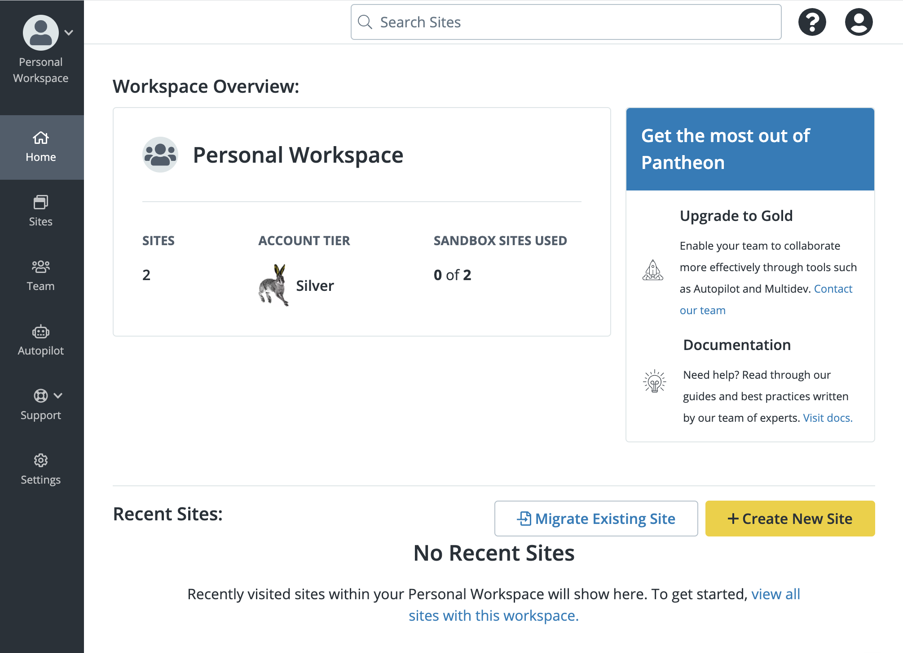
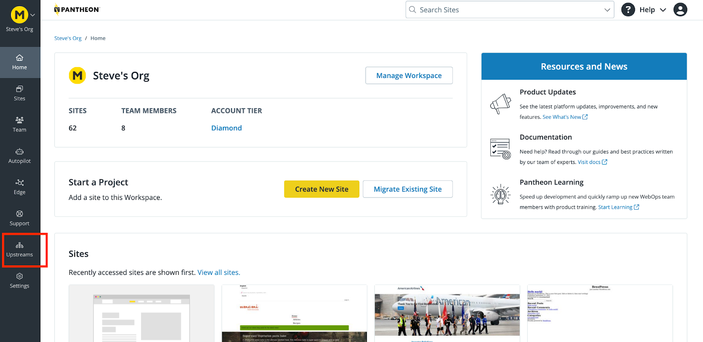
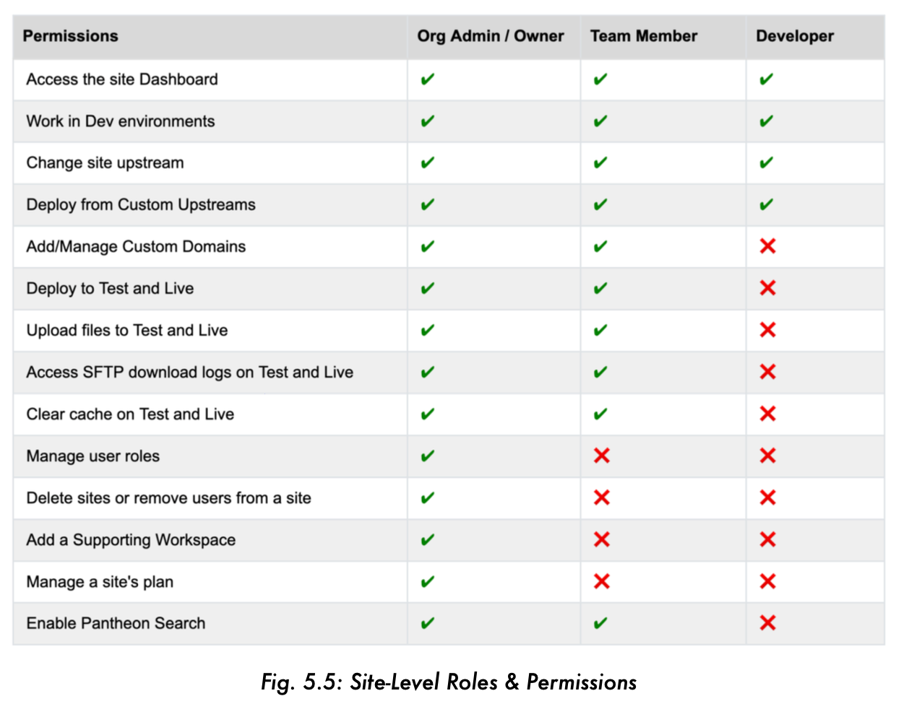
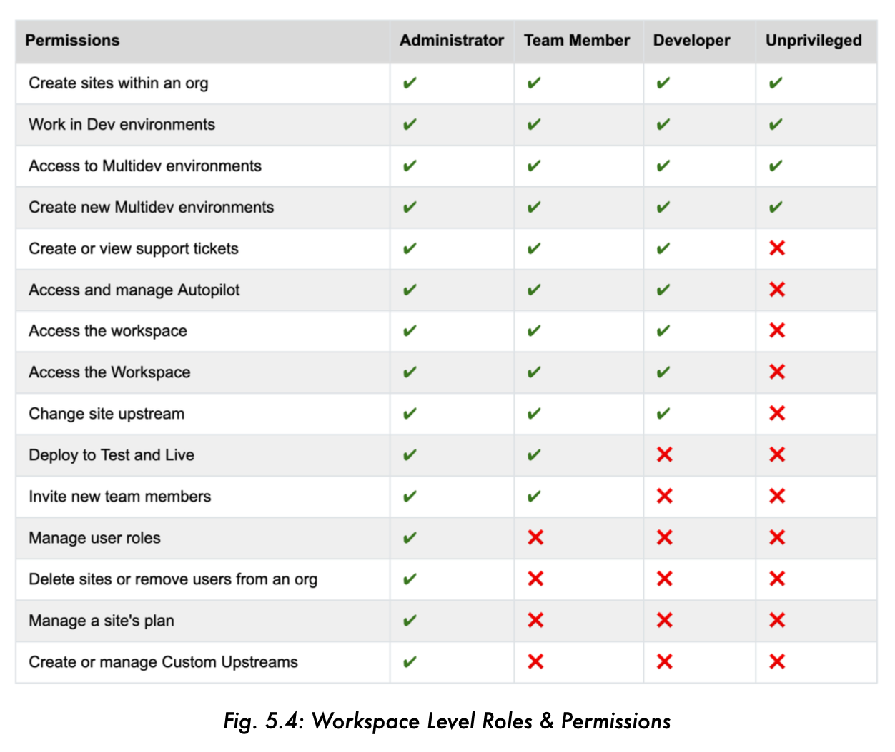
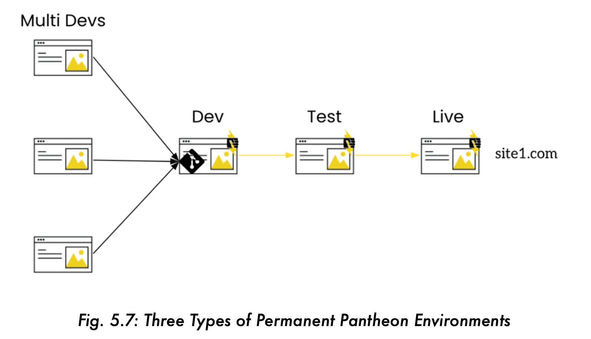
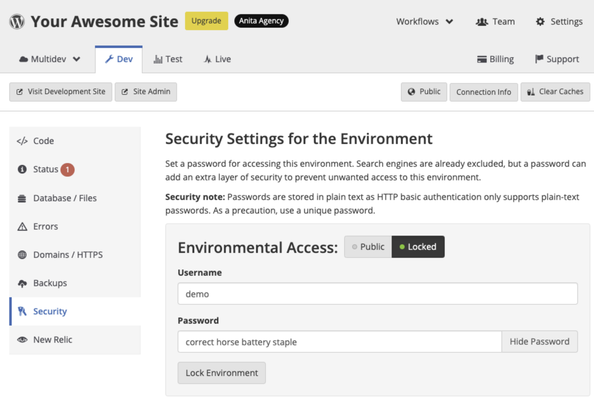

<Alert title="Learning objectives for this chapter:"  type="info" >


**Running CMS Applications on Pantheon**

* Define the difference between Sites, Applications and Environments on Pantheon.
* Describe the different types of environments on Pantheon, and what each is typically used for.
* Implement Pantheon's Dashboard Security Tool as a way to lock down access to development progress on Multidev environments.

**Workspaces and Site Plans**

* List and Describe the different site plans available on Pantheon, and the resources associated with each type of plan.
* Describe the limitations of Pantheon's free tier Sandbox site plans.
* List the features that are available only in Professional Workspaces, but not in Personal Workspaces.
* List and Describe the permissions that are associated with the Workspace Administrator, Workspace Team Member, Workspace Developer and Workspace Unprivileged roles.
* List and Describe the WebOps features that are unlocked in the Professional Dashboard by upgrading to a Gold Plan.

**Domains on Pantheon**

* Provide recommendations around best practices for launching migrating an existing site with as little DNS-related downtime as possible.
* Describe the predictable pattern that governs Pantheon's platform domain system.
* Explain the benefits of setting a primary domain through the Pantheon dashboard.
* Describe the requirements for adding a custom domain in the Pantheon dashboard.

</Alert>


Pantheon provides a robust SaaS-based WebOps platform, built on an enterprise-grade application hosting infrastructure. In this section, we will delve into the process of running CMS applications on Pantheon, focusing on our approach to user permissions and security protocols that ensure both security and stability for your applications. We will also learn how Workspaces, Teams, and Sites work together to help you effortlessly leverage WebOps in your web application lifecycle.

In this section, you will learn about Sites and Environments on Pantheon, and you will learn how to create sites on Pantheon through the dashboard.

Pantheon supports Drupal and WordPress CMS applications, as well as JavaScript Front End Sites used in a decoupled configuration.
Workspaces, Teams, and Sites work together to help you organize and manage your sites.


## Workspaces

<Alert title="Learning objectives for this chapter:"  type="info" >

* List and describe the features and functionality accessible through the Personal Workspace.
* List and describe the features and functionality accessible through the Professional Workspace.
* List and describe the WebOps features that are unlocked in the Professional Dashboard by upgrading to a Gold Plan.

</Alert>

Workspaces bring together sites, teams and features, simplifying the management of large numbers of sites. There are two types of Workspaces on Pantheon: Personal and Professional.

The **Personal Workspace** displays tools for the sites you own (or are a team member of), your account plan, and billing for sites you own. You have only one Personal Workspace.

* Every Pantheon user is assigned one Personal Workspace.
* All sites you have created, as well as individual sites from other Workspaces you've been invited to collaborate on, will be in your Personal Workspace.
* Collaboration features such as Multidev and Custom Upstreams are not available in Personal Workspaces. To access these features, you need a Professional Workspace.

**Professional workspaces** bring together users and sites to allow administrators to effectively manage a large number of sites.

* You may be a member of more than one Professional Workspace, and can switch between your Personal and Professional Workspace at any time.
* When you first create a Professional Workspace, it is created with a Silver Account plan, which gives you access to the basic capabilities of the Pantheon Platform. 
* To take advantage of features such as Multidev, Custom Upstreams, and Autopilot, you'll want to upgrade the Workspace to a Gold plan.

### Personal Workspace

We will start by exploring the **Personal Workspace**, which is what you see after you log in.

The Personal Workspace displays tools for the sites you own (or are a team member of), your account plan, and billing for sites you own. You have only one Personal Workspace.

The Home Page of your Personal Workspace contains the following information: Workspace type, Sites, Account tier, and Sandbox sites used (fig. 5.1)



#### Tabs in your Personal Workspace


The navigation bar on the left contains several additional tabs to help you manage your sites:

* **Sites: **Add a new site, view sites you're a team member of, and check how many free sites you have remaining. Return to this page by clicking the Pantheon logo.
    * **Create New Site:** Start the process of creating a new site on Pantheon. New sites will appear under the Sites tab.
    * **Migrate Existing Site:** Start a guided migration to add a site. If you’re importing a site from your local environment, follow our manual migration process. For information about migrating a site from a competitor, or other migration scenarios, refer to Migrate Sites to Pantheon on our Get Started page.
* **Team:** If you belong to a Workspace, you’ll see it listed here. Click the Workspace name to view the Workspace's dashboard.
* **Autopilot:** Autopilot is Visual Regression Testing (VRT) for every WordPress and Drupal Site within your Workspace.
* **Support:** View details of an open support request or create a new support request. Our chat-based support is available 24-hours a day.
* **Custom Upstreams: **Create a new Workspace-specific Custom Upstream using a GitHub or Bitbucket repository. Custom Upstreams allow you to use an external repository as a template for your site.

**Settings:** Modify the Workspace name, logo, billing information, and if your Organization is configured for it, billing terms and instructions for your team.

For more information, see [Workspaces, Sites, and Teams](/guides/quickstart/user-dashboard/).

**Professional Workspace**

**Professional workspaces** bring together users and sites to allow administrators to effectively manage a large number of sites.

The navigation bar on the left contains several additional tabs to help you manage your sites (fig 5.3):




* **Home: **The home page of a Workspace contains information related to your workspace, such as the number of sites, sites recently added, and more.
* **Sites:** Add a new site, view sites you're a team member of, and check how many free sites you have remaining.
* **Team: **Invite people to work on sites in this Workspace.
* **Autopilot: **Autopilot is Visual Regression Testing (VRT) for every WordPress and Drupal Site within your workspace.
* **Edge: **Advanced Global CDN offers a suite of edge capabilities ensuring your sites are fast, reliable, and secure. Our specialists help you optimize your site performance for maximum uptime.
* **Support: **View details of an open support request or create a new support request. Our chat-based support is available 24-hours a day.
* **Custom Upstreams*:** Create a new workspace-specific Custom Upstream using a GitHub or Bitbucket repository. Custom Upstreams allow you to use an external repository as a template for your site. (*This tab is exclusively available through the Professional Workspace )
* **Settings:** Modify the workspace name, logo, billing information, and if your Workspace is configured for it, billing terms and instructions for your team.


### Teams

**Teams** allow you to define the users who will have access to a workspace or site. Team members can be associated with a group of sites, or a single site.

There are two places a team can be defined: on a Professional Workspace, or in the Site Dashboard.

* Professional Workspace team members have access to all sites in that Workspace, and any sites that have that Workspace assigned as a Supporting Workspace.
* Site Team members only have access to that site.


#### Roles and Permissions

There are two tiers of roles and permissions on Pantheon: **Workspace Level Permissions**, and **Site Level Permissions** (figs. 5.4 and 5.5), each of which has multiple roles:





### Sites

A Pantheon CMS Site is a complete web project that includes all of the elements needed to build, test, and run a CMS. In general, the terms "CMS", “Site” and “Application” can be used interchangeably on Pantheon. You can have one site or hundreds. 

A **Site** has a site dashboard (fig. 5.6) and consists of environments kept in sync through platform automation.


#### Environments

A Site on Pantheon consists of multiple **Environments**. (fig. 5.7)



An Environment on Pantheon is a self-contained space where a specific stage of development takes place. All sites on Pantheon come with three permanent environments (Dev, Test, and Live), and sites that are part of a Gold Workspace and above also have up to 10 on-demand sandbox environments called Multidevs. Each environment has its own codebase, database, and files, which are kept in sync with other environments through Pantheon’s orchestration layer. This allows you to develop and test features without impacting your Live site.

There are three types of permanent environments on Pantheon's CMS Sites:

**Dev Environment:** This is where all new coding and development can occur (in addition to a local environment on your computer if you like). Features are built, bugs are fixed, and updates are created in this environment. It is essentially the "workshop" for developers, where changes are made and tested in isolation from the live site.

**Test Environment:** Once updates or new features are ready in the Dev environment, they are moved to the Test environment. This environment is a replica of the Live environment, and it's where final testing and quality assurance checks happen. The purpose is to test changes in a 'safe' version of the live site, catching any issues before they affect the real website.

**Live Environment:** This is the production environment, which users interact with when they visit your website. Once changes have been thoroughly tested and approved in the Test environment, they are deployed to the Live environment.

In addition to these three permanent environments, each qualifying site comes with up to 10 on-demand environments, called Multidevs.

**Multidev environment:** Multidev is an on-demand, disposable environment within a Pantheon application. A Multidev environment allows a developer to replicate the entire stack (code and content), work independently, and then merge the code changes back into the default branch. Each branch has its own separate development environment, including database and files. Each Multidev environment can be independently set to use either SFTP or Git mode for code changes.

Each site has a limit of 10 Multidev environments. Elite sites can request additional Multidev environments from support as needed.

<Alert title="Which Sites Include Multidevs?
"  type="info" >

Multidev is an Account-based feature that is available for the following account types:
* Gold
* Platinum
* Diamond
* Agency partners

Any type of site (Sandbox, Basic, Performance, Elite) that is part of one of these Account tiers includes up to 10 Multidevs. The Silver Account Tier (free) does not include access to Multidev environments. If you would like to add Multidevs, contact Pantheon’s Sales or Account Management teams to find out about upgrading your Account tier.

</Alert>

#### Locking Environments with Username/Password

Each environment on Pantheon, including Multidevs, provides platform domains that are accessible through a browser by default. This allows for a convenient mechanism for sharing development progress with key stakeholders, and getting timely feedback before the changes are pushed live. 

Sometimes, it makes sense for these environments to be locked, so that developers can share the platform domain URL freely, but only users that know the correct username/password combination can see the progress. This is where Pantheon’s Dashboard Security Tool comes in handy.

The **Dashboard Security Tool** is a useful solution when you are working on your site and you would like to keep your progress hidden from the world as you prepare to go live or make updates.

This can be done by putting a [basic authentication](https://developer.mozilla.org/en-US/docs/Web/HTTP/Authentication) username and password on the environment. Visitors will be prompted to authenticate before the site is served.

In order to lock an environment on Pantheon with a username and password, follow these steps:

1. Select the environment (for example,  Dev).
2. Select Security.
3. Select Locked.
4. Provide a username and password.
5. Click Lock Environment.



If other members of your team on the site need to access the site, they will also be able to view the authentication credentials when they log in to their accounts.

Refresh your page and you will notice that the environment is shown as Private. You will also be able to see the credentials needed to access that environment.

You can set a different username and password for each environment. This is important if you only want the Live site publicly viewable, while Dev and Test can be private as you work on your code and content.

Visit the URL of the environment that you have made private to verify that everything is working correctly. You should see an authentication form prompting you to enter the username and password for that environment to start your session.

In addition to being able to lock environments through the Pantheon Dashboard, you can [also lock and unlock environments using Terminus](/terminus/commands/lock-enable).

For more information, see: [Secure Development on Pantheon](/guides/secure-development/security-tool).

### Site Plans

Pantheon offers a variety of plans to suit your needs. This section will cover the various purchase plans, what is included with each, and how to manage your plan.

**Terminology**

* **Application Containers:** Each application container is a separate deployment of your site's code. All Dev and Test environments for Personal and Performance sites have one container, and Test environments for Business and Elite sites have two containers. The Live environment for Elite sites may be scaled to multiple containers to handle more requests.
* **PHP Concurrency:** The amount of simultaneous processes PHP that can run within a given container. The number of requests your website can handle is a product of the number of containers, and each containers' concurrency, as well as your application performance.
* **PHP Memory Limit (Application Memory Limit):** The maximum amount of memory a single PHP process can use. Exceeding this limit will cancel the process, resulting in a failed request from the user's perspective.
* **MySQL Buffer Pool:** The buffer pool is InnoDB's cache for frequently-accessed data in your database. If queries can run out of the buffer alone, they will be dramatically accelerated.

Before reading on, we recommend you familiarize yourself with the following terminology:

#### Types of Site Plans

Pantheon offers four different tiers of site plans: Sandbox, Basic, Performance, and Elite.

#### Sandbox (Free Tier):

Pantheon is a containerized infrastructure with automated provisioning of new container resources. As a result, one of the great advantages of Pantheon is that you have the ability to spin up an unlimited number of free tier Sandbox sites. This ensures that customers do not have to pay for a production site plan until the site is ready to go live. 

There are a couple of limitations to be aware of for Sandbox sites:

* **Custom Domains:** Sandbox sites only allow for the use of platform domains (e.g. `https://live-mysandboxsite.pantheon.io`) and do not allow access to the Custom Domain feature. In order to associate a custom domain with your site, you will need to upgrade to one of the paid plans.
* **Automated Backups:** Sandbox sites also do not provide access to the Automated Backups feature, which means that you will need to create backups manually. 
* **Inactivity Periods:** After a certain period of inactivity, Sandbox sites (as well as development environments) will automatically sleep. They can be woken up quickly (8-10 seconds) by simply pinging the site or visiting the URL in the dashboard.

####  Basic:

Basic site plans are for small, individual sites and non-mission critical sites. They come with a limit of 5 custom domains, 20GB of combined storage for database and files, and they do not provide access to New Relic, Object Cache, or Pantheon Search (Solr). Traffic figures for Basic plans must be below 25,000 monthly unique visitors.

#### Performance

Performance plans provide a range of resources for sites that have higher traffic and greater importance to the business than Basic plans. All performance plans provide access to New Relic, Object Cache, and Pantheon Search (Solr). Performance plans also come in sizes that correspond to the expected traffic figures for the sites: Small (less than 25,000 monthly uniques), Medium (less than 50,000 monthly uniques), Large (less than 150,000 monthly uniques), Extra Large (less than 300,000 monthly uniques), and 2XL (less than 600,000 monthly uniques).

#### Elite

Elite plans are for mission-critical websites that require a contractually-backed uptime guarantee**. **Elite plans include an uptime SLA of 99.95%, with an option to increase the uptime SLA to 99.99% with our Elite with Multizone Failover plans. Elite plans include Managed Scaling, which allows Pantheon to automatically scale to meet the demands of unforeseen traffic spikes.

For more information about Pantheon’s Multizone Failover site plans, see [https://pantheon.io/features/multizone-failover](https://pantheon.io/features/multizone-failover). 

### Upgrading Site Plans

The platform resources provided to your website depend on your current plan. Pantheon can scale instantly, so changing your service level will immediately change your resources to the values for the new plan, as shown in the table below (fig. 5.8).


## Domains on Pantheon - Connecting the Public to Your Site


<Alert title="By the end of this section, you should be able to:"  type="info" >

* Provide recommendations around best practices for launching an existing site with as little DNS-related downtime as possible.
* Describe the predictable pattern that governs Pantheon's platform domain system.
* Explain the benefits of setting a primary domain through the Pantheon dashboard.
* Describe the requirements for adding a custom domain in the Pantheon dashboard.

</Alert>

A domain name is the web address or URL used to visit your site. The Domain Name System (DNS) resolves human-readable names like `www.example.com` into machine-readable internet protocol (IP) addresses like `127.0.0.1.` All Pantheon sites are accessible via platform domains, and you can easily connect your own custom domain to paid sites.


### Domain Name System (DNS)

Pantheon does not offer DNS management services. However, we can help you to understand how DNS works, and configure your domain to point to your Pantheon site.

<Partial file="dns-terms.md" />


#### DNS Record Types


<Partial file="dns-record-types.md" />


#### DNS Propagation

<Partial file="dns-propagation.md" />

#### DNS Migration Preparation

<Partial file="dns-prep.md" />

### Types of Domains

This section will highlight three types of domains on Pantheon that can be used to access a live site in your browser: Platform Domains, Primary Domains, and Custom Domains.


#### Platform Domains

<Partial file="dns-platform-domains.md" />

As you can see, the domain structure for Pantheon platform domains follows a predictable pattern, based around the name of the environment and the machine name of the site. So, for example, if you had a site on Pantheon that was called “Acme Corporation WordPress” and you were trying to access the site in a Multidev environment associated with a feature branch called `myfeature`, the platform domain to access that environment would be:

```
https://myfeature-acme-corporation-wordpress.pantheonsite.io
```

All platform domains are available over HTTPS. Redirecting to HTTPS during development and testing is a recommended best practice to ensure you are ready to go live with HTTPS. Refer to [Redirect to HTTPS](/guides/redirect/#redirect-to-https) for more information.

#### Primary Domains

<Partial file="dns-primary.md" />

For more information on Primary Domains, see [this documentation page](/guides/domains/primary-domain).


#### Custom Domains

<Partial file="dns-custom.md" />
