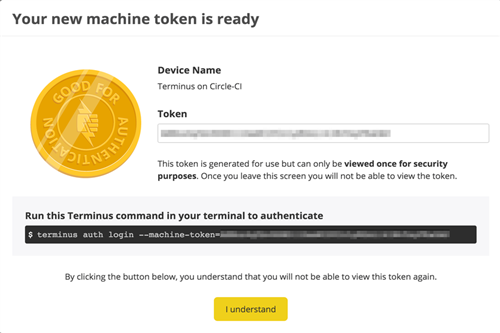

<Alert title="By the end of this chapter, you will be able to:"  type="info" >

- Describe the general functionality Terminus provides as a command line interface (CLI) tool.
- List five of the most useful tasks that can be automated using Terminus scripting.
- Describe the scope of access granted through Terminus as it relates to a pre-existing user instance on Pantheon.
- Describe how Machine Tokens provide access to Pantheon services.
- List the steps to create a Machine Token on Pantheon.
- Describe the steps required to install Terminus on a Mac and on a Windows PC.
- Install Terminus on your local machine by following the steps provided.
- List and Describe five or more common use cases for Quicksilver platform hook automation
- List and Describe some common Quicksilver Triggers and Events
- Describe how Terminus and Quicksilver can work together to help facilitate complex WebOps workflows


</Alert>

## Pantheon CLI
Terminus is a command line interface that provides advanced interaction with Pantheon. It enables you to do almost everything in a terminal that you can do in the Dashboard, as well as scripting and much more.

What can you do with Terminus?

Terminus is a powerful tool that allows you to:

- Create a new site
- Create and delete Multidev environments
- Clone one environment to another
- Check for and apply upstream updates
- Deploy code from one environment to another
- Run Drush and WP-CLI commands
- Perform other operations

Since Terminus authentication is tied to a pre-existing user and role on Pantheon, one of the things you cannot automate with Terminus is the creation of a new user (which would be a huge security liability!)

### Installing Terminus

<Alert title="Tutorial Activity #12: Install Terminus"  type="info" >

In this section, we will install Terminus, Pantheon’s command line interface tool. Note the technical requirements for Terminus to be compatible with your machine. Terminus requires PHP 7.4 or later, Composer, and Git.

</Alert>

This section provides information on how to install and authenticate Terminus. Terminus is available for MacOS and Linux. Windows 10 users can install the Windows Subsystem for Linux, and then install Terminus in the Linux shell.

Some Terminus commands use SSH authentication. You should add [SSH keys](/certification/study-guide/chapter-6-deployment#connect-with-ssh) to your account before you continue.


| **Compatible Operating Systems** | **Incompatible Operating Systems**|
|:-----|:----|
| Terminus has been tested on the following platforms:<br /><br /> <ul><li>MacOS</li><li>Windows 10 – WSL 2 Ubuntu 20.0</li><li>Ubuntu 20.0 – this would include Ubuntu under Docker or VirtualBox</li></ul> | Terminus does not work with the following platforms:<br /><br /><ul><li>Windows 10 – Command Line</li><li>Windows 10 – Git Bash (MingW)</li><li>Ubuntu 18.0 and earlier versions</li><li>Linux system with coreutils equal to or less than 8.28</li></ul>|

There are several ways to install Terminus, depending on your use case: as a self-contained Terminus executable (`terminus.phar`), using Homebrew on a Mac, or [downloading and installing from the Git repository](https://github.com/pantheon-systems/terminus#installing-with-git).

We will now walk you through each of these three methods.

#### Method #1: Standalone Terminus PHAR
The commands below will:

- Create a terminus folder in your home directory (`~/`)
- Get the latest release tag of Terminus
- Download and save the release as `~/terminus/terminus`
- Make the file executable
- Add a symlink to your local bin directory for the Terminus executable

```bash{promptUser: user}
mkdir -p ~/terminus && cd ~/terminus
curl -L https://github.com/pantheon-systems/terminus/releases/download/3.2.1/terminus.phar --output terminus
chmod +x terminus
./terminus self:update
sudo ln -s ~/terminus/terminus /usr/local/bin/terminus
```

#### Method #2: MacOS Homebrew Installation
The Terminus application is published to Homebrew. Run the command below to install Terminus:

```bash{promptUser: user}
brew install pantheon-systems/external/terminus
```

#### Method #3: Ubuntu/WinWSL-Ubuntu Installation

Follow the steps in the Standalone Terminus PHAR section.

### Authenticating Terminus

<Alert title="Tutorial Activity #13: Authenticate with Terminus using a Machine Token"  type="info" >

Machine tokens are used to uniquely identify your machine and securely authenticate via Terminus. They provide the same access as your username and password, do not expire, can only be viewed when you’re creating it, and should be revoked when no longer used to help keep your account safe

</Alert>

You must log in with a machine token after the installation completes. A machine token is used to securely authenticate your machine. Machine tokens provide the same access as your username and password, and do not expire. In this section, we will generate a machine token in the Pantheon Dashboard, and use that machine token to authenticate Terminus.

Machine tokens are used to uniquely identify your machine and securely authenticate via Terminus.

Some features of machine tokens:

- Provide the same access as your username and password
- Do not expire
- Can only be viewed when they are being created in the dashboard, and must be copied and stored in a secure location for subsequent access.
- Should be revoked when no longer used to help keep your account safe

To set up a machine token on Pantheon, follow these steps:

1. Go to your [Personal Settings](/personal-settings) and select Machine Tokens.
2. Click Create Token.
3. Enter a token name, and click Generate Token.
4. Copy and save your machine token now, as you will not be able to view or edit it later.
5. Click I understand to continue.

You should see the following screen upon completion:



Once you have generated your token, you can use it to authenticate with Terminus. In order to authenticate with Terminus, run the following command (using the unique machine token string you have just generated in the Pantheon Dashboard):

```bash{promptUser: user}
terminus auth:login -machine-token=<replace your machine token here>
```

### Terminus Command Structure

The following command structure pattern presupposes formal web application naming conventions.

Terminus command structure typically includes `<site>.<env>` in order to determine the target site and environment to execute against. Note that the `<>` symbols are part of the example, and should not to be included in your commands. For example, running the env:clear-cache command for the Live environment of a site labeled "Your Awesome Site”:

```bash{promptUser: user}
terminus env:clear-cache your-awesome-site.live
```

As you can see, Terminus commands use the same machine naming conventions as Pantheon’s platform domain system.

#### Basic Format
The basic format of a Terminus command is:

```bash{promptUser: user}
terminus command:subcommand <site>.<env>
```

#### More Information Command
You can find more information on any command by using the `-h` flag:

```bash{promptUser: user}
terminus command:subcommand -h
```

#### List of Commands
You can get a list of all available commands by using the `list` command:


```bash{promptUser: user}
terminus list
```

#### Drush and WP-CLI
Drush and WP-CLI commands must be run from the command line via Terminus. It is not possible to invoke Drush or WP-CLI in the Pantheon Dashboard.

The syntax for Drush and WP-CLI commands starts by using the basic Terminus command structure, then adds `--` after `<site>.<env>` which is then followed by the Drush or WP-CLI command and all arguments. For example:

```bash{promptUser: user}
terminus wp <site>.<env> -- plugin activate debug-bar
```

While a comprehensive exploration of all that is possible with [Drush](https://www.drush.org/) and [WP-CLI](https://wp-cli.org/) is outside the scope of this guide, we would highly recommend visiting the documentation sites and exploring the possible uses for each tool.


### CLI vs Dashboard Interface
Let’s walk through some common actions within the dashboard and their Terminus command counterparts.

#### Site List

<Example class="certification style-example">

```bash{promptUser: user}
terminus site:list
```
<hr className="certification source-code" /> <br/>


</Example>

#### Create Site

<Example class="certification style-example">

```bash{promptUser: user}
terminus site:create mysite “My Site” wordpress
```
<hr className="certification source-code" /> <br/>


</Example>

#### Install WordPress

<Example class="certification style-example">

```bash{promptUser: user}
terminus wp mysite.dev -- core install --title="My Site" --admin_user=admin123
```
<hr className="certification cms source-code" /> <br/>


</Example>

#### Create Multidev Environment

<Example class="certification style-example">

```bash{promptUser: user}
terminus multidev:create mysite.live calendar
```
<hr className="certification source-code" /> <br/>


</Example>

#### Enable SFTP Development Mode

<Example class="certification style-example">

```bash{promptUser: user}
terminus connection:set mysite.dev sftp
```
<hr className="certification source-code" /> <br/>


</Example>

#### Activate Plugins

<Example class="certification style-example">

```bash{promptUser: user}
terminus wp mysite.dev -- plugin activate debug-bar
```
<hr className="certification cms source-code" /> <br/>


</Example>

#### Enable Modules

<Example class="certification style-example">

```bash{promptUser: user}
terminus drush mysite.dev -- pm-enable serialization
```
<hr className="certification cms source-code" /> <br/>


</Example>

#### Deploy Dev to Test

<Example class="certification style-example">

```bash{promptUser: user}
terminus deploy mysite.test --note="one sidebar" --updatedb --cc --sync-content
```
<hr className="certification source-code" /> <br/>


</Example>

#### Clear Caches

<Example class="certification style-example">

```bash{promptUser: user}
terminus env:clear-cache mysite.dev
```
<hr className="certification source-code" /> <br/>


</Example>

#### Retrieve Latest Database Backup from Live

<Example class="certification style-example">

```bash{promptUser: user}
terminus backup:get mysite.live --element=db
```
<hr className="certification source-code" /> <br/>


</Example>

### Scripting with Terminus
As demonstrated in the comparisons above, nearly anything you can do in the Pantheon Dashboard interface is possible via the command line, and thus is scriptable.

Consider the repetitive tasks you perform using the Pantheon Dashboard:

- Can those tasks be executed by Terminus commands?
- Can the values required by the commands be derived programmatically?

If so, consider how you can turn the task into a script. For some quick examples of Bash scripts that use Terminus commands, see [this documentation page](/terminus/scripting).

Terminus must be authenticated before you can execute most commands (using the `terminus auth:login` command). You must authenticate Terminus with a machine token that has the correct permissions before running a script.

Using Terminus commands, you can create customized WebOps automation scripts to further automate tedious tasks, effortlessly enforce quality control guardrails, permit self-service completion of a complex multistep provisioning process, and more.

Keep in mind that you can run Terminus commands individually, but the real power comes in the ability to script your Terminus commands. This enables you to put specific guardrails in place automatically, opening up virtually unlimited possibilities for your WebOps workflow!

For more information on scripting with Terminus, see the following [documentation page](/terminus/scripting).

## Quicksilver
Quicksilver is Pantheon's platform automation tool, designed to trigger scripts or operations in response to specific platform-related events. It provides an event-driven script execution system which allows developers to build automation pipelines and integrate with external tools.

With Quicksilver, you can automate workflows such as clearing caches when code is deployed, notifying team members via Slack when a new commit is pushed, or running security tests after a site update, thus enhancing efficiency, reliability, and the overall maintenance of your web projects.

There is a growing set of example scripts available for review and contributions. Several scripts enable additional functionality, including:
- Chat-ops
- Database sanitization
- Deployment logging
- Automated testing operations with a CI server

To see some example scripts to get started with, check out our [Quicksilver Examples Repository](https://github.com/pantheon-systems/quicksilver-examples/).

Quicksilver workflows are defined in your `pantheon.yml` file. You can specify the workflows you want to hook into, for example, deploy or sync_code. You can also specify the workflow stage (before or after) and the location of the script relative to the root of your site's docroot.

### Quicksilver Example with Pantheon.yml
The adapted [`slack_notification` example](https://github.com/pantheon-systems/quicksilver-examples/tree/main/slack_notification) below provides steps to post to Slack every time you deploy:

Commit a `pantheon.yml` file with the following content:
```yaml:title=pantheon.yml
api_version: 1

workflows:
  deploy:
    after:
      - type: webphp
        description: Post deployment notification to Slack
        script: private/scripts/slack_deploy_notification.php
```

Add the code below if you want the script to automatically log the deployment to New Relic:
```yaml:title=pantheon.yml
      - type: webphp
        description: Log to New Relic
        script: private/scripts/new_relic_deploy.php
```
<Alert title="Terminus vs. Quicksilver" type="info">
Terminus and Quicksilver can work together to help facilitate complex WebOps workflows. In general:

- Use Terminus as a way to send commands to Pantheon
- Use Quicksilver as a way to send commands back out to other services

This allows you to close the loop with your workflow tools and have Pantheon be an automated part of that process.

</Alert>

### Quicksilver Hooks
Deploy your `pantheon.yml` file into an environment before using a Quicksilver hook for a deploy workflow.

Quicksilver scripts that trigger on the deploy hook operate on the state of the code at the time of the deploy, not the state of the code after the deploy. This means that new or updated code is not available until the deployment finishes even though the deploy hook is triggered at the start of the deployment.

Review available hooks on [this documentation page](/guides/quicksilver/hooks#hooks).

### Example Use Cases
The following are some common examples of how Quicksilver can help you automate your WebOps workflow:

| **Triggers** | **Possible Events**|
|:-----|:----|
| Deploying to Test or Live | <ul><li>Notify a Slack Channel</li><li>Revert/import Features/configuration</li><li>Send SMS to project manager</li><li>Trigger visual regression test</li><li>Trigger load test</li><li>New Relic deployment marker</li></ul>|
| Making a Multidev | <ul><li>Enable development modules</li><li>Report back to a CI service like Jenkins</li><li>Copy New Relic settings</li><li>Index content in Solr</li></ul>|
| Committing Code | <ul><li>New Relic deployment marker</li><li>Update Project Management system</li><li>Trigger a code push to an external repository</li></ul>|
| Cloning a Database | <ul><li>Import configuration</li><li>Sanitize user names</li><li>Enable development modules</li></ul>|
| Clearing Caches | <ul><li>Clear a CDN</li><li>Debug a script meant for another workflow</li><li>New Relic deployment marker</li></ul>|
| New Site Created | <ul><li>Send SMS to administrator</li><li>Notify a Slack channel</li><li>Run Composer scripts</li></ul>|

### More Quicksilver Examples
The Quicksilver Examples repository provides many more ways to automate development, so please take advantage of them and extend them to fit your workflow.

#### More Resources
- [Automate and Integrate your WebOps Workflow with Quicksilver](/guides/quicksilver)
- [Quicksilver Examples Repository](https://github.com/pantheon-systems/quicksilver-examples)
- [Pantheon YAML Configuration Files](/pantheon-yml)


## Chapter Summary

We have covered a lot in this section! We started by getting familiar with Terminus, and you learned how to install the powerful command line interface tool in your laptop. Next, you learned about running individual Terminus commands, and then about scripting Terminus using your scripting language of choice (Bash, Python, etc.). And finally, you learned about how Quicksilver platform hooks can allow you to extend WebOps workflows and integrate external services. We have covered a lot in this chapter. In the next and final chapter, we will learn about some of Pantheon’s other automation tools: Integrated Composer and Autopilot.
