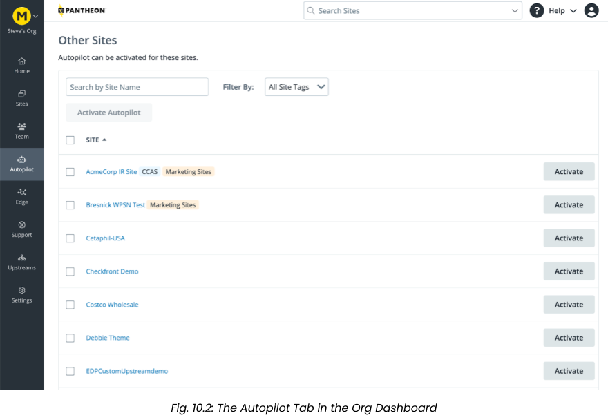
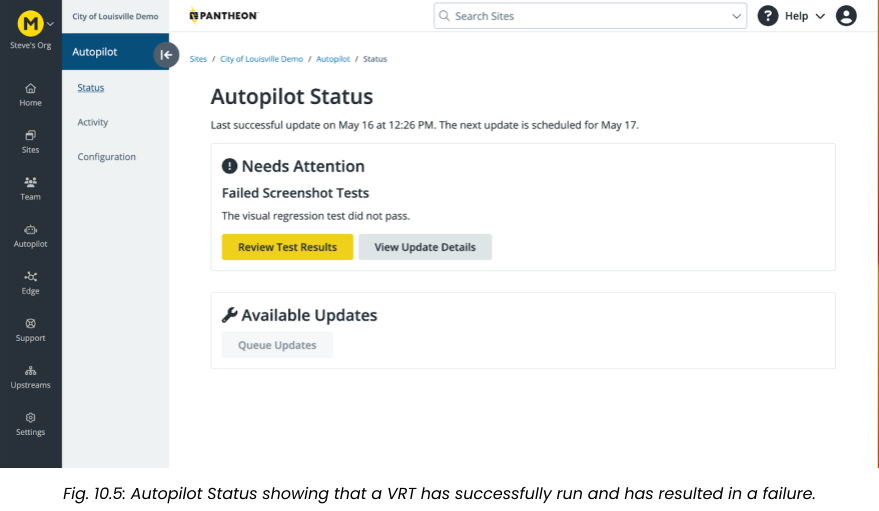
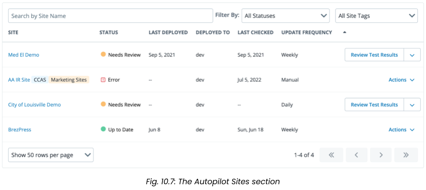

<Alert title="Learning objectives for this chapter:"  type="info" >


**Integrated Composer**

* Describe how to enable or disable Integrated Composer on a Pantheon site.
* Explain how to add and remove dependencies with Integrated Composer sites on Pantheon.
* Describe the differences between the typical method of managing dependencies with Composer vs. managing dependencies with Integrated Composer.


**Autopilot**

* Demonstrate understanding of the reports and notices generated by Autopilot during Visual Regression Tests.
* Describe the options available for addressing a failed Visual Regression Test by Autopilot.
* Describe a use case where it would make sense to use CSS selectors to select web elements to exclude from a Visual Regression Test with Autopilot.
* Describe the minimum feature requirements for a site to successfully run Autopilot on Pantheon.
* List the ways Autopilot can alert a user of a failed Visual Regression Test.
* Distinguish between the the types of sites that are compatible with Autopilot, and those that are not.


</Alert>

In this chapter, we will explore two of Pantheon’s powerful automation tools that help teams adopt a WebOps practice. These tools are Integrated Composer and Autopilot.

Integrated Composer simplifies dependency management by extending Composer functionality to core WordPress and Drupal files, treating them as a managed dependency. Instead of committing your vendor directory with your dependencies, you simply commit your `composer.json` and `composer.lock` file to your Pantheon site, and we automate the rest. This enables one-click updates from the Pantheon Dashboard for upstream updates and Composer dependencies on your site, streamlining site maintenance and saving significant time and effort.

Autopilot automates the process of maintaining your CMS sites, saving time and effort, and providing peace of mind that the site is protected against known security vulnerabilities. It checks for updates on a regular basis, applies those updates using best-practice workflows, performs visual regression testing (VRT) to ensure a consistent user experience and finally deploys these updates when all tests pass.

## Integrated Composer
<Alert title="By the end of this section, you should be able to:" type="info" >

* Describe how to enable or disable Integrated Composer on a Pantheon site.
* Explain how to add and remove dependencies with Integrated Composer sites on Pantheon.
* Explain that Integrated Composer automates the downloading and updating of individual dependencies.

</Alert>

Integrated Composer is a Pantheon platform feature that makes it easier to manage dependencies with Composer by extending Composer functionality to WordPress and Drupal's core files, and treating them as a managed dependency. Integrated Composer enables one-click updates from the Dashboard for upstream updates and Composer dependencies on your Composer-managed Pantheon site.

Composer is a dependency management tool for PHP (similar to node's npm and ruby's bundler). It provides an alternative, more modern way to manage the shared code used by a WordPress or Drupal site. As these frameworks have become increasingly dependent on other frameworks to deliver functionality (e.g. Drupal’s dependency on the Symfony framework), using Composer to manage these dependencies has become essential for many teams.

Using Composer to manage project dependencies is considered a best practice for most Drupal and WordPress websites, and using Integrated Composer on Pantheon can help streamline site maintenance, saving you time and effort in the long run.

### Enabling Integrated Composer
You can enable or disable Integrated Composer in the `pantheon.yml` file. For example, to enable Integrated Composer:

```yaml:title=pantheon.yml
build_step: true
```

This is enabled by default for new Drupal sites on Pantheon.

### Drupal with Integrated Composer
Pantheon offers several paths to help you launch a Drupal site that leverages Integrated Composer:

* To create a new Drupal site with Integrated Composer built in: Follow the instructions in the [Drupal on Pantheon](/drupal) documentation page.
* To upgrade or migrate an existing site to Drupal with Integrated Composer, visit the [Migrate to Drupal](/drupal-migration) guide.
* To convert an existing Drupal site to a Composer-managed site with Integrated Composer, visit the [Composer Convert](/guides/composer-convert) documentation page.
* If you are using a deprecated Pantheon Drupal Upstream and would like to convert your site from one of the deprecated upstreams to the supported `drupal-composer-managed` upstream, you can use the [Terminus Conversion Tools Plugin](https://github.com/pantheon-systems/terminus-conversion-tools-plugin).

### WordPress with Integrated Composer
Pantheon has a [WordPress (Composer Managed)](/guides/wordpress-composer/wordpress-composer-managed) upstream. You can use this upstream to create an Integrated Composer WordPress site with Bedrock.

#### Adding and Removing Dependencies with Integrated Composer

In this section, we will learn how to add and remove dependencies with Integrated Composer sites on Pantheon, and compare and contrast this with how dependencies are typically managed with Composer. When running sites with Integrated Composer, you are not committing the directories that actually contain the code for the PHP libraries, Drupal modules, and WordPress plugins you will add to your site. Instead, you create all of the instructions through your `composer.json` file, then commit `composer.json` and `composer.lock` to your site on Pantheon. Integrated Composer does all of the work of downloading and managing the dependencies behind the scenes.

[Table 10.1](#table-101) below compares the steps for managing dependencies on a typical Composer-based Drupal site vs. a Drupal Composer-based site with Pantheon’s Integrated Composer.

As you can see from the steps outlined in the table, the key difference here is that with Pantheon's Integrated Composer, the platform automatically handles the Composer operations when changes to the `composer.json` file are pushed to the repository, whereas with a typical Drupal site, you would run the Composer commands manually. This means that you do not have to commit your modules/contrib directory itself, allowing you to maintain a lean repository.

By handling the Composer operations automatically on the platform, Pantheon's Integrated Composer allows for easier management of dependencies and a smoother workflow for developers.
For more information, check out [Pantheon's Documentation for Integrated Composer](/guides/integrated-composer).

#### Table 10.1
| **Task** | **Typical Drupal Site with Composer**| **Drupal Site with Integrated Composer**|
|:-----|:----|:----|
| Initial Setup | Install Composer on your system and initialize a `composer.json` file in your Drupal project root directory | Initialize your site with Integrated Composer via Pantheon's dashboard during site creation or convert an existing site. |
| Adding Dependencies | Use `composer require drupal/pkg-name` to add a new module or theme to your project. This command adds the module to your `composer.json` file and downloads it into the appropriate directory (/modules/contrib/). | Modify the `composer.json` file to include the new dependencies, and commit and push this change to your Pantheon repository.|
| Updating Dependencies | Use `composer update` or `composer update drupal/pkg-name` to update all or a specific module/theme | Modify the `composer.json` file to specify the desired version of a module/theme, and then commit and push the change. |
| Removing Dependencies | Use `composer remove drupal/pkg-name` to remove a module or theme from your project | Remove the corresponding module/theme line from the `composer.json` file, and commit and push the change.|
| Installing Dependencies | Use `composer install` when setting up a new instance of the site (e.g. when other developers clone the project or when deploying to a new environment) | Handled automatically by Pantheon during the deployment of changes to the Test or Live environment |
| Handling Conflicts/Issues | Errors will be output in the terminal where you're running the Composer commands | Issues with the Composer operations will be shown in the build log in the Pantheon dashboard.|

_Dependency management on a typical Composer-based Drupal site vs. a site using Integrated Composer._

## Autopilot
<Alert title="By the end of this section, you should be able to:" type="info" >

* Demonstrate understanding of the reports and notices generated by Autopilot during Visual Regression Tests.
* Describe the options available for addressing a failed Visual Regression Test by Autopilot.
* Describe a use case where it would make sense to use CSS selectors to select web elements to exclude from a Visual Regression Test with Autopilot.
* Describe the minimum feature requirements for a site to successfully run Autopilot on Pantheon.
* List the ways Autopilot can alert a user of a failed Visual Regression Test.
* Distinguish between the the types of sites that are compatible with Autopilot, and those that are not.

</Alert>

As with any software, it’s important to keep Drupal and WordPress applications up to date to ensure sites are secure and performant.  While that certainly represents critical and ongoing work, we think developers have more valuable things to do with their time than managing CMS updates.  Pantheon’s Autopilot offers integrated, automated updates along with testing and deployments for Drupal and WordPress sites.  

Autopilot checks for updates on a regular basis, applies those updates using best-practice workflows, performs visual regression testing (VRT) to ensure a consistent user experience (UX) and finally deploys these updates when all tests pass.

### What Autopilot Does
Pantheon's Autopilot is a no-code, in dashboard tool that:

* Checks for updates on a regular cadence for your CMS core as well as modules/plugins and themes.
* Performs the updates in an isolated, dedicated Multidev environment / git branch (Autopilot’s Multidev environment does not count toward your application’s standard limit of 10 environments)
* Tests the updates with automated visual regression testing (VRT)
* Provides testing notifications and user-friendly VRT analysis tools
* Optionally merges and deploys the updates to a permanent environment of your choice (Dev, Test, or Live)


### Scope of Autopilot
Autopilot checks for updates to CMS core (WordPress / Drupal) as well as modules/plugins and  themes.  Autopilot’s scope is the application layer and does not apply to server-level configurations like PHP or MySQL versions.    

### Autopilot Requirements
To use Autopilot, you must have the following:

* A Gold, Platinum, or Diamond account tier
Multidev
* A compatible version of Drush (if you are not using Integrated Composer)
* A compatible site framework (refer to Autopilot Site Compatibility for details)

### Autopilot Site Compatibility
Your site must be on Pantheon and meet the criteria below to be eligible for Autopilot:

* Drupal sites that use Integrated Composer (Drupal 8,9,10)
  * or for Drupal 7 or 8 sites that are not using Integrated Composer, Drush 8 must be in use to be compatible with Autopilot.
* WordPress sites that are not using WordPress Multisite (wordpress_network).
* Sites that are not using Build Tools.
* While Autopilot can be used on sites leveraging custom upstreams, special consideration is called for in these use cases as the scope of what Autopilot will update potentially include everything from the Custom Upstream.

### Some other things to note about Autopilot:
* Sites that use external build tools are not compatible with Autopilot.
* Currently, Autopilot only supports tests on anonymous access versions of pages. Support for authenticated (logged-in user) page tests is planned for a future release.
* Presently, Autopilot performs VRT at a single desktop breakpoint (Responsive testing is not yet available)
* While Autopilot can be used for sites connected to external repositories (ie: GitHub or Bitbucket), by default Autopilot will only update the Pantheon repository.  Developers can leverage a sync_code Quicksilver hook to push these changes back to an external repository if needed.

### Activating Autopilot
To activate Autopilot on a site, locate the Autopilot tab on the left menu bar of your organization dashboard (fig. 10.2), and scroll down to the section titled “Other Sites” and click the “Activate” button next to the site you would like to activate Autopilot on:



### Configuring Autopilot
Autopilot’s Configuration form provides you with several options for configuring Autopilot. You will set the initial configuration of Autopilot upon activating the tool for your site, but the configuration options can be tweaked at any time should you wish to adjust the settings.

#### Autopilot provides the following configuration options:

**Scope:** You can toggle three options for types of updates to import and apply:
* Upstream updates the core of your Drupal or WordPress application
* Modules (or Plugins) applies available updates to community-contributed modules and plugins for your Drupal or WordPress site
* Themes applies available update to community-contributed themes for your Drupal or WordPress site

**Destination & Frequency**: Determines how often Autopilot executes for this site and where successful updates are deployed.
* Update Frequency can be set to Daily, Weekly, Monthly, Custom, or Never (Update Manually)
  * “Custom” allows you to specify a specific day of the week
* Sync Live Environment Before Testing? If selected, Autopilot will sync the live database and files to the dev environment before running.
* Deployment Destination allows you to set the permanent environment (Dev, Test or Live) to which Autopilot will deploy successful site updates.

### Visual Test Screenshots:
Autopilot’s Visual Regression Testing (VRT) looks for “regressions” in the presentation of important pages on your site that might occur when security patches have been applied to the codebase. You define the pages on your site that you want Autopilot to test through the Autopilot configuration screen (fig. 10.3):


For each page, you can set a threshold for the maximum percentage of pixels that can be different between the two screenshots. An acceptable change of 0% would render a failed VRT if there is any difference between the two screenshots, but you can set the percentage to be higher if you would like the tests to be a bit more forgiving.

### Excluded Web Elements
Often, a webpage will have one or more animated components that will cause a false positive Visual Regression Test. Examples include video backdrops, embedded video clips, or animated components such as menu dropdowns or buttons that change when you hover over them. For these use cases, Autopliot allows you to select specific DOM elements with CSS selectors (id and class name) to exclude from the Visual Regression Tests (fig. 10.4). Use commas or a line break to separate excluded elements. This can be useful to prevent landing pages with animation or videos from causing false positive Visual Regression Tests:


### Tests & Results
When a test fails, it means that the percentage of pixels that differ between the “before” and “after” screenshots is higher than the threshold set in Autopilot’s Configuration tab. Autopilot lets you know about the failed test in the Status tab with the following alert (fig. 10.5):



Autopilot can report failures via email or [Quicksilver](/guides/quicksilver/hooks) hooks immediately, and send a weekly email report summarizing all Autopilot activity. Quicksilver can hook into the `autopilot_vrt` workflow as a way to trigger an event `after` running the Visual Regression Test, such as sending an email, a Slack notification, or a Jira notification.
If an error is detected during an update attempt, the Autopilot Status shows “Needs Attention” with two options to Review Test Results or to View Update Details.

### View Test Results
1. Navigate to your Autopilot Overview page and click the VRT results under Autopilot Sites. This section displays which sites passed testing and are up to date, as well as sites that need your manual review (fig. 10.6).
  
1. The Autopilot Sites section (fig. 10.7) displays a list of sites that are running Autopilot, as well as information on the tests that have been run:
  
1. The Status column in the sitelist of the Autopilot Sites section will display one of three statuses:

  |Status<span style="padding-right:80px"/>|Indication|
  |:-----|:----|
  |  | An “Error” status indicates that there is an issue with the site configuration that has prevented the Visual Regression Test from running. Under “Actions” select “View Error”. See Troubleshooting Autopilot Errors for more information.|
  |  | “Up to Date” indicates that there are no new updates to be applied. Autopilot checks for updates at the interval you set in the configuration screen: Daily, Weekly, Monthly, or Never.|
  |  | “Needs Review” means that the Visual Regression Test has run and that the test has failed. The updates have been applied to the Autopilot multidev environment but have not been deployed forward. In this case, select “Review Test Results”, which will bring up the Test Results page where you can see the results.|

1. If the Visual Regression Test fails and the status reads “Needs Review”, select “Review Test Results” to view the results of the test (fig. 10.8):
  

Autopilot updates and visually tests a copy of your site on a Multidev so it can detect issues before it deploys updates to your Dev, Test or Live environment. Autopilot does this by taking before and after screenshots to check for changes. Before screenshots are taken from the Dev environment and After screenshots are taken from the Multidev environment. You also have the option to pull down your site's live content to the Dev environment before taking the Before screenshot so that it is in parity with your Live environment.

#### Failed Tests
When a Visual Regression Test fails, there are three options for resolving the issue:
* Discard This Test: Changes will not be applied to your site. You can run the test again after fixing issues or let Autopilot run again in the next scheduled test interval (e.g. weekly).
* Deploy Updates: In this case, you are manually overriding the failed test and updates will be deployed to whichever environment Autopilot is configured to deploy to.
* Approve This Page: Visual Regression Test results for the specific page will be accepted.  This can be useful if different parts of the site might require different stakeholder approval.  Once all failing pages have been approved, updates will be deployed.

#### Successful Tests
Autopilot allows you to designate which permanent environment you would like Autopilot deploying to after updates have passed VRT.
If you’re not comfortable with Autopilot deploying all the way to the Live environment, you can have Autopilot only deploy updates to Dev or Test and stop. You can proceed with other manual or automated QA processes, and deploy from the Test to Live environment when ready.

You can specify the environments to which Autopilot deploys. When all tests pass, it can deploy to the:
* Dev environment only: A good choice for a site under continual active development
* Test environment (after Dev): A good choice for a high traffic site that needs an extra level of manual quality assurance (QA) or automated CI
* Live environment (after Dev and Test)
* Do Not Deploy: This is a good option if you want to stop updates at the Multidev, and manually merge in Autopilot’s changes for deployment when you are ready.  Refer to Update Destination & Frequency for more information.
