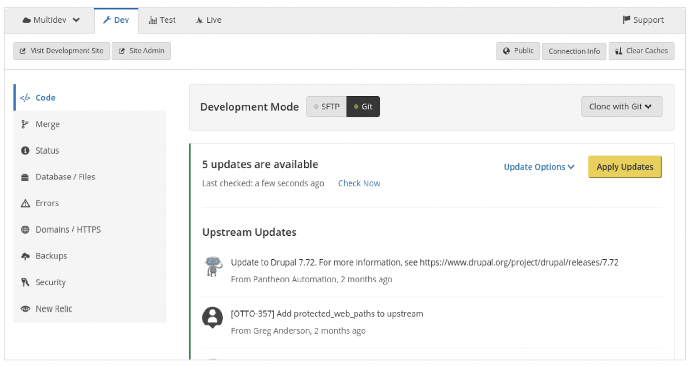

<Alert title="By the end of this chapter, you will be able to:"  type="info" >

* Define what an Upstream is on Pantheon.
* Describe the relationship between Pantheon’s Core Upstreams, Custom Upstreams, and Individual Site Repositories.
* Describe the advantages of using Custom Upstreams to manage and maintain portfolios of Drupal and WordPress sites.
* Describe the advantages and disadvantages of using a Custom Upstreams approach vs. a Drupal Multisite approach to manage and maintain a portfolio of Drupal sites.
* List and Describe the three methods for applying one-click updates to individual child sites on the Pantheon Dashboard.
* Describe the steps for connecting a Custom Upstream repository to your Pantheon Professional Workspace.
* Describe the steps for creating a new site on Pantheon using a Custom Upstream.
* Describe the steps for deploying updates to multiple sites using the same Custom Upstream.
* List and Describe some best practices to follow that will help avoid merge conflicts when using Custom Upstreams.

</Alert>

WebOps culture emphasizes saving time and avoiding repetitive tasks through standardization where it makes sense. Many organizations adopt Drupal and WordPress because of their DRY (Don’t Repeat Yourself) approach to website development. Both are highly modular CMS frameworks that standardize around a core application and allow site builders to add new functionality through community contributed modules and plugins that override and extend the capabilities of these systems.

Site portfolios take this DRY approach and apply it to groups of sites, not just individual sites. There are many cases where creating site portfolios can be useful:

* **Agencies** developing websites for multiple clients that require similar features, themes, or plugins.
* **Higher Education Institutions** with large groups of websites for different departments, research centers, or projects, all needing to adhere to the same branding guidelines and IT standards.
* **Enterprises and Corporations** that manage a diverse portfolio of sites for different brands, products, regions, or campaigns
* **Franchises** that need multiple sites with similar functionalities but unique content for different locations or branches

Pantheon offers several features that help teams manage portfolios of sites in the most efficient way possible. Previously, we explored Professional Workspaces, which bring together users and sites to allow administrators to effectively manage a large number of sites. In this section, we will explore another Pantheon WebOps feature that helps teams manage site portfolios: **Custom Upstreams**.

## Custom Upstreams

An **Upstream** is a repository that acts as a parent for another repository. Pantheon maintains core upstream repositories for WordPress and Drupal which act as a parent repository to site repositories on Pantheon. Updates made by Pantheon in the core upstream repository, in addition to updates made by maintainers of Custom Upstreams, become available downstream as a one-click update.

Pantheon manages and maintains three core upstreams:

* [WordPress](https://github.com/pantheon-systems/wordpress)
* [Drupal (Latest Version)](https://github.com/pantheon-upstreams/drupal-composer-managed)
* [Drupal 7](https://github.com/pantheon-systems/drops-7)

A **Custom Upstream** is a centralized codebase that lives in an external repository (on GitHub, Bitbucket, or GitLab) that allows organizations to create a standard, reusable starting point for their Drupal or WordPress sites. It serves as a common base code, including pre-configured themes, plugins, or modules, which can be used to rapidly spin up new sites.

Custom Upstreams act as a scaffold for new sites, allowing developers and site owners of any skill level to kickoff projects at warp speed. Instead of repeating the same technical work on each individual site, you can build and maintain a common user interface with unified branding and functionality in a single source.

## Three Levels of Git Repositories

There are three levels of repositories in play here, and updates flow "downstream" from one level to another (see fig. 10.1):

<figure>

 

 <figcaption align = "center"><b>Fig. 10.1: Different Levels of Upstreams on Pantheon</b></figcaption>

 </figure>

As you can see in the diagram above, updates flow down from the top level repository, a Pantheon-managed core of Drupal (Latest or Drupal 7) or WordPress. When core updates are available, Pantheon applies the updates to the core upstream, and those updates are now available for the Custom Upstream to pull down. Any modifications to the common codebase are pushed up to the Custom Upstream repository, which lives in GitHub, Bitbucket, or GitLab. Any code pushes made to the Custom Upstream repository are then available to all of the Individual Site repositories. Each individual site can now apply the updates from the Custom Upstream, or override and customize the codebase for that individual site.

This inheritance workflow allows teams to scale the maintenance of all sites in the portfolio without having to also scale up the number of people on the team.

## Custom Upstreams vs. Drupal Multisite

There are many approaches to managing portfolios of Drupal and WordPress sites. In this section, we will talk about the advantages and disadvantages of Custom Upstreams versus the other approaches.

**Drupal Multisites** use a shared codebase and per-site database instances to store content and configurations for each site. The challenges with Drupal Multisite are that it creates a single point of failure where a single bad code push can bring down the entire portfolio of sites at once. Additionally, as the number of sites in a portfolio expands over time, configurations stored in the database risk becoming out of sync with the codebase and themes. For more information on the disadvantages of a Drupal Multisite vs. a Custom Upstreams approach, see [this blog post](https://pantheon.io/blog/drupal-multisite-much-ado-about-drupal-multisite).


## Setting Up a WordPress Custom Upstream

<Alert title="Activity #10: Creating Sites with Custom Upstreams"  type="info" >

In this section, we will walk you through the steps of creating a Custom Upstream repository in GitHub, connecting it to your Pantheon Dashboard, and creating sites from your Custom Upstream in the Pantheon Dashboard. If you are using a different Git host (Bitbucket, GitLab, Other), you can [follow the steps outlined on this documentation page](/guides/custom-upstream/create-custom-upstream#create-and-host-the-repository-remotely).

First, we will create and host the repository remotely. We will then pull in Core from Pantheon's Upstream. After that, we will connect the repository to Pantheon. Once we have set up our Custom Upstream and connected it to our Professional Workspace, we will walk through the process of creating sites from your Custom Upstream in the Pantheon Dashboard.

</Alert>

Pantheon Custom Upstreams are a self-serve feature available to anyone with access to the Workspace with an eligible plan. Workspace members will be able to create new sites from a set common codebase after a Workspace Administrator creates a Custom Upstream. The Custom Upstream must be created within each Workspace if you want to use a specific Custom Upstream for multiple Workspaces.

To set up a Custom Upstream, follow these steps:

**Create and Host the Repository Remotely:** First we will set up a fresh repository in GitHub to host our Custom Upstream repository. To use a different Git host (Bitbucket, GitLab, Other), you can [follow the steps outlined on this documentation page](/guides/custom-upstream/create-custom-upstream#create-and-host-the-repository-remotely).

1. First, sign up for a GitHub account if you do not have one already, then log in to GitHub.

1. Create an SSH Key if you don't already have one associated with your GitHub account and add your SSH Key to GitHub.

1. Click Start Project if this is your first time logging in to GitHub. Otherwise click New in the Repositories sidebar on the left.

1. Name the repository.

1. Select whether the repository will be private or if it can be publicly accessible from outside your organization.

1. Do not select the options to create a README, .gitignore, or license file:

    <figure>

    

    </figure>

1. Click Create Repository.

1. Copy the repository URI (SSH) found in the Quick setup section:

1. Clone the repository to your local from the command line (replace the URI):

    ```shell{promptUser:user}
    git clone git@github.com:pantheon-systems/custom-upstream.git
    ```

1. Navigate to the repository's root directory:

    ```shell{promptUser:user}
    cd custom-upstream
    ```

**We will now Pull in Core from Pantheon's Upstream:**  You must track Pantheon's corresponding upstream repository within the Custom Upstream to avoid incompatibilities.

```shell{promptUser:user}
git checkout -b master
git fetch pantheon-wordpress
git merge pantheon-wordpress/master
git push origin master
```

11. Navigate to the Custom Upstream's root directory using the command line and add the appropriate Pantheon Upstream as a remote. Here, we will pull in Pantheon’s WordPress Core Upstream. (To pull in Drupal (latest version) or Drupal 7 instead, [you can follow these instructions](/guides/custom-upstream/create-custom-upstream#pull-in-core-from-pantheons-upstream)):

```shell{promptUser:user}
git remote add pantheon-wordpress https://github.com/pantheon-systems/WordPress.git
```

12. Run the appropriate command below now that the Custom Upstream repository is tracking the corresponding Pantheon core upstream.

**Connect your Repository to Pantheon:** Now that you have imported Pantheon’s Core Upstream into your Custom Upstream repository, you will connect the repository to your Pantheon Professional Workspace.

<Alert title="Inclusive Language on Pantheon's Git"  type="info" >

**Note:** As of October 1st, 2020, all new repositories on GitHub are initialized with the default branch name `main`.

As a company, Pantheon is trying to use more inclusive language in our repositories. While our team works to make Custom Upstreams less reliable on older naming conventions, new Custom Upstreams currently default to using the `master` branch name.

</Alert>

13. Go to the workspace where you want to add the upstream, and select the Upstreams tab in the left navigation:

    <figure>

    

    </figure>

14. Click the Add New Upstream button. You must be an Organization Administrator to add a new upstream. If you are using a Private Repository, you will be prompted to enter a personal access token to connect to your GitHub repository when you paste the repository URL into the form:

    <figure>

    

    </figure>

15. Click the link to “generate a personal key with ‘repo’ as the scope”. This will open up a new tab in your browser. You will be prompted to once again authenticate through GitHub.

16. Enter a token description, such as "pantheon read my Custom Upstream". Select "repo" as the scope:

    <figure>

    

    </figure>

17. Click Generate token and copy the new token to your clipboard.

18. Return to the Workspace where you are creating the Custom Upstream. Paste your access token in the field, and click “Connect to Github”. You should see the following confirmation that your Custom Upstream repository is connected to your Pantheon Workspace:

    <figure>

    

    </figure>

19. Select the appropriate framework (WordPress in this case), and your initial connection mode (Git or SFTP):

20. Click Save. When you visit your Upstreams tab, you should now see your freshly created Custom Upstream in the list:

    <figure>

    

    </figure>

**Congratulations!** You have successfully connected a Custom Upstream repository on GitHub with your Pantheon Professional Workspace. You can now start creating child sites in your portfolio.

Once you have set up your Custom Upstream, follow the steps outlined in the following documentation page to create a new site from a Custom Upstream in the dashboard:

<figure>


</figure>

5. Click **Continue** to provision your new child site.

You can apply one-click updates to individual child sites through the Apply Updates
button in the Site Dashboard on Pantheon, using Terminus, or manually from the
command line.

<Alert title="Default Connection Mode" type="info" >

**Note:** The default connection mode for new sites created from a Custom Upstream is
Git for WordPress and Drupal. The latest version of Drupal defaults to SFTP connection
mode. Configure this setting after connecting your Custom Upstream to Pantheon if
new sites need to use an initial connection mode other than the default.

</Alert>

<Alert title="Note on Canary Sites" type="info">

We've labeled our site a 'Canary Site'. Named after the 'canary in
a coal mine' analogy, a canary site is a live platform used for initial real-world testing of
updates or new features. It gauges new code performance before wider-scale
deployment. If the canary site operates without issues, the changes are safe to
implement elsewhere. But if problems occur, they can be resolved before larger rollout,
preventing widespread disruption. This strategy reduces risks associated with code
changes and underpins continuous delivery.

</Alert>

Setting up a canary site as a child site when using Custom Upstreams is advisable. It lets
you trial updates or modifications from your Custom Upstream in a live, controlled
setting before rolling out to all other sites. This method lets you identify and address
potential issues or conflicts early, before affecting all your sites. It minimizes the risk of
broad site disruption and ensures controlled, reliable updates, enhancing the stability
and performance of your online properties.

## Creating and Updating Child Sites

<Alert title="Activity #11: Apply Updates Through the Site Dashboard" type="info">

Whether or not your site is connected to a Custom Upstream, Pantheon provides One-
Click Updates to your site through the Site Dashboard. This workflow is useful for
applying core updates made available through the Pantheon-managed Core Upstream,
as well as updates you make to your Custom Upstream. In this section, we will walk
through the process of identifying and applying any updates that are available to your
site.

</Alert>

To apply updates through the Site Dashboard on Pantheon, follow these steps:

1. Navigate to the Code tab in the Site Dashboard on the Dev environment, then click
Apply Updates:

<figure>



</figure>


2. Commit and deploy any SFTP changes, then set the site's Connection Mode to Git.
You can't apply upstream updates when the Connection Mode is set to SFTP.

3. Select whether or not you want to automatically resolve conflicts in the Update
Options menu. Drupal users can opt to run `update.php` after updates are applied:


<figure>


</figure>


You can also apply updates using Terminus commands instead of logging into the Pantheon
Dashboard. We will show you how to install Terminus in the next section. To apply
updates using Terminus, [follow these steps](/core-updates#apply-upstream-updates-via-terminus)

Sometimes you will run into merge conflicts between your Custom Upstream repository
and your individual site repository on Pantheon. To apply updates manually from the
command line, to resolve conflicts, [follow these steps](/core-updates#apply-upstream-updates-via-terminus)

## Avoiding Merge Conflicts

<Alert title="Resolving Merge Conflicts" type="info">

**Note**: Some merge conflicts can't be resolved automatically. This can happen when files
are removed or renamed. These files must be manually resolved. Refer to [this guide on
resolving merge conflicts](/guides/git/resolve-merge-conflicts) for more information.

</Alert>

Merge conflicts between your parent Custom Upstream repository and the child site
updates can be minimized by following these best practices:

* **Regular Upstream Pulls:** Always pull changes from the Custom Upstream regularly
to your site repository. This ensures that your site remains up-to-date with the
upstream changes, reducing the likelihood of conflicts when new updates are made to
the Upstream.

* **Make Changes in Site Repositories:** If changes need to be made that are specific to a
particular site, they should be made in the individual site's repository, not the Custom
Upstream. Custom Upstreams should only be used for changes that will be applied
across all sites.

* **Communicate and Coordinate:** Regularly communicate with your team about
changes made in the Upstream. This coordination reduces the likelihood of two team
members making incompatible changes.

* **Use a Canary Site:** Before you apply the updates from the Custom Upstream to all
sites, apply them to a canary site first. If any conflicts occur, you can address them
here before rolling out to other sites.

* **Resolve Conflicts Immediately:** If a merge conflict does occur, resolve it as quickly as
possible to prevent it from affecting other developers' work.

## More Resources
- [WebOps Certification: About the program](/certification/about)
- [WebOps Certification: Exam Overview](/certification/exam)
