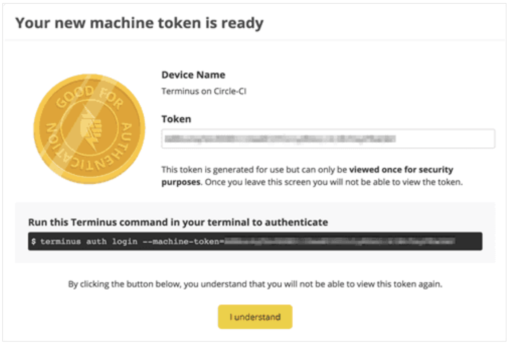
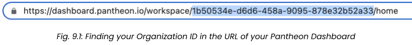
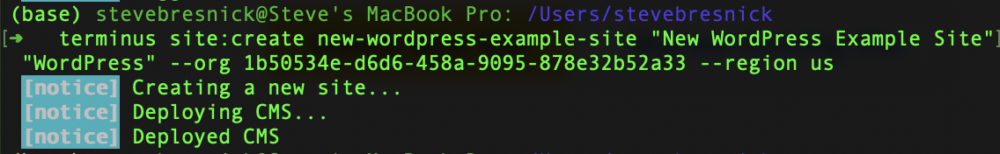
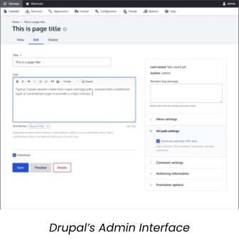

<Alert title="By the end of this chapter, you will be able to:"  type="info" >

- Describe the general functionality Terminus provides as a command line interface (CLI) tool.
- List five of the most useful tasks that can be automated using Terminus scripting.
- Describe the scope of access granted through Terminus as it relates to a pre-existing user instance on Pantheon.
- Describe how Machine Tokens provide access to Pantheon services.
- List the steps to create a Machine Token on Pantheon.
- Describe the steps required to install Terminus on a Mac and on a Windows PC.
- Install Terminus on your local machine by following the steps provided.
- List and Describe five or more common use cases for Quicksilver platform hook automation
- List and Describe some common Quicksilver Triggers and Events
- Describe how Terminus and Quicksilver can work together to help facilitate complex WebOps workflows


</Alert>

## Pantheon CLI
Terminus is a command line interface that provides advanced interaction with Pantheon. It enables you to do almost everything in a terminal that you can do in the Dashboard, as well as scripting and much more.

What can you do with Terminus?

Terminus is a powerful tool that allows you to:

- Create a new site
- Create and delete Multidev environments
- Clone one environment to another
- Check for and apply upstream updates
- Deploy code from one environment to another
- Run Drush and WP-CLI commands
- Perform other operations

Since Terminus authentication is tied to a pre-existing user and role on Pantheon, one of the things you cannot automate with Terminus is the creation of a new user (which would be a huge security liability!)

### Installing Terminus

<Alert title="Tutorial Activity #12: Install Terminus"  type="info" >

In this section, we will install Terminus, Pantheon’s command line interface tool. Note the technical requirements for Terminus to be compatible with your machine. Terminus requires PHP 7.4 or later, Composer, and Git.

</Alert>

This section provides information on how to install and authenticate Terminus. Terminus is available for MacOS and Linux. Windows 10 users can install the Windows Subsystem for Linux, and then install Terminus in the Linux shell.

Some Terminus commands use SSH authentication. You should add SSH keys to your account before you continue.


| **Compatible Operating Systems** | **Incompatible Operating Systems**|
|:-----|:----|
| Terminus has been tested on the following platforms:<br /><br /> <ul><li>MacOS</li><li>Windows 10 – WSL 2 Ubuntu 20.0</li><li>Ubuntu 20.0 – this would include Ubuntu under Docker or VirtualBox</li></ul> | Terminus does not work with the following platforms:<br /><br /><ul><li>Windows 10 – Command Line</li><li>Windows 10 – Git Bash (MingW)</li><li>Ubuntu 18.0 and earlier versions</li><li>Linux system with coreutils equal to or less than 8.28</li></ul>|

There are several ways to install Terminus, depending on your use case: as a self-contained Terminus executable (`terminus.phar`), using Homebrew on a Mac, or [downloading and installing from the Git repository](https://github.com/pantheon-systems/terminus#installing-with-git).

We will now walk you through each of these three methods.

#### Method #1: Standalone Terminus PHAR
The commands below will:

- Create a terminus folder in your home directory (`~/`)
- Get the latest release tag of Terminus
- Download and save the release as `~/terminus/terminus`
- Make the file executable
- Add a symlink to your local bin directory for the Terminus executable

```bash{promptUser: user}
mkdir -p ~/terminus && cd ~/terminus
curl -L https://github.com/pantheon-systems/terminus/releases/download/3.2.1/terminus.phar --output terminus
chmod +x terminus
./terminus self:update
sudo ln -s ~/terminus/terminus /usr/local/bin/terminus
```

#### Method #2: MacOS Homebrew Installation
The Terminus application is published to Homebrew. Run the command below to install Terminus:

```bash{promptUser: user}
brew install pantheon-systems/external/terminus
```

#### Method #3: Ubuntu/WinWSL-Ubuntu Installation

Follow the steps in the Standalone Terminus PHAR section.

### Authenticating Terminus

<Alert title="Tutorial Activity #13: Authenticate with Terminus using a Machine Token"  type="info" >

Machine tokens are used to uniquely identify your machine and securely authenticate via Terminus. They provide the same access as your username and password, do not expire, can only be viewed when you’re creating it, and should be revoked when no longer used to help keep your account safe

</Alert>

You must log in with a machine token after the installation completes. A machine token is used to securely authenticate your machine. Machine tokens provide the same access as your username and password, and do not expire. In this section, we will generate a machine token in the Pantheon Dashboard, and use that machine token to authenticate Terminus.

Machine tokens are used to uniquely identify your machine and securely authenticate via Terminus.

Some features of machine tokens:

- Provide the same access as your username and password
- Do not expire
- Can only be viewed when they are being created in the dashboard, and must be copied and stored in a secure location for subsequent access.
- Should be revoked when no longer used to help keep your account safe

To set up a machine token on Pantheon, follow these steps:

1. Go to your [Personal Settings](/personal-settings) and select Machine Tokens.
2. Click Create Token.
3. Enter a token name, and click Generate Token.
4. Copy and save your machine token now, as you will not be able to view or edit it later.
5. Click I understand to continue.

You should see the following screen upon completion:



Once you have generated your token, you can use it to authenticate with Terminus. In order to authenticate with Terminus, run the following command (using the unique machine token string you have just generated in the Pantheon Dashboard):

```bash{promptUser: user}
terminus auth:login -machine-token=<replace your machine token here>
```

### Running Terminus Commands

This section provides information on how to apply updates, deploy code, switch upstreams, and install Drush and WP-CLI with Terminus, as well as information on command structure and automatic site and environment detection.

#### Terminus Command Structure

The following command structure pattern presupposes formal web application naming conventions.

Terminus command structure typically includes `<site>.<env>` in order to determine the target site and environment to execute against. Note that the `<>` symbols are part of the example, and should not to be included in your commands. For example, running the env:clear-cache command for the Live environment of a site labeled "Your Awesome Site”:


```bash{promptUser: user}
terminus env:clear-cache your-awesome-site.live
```

As you can see, Terminus commands use the same machine naming conventions as Pantheon’s platform domain system.

#### Basic Format
The basic format of a Terminus command is:

```bash{promptUser: user}
terminus command:subcommand <site>.<env>
```

#### More Information Command
You can find more information on any command by using the `-h` flag:

```bash{promptUser: user}
terminus command:subcommand -h
```

#### List of Commands
You can get a list of all available commands by using the `list` command:


```bash{promptUser: user}
terminus list
```

### Scripting with Terminus

<Alert title="Tutorial Activity #14: Using Terminus to Accelerate Development"  type="info" >

Pantheon also allows you to programmatically create sites using Terminus. The terminus site:create command is just one example of how Terminus can automate the completion of a complex task, in this case creating a new site. In this section, we will walk through several useful examples of what Terminus can do for you without requiring you to login to the Pantheon Dashboard in your browser. And keep in mind that these examples are merely scratching the surface of what is possible with Terminus and WebOps.

</Alert>

This section provides information on how to automate your workflow with Terminus scripting.

Terminus makes it easy to directly interact with Pantheon from your command line, and provides additional value with scripting abilities. You can make Pantheon a part of your standardized workflow by adding Terminus to your automated tasks.

Consider the repetitive tasks you perform using the Pantheon Dashboard:

- Can those tasks be executed by Terminus commands?
- Can the values required by the commands be derived programmatically?

If so, consider how you can turn the task into a script. For some quick examples of Bash scripts that use Terminus commands, see [this documentation page](/terminus/scripting).

Terminus must be authenticated before you can execute most commands (using the `terminus auth:login` command). You must authenticate Terminus with a machine token that has the correct permissions before running a script.

Using Terminus commands, you can create customized WebOps automation scripts to further automate tedious tasks, effortlessly enforce quality control guardrails, permit self-service completion of a complex multistep provisioning process, and more.

Now that we have created a site through the dashboard, let’s see how to create a site programmatically with Terminus!


1. Terminus should already be installed on our local machine, and you should have already created a Machine Token in the Pantheon dashboard to allow Terminus to authenticate on our behalf.

    - To install Terminus, you can follow the steps on [this documentation page](/terminus/install).
    - To create a Machine Token, you can follow the steps on this [documentation page](/machine-tokens).

  You can validate the successful installation of Terminus on your machine by typing the following into your command line:
  ```bash{promptUser: user}
  which terminus
  ```
  If Terminus is successfully installed you should see something like the following:
  ```bash{promptUser: user}
  /usr/local/bin/terminus
  ```

1. Now that Terminus is installed, we will authenticate through the command line by authenticating with our machine token. To generate a machine token in your dashboard, you can following the directions on [this documentation page](/machine-tokens).

  Once you have created your token and copied it to a secure place, you can authenticate with Terminus by typing the following command:
  ```bash{promptUser: user}
  terminus auth:login --email=<email@example.com> --machine-token=<machine_token>
  ```

  In this example, use the email address associated with the user who is logging into the dashboard. Note that Terminus will have the same permissions as the user associated with the email address you provide here. Also, replace `<machine_token>` with the machine token string you copied when you created your machine token.

1. Now that you are logged into Terminus, you can run individual commands in your command line. You can view a list of available commands on [this documentation page](/terminus/commands), or you can type the following command to get a list of all commands:
  ```bash{promptUser: user}
  terminus list
  ```
  Here is an example of the command we will use to create a new site with Terminus:
  ```bash{promptUser: user}
  terminus site:create <site_name> <label> <upstream_id> --org <org_id> —region <region>
  ```
  In this case, there are a few parameters we will need to grab. We would like to create a new site that is a fresh install of the latest version of WordPress, deployed to the United States region. We will call the site “New WordPress Example Site”.

  To create this site, therefore, we will input the following parameters:
    - **site name:** This is the machine name for your site. In this case, we would type in “new-wordpress-example-site”
    - **label**: This is the human-readable name of the site. In this case, we would enter “New WordPress Example Site”.
    - **upstream_id:** This is a string that can denote one of Pantheon’s core upstreams (e.g. “WordPress” or “Drupal”), or you can use the ID number of a Custom Upstream. In this case, we will be deploying a fresh installation of WordPress, so we will select “WordPress” as our upstream ID.
    - **org:** This is the unique identifier for the Organization the site will belong to. This ID number can be found in the URL of your Workspace. In this case, the organization ID is `1b50534e-d6d6-458a-9095-878e32b52a33`. You can easily copy and paste this string from your Workspace’s URL (fig. 9.1).

      

    - **region:** Pantheon allows you to deploy to one of four global regions: Australia (au), Canada (ca), European Union (eu), and the United States (us). In this case, we will choose United States (us)

  The complete command line command should look like this:
  ```bash{promptUser: user}
  terminus site:create new-wordpress-example-site "New WordPress Example Site” "WordPress" --org 1b50534e-d6d6-458a-9095-878e32b52a33 --region us
  ```

1. Terminus will now run through the process of provisioning a new site. The process typically takes a couple minutes or less. Once the process completes, you should see confirmation with the “Deployed CMS” message:
  

1. Head back to the dashboard in the web browser. In the “Sites” tab of your Workspace, you should now see the new site listed with the other sites:
  

  Clicking on the link will bring you to the site dashboard for your new site.

Now, you have seen how to create a new site programmatically using Terminus in the command line. We have just scratched the surface on what is possible with Terminus. Here are some suggested next steps to get your feet wet with Terminus:

- **Install your WordPress site:** You can do this with the [WP-CLI](https://developer.wordpress.org/cli/commands/core/) command [`wp core install`](https://developer.wordpress.org/cli/commands/core/)**.** Terminus provides a wrapper for writing WP-CLI commands (and Drush commands for Drupal websites) with the [`terminus remote:wp`](/terminus/commands/remote-wp) command. The following example would install WordPress in the Dev environment of our WordPress site:
  ```bash{promptUser: user}
  terminus remote:wp --progress new-wordpress-example-site.dev core install
  ```

- **Initialize your Test and Live environments:** When you create the new site, everything is provisioned within the Dev environment. You can initialize your Test and Live environments through the dashboard, but Terminus provides a faster way to do this with the [`terminus env:deploy`](/terminus/commands/env-deploy) command. The following example would initialize the Test environment for our new WordPress site:
  ```bash{promptUser: user}
  terminus env:deploy --sync-content --cc --updatedb -- new-wordpress-example-site.test
  ```

- **Create a backup of your new site:** You can programmatically create backups of your site using the [`terminus backup:create`](/terminus/commands/backup-create) command. You can also use this command as part of a script that runs every time a new version of the site is deployed. The following example would create a backup of the code, database, and files in the Dev environment of our site:
  ```bash{promptUser: user}
  terminus backup:create new-wordpress-example-site.dev
  ```

- **Create a new Multidev environment for new site:** You can programmatically create Multidevs for your new site using the [`terminus multidev:create`](/terminus/commands/multidev-create) command. This can save significant time, especially when working on large projects or handling multiple development streams simultaneously. Scripting the creation of Multidevs with Terminus unlocks a whole world of potential for using Multidevs as build artifact destinations in a CI/CD workflow. The following example would create a new Multidev called newfeature, and clone the code, database, and files from the Dev environment of our site:
  ```bash{promptUser: user}
  terminus multidev:create  -- new-wordpress-example-site.dev newfeature
  ```

Keep in mind that you can run Terminus commands individually, but the real power comes in the ability to script your Terminus commands. This enables you to put specific guardrails in place automatically, opening up virtually unlimited possibilities for your WebOps workflow!

For more information on scripting with Terminus, see the following [documentation page](/terminus/scripting).

### Interacting Programmatically with the CMS
As you know, Pantheon is a platform for hosting, developing, deploying and managing Drupal, WordPress, and JavaScript frontend applications. It is worth quickly distinguishing between the different types of users who login to the Pantheon dashboard, and those who login to the administrative dashboard of the Drupal or WordPress CMS applications.

#### Content Management System Users
These users are generally content creators, marketers, SEO specialists, and administrators who need to manage the website's content, look, and feel. They use the CMS interface for tasks like creating, editing, and publishing content; managing site structure and navigation; updating visual themes and layouts; and handling SEO metadata. Their main goal is to ensure the website's content is engaging, up-to-date, and effectively reaching its target audience.



While there is a dedicated link in the site dashboard to access the admin dashboard of the CMS application, it should be noted that this link is there for convenience only. CMS users may log directly into the CMS through the CMS login form, and do not need to interface with Pantheon on a daily basis.

#### Pantheon Dashboard Users
These are typically website developers, DevOps engineers, and IT personnel, who use the Pantheon dashboard to manage technical aspects of websites, including code commits, development, testing, and deployment live environments. Their primary focus is ensuring the technical health and performance of the website. Additionally, agency and organization administrators often use the Pantheon Dashboard to manage their teams and to review usage and billing information.

Pantheon Dashboard users can log directly into the dashboard with a username and password, authenticate via a SAML-based Single Sign-On (SSO) solution, or authenticate via a machine token with Terminus.

There are often reasons why developers would want to interact directly with the application itself, not just with the code or underlying database. Terminus provides a simple, secure way to interact directly with the CMS through the command line or through scripting by providing a shell for running Drush and WP-CLI commands.

Both Drupal and WordPress provide convenient CLI (Command Line Interface) tools, known as [Drush](http://drush.org/) and [WP-CLI](https://wp-cli.org/) respectively, which enable developers to perform a variety of tasks and manage site configurations directly from the command line. Both allow you to update plugins and modules, configure individual and WordPress multisite installations, perform utility tasks such as clearing the cache and updating the database, and more, all without using a web browser.

While a comprehensive exploration of all that is possible with each of these tools is outside the scope of this guide, we would highly recommend visiting the documentation sites and exploring the possible uses for each tool.

#### Running Drush and WP-CLI Commands
Here's an example of how to use Terminus to run a Drush command. Let's use drush status as an example command:


```bash{promptUser: user}
terminus remote:drush new-wordpress-example-site.dev -- status
```

This command would return the status of your Drupal site (although in this case, you'd want to run a WordPress command since the site is a WordPress site).
But if you're working with a WordPress site, you might use WP-CLI instead of Drush. An example command for that might be:


```bash{promptUser: user}
terminus remote:wp new-wordpress-example-site.dev -- core version
```

This command would return the version of WordPress core that is currently running on your site in the dev environment.

## Quicksilver
Quicksilver hooks into platform workflows to automate your Pantheon WebOps workflow. This allows the platform to run selected scripts automatically every hour, or when a team member triggers the corresponding workflow. There is a growing set of example scripts available for review and contributions. Several scripts enable additional functionality, including:
- Chat-ops
- Database sanitization
- Deployment logging
- Automated testing operations with a CI server

To see some example scripts to get started with, check out our [Quicksilver Examples Repository](https://github.com/pantheon-systems/quicksilver-examples/).

Quicksilver workflows are defined in your `pantheon.yml` file. You can specify the workflows you want to hook into, for example, deploy or sync_code. You can also specify the workflow stage (before or after) and the location of the script relative to the root of your site's docroot.

### Quicksilver Example with Pantheon.yml
The adapted slack_notification example below provides steps to post to Slack every time you deploy:

Commit a `pantheon.yml` file with the following content:
```yaml:title=pantheon.yml
api_version: 1

workflows:
  deploy:
    after:
      - type: webphp
        description: Post deployment notification to Slack
        script: private/scripts/slack_deploy_notification.php
```

Add the code below if you want the script to automatically log the deployment to New Relic:
```yaml:title=pantheon.yml
      - type: webphp
        description: Log to New Relic
        script: private/scripts/new_relic_deploy.php
```
<Alert title="Terminus vs. Quicksilver" type="info">
Terminus and Quicksilver can work together to help facilitate complex WebOps workflows. In general:

- Use Terminus as a way to send commands to Pantheon
- Use Quicksilver as a way to send commands back out to other services

This allows you to close the loop with your workflow tools and have Pantheon be an automated part of that process.

</Alert>

### Quicksilver Hooks
Deploy your `pantheon.yml` file into an environment before using a Quicksilver hook for a deploy workflow.

Quicksilver scripts that trigger on the deploy hook operate on the state of the code at the time of the deploy, not the state of the code after the deploy. This means that new or updated code is not available until the deployment finishes even though the deploy hook is triggered at the start of the deployment.

Review available hooks on [this documentation page](/guides/quicksilver/hooks#hooks).

### Example Use Cases
The following are some common examples of how Quicksilver can help you automate your WebOps workflow:

| **Triggers** | **Possible Events**|
|:-----|:----|
| Deploying to Test or Live | <ul><li>Notify a Slack Channel</li><li>Revert/import Features/configuration</li><li>Send SMS to project manager</li><li>Trigger visual regression test</li><li>Trigger load test</li><li>New Relic deployment marker</li></ul>|
| Making a Multidev | <ul><li>Enable development modules</li><li>Report back to a CI service like Jenkins</li><li>Copy New Relic settings</li><li>Index content in Solr</li></ul>|
| Committing Code | <ul><li>New Relic deployment marker</li><li>Update Project Management system</li><li>Trigger a code push to an external repository</li></ul>|
| Cloning a Database | <ul><li>Import configuration</li><li>Sanitize user names</li><li>Enable development modules</li></ul>|
| Clearing Caches | <ul><li>Clear a CDN</li><li>Debug a script meant for another workflow</li><li>New Relic deployment marker</li></ul>|
| New Site Created | <ul><li>Send SMS to administrator</li><li>Notify a Slack channel</li><li>Run Composer scripts</li></ul>|

### More Quicksilver Examples
The steps above provide a fast way to integrate New Relic® Performance Monitoring and Pantheon with Quicksilver. The Quicksilver Examples repository provides many more ways to automate development, so please take advantage of them and extend them to fit your workflow.

#### More Resources
- [Automate and Integrate your WebOps Workflow with Quicksilver](/guides/quicksilver)
- [Quicksilver Examples Repository](https://github.com/pantheon-systems/quicksilver-examples)
- [Pantheon YAML Configuration Files](/pantheon-yml)


## Chapter Summary

We have covered a lot in this section! We started by getting familiar with Terminus, and you learned how to install the powerful command line interface tool in your laptop. Next, you learned about running individual Terminus commands, and then about scripting Terminus using your scripting language of choice (Bash, Python, etc.). And finally, you learned about how Terminus can allow you to interact directly with your CMS site, using Drush or WP-CLI commands as a starting point. We have covered a lot in this chapter. In the next and final chapter, we will learn about some of Pantheon’s other automation tools: Integrated Composer, Autopilot, and Quicksilver.
