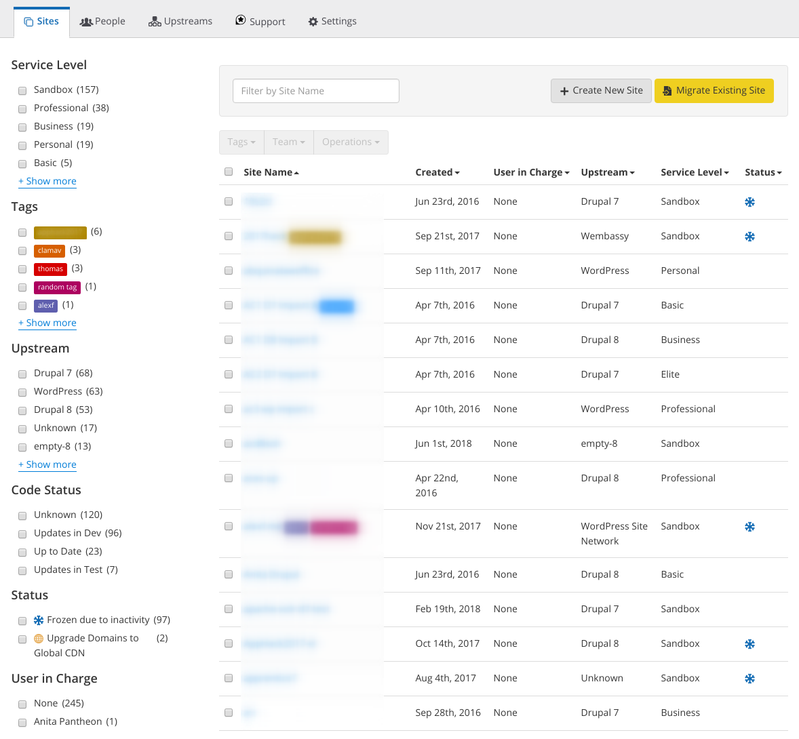

Change Management is an [Organization](/organizations) feature that enables role-based permissions for users in the organization. It is automatically enabled for all Organizations.

Users added to the organization can access all sites associated with the organization, with access restricted based on the user's role in that organization. These roles exist to restrict who can deploy code on sites, and manage other users in the organization or sites it works on.

## Roles and Permissions

These tables detail the actions each role can execute on each Dashboard.

In some Dashboards, you may notice the "User in Charge" label applied to a user. This helps distinguish who created a site for Enterprise and EDU Organizations where members are allowed to spin up new Sandbox sites at will. However, in these organizations the "User in Charge"  cannot adjust the site service level — e.g. to take a site live. Because this may affect the overall bill for the organization, only organization admins are allowed to change service levels.

If you are an administrator for a Pantheon organization, [contact support](/guides/support/contact-support/) to have the User in Charge changed.

### Organizations: Roles and Permissions

| Permissions                                             | Administrator                       | Team Member                         | Developer                          | Unprivileged <Popover title="Unprivileged" content="Enterprise and EDU+ organizations only" /> |
|:------------------------------------------------------- |:----------------------------------- |:----------------------------------- |:-----------------------------------|:-----------------------------------|
| Create sites within an org                              | ✔ | ✔ | ✔| ✔|
| Work in Dev environments                                | ✔ | ✔ | ✔| ✔|
| Access to Multidev environments                         | ✔ | ✔ | ✔| ✔|
| Create new Multidev environments                         | ✔ | ✔ | ✔| ✔|
| Create or view support tickets                                    | ✔ | ✔  | ✔ | ❌ |
| Access and manage [Autopilot](/guides/autopilot)        | ✔ | ✔ | ✔| ❌ |
| Access the [Workspace](/guides/new-dashboard/workspaces)| ✔ | ✔ | ✔| ❌ <Popover title="Workspace Unprivileged" content="Users with an Unprivileged role will see the Workspace's name, but will not be able to access it." />|
| Access the org Dashboard                                | ✔ | ✔ | ✔| ❌ |
| Change site upstream <Popover title="Permissions Note" content="The site and the upstream must both belong to the same organization." /> | ✔ | ✔ | ✔ | ❌ |
| Deploy to Test and Live                                 | ✔ | ✔ | ❌ | ❌ |
| Invite new team members                                 | ✔ | ✔ | ❌ | ❌ |
| Manage user roles                                       | ✔ | ❌  | ❌ | ❌ |
| Delete sites or remove users from an org                | ✔ | ❌  | ❌ | ❌ |
| Manage a site's plan                                    | ✔ | ❌  | ❌ | ❌ |
| Create or manage Custom Upstreams                          | ✔ | ❌  | ❌ | ❌ |

### Site-Level: Roles and Permissions

| Permissions                                       | Org Admin / Owner <Popover title="Owner" content="Partner organizations only" /> | Team Member | Developer <Popover content="Enterprise organizations only" /> |
|:------------------------------------------------- |:----------------------------------- |:----------------------------------- |:----------------------------------- |
| Access the site Dashboard                         | ✔ | ✔ | ✔ |
| Work in Dev environments                          | ✔ | ✔ | ✔ |
| Change site upstream                | ✔ | ✔ | ✔ |
| Deploy from Custom Upstreams <Popover title="Custom Upstream availability" content="Applies only when an organization has Custom Upstreams enabled, and has already created one." /> | ✔ | ✔  | ✔  | ✔  |
| Add/Manage Custom Domains           | ✔ | ✔ | ❌  |
| Deploy to Test and Live                           | ✔ | ✔ | ❌  |
| Clear cache on Test and Live                      | ✔ | ✔ | ❌  |
| Manage user roles                                 | ✔ | ❌  | ❌  |
| Delete sites or remove users from a site          | ✔ | ❌  | ❌  |
| Add a [Supporting Organization](/organizations#organization-site-association)                     | ✔ | ❌  | ❌  |
| Manage a site's plan                              | ✔ Org admin or Owner <Popover title="Owner" content="When an organization is the owner of a site, users in charge cannot change the site plan." /> | ❌  | ❌  |
| Enable Pantheon Search                | ✔ | ❌  | ❌  |

## Manage People in an Organization

### Add a User to the Organization

1. Navigate to the Organization dashboard > click **Add User** in the **People** tab.

1. Enter the email address of the new user > select a role > click **Add user**.

 

An email confirmation is sent to the user. Users with an existing Pantheon account are immediately added to the Organization. Users without existing accounts must first click the confirmation link in the email to create their account.

To create a new user with an unprivileged role, create the user first, then change the role as detailed below.

### Change a User's Role

1. Navigate to the Organization dashboard > select the user's name in the **People** tab. 

1. Click **Operations**, and choose **Change Role**.

1. Select the new role from the drop-down > click **Set User Role**.

### Change Site Owner

To change the owner of a paid site (e.g. Basic or Performance):

<Partial file="transfer-ownership-billing-steps.md" />

Keep in mind that [Partner Organizations cannot own sites directly](/organizations/#organization-site-association).

For Sandbox sites, within the Team modal, the current site owner can click **Make Owner** next to the site team member who should receive ownership of the site.

## Manage a Site's Team

### Add a User to a Site

1. Click **Team** in the Site Dashboard.

1. Enter the user's email address > select a role > click **Add Team Member**.

### Add a Supporting Organization to a Site

Organization Administrators, Users in Charge, or Site Owners can add a [Supporting Organization](/organizations#organization-site-association).

1. Click **Team** in the Site Dashboard.

1. Click **Add a Supporting Organization** > enter the organization's name in the search box > click **Search**.

1. Select a role > click **Add**.

All members of the Supporting Organization receive the role assigned on the site, regardless of their role in the Supporting Organization.

## Frequently Asked Questions (FAQs)

#### Which role should I assign a user to give them the lowest level of access?

At the site level, the Developer role has the least amount of permissions and can create sites, view the Organization Dashboard, and deploy to the Development and Multidev environments. At the organization level, the Unprivileged role has the least amount of permissions and can only create sites.

#### Which environments can a user with the Developer role deploy to?

The Developer role can only deploy to Development and Multidev environments. If a user needs to deploy to Live, you can promote a Developer to Team Member for a single site by adding the user to the site's team.

#### Who can add users to Organizations?

Enterprise Administrators can add site Team Members or Supporting Organizations to **sites** owned by the organization, with the Developer or organizational Team Member roles. Partner Organizations can assign users the role of an Administrator, Team Member, or Developer at the organization level.

#### How do I recover an account after a site owner leaves?

See the steps in our [Site Access](/site-access) doc for recovery instructions.
