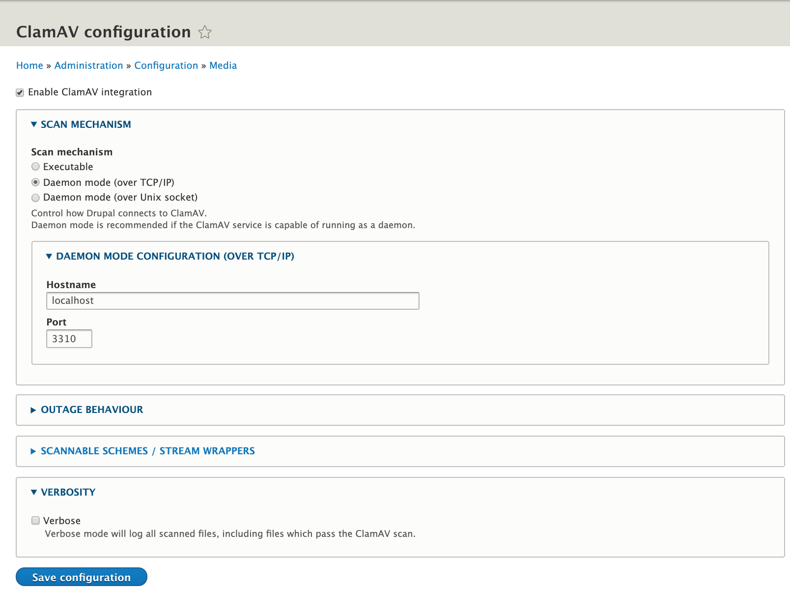
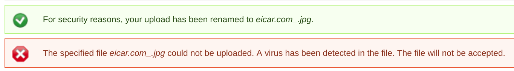

**ClamAV** is an open source antivirus engine for detecting trojans, viruses, malware & other malicious threats. It supports multiple file formats, file and archive unpacking, and multiple signature languages.

A file that may look like a normal JPG or PDF file may actually be malware that run scripts within your site. They may come from files that have been uploaded via fields, attachments or other media forms. These may end up in your public files directory and might cause alerts, harm site SEO scores, compromise data, and or lower site credibility.

## Install ClamAV

<Alert title="Exports" type="export">

This process uses [Terminus](/terminus) commands. Before we begin, set the variables `$site` and `$env` in your terminal session to match your site name and the Dev environment:

```bash
export site=yoursitename
export env=dev
```

</Alert>

Because the ClamAV binary is already installed on Pantheon servers, all you need to do is install one of the available modules.

<Alert title="Note" type="info">

As of this doc's last update, there are no actively maintained ClamAV plugins for WordPress.

</Alert>

### Drupal

This doc uses the [ClamAV Module for Drupal 7 & 8](https://www.drupal.org/project/clamav).

1. Download and enable the module in the Drupal admin panel, or via [Terminus](/terminus):

   ```bash
   terminus drush $site.$env -- dl clamav
   terminus drush $site.$env -- en clamav -y
   ```

2. From the module's configuration page, ensure that the scan method is set to to daemon mode, with the hostname `localhost` and the port number `3310`:

    

When ClamAV detects a virus, it will display a warning:



## Known Issues

After installation, make sure to clear your sites cache via the Site Dashboard.
