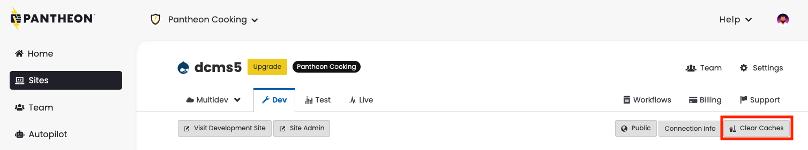

Pantheon extends the core functionality of caching mechanisms within WordPress and Drupal so that caches are cleared within the site's frame and from our [Global CDN](/global-cdn) service.

## Granular Cache Clearing
Use the Pantheon Advanced Page Cache [plugin](https://wordpress.org/plugins/pantheon-advanced-page-cache/) or [module](https://www.drupal.org/project/pantheon_advanced_page_cache) to automatically clear caches for related pages as content is updated. No configuration needed, simply install and enable to take advantage of the granular cache clearing capabilities of the Global CDN.

Lower-level documentation for custom implementation of caching strategies is also coming soon. Please [contact our enablement team](https://pantheon.io/learn-pantheon?docs) if you are interested in implementing a custom cache strategy.

## Full Cache Clearing
We refer to this as "full cache clearing" because the operation removes all pages from cache at once. There are three methods you can use to clear all caches for a given [environment](/pantheon-workflow) of a site:

- Pantheon Dashboard
- Site Admin
- Command Line

**Note:** To clear the Object cache, please see our [Object Cache](/object-cache#clear-cache) doc.

### Pantheon Dashboard
1. Navigate to the Site Dashboard and select the desired environment.
2. Click the **Clear Caches** button:

  

### Site Admin

<TabList>

<Tab title="WordPress" id="wp-1" active={true}>

1. Navigate to the Site Dashboard and select the desired environment.
2. Click the **<span class="glyphicons glyphicons-new-window-alt"></span> Visit Site** button and login.
3. Navigate to **Settings** > **Pantheon Page Cache**, then click **Clear Cache**:

  

</Tab>

<Tab title="Drupal 8" id="d8-2">

1. Navigate to the Site Dashboard and select the desired environment.
2. Click the **<span class="glyphicons glyphicons-new-window-alt"></span> Visit Site** button and login.
3. Navigate to **Configuration** > **Development** > **Performance**, then click **Clear all caches**:

  

</Tab>


<Tab title="Drupal 7" id="d7-3">

1. Navigate to the Site Dashboard and select the desired environment.
2. Click the **<span class="glyphicons glyphicons-new-window-alt"></span> Visit Site** button and login.
3. Ensure the [Pantheon Platform API](/modules#pantheon-module-drupal-7) module is enabled:

  

4. Navigate to **Configuration** > **Development** > **Performance**, then click **Clear all caches**:

  

</Tab>

</TabList>


### Command Line
If you're working from a terminal prompt or looking to automate parts of your workflow, use [Terminus](/terminus) to clear caches from the command line:

```bash
terminus env:clear-cache site.env
```

Replace `site` and `env` with your site name and the correct environment.

## Troubleshooting

### Clear Cache Fails in Dashboard or Terminus
If you see a notification on the Dashboard indicating a failure to clear cache, this is usually due to a PHP error, redirect, or other code-related issue. While the Dashboard notification may not help much to debug, running the same command via [Terminus](/terminus) will likely provide actionable information.

Some good troubleshooting first steps include:

 - Commenting out redirections in `settings.php`, `wp-config.php`, or elsewhere.

 - Resolve any fatal PHP errors.
 
 - Isolate which plugin or module may be causing the issue by turning them all off, then turning on one by one.
 
 - Check if the issue is theme related by using an unmodified default theme like [Bartik](https://www.drupal.org/project/bartik) or [Twenty Nineteen](https://wordpress.org/themes/twentynineteen/).

### Cache Is Cleared from Dashboard and Application but New Changes Are Not Visible
This usually happens when using a 3rd Party CDN on top of Pantheon like Cloudflare, Stackpath, etc. Try clearing the cache from the 3rd-party CDN's dashboard.
