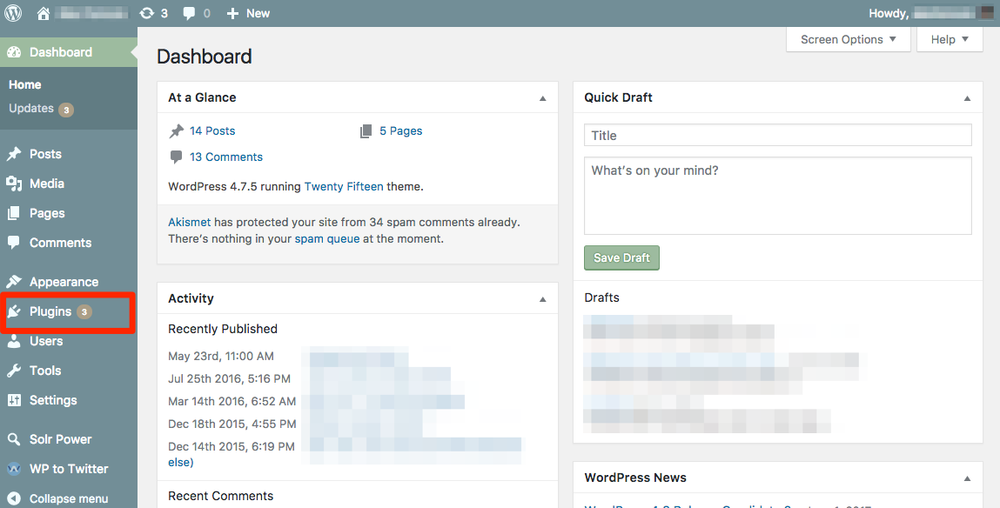
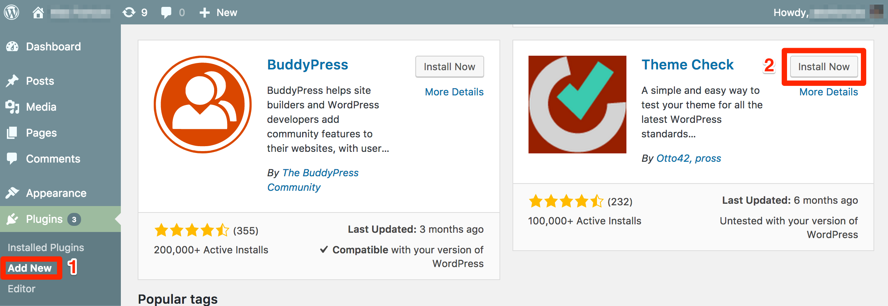
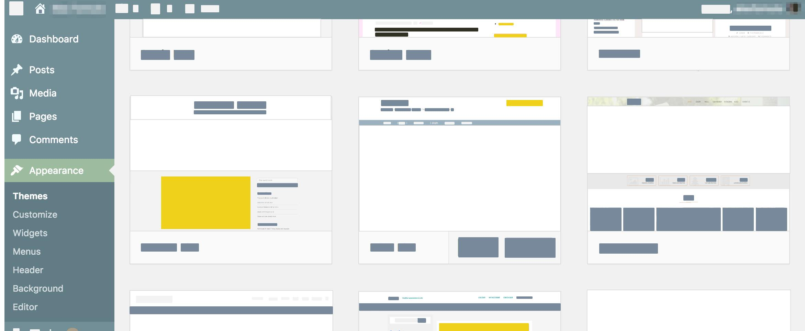
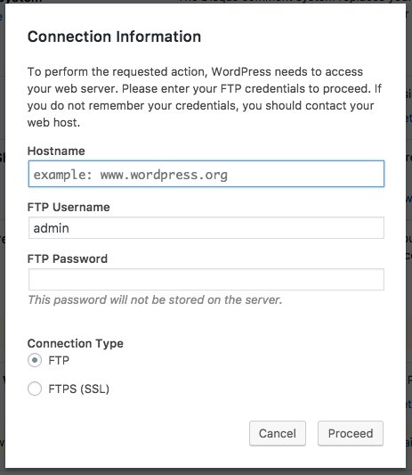
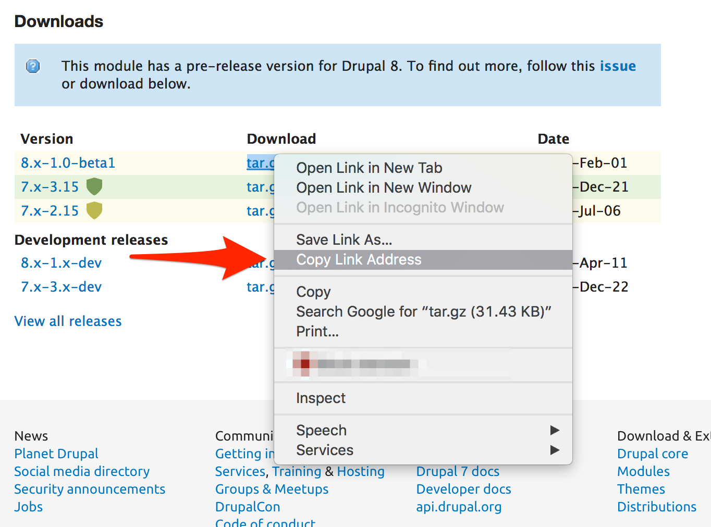
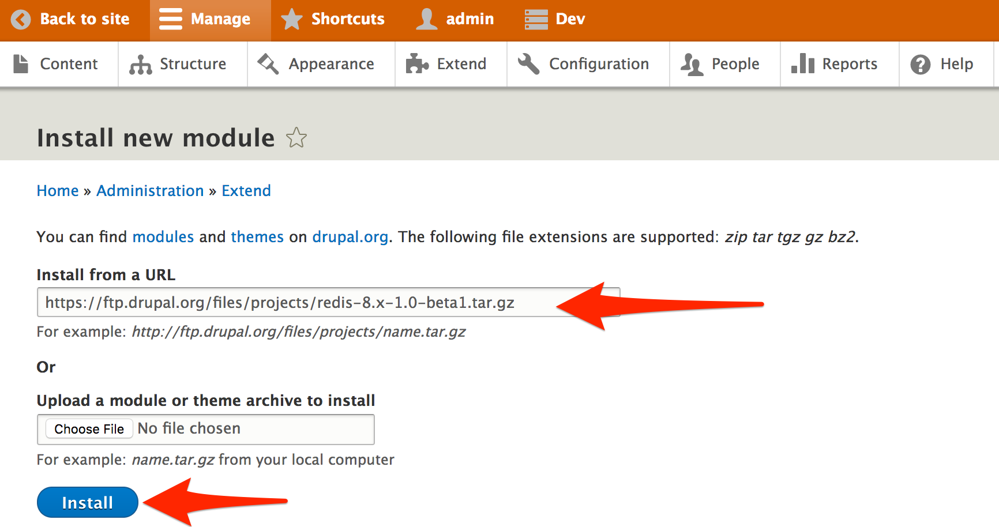
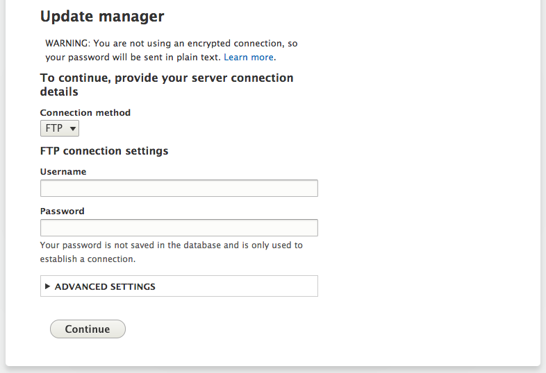
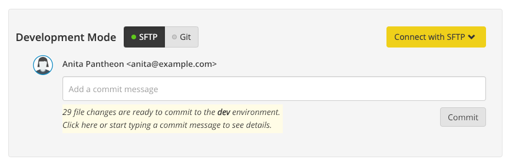
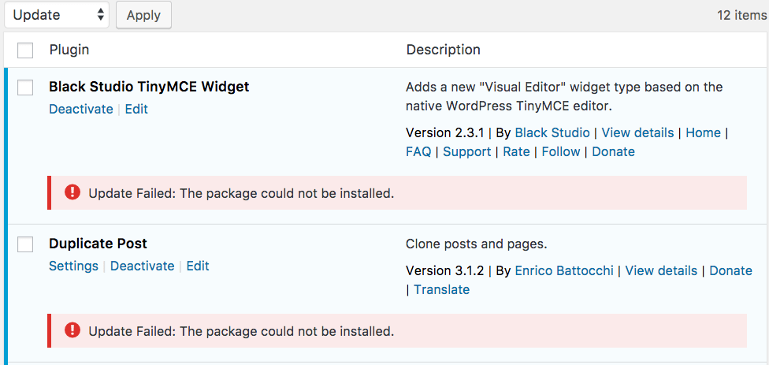

Pantheon's Site Dashboard provides two connection modes to support various development workflows, such as pushing commits from your local with [Git](/git) or working in the WordPress or Drupal admin interface in [SFTP](/sftp) mode. Admin tools and command-line interfaces require write access to the codebase, which is only provided to development environments (Dev or [Multidev](/multidev)) in **SFTP** mode.

<Alert title="Exports" type="export">

This doc offers [Terminus](/terminus) commands, using the variables `$site` and `$env`. Export these variables in your terminal session to match your site name and the correct environment:

```bash{promptUser: user}
export site=yoursitename
export env=dev
```

</Alert>

## SFTP Mode

1. Navigate to the **<span class="glyphicons glyphicons-wrench"></span> Dev** or **<span class="glyphicons glyphicons-cloud"></span> Multidev** tab of your Pantheon Site Dashboard.
1. Next to Connection Mode, click **SFTP**:

  

Operations that require write access to the codebase must be executed while the site is in SFTP mode, such as:

- Activating a new theme in the site admin,
- Uploading a new module or plugin using an SFTP client,
- Remote Drush commands, like `terminus remote:drush $site.$env -- pm-enable hsts --yes` <Popover content="Run Drush commands with <a href='/docs/terminus/'>Terminus</a>. For details, see <a href='/docs/drush/'>Drupal Drush Command-Line Utility</a>." />
- Remote WP-CLI commands, like `terminus remote:wp $site.$env -- plugin install lh-hsts --activate` <Popover content="Run WP-CLI commands with <a href='/docs/terminus/'>Terminus</a>. For details, see <a href='/docs/wp-cli/'>Using WP-CLI On The Pantheon Platform</a>." />

## WordPress Dashboard

WordPress' admin interface has built in tools to manage plugins and themes, allowing you to install and manage popular themes and plugins from the main WordPress.org repository.

<Alert title="Warning" type="danger">

Do not update core using the WordPress Dashboard or WP-CLI. Apply one-click updates within the Site Dashboard on Pantheon or via [Terminus](/terminus). For additional details, see [Scope of Support](/support/#scope-of-support) and [WordPress and Drupal Core Updates](/core-updates).

</Alert>

### Manage Plugins and Themes

1. From the **<span class="glyphicons glyphicons-wrench"></span> Dev** or **<span class="glyphicons glyphicons-cloud"></span> Multidev** tab of your Pantheon Site Dashboard, click **<span class="glyphicons glyphicons-new-window-alt"></span> Site Admin**, then login if you have not done so already.

1. WordPress will let you know when there are plugin updates available:

  

1. From the **Plugins** menu, click **Add New** to search and install plugins directly:

  

1. Themes can be installed directly through the admin panel as well:

  

You still need to turn these changes into commits in your Pantheon Site Dashboard. Committing code will submit your changes to version control so you can deploy up to Test and Live.

### Connection Information Prompt

Prompts asking for connection information will occur in the WordPress Dashboard when the site is set to the wrong connection mode:



You should *never* have to enter credentials into the WordPress Dashboard. Visit the Site Dashboard and set the environment's connection mode to **SFTP**, then try again.

### Uninstall Plugins

Unused plugins should be removed from the Live environment. Deactivated and un-updated plugins can pose a security concern and they contribute to code bloat. Because plugins are a mix of files in the codebase and configuration in the database, removing plugins requires several steps:

<Alert title="Exports" type="export">

This process uses [Terminus](/terminus) commands. Before we begin, set the variable `$site` in your terminal session to match your site name:

```bash{promptUser: user}
export SITE=yoursitename
```

</Alert>

1. Confirm that you can safely remove the plugin by uninstalling it in Dev or a [Multidev](/multidev) environment set to [SFTP mode](#sftp-mode).

  <Alert title="Note" type="info">

  If the plugin being removed required symlinks to bypass assumed write access to the codebase, be sure to [remove](/symlinks-assumed-write-access#removing-a-symlink) them as well.

  </Alert>

1. [Commit](#commit-sftp-changes) the code change. If you're working in a Multidev environment, [merge](/multidev#merge-code) the change to Dev at this point.

1. Use [WP-CLI](/wp-cli) through Terminus to remove the necessary tables from the Live environment's database while skipping file deletion. Replace `<plugin-name>` in the example below:

  ```bash{promptUser: user}
  terminus wp $SITE.live -- plugin uninstall <plugin-name> --skip-delete
  ```

1. In the Test environment, [combine](/pantheon-workflow#combine-code-from-dev-and-content-from-live-in-test) the code changes from Dev and the Content (database) changes from Live to test and validate that your change is valid.

1. Once you've confirmed in the Test environment that the plugin is removed and nothing has broken, [deploy the code change to the Live environment](/pantheon-workflow#deploy-code-to-live).

## Drupal Admin Interface

Drupal also allows you to install modules or themes [using its administrative interface](https://drupal.org/documentation/install/modules-themes/modules-7#using-drupal-interface).

<Alert title="Warning" type="danger">

Do not update core using the Drupal Admin interface or Drush. Apply one-click updates within the Site Dashboard on Pantheon or via [Terminus](/terminus). For additional details, see [Scope of Support](/support#scope-of-support) and [WordPress and Drupal Core Updates](/core-updates).

</Alert>

### Install a New Module

<TabList>

<Tab title="Drupal 8" id="d8-1" active={true}>

1. Get the URL to the code you want to install from Drupal.org:

  

  Make sure the module has a version marked `8.x-*` before installing it on a Drupal 8 site.

1. From the <span style="line-height:.9" class="glyphicons glyphicons-wrench"></span> **Dev** tab of your Pantheon Site Dashboard, click **Visit Development Site**. Sign in with your admin credentials.

1. Under the **Manage** menu, click on **Extend**, then **+ Install new module**. Paste the URL from Step 1. You can also upload a `tarball` or `zip` file from your desktop:

  

</Tab>

<Tab title="Drupal 7" id="d7-2">

1. Get the URL to the code you want to install from Drupal.org:

  

1. From the <span style="line-height:.9" class="glyphicons glyphicons-wrench"></span> **Dev** tab of your Pantheon Site Dashboard, click **Visit Development Site**, then navigate to the administration page.

1. Paste the URL into Drupal's update manager. You can also upload a tarball or zip file from your desktop:

  

</Tab>

</TabList>

You still need to turn these changes into commits in your Pantheon Site Dashboard. Committing code will submit your changes to version control so you can deploy up to Test and Live.

### Connection Information Prompt

Prompts asking for connection information will occur in the Drupal Admin interface when the site is set to the wrong connection mode:



You should *never* have to enter credentials into the Drupal Admin interface. Visit the Site Dashboard and set the environment's connection mode to **SFTP**, then try again.

## Command Line Tools

Perhaps the most powerful way to leverage the capabilities of on-server development is to use command line tools such as WP-CLI and Drush, which can be executed on Pantheon via [Terminus](/terminus).

### Install & Authenticate Terminus

In order to run WP-CLI or Drush commands on Pantheon's development environments, you'll need use our very own command line tool, Terminus:

1. Install [Terminus](/terminus):

  ```bash{promptUser: user}
  curl -O https://raw.githubusercontent.com/pantheon-systems/terminus-installer/master/builds/installer.phar && php installer.phar install
  ```

1. [Generate a Machine Token](https://dashboard.pantheon.io/machine-token/create) from **User Dashboard** > **Account** > **Machine Tokens**, then authenticate Terminus:

  ```bash{promptUser: user}
  terminus auth:login --machine-token=‹machine-token›
  ```

### Download Contrib Modules with Drush

SFTP mode supports [Drush](https://github.com/drush-ops/drush/), the command-line interface for Drupal. For example, you can download multiple contrib modules and a theme to the Dev environment:

```bash{outputLines: 2-18}
terminus drush $site.$env -- dl pathauto devel admin_menu zen search_api search_api_solr

Running drush dl pathauto devel admin_menu zen search_api search_api_solr on community-plumbing-20-dev
Project pathauto (7.x-1.2) downloaded to [success]
/srv/bindings/.../code/sites/all/modules/pathauto.
Project devel (7.x-1.5) downloaded to [success]
/srv/bindings/.../code/sites/all/modules/devel.
Project devel contains 3 modules: devel_generate, devel, devel_node_access.
Project admin_menu (7.x-3.0-rc4) downloaded to [success]
/srv/bindings/.../code/sites/all/modules/admin_menu.
Project admin_menu contains 3 modules: admin_devel, admin_menu_toolbar, admin_menu.
Project zen (7.x-5.5) downloaded to [success]
/srv/bindings/.../code/sites/all/themes/zen.
Project search_api (7.x-1.11) downloaded to [success]
/srv/bindings/.../code/sites/all/modules/search_api.
Project search_api contains 3 modules: search_api_views, search_api_facetapi, search_api.
Project search_api_solr (7.x-1.4) downloaded to [success]
/srv/bindings/.../code/sites/all/modules/search_api_solr.
```

You still need to turn these changes into commits in your Pantheon Site Dashboard. Committing code will submit your changes to version control so you can deploy up to Test and Live:

```bash{promptUser: user}
terminus env:commit $site.$env --message="Download pathauto devel admin_menu zen search_api search_api_solr"
```

### Install WordPress Plugins with WP-CLI

SFTP mode supports [WP-CLI](https://make.wordpress.org/cli/handbook/), the official command line tool for interfacing with WordPress sites. For example, you can install multiple plugins on the Dev environment:

```bash{outputLines: 2-24}
terminus remote:wp bensons-big-demo.dev -- plugin install akismet wordpress-seo jetpack google-sitemap-generator

Running wp plugin install akismet wordpress-seo jetpack google-sitemap-generator on bensons-big-demo-dev
dev.f8277b1a-ed45-4390-a257-8d@appserver.dev.f8277b1a-ed45-4390-a257-8dda0b50ff21.drush.in's password:
Installing Akismet (3.0.0)
Downloading install package from https://downloads.wordpress.org/plugin/akismet.3.0.0.zip...
Unpacking the package...
Installing the plugin...
Plugin installed successfully.
Installing WordPress SEO by Yoast (1.5.2.8)
Downloading install package from https://downloads.wordpress.org/plugin/wordpress-seo.1.5.2.8.zip...
Unpacking the package...
Installing the plugin...
Plugin installed successfully.
Installing Jetpack by WordPress.com (2.9.3)
Downloading install package from https://downloads.wordpress.org/plugin/jetpack.2.9.3.zip...
Unpacking the package...
Installing the plugin...
Plugin installed successfully.
Installing Google XML Sitemaps (4.0.4)
Downloading install package from https://downloads.wordpress.org/plugin/google-sitemap-generator.4.0.4.zip...
Unpacking the package...
Installing the plugin...
Plugin installed successfully.
```

You still need to turn these changes into commits in your Pantheon Site Dashboard. Committing code will submit your changes to version control so you can deploy up to Test and Live:

```{promptUser: user}
terminus env:commit $site.$env --message="Install akismet wordpress-seo jetpack google-sitemap-generator"
```

## Commit SFTP Changes

While in SFTP Mode, changes made to the codebase are "staged", as visible on in the <span style="line-height:.9" class="glyphicons glyphicons-wrench"></span> **Dev** tab:



Changing your site's connection mode from SFTP to Git will discard all uncommitted file changes. If you want to keep work in progress, commit before toggling the connection mode.

## Troubleshooting

### I can't write to my codebase on Test or Live.

This is by design. Please read [this section](/pantheon-workflow#understanding-write-permissions-in-test-and-live) of our Pantheon Workflow article to understand why.

### Unable to Install Plugins on Migrated Sites

On some WordPress sites migrated from other platforms, when installing or updating plugins you may see an error like this:



This is usually caused by the following lines in `wp-config.php`, added by your former host:

```php:title=wp-config.php
define('FS_CHMOD_DIR', 755);
define('FS_CHMOD_FILE', 644);
```

Remove these lines to resolve.

A `wp-content/upgrade` folder with read-only access can also cause this error. You can remove this folder or change the file permission to `755` to make it writable. WordPress stores temporary files to the `wp-content/upgrade` folder when updating plugins or themes.

### Unable to Install Drupal Module or Theme

There is a known bug in Drupal 8 impacting the **+ Install new module** and **+ Install new theme** buttons. See [Modules With Known Issues](/modules-known-issues#update-manager) for details.
