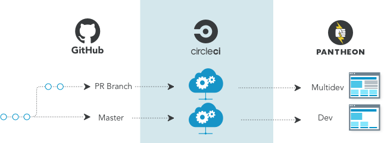

[<dfn id="composer">Composer</dfn>](https://getcomposer.org/doc/01-basic-usage.md) is a PHP dependency manager that provides an alternative, more modern way to manage the external code used by a WordPress or Drupal site.

At its primary level, Composer needs:

- A list of dependencies
- A place to put the dependencies

Understanding how Composer can be used independent of Drupal or WordPress is a good place to learn more about the general concepts. For a summary of basic usage, see [Composer's own documentation](https://getcomposer.org/doc/01-basic-usage.md).

<Enablement title="Automation Training" link="https://pantheon.io/learn-pantheon?docs" campaign="docs-webops">

Learn Composer concepts with help from our experts. Pantheon delivers on-demand training to help development teams navigate the platform and improve internal WebOps.

</Enablement>

## Dependencies

Composer encourages a mental model where code not written specifically for a given project is a dependency. Only files unique to the project are tracked as part of the project's main source repository, also referred to as the canonical site repository. Dependencies for WordPress and Drupal include core, plugins, contrib modules, themes, and libraries. A single dependency, such as a theme, is referred to as a package.

Composer looks within [The PHP Package Repository](https://packagist.org/) for dependencies to install, which does not include Drupal or WordPress packages by default. Additional repositories must be configured for Composer to use packages not found in the default repository. Each framework provides it's own respective package repository so dependencies can be managed with Composer:

- WordPress: <https://wpackagist.org>
- Drupal 8: <https://packages.drupal.org/8>
- Drupal 7: <https://packages.drupal.org/7>

## Managing Core as a Project Dependency

Sites managed with Composer should use the nested docroot feature, which allows core to be installed within the `web` subdirectory instead of the default root directory of the site's codebase. A nested docroot is the simplest path towards reliable core updates in a Composer workflow.

This is possible on Pantheon by specifying `web_docroot: true` in `pantheon.yml` file. For details, see [Serving Sites from the Web Subdirectory](/nested-docroot).

## Pull Request Workflow

In this WebOps workflow, a [Multidev](/multidev) environment is created on Pantheon for each pull request branch on GitHub. Work in these environments can also be committed back to the same branch for review on GitHub. When a pull request is merged into the default branch on GitHub, the result is deployed to the Dev environment on Pantheon:

### Scaling Considerations

We recommend the Pull Request workflow for single site use cases, and for most use cases involving larger site portfolios such as EDUs. You can create a "template" repository based off Pantheon's example repositories and customize it to your liking, then use the template to create new sites.

However, this method does not support One-click updates in the Site Dashboard. Adopting this WebOps workflow means forgoing all other update techniques in favor of Composer. If your use case requires a simpler update strategy for non-technical site admins, this workflow could present problems scaling or at the very least require additional training for your development team.

## Custom Upstream Workflow

It is possible to preserve the functionality of Pantheon's One-click updates in the Site Dashboard for Composer managed sites created from a [Custom Upstream](/custom-upstream), however its use case is quite narrow.

A Custom Upstream based off Pantheon's example repositories would need to commit all dependencies. Updates via Composer would only happen at the Custom Upstream repository level by a single repository maintainer. Those updates would then trickle down to sites created from the Custom Upstream as One-click updates in the Pantheon Site Dashboard.

This workflow has one very serious shortcoming, that is site-specific dependencies are likely to cause a lot of conflicts. The practical use case for this WebOps workflow is for a large group of sites that require a single set of dependencies. You should only use this method if you don’t intend to use site specific themes, modules, or plugins downstream.

You can also prevent upstream updates by [setting an empty upstream](/guides/composer-convert/#change-upstreams). This action is available to Site Owner, Organization Administrator, and Users in Charge roles.

## Next Steps

Follow the [Build Tools Guide](/guides/build-tools) to learn best practices for Composer on Pantheon, or [Drupal 8 and Composer on Pantheon Without Continuous Integration](/guides/drupal-8-composer-no-ci) if you don't want to use CI tools in your development process.

If you already have a Drupal 8 site that you need to convert to a Composer-managed workflow, check out [Convert a Standard Drupal 8 Site to a Composer Managed Site](/guides/composer-convert).

### Partial Adoption

If you're not ready to go all in with a Composer workflow and you want to see how it works on a smaller scale, follow the [Manage Some Dependencies with Composer](/guides/partial-composer) guide to get started.

<Partial file="notes/partial-composer-adoption-warning.md" />

## See Also

- [Convert a Standard Drupal 8 Site to a Composer Managed Site](/guides/composer-convert)
