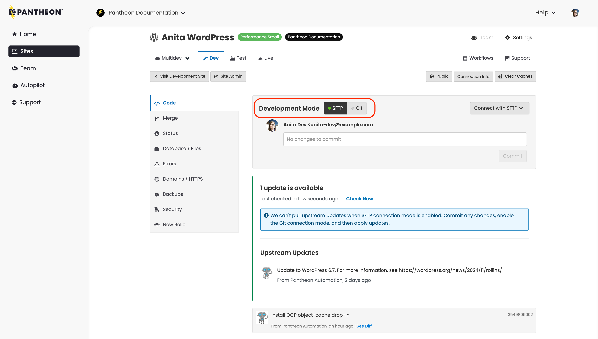

On Pantheon, you can connect and work via [Git](/guides/git/git-config), or you can connect and work via [SFTP](/guides/sftp). Dev is the only environment on Pantheon where you can add or change code, so it’s the only place you can access and change your Connection Mode.

<Alert title="Note" type="info" >

It’s common to switch between SFTP and Git Connection Mode, depending on the task. For example, WordPress and Drupal Core updates are managed by Pantheon, and they must be applied in Git Connection Mode. Plugin and module updates made in the UI must be applied in SFTP Connection Mode.

</Alert>

To manage connection modes:

- [Go to the Site Dashboard](/guides/account-mgmt/workspace-sites-teams/sites#site-dashboard), select the <Icon icon="wrench" text="Dev"/> tab, and then select <Icon icon="code" text="Code"/>.

## Git Connection Mode

You can develop locally with Git Connection Mode. Git is the version control tool at the heart of the Pantheon workflow. If you're a developer who prefers local development, it's an efficient way to interact with our platform: develop locally, commit, and push code to your Dev environment.

For more information, refer to [Local Development](/guides/local-development) and [Git on Pantheon](/guides/git).

## SFTP Connection Mode

You can develop directly on our servers with SFTP Connection Mode. It’s particularly useful for updating and adding plugins/modules directly from within your site.

Code changes made in SFTP Connection Mode are still committed into a Git repository. This makes working with other developers easy and ensures _all_ changes are tracked in version control. Whether you’re a novice or seasoned developer, our SFTP Connection Mode is handy and safe to use.

For more information, refer to [SFTP on Pantheon](/guides/sftp).

## More Resources

- [Local Development](/guides/local-development)
- [Git on Pantheon](/guides/git)
- [SFTP on Pantheon](/guides/sftp)
