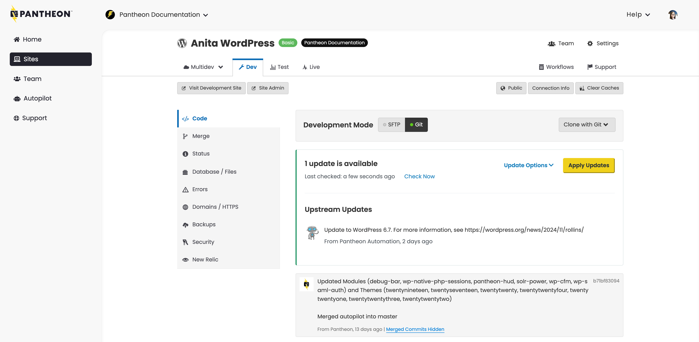
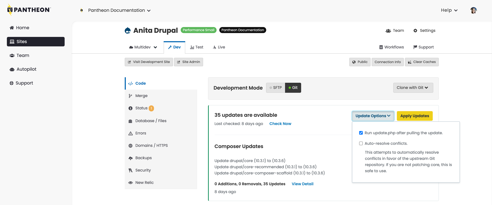
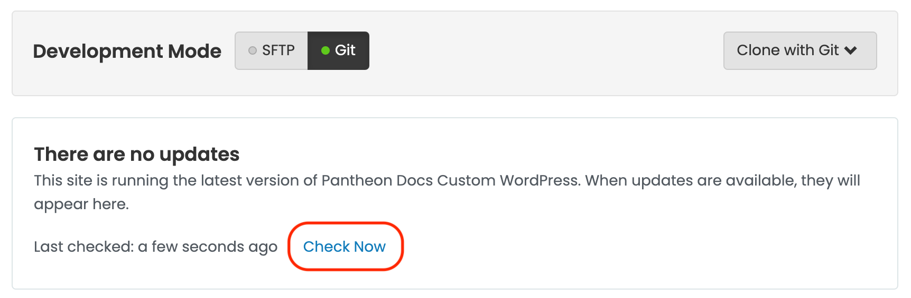

This doc includes instructions to make core updates to WordPress and Drupal sites hosted on the Pantheon WebOps platform.

## Drupal (Latest Version)

The [latest version of Drupal](/drupal-migration) automatically includes [Integrated Composer](/guides/integrated-composer). Integrated Composer allows you to use one-click core updates through the Dashboard. Site maintainers can combine these one-click updates with Pantheon's [Autopilot](/guides/autopilot) service to automate site module updates.

## Drupal 8 Composer-Managed Sites

As of Drupal 8.8, you are required to use Composer to manage your dependencies if you want to use all contributed modules. Composer-managed sites are not compatible with Pantheon's One-click updates. However, you can easily meet Drupal's Composer requirement and be compatible with Pantheon's platform by using [Integrated Composer](/guides/integrated-composer). You must do **one** of the following to be compatible with Pantheon's One-click updates and Drupal Composer requirements:

- [Convert the site to Integrated Composer](/guides/composer-convert).

- Update core to use Composer exclusively. Refer to [Build Tools](/guides/build-tools/update) for instructions.

- [Update to the latest version of Drupal](/drupal-migration) which has [Integrated Composer](/guides/integrated-composer) built-in.

## Check for Drupal Updates

1. [Go to the Site Dashboard](/guides/account-mgmt/workspace-sites-teams/sites#site-dashboard) and select **Dev**.

1. Click **Code**, then click **Check Now**, and then click **Apply Updates** if updates are available.

## Non-Composer-Managed WordPress and Drupal Sites

Pantheon maintains core upstream repositories for [WordPress](https://github.com/pantheon-systems/wordpress) and [Drupal](https://github.com/pantheon-systems/drops-7) which act as a parent repository to site repositories. Updates made by Pantheon in the core upstream repository, in addition to [updates made by maintainers of Custom Upstreams](/guides/custom-upstream/maintain-custom-upstream), become available downstream as a one-click update.

You can apply one-click updates to individual site repositories through:

- Site Dashboard on Pantheon
- [Terminus](/terminus), or manually from the command line. Do not update core using the WordPress Dashboard, Drush, or WP-CLI; you will overwrite your core. For additional details, see [Scope of Support](/guides/support).

## Apply Upstream Updates via the Site Dashboard

1. Navigate to the **Code** tab in the Site Dashboard on the Dev environment, then click **Apply Updates**.

  

1. Commit and deploy any SFTP changes, then set the site's **Connection Mode** to **Git**.

    - You can't apply upstream updates when the Connection Mode is set to SFTP.

1. Select whether or not you want to automatically resolve conflicts in the **Update Options** menu. Drupal users can opt to run `update.php` after updates are applied:

    

  <Alert title="Note"  type="info" >

  Some merge conflicts can't be resolved automatically. This can happen when files are removed or renamed. These files must be manually resolved. Refer to [Resolve Git Merge Conflicts](/guides/git/resolve-merge-conflicts) for more information.

  </Alert>

1. Click **Apply Updates**.

1. Click **Visit Development Site** in the **Dev** environment to test and QA the site.

1. Follow the standard [Pantheon Workflow](/pantheon-workflow/#combine-code-from-dev-and-content-from-live-in-test) to deploy changes up to the Test and Live environments.

### Auto-Resolve Conflicts

You may see an error indicating a conflict with some files in core if the update fails. Try the "Auto-Resolve" option when applying updates. Pantheon will try to automatically resolve conflicts in favor of the upstream Git repository. This does not solve all problems that may arise, but it should take care of most situations.

Some merge conflicts can't be resolved automatically. This can happen when files are removed or renamed. These files must be manually resolved. Refer to [Resolve Git Merge Conflicts](/guides/git/resolve-merge-conflicts) for more information.

## Apply Upstream Updates via Terminus

You can apply updates with [Terminus](/terminus) if you prefer using the command line.

### Update a Specific Site

1. Open Terminus and navigate to your site directory.

1. Run the code below, replacing `site` and `env` with your site name and the correct environment. Learn more about this command by running `terminus help upstream:updates:apply`.

```bash{promptUser: user}
terminus upstream:updates:apply site.env --updatedb
```

### Update Multiple Sites

The Terminus Mass Update Plugin can apply core updates to multiple sites at the same time:

```bash{promptUser: user}
terminus site:mass-update:apply
```

Refer to the [Terminus Mass Update Plugin](https://github.com/pantheon-systems/terminus-mass-update) page in GitHub for more information.

## Apply Upstream Updates Manually from the Command Line to Resolve Merge Conflicts

It's possible there are conflicts with your codebase in the update if the automated core update doesn't work as expected. You can resolve this by overwriting your CMS core with the upstream, or through manual [merge conflict resolution](/guides/git/resolve-merge-conflicts).

### Overwrite Core

The fastest resolution is often the `-Xtheirs` flag if you receive an error that you have conflicts while updating core. This will attempt to automatically resolve the conflicts with a preference for upstream changes, and is safe to run if you don't have your own changes in any of the conflicting files (for example, problems with `.gitignore` or `.htaccess`).

<Alert title="Warning" type="danger">

This process can potentially cause loss of data. Be sure you have no custom code in your CMS core before proceeding.

</Alert>

<TabList>

<Tab title="Drupal (Latest Version)" id="d9" active={true}>

1. Run the code below:

  ```bash{promptUser: user}
  git pull -Xtheirs https://github.com/pantheon-upstreams/drupal-composer-managed main
  # resolve conflicts
  git push origin master
  ```

1. Double-check the files before going forward to make sure no bugs were introduced.

1. Refer to [this troubleshooting section](#one-click-updates-do-not-appear-after-rewriting-git-history) to reset your Git repository if this procedure fails with the message `Already up to date.`

</Tab>

<Tab title="Drupal 7" id="d7">

1. Run the code below:

  ```bash{promptUser: user}
  git pull -Xtheirs https://github.com/pantheon-systems/drops-7.git master
  # resolve conflicts
  git push origin master
  ```

1. Double-check the files before going forward to make sure no bugs were introduced.

1. Refer to [this troubleshooting section](#one-click-updates-do-not-appear-after-rewriting-git-history) to reset your Git repository if this procedure fails with the message `Already up to date.`

</Tab>

<Tab title="WordPress" id="wp">

1. Run the code below:

  ```bash{promptUser: user}
  git pull -Xtheirs https://github.com/pantheon-systems/WordPress.git master
  # resolve conflicts
  git push origin master
  ```

1. Double-check the files before going forward to make sure no bugs were introduced.

1. Refer to [this troubleshooting section](#one-click-updates-do-not-appear-after-rewriting-git-history) to reset your Git repository if this procedure fails with the message `Already up to date.`

</Tab>

</TabList>

#### Overwrite WordPress Core Via SFTP

You can use [SFTP](/guides/sftp) to overwrite core files if you can't use Git.

1. Confirm that the **Development Mode** is set to **SFTP**.

1. Delete the files and folders below. ** Do NOT delete the `wp-config.php`file**.

    ```none
      ├── README.md
      ├── index.php
      ├── license.txt
      ├── readme.html
      ├── wp-activate.php
      ├── wp-blog-header.php
      ├── wp-comments-post.php
      ├── wp-config-sample.php
      ├── wp-cron.php
      ├── wp-links-opml.php
      ├── wp-load.php
      ├── wp-login.php
      ├── wp-mail.php
      ├── wp-settings.php
      ├── wp-signup.php
      ├── wp-trackback.php
      ├── xmlrpc.php
      ├── wp-admin
      ├── wp-includes
      ├── wp-content
          └── index.php
          └── mu-plugins
              └── pantheon.php
      ```

1. Re-upload the corresponding files from [GitHub](https://github.com/pantheon-systems/WordPress).

1. Commit your changes.

1. Set your **Development Mode** to **Git**.

1. Apply one-click core updates via the dashboard with the auto-resolve conflicts option selected. The update warning should disappear after a successful update.

### Merge Conflict Resolution

This process lets you manually resolve the conflict using the command line and a text editor.

1. Navigate to a [local clone of your site repository](/guides/git/git-config#clone-your-site-codebase) using the command line, then add the applicable upstream as a [remote](https://git-scm.com/docs/git-remote) if you haven't done so already:

  <TabList>

  <Tab title="Drupal (Latest Version)" id="d9-1conflict" active={true}>

  ```bash{promptUser: user}
  git remote add pantheon-drupal https://github.com/pantheon-upstreams/drupal-composer-managed
  ```

  </Tab>

  <Tab title="Drupal 7" id="d7-1conflict">

  ```bash{promptUser: user}
  git remote add pantheon-drops-7 https://github.com/pantheon-systems/drops-7.git
  ```

  </Tab>

  <Tab title="WordPress" id="wp-1conflict">

  ```bash{promptUser: user}
  git remote add pantheon-wordpress https://github.com/pantheon-systems/WordPress.git
  ```

  </Tab>

  <Tab title="Custom Upstream" id="custom-1conflict">

  Replace the remote name (`custom-upstream-example`) and repository URL (`https://github.com/example-org/custom-upsream-example.git`) with values specific to your existing Custom Upstream:

  ```bash{promptUser: user}
  git remote add  custom-upstream-example https://github.com/example-org/custom-upsream-example.git
  ```

  </Tab>

  </TabList>

1. Pull down changes from the appropriate upstream:

  <TabList>

  <Tab title="Drupal (Latest Version)" id="d9-2conflict" active={true}>

  ```bash{promptUser: user}
  git fetch pantheon-drupal
  git rebase pantheon-drupal/master
  ```

  </Tab>

  <Tab title="Drupal 7" id="d7-2conflict">

  ```bash{promptUser: user}
  git fetch pantheon-drops-7
  git rebase pantheon-drops-7/master
  ```

  </Tab>

  <Tab title="WordPress" id="wp-2conflict">

  ```bash{promptUser: user}
  git fetch pantheon-wordpress
  git rebase pantheon-wordpress/master
  ```

  </Tab>

  <Tab title="Custom Upstream" id="custom-2conflict">

  Replace the remote name (`custom-upstream-example`):

  ```bash{promptUser: user}
  git fetch custom-upstream-example
  git rebase custom-upstream-example/master
  ```

  </Tab>

  </TabList>

1. Use the output provided to resolve any conflicts introduced. For example:

  ```bash{outputLines: 2-15}
  git rebase pantheon-wordpress/master
  First, rewinding head to replay your work on top of it...
  Applying: Adjust rendering of version release notes
  Using index info to reconstruct a base tree...
  M	wp-admin/about.php
  Falling back to patching base and 3-way merge...
  Auto-merging wp-admin/about.php
  CONFLICT (content): Merge conflict in wp-admin/about.php //highlight-line
  error: Failed to merge in the changes.
  Patch failed at 0001 Adjust rendering of version release notes
  The copy of the patch that failed is found in: .git/rebase-apply/patch

  When you have resolved this problem, run "git rebase --continue".
  If you prefer to skip this patch, run "git rebase --skip" instead.
  To check out the original branch and stop rebasing, run "git rebase --abort".
  ```

  In this example, you would:

    1. Open `wp-admin/about.php` in your preferred text editor.

    1. Look for the conflict markers starting with `<<<<<<< HEAD` and manually edit the file to merge changes between Pantheon's upstream (shown first between `<<<<<<< HEAD` and `=======`) and changes made downstream in the Custom Upstream repository (shown second between `=======` and `>>>>>>> Adjust rendering of version release notes`).

    1. Delete the conflict markers and double-check the changes.

    1. Run `git status` to see conflicting files in the current index again. Resolve the conflicts and then add them to your index and continue pulling in updates:

    ```bash{promptUser: user}
    git add .
    git rebase --continue
    ```

    1. Push updates to the site Dashboard on Pantheon:

      ```bash{promptUser: user}
      git push origin master
      ```

## Core Release Updates

Updates are available within 72 hours of upstream availability whenever a new WordPress or Drupal core is released. Security related updates are made available within 24 hours.

## Suppress WordPress Admin Notice

WordPress admin checks for new upstream updates by default, instead of the default WordPress update nag. You can disable this by setting the `DISABLE_PANTHEON_UPDATE_NOTICES` constant to `true` in your `wp-config.php` file. This only disables the text and notice in the WordPress admin; you will still see upstream updates in the Pantheon dashboard.

```php:title=wp-config.php
define( 'DISABLE_PANTHEON_UPDATE_NOTICES', true );
```

## Troubleshooting

### One-Click Updates Do Not Appear After Rewriting Git History

Squashing and rewriting history may cause one-click updates to break. This means updates will no longer appear on your Site Dashboard when available. Instead of using squash and rebase to clean up commits from merges occurring upstream, we recommend reviewing history locally with `git log --first-parent`. This provides the same history shown on the Site Dashboard and prevents conflicts with our one-click updates.

If you are in a situation where you've altered the commit history in such a way that the dashboard is no longer able to determine if your site is up to date with the upstream, the simplest course of corrective action is to use `git reset --hard` to reset the site repository to the last known good commit before the squash/rebase/revert was applied. This *will* result in losing *all* changes that have happened since this commit. You will need to re-apply all custom/contributed code updates that occurred in the interim, so make sure to take stock of these changes first and develop a plan to reapply them with the fixed Git history.

### One-Click Update Not Appearing for Sites Using a Custom Upstream

Core updates for Custom Upstreams are initiated by the repository maintainer, not Pantheon. Please report issues directly to the project maintainer for expected updates.

It's important to relay the need for updating core to maintainers, even if you plan on manually pulling in core version updates. First, file an issue in the queue of your repository and reach out to a maintainer. Even better - submit a pull request for the update.

After you have communicated the issue, you can [manually apply updates from the command line](#apply-upstream-updates-manually-from-the-command-line-to-resolve-merge-conflicts).

### Custom Upstream Updates Not Available

If you know your site's Custom Upstream has updated code, but it's not visible on your Site Dashboard, click **Check now**:



This will trigger a "Code Cache Clear" to verify that the Site Dashboard has fetched the most recent commit. Please note that even after the workflow completes, it may take up to a minute before updates appear on the dashboard.

If updates are still not showing on the site, it may be necessary to re-set the site's upstream via [Terminus](/terminus/examples/#switch-upstreams).

### 503 Errors When Running Update.php and Installing Modules

There are multiple reasons that 503 errors might occur when updating:

- PHP segfault: These are tricky to troubleshoot because very little debugging information is present. A temporary fix is available. Contact Pantheon Customer Support if you think you have been affected.

- Timeouts are another cause of 503 errors, though they are much less likely to occur if you are using the Pantheon domains. If the operation takes more than 60 seconds, you might see a timeout occur.

### Error updating: CONFLICT (modify/delete): pantheon.upstream.yml deleted in HEAD and modified in upstream/master. Version upstream/master of pantheon.upstream.yml left in tree

This issue happens when you attempt to update very outdated core files from the Dashboard. Perform the following to resolve:

1. Modify `.gitignore` and add a `#` at the beginning of the `pantheon.upstream.yml` line to comment it out

1. Set the Site Connection Mode to SFTP

1. Reupload the `pantheon.upstream.yml` file if missing:
   * [Drupal (Latest Version)](https://github.com/pantheon-upstreams/drupal-composer-managed/blob/main/pantheon.upstream.yml)
   * [Drupal 7](https://github.com/pantheon-systems/drops-7/blob/default/pantheon.upstream.yml)
   * [WordPress](https://github.com/pantheon-systems/WordPress/blob/default/pantheon.upstream.yml)

1. Return to the Commit in dashboard, and note that `pantheon.upstream.yml` can now be committed

1. Set the Site Connection Mode to Git and reapply updates

1. Modify `.gitignore` and remove the `#` before the `pantheon.upstream.yml` line to instruct Git to ignore the file again

### Unable to Update Older Drupal Versions Using One-click Update

Older Drupal versions (for example, 7.68) can have a significant version gap that causes the workflow to fail.

Sample error:

`Requested database version 10.4 is not compatible with your framework and version: Drupal 7.67`

**Solution**

You must update the core versions from the upstream version. However, older versions of the site may not be able to update from the upstream version directly. The safest method is to update your sites one by one. Follow the steps below to complete this process.

1. Clone the repository locally.

1. Pull one version increment at a time to be safe. Normally, you can pull up to the latest version, but this can have larger conflicts due to version differences.

  ```bash{promptUser: user}
  git pull -Xtheirs https://github.com/pantheon-systems/drops-7.git 7.69
  ```

  You can also try updating starting at Drupal v7.84:

  ```bash{promptUser: user}
  git pull -Xtheirs https://github.com/pantheon-systems/drops-7.git 7.84
  ```

1. Fix any conflicts.

1. Commit and push to the Pantheon repository.

1. Run database updates to the Dev environment:

  ```bash{promptUser: user}
  terminus drush <site>.dev updb
  ```

1. Deploy to Test and Live, and then run the database for each environment.

1. Increment the version of the upstream and repeat step two. Repeat these steps until you reach the latest version of the site.

- More Resources

- [Git on Pantheon Guide](/guides/git)
- [SFTP on Pantheon](/guides/sftp)
- [Custom Upstreams](/guides/custom-upstream)
