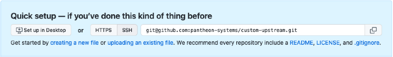

Pantheon Custom Upstreams are a self-serve feature available to anyone with access to the Organization Dashboard of an eligible plan. Once an Organization Administrator creates a Custom Upstream, members of the organization will be able to create new sites from a set common codebase. For an overview of this feature, see [Introduction to Custom Upstreams](/custom-upstream). In order to use a specific Custom Upstream on multiple Organizations, the upstream must be created within each Organization’s Dashboard.

<Alert title="Note" type="info">

Be aware that support for Custom Upstreams is limited to verification that the externally hosted upstream repository is connected properly to the platform. For details, see [Get Support](/support/#custom-upstreams).

</Alert>

## Create and Host the Repository Remotely

This remote repository serves as the central location for the development and maintenance of your Custom Upstream. Changes are tracked here and distributed downstream to sites within your Organization as one-click updates in the Site Dashboard.

Choose your preferred Git host:

<TabList>

<Tab title="GitHub" id="gh" active={true}>

1. [Sign up for a GitHub account](https://github.com/join) if you do not have one already.

1. [Log in to GitHub](https://github.com/login/).

1. If this is your first time logging in to GitHub, click [**Start Project**](https://github.com/new). Otherwise, click [**New**](https://github.com/new) from the Repositories sidebar on the left.

1. Name the repository.

1. Select whether the repository will be private or if it can be publicly accessible from outside your organization.

   **Do not** select the options to create a `README`, `.gitignore`, or license file:

   

  <Alert type="info" title="Note">

  As of October 1st, 2020, all new repositories on GitHub are initialized with the default branch name `main`. Pantheon currently defaults to using the `master` branch name for custom upstreams.

  By not initializing the repo on GitHub, it will be constructed when you clone the repository locally, using Git's default branch of `master`.

  </Alert>

1. Click **Create Repository**.

1. Copy the repository URL (HTTPS), found in the Quick setup section:

  

1. Clone the repository to your local from the command line (replace the URL):

  ```bash{promptUser: user}
  git clone https://github.com/pantheondocs/agency-custom-upstream.git
  ```

1. Navigate to the repository's root directory:

  ```bash{promptUser: user}
  cd agency-custom-upstream
  ```

</Tab>

<Tab title="Bitbucket" id="bb">

1. [Sign up for a Bitbucket account](https://bitbucket.org/account/signup/) if you do not have one already.

1. [Log in to Bitbucket](https://bitbucket.org/account/signin/) and navigate to [**Repositories**](https://bitbucket.org/dashboard/repositories).

1. Click [**Create a Repository**](https://bitbucket.org/repo/create).

1. Name the repository.

1. Select whether the repository will be private or if it can be publicly accessible from outside your organization.

1. Click **Create Repository**.

1. Copy the repository URL (HTTPS), found on the top right of the page:

  

1. Clone the repository to your local from the command line (replace the URL):

  ```bash{promptUser: user}
  git clone https://pantheondocs@bitbucket.org/pantheondocs/agency-custom-upstream.git
  ```

1. Navigate to the repository's root directory:

  ```bash{promptUser: user}
  cd agency-custom-upstream
  ```

</Tab>

<Tab title="GitLab" id="gitlab">

You can [sign up](https://gitlab.com/users/sign_in) for a GitLab.com account, or use a self-managed GitLab installation.

1. From your GitLab dashboard click **New project**.

1. Provide a **Project name**, **Project description** (optional), and **Visibility Level**, then click **Create project**.

1. Copy the repository URL (HTTPS), and clone the site locally:

    ```bash{promptUser: user}
    git clone https://gitlab.com/pantheondocs/agency-custom-upstream.git
    ```

1. `cd` into the project directory:

    ```bash{promptUser: user}
    cd agency-custom-upstream
    ```

</Tab>

</TabList>

## Pull in Core from Pantheon's Upstream

To avoid incompatibilities, you must track Pantheon's corresponding upstream repository within the Custom Upstream.

1. Navigate to the Custom Upstream's root directory using the command line, then add the appropriate Pantheon upstream as a [remote](https://git-scm.com/docs/git-remote):

    <TabList>

    <Tab title="WordPress" id="wp1" active={true}>

    ```bash{promptUser: user}
    git remote add pantheon-wordpress git://github.com/pantheon-systems/WordPress.git
    ```

    </Tab>

    <Tab title="Drupal 8" id="d81">

    ```bash{promptUser: user}
    git remote add pantheon-drops-8 git://github.com/pantheon-systems/drops-8.git
    ```

    </Tab>

    <Tab title=" Drupal 7" id="d71">

    ```bash{promptUser: user}
    git remote add pantheon-drops-7 git://github.com/pantheon-systems/drops-7.git
    ```

    </Tab>

    </TabList>

1. Now that the Custom Upstream repository is tracking the corresponding Pantheon core upstream, we can pull in core:

    <TabList>

    <Tab title="WordPress" id="wp1" active={true}>

    ```bash{promptUser: user}
    git checkout master
    git fetch pantheon-wordpress
    git merge pantheon-wordpress/master
    git push origin master
    ```

    </Tab>

    <Tab title="Drupal 8" id="d81">

    ```bash{promptUser: user}
    git checkout master
    git fetch pantheon-drops-8
    git merge pantheon-drops-8/master
    git push origin master
    ```

    </Tab>

    <Tab title=" Drupal 7" id="d71">

    ```bash{promptUser: user}
    git checkout master
    git fetch pantheon-drops-7
    git merge pantheon-drops-7/master
    git push origin master
    ```

    </Tab>

    </TabList>

## Connect Repository to Pantheon

<TabList>

<Tab title="GitHub" id="gh-auth" active={true}>

1. Navigate to the **[<span class="glyphicons glyphicons-group"></span> Organizations](https://dashboard.pantheon.io/#organizations)** tab within the Pantheon Dashboard and select your organization:

  

1. Select the **<span class="upstreams-regular"></span> Upstreams** tab.
1. Click the **<span class="glyphicons glyphicons-plus"></span> Add New Upstream** button. You must be an Organization Administrator to add a new upstream.
1. Enter the following information about the Custom Upstream:

   * **Name**
   * **Upstream Repository URL**:

    

     * **Authenticate (private repositories only)**: If you provided the URL to a private repository, a new field will appear:

     

     For privately hosted repositories, create a dedicated user with repository access. If your repository is publicly accessible, you can skip this step.

       1. Go to GitHub to [generate a personal access token](https://github.com/settings/tokens).
       1. Click **Generate new token**.
       1. Confirm your password if prompted.
       1. Enter a token description, such as "pantheon read my Custom Upstream"
       1. Select "repo" as the scope:

           

       1. Click **Generate token** and copy the new token to your clipboard.
       1. Return to the Pantheon Organization Dashboard, where you are creating the Custom Upstream.
       1. Paste your new GitHub access token.

   * **Framework**: Drupal 7, Drupal 8, or WordPress
   * **Description**: (Optional) Less than 200 characters, plain text and markdown supported

1. Click **Create**.

</Tab>

<Tab title="Bitbucket" id="bb-auth">

1. Navigate to the **[<span class="glyphicons glyphicons-group"></span> Organizations](https://dashboard.pantheon.io/#organizations)** tab within the Pantheon Dashboard and select your organization:

  

1. Select the **<span class="upstreams-regular"></span> Upstreams** tab.
1. Click the **<span class="glyphicons glyphicons-plus"></span> Add New Upstream** button. You must be an administrator of the organization to add a new upstream.
1. Enter the following information about the Custom Upstream:

    * **Name**
    * **Upstream Repository URL**:

       

    * **Authenticate (private repositories only)**: If you provided the URL to a private repository, a new field will appear:

      

      For privately hosted repositories, create a dedicated user with repository access. If your repository is publicly accessible, you can skip this step.

        1. Go to Bitbucket to generate an [app password](https://bitbucket.org/account/admin/app-passwords).
        1. Click **Create app password**.
        1. Enter a label and select the `"Repositories:Read"` permission:

          

        1. Click **Create** and copy the new password.
        1. Return to the Pantheon Organization Dashboard, where you are creating the Custom Upstream.
        1. The username field should already be populated, based on the repository URL. Paste your new Bitbucket app password.

    * **Framework**: Drupal 7, Drupal 8, or WordPress
    * **Description**: (Optional) Less than 200 characters, plain text and markdown supported

1. Click **Create**.

</Tab>

<Tab title="GitLab" id="gitlab-auth">

  Custom Upstreams from GitLab repositories must be created for you by Pantheon Support.

  1. Prepare a new GitLab user specifically for Pantheon access.

  1. From this new account, [generate an Access Token](https://gitlab.com/profile/personal_access_tokens) with the `API` scope:

      

  1. From the GitLab account that maintains the repository, add the new user to the repo under **Members** with **Reporter** access.

      

  1. [Contact support](/support) to add the Custom Upstream to your org. You must provide:

     - A name for the custom upstream
     - The `https` clone URL (ending in `.git`)
     - The Access Token for the new user.

</Tab>

</TabList>

## Edit Existing Custom Upstream Settings

If you would like to change the name or description of your Custom Upstream:

1. Navigate to the **[<span class="glyphicons glyphicons-group"></span> Organizations](https://dashboard.pantheon.io/#organizations")** tab within the Pantheon Dashboard and select your organization.
1. Select the **<span class="upstreams-regular"></span> Upstreams** tab.
1. Click **Settings** next to the existing upstream requiring an update.
1. Make desired changes, then click **Update**.

### Initial Connection Mode

The default connection mode for new sites created from a Custom Upstream is Git for WordPress and Drupal 7. Drupal 8 defaults to the SFTP connection mode.

Configure this setting after connecting your Custom Upstream to Pantheon if new sites need to use an initial connection mode other than the default:

1. Navigate to the **[<span class="glyphicons glyphicons-group"></span> Organizations](https://dashboard.pantheon.io/#organizations" )** tab within the Pantheon Dashboard and select your organization.
1. Select the **<span class="upstreams-regular"></span> Upstreams** tab.
1. Click **Settings** next to the existing upstream requiring an update.
1. Select the desired connection mode, then click **Update**:

  

New sites created from this Custom Upstream will use this connection mode by default going forward.

### Repository URL and password

You cannot modify the repository details on existing Custom Upstreams. If there is a new URL or password you need to use, we recommend creating a new Custom Upstream and switching each site to the new upstream individually with [Terminus](/terminus):

```bash{promptUser: user}
terminus site:upstream:set my-site "My New Custom Upstream"
```

You must be a site owner to switch a site's upstream. After a site's upstream has been changed, you will need to merge changes as a one-click update. For details, see [Example Usage](/terminus/examples/#switch-upstreams).

Once all sites have been updated to track the new Custom Upstream, you can safely delete the old one:

1. Navigate to the **[<span class="glyphicons glyphicons-group"></span> Organizations](https://dashboard.pantheon.io/#organizations" )** tab within the Pantheon Dashboard and select your organization.
1. Select the **<span class="upstreams-regular"></span> Upstreams** tab.
1. Click **Settings** next to the existing upstream, then click **Delete**.

## Switch an Existing Site to a Custom Upstream

<Alert title="Warning" type="danger">

Switching the upstream of an existing site is risky. Consider creating a new site from your Custom Upstream and migrating the contents. If you must switch upstreams, [back up](/backups) your site first, and consider our documentation on [upstream merge conflicts](/core-updates/#apply-upstream-updates-manually-from-the-command-line-to-resolve-merge-conflicts).

</Alert>

Only a Site Owner, User in Charge, or Organization Administrator can change an existing site to use a new Custom Upstream using [Terminus](/terminus):

```bash{promptUser: user}
terminus site:upstream:set $site $upstream_id
```

In the example above, set or replace the variables `$site` and `$upstream_id` with your site name and upstream machine name, respectively. You can find your Custom Upstream's machine name using `terminus org:upstream:list $org`, where `$org` is your organization name.

## Next Steps

- [Best Practices for Maintaining Custom Upstreams](/maintain-custom-upstream)
- [Switching an Existing site to a Custom Upstream with Terminus](/terminus/examples/#switch-upstreams)
