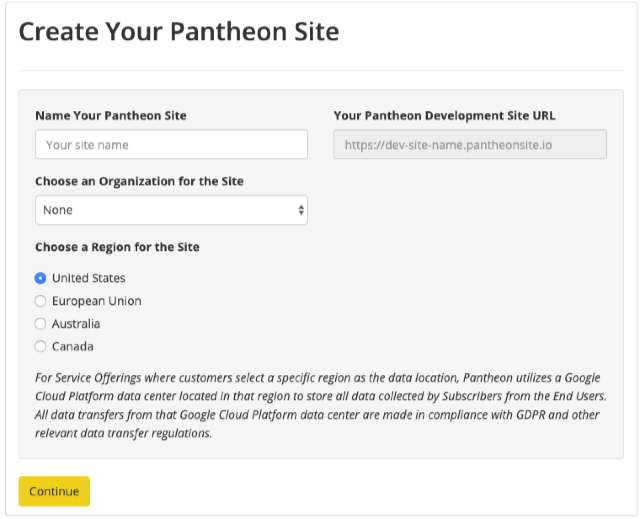
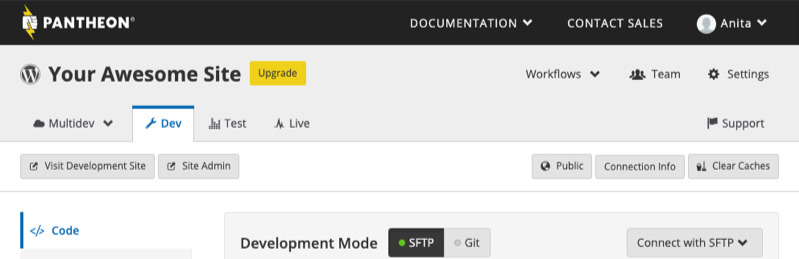

The Pantheon Dashboard provides a quick "click to install" method of creating new sites. In less than five minutes, you'll have a new site up and running on the platform.

## Create a Site

1. From your User or Organization's Dashboard, click **Create New Site** to be brought to the **Create Your Pantheon Site** page:

  

1. Name the site.

  <Alert title="Note" type="info">

  The site name will be prefixed to all [Platform URLs](/domains/#platform-domains), which are automatically configured as subdomains of `pantheonsite.io`.

  This name cannot be changed once set.

  </Alert>

1. Optionally, if you have access to [organizations](/organization-dashboard/#new-sites), choose an organization to affiliate the site with.
1. Choose a [Region](/regions) for the Site.
1. Click **Continue** and wait a few moments for the Site to be created:

1. On the **Choose Your CMS** page, click **Deploy** to install WordPress, Drupal 9, Drupal 8, or Drupal 7. See [Choosing Your Start State](/start-state) for more information.

   Wait while the platform provisions the site with the start state you selected.

1. Click **Visit your Pantheon Site Dashboard** to transfer to the [Site Dashboard](/guides/quickstart/site-dashboard/).
1. Click **Visit Development Site** and complete the installation process for the selected framework.

  

## Sandbox Sites

Sandbox sites are useful for trying out the Pantheon platform, creating sandboxes for development, or for starting a new client project. A Sandbox has the equivalent resources of a Performance Small site. We allocate two Sandbox sites for all user accounts. If you've reached your limit of Sandbox sites, delete an unused site, take a site live or join an organization. If you're building sites for third parties, join the [Pantheon Partner Program](https://pantheon.io/plans/partner-program?docs) for more sandbox sites, Multidev environments, and other features. If you're at an educational institution, sign up for [Pantheon for EDU](https://pantheon.io/edu?docs).

## Your Pantheon Account

Your account is your own individual account, and every account can manage multiple projects or sites at a time. Pantheon doesn't recommend sharing your account with other people. If you're collaborating on a project or handing over ownership to a client, use our [team management](/team-management) and [ownership transfer](/site-owner-faq/#billing-tasks) tools.

## Frequently Asked Questions (FAQs)

### Can I rename my Pantheon site after creation?

No. Site names and Platform URLs are permanent and cannot be changed. As a workaround, you can export your existing site and import it to a new site with the correct name. See [Migrate Sites to Pantheon FAQs](/migrate/#how-do-i-clone-an-existing-pantheon-site).

### What if my site name is already taken?

Site names must be unique across all Pantheon sites, including [frozen](/platform-considerations/#inactive-site-freezing) sites. Choose another site name, and remember that the name you choose in the Pantheon Dashboard is only visible to the public in your [platform domain](/domains/#platform-domains).

## Next Steps

 - [Developing Directly with SFTP](/sftp)
 - [Starting with Git](/git)
