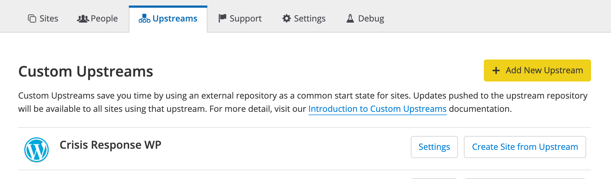

## Overview

The **Pantheon Crisis Response WordPress Upstream** is a specialized WordPress [custom upstream](/custom-upstream), created in response to COVID-19, to enable organizations on the front line to quickly create a production-ready website to provide timely information during a crisis.

If you are a government, medical, or educational institution with a crisis communications website, or a non-profit organization directly providing relief, we will [provide the full service of our WebOps platform](https://pantheon.io/resources-navigate-covid-19) at no charge until at least July 1, 2020—or more, as the situation warrants. We want you to deliver vital information to the public without worrying about traffic cost or site availability.

## Features

This distribution features a minimal set of plugins for easy maintenance. You can tailor them to your organization’s specific needs and capabilities.

### Site Optimization Plugins

These plugins were selected to improve the performance of the site, and better utilize tools built into Pantheon.

- **[Native PHP Sessions for WordPress](https://wordpress.org/plugins/wp-native-php-sessions/)**: Offload PHP’s native sessions to your database for multi-server compatibility.

- **[Pantheon HUD](https://wordpress.org/plugins/pantheon-hud/)** - A heads-up display into your Pantheon environment, giving you information about the current environment.

- **[Pantheon Advanced Page Cache](https://wordpress.org/plugins/pantheon-advanced-page-cache/)** - Automatically clear related pages from Pantheon’s Edge when you update content. High TTL. Fresh content. Visitors never wait.

- **[WP Redis](https://wordpress.org/plugins/wp-redis/)** - WordPress Object Cache using Redis. Requires the [PhpRedis extension](https://github.com/phpredis/phpredis).

### Content Features Plugins

These plugins were selected to improve the content creation and moderation process, in addition to improving SEO for visibility.

- **[Disable Comments](https://wordpress.org/plugins/disable-comments/)** - Allows administrators to globally disable comments on their site. Comments can be disabled according to post type.

- **[Yoast SEO](https://wordpress.org/plugins/wordpress-seo/)** - The first true all-in-one SEO solution for WordPress, including on-page content analysis, XML sitemaps and much more.

  **Note:** Use the "PHP" redirect method with this plugin. See [Plugins With Known Issues](/plugins-known-issues#yoast-seo) for more information.

- **[Elementor](https://wordpress.org/plugins/elementor/)** - The most advanced frontend drag & drop page builder. Create high-end, pixel perfect websites at record speeds. Any theme, any page, any design.

- **[Essential Addons for Elementor](https://wordpress.org/plugins/essential-addons-for-elementor-lite)** - Enhances the Elementor page building experience with 65+ creative elements and extensions. 

- **[Contact Form 7](https://wordpress.org/plugins/contact-form-7/)** - Simple, but flexible contact form builder for WordPress.

- **[WP RSS Aggregator](https://wordpress.org/plugins/wp-rss-aggregator/)** - Imports and aggregates multiple RSS Feeds.

- **[Ocean Extra](https://wordpress.org/plugins/ocean-extra/)** - Add extra features like widgets, meta boxes, import/export and a panel to activate the premium extensions. This plugin is a companion to the [OceanWP](https://oceanwp.org/) theme, to enhance it and create widgets for page building.

## How to Install

1. [Contact Sales](https://pantheon.io/contact-us) to sign up with access to this distribution. We will work with you to get an appropriate site plan and organization set up free of charge.

1. Once you are set up on the platform, go to the **Upstreams** tab of your [Organization Dashboard](/organization-dashboard), and click **Create Site from Upstream** next to **Crisis Response WP**.

    

  The installation script will pre-populate generic content into the site.

1. On the Dev environment tab of the site dashboard, click the **Site Admin** button to go to your development site. During the site deployment process, you should receive a password reset notice to the email address associated with your Pantheon account. 

  If not, use your email address for the username and click on **Forgot Password**. Be sure to set a strong password.

1. Once the site is configured correctly in the Dev environment, you can [create the Test and Live environments](/guides/quickstart/create-test-live), copying your code and the initial database to each.

1. If you update your site code or add a new plugin, you can use the [Pantheon WebOps workflow](/pantheon-workflow). On your site's Pantheon dashboard, once changes are [committed](/sftp#committing-sftp-changes), the Deploys panel in the Test environment will prompt you to deploy the changes to the Test environment.

1. After testing your changes in the Test environment you can deploy them to the Live environment. Deploying code from Test to Live will immediately update your live website.

  See the [Pantheon Workflow](/pantheon-workflow) documentation to learn more about the Pantheon WebOps workflow.

1. Login to your live site and update your content.

1. Associate a [domain name](/guides/launch/domains) with your Live site.

## Next Steps

Visit the [Launch Checks](/guides/launch/launch-check) guide to review key checks to perform before going live.

## See Also

- [Introduction to Custom Upstreams](/custom-upstream) - Learn about the benefits of Pantheon Custom Upstreams
- [Professional Services](/professional-services) - Learn all the great services our expert team can provide.
