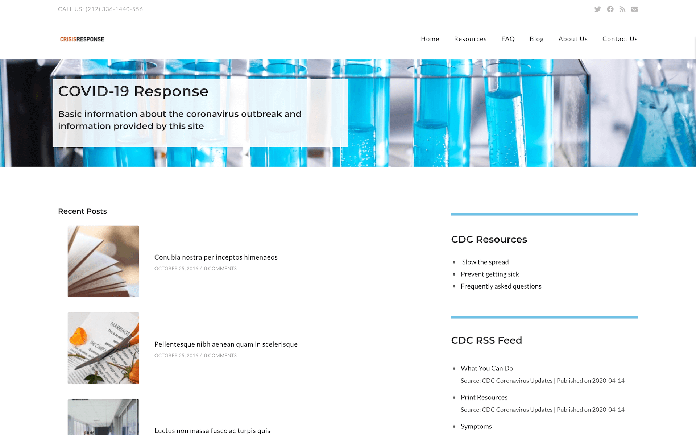

## Overview

The **Pantheon Crisis Response WordPress Upstream** is a specialized WordPress [custom upstream](/custom-upstream), created in response to COVID-19, to enable organizations on the front line to quickly create a production-ready website to provide timely information during a crisis.



## Features

This distribution features a minimal set of plugins for easy maintenance that can be tailored to your organization’s specific needs and capabilities. A few assumptions have been made to simplify the site building process for any organization utilizing this upstream, which are detailed in the plugin list below:

### Site Optimization Plugins

These plugins were selected to improve the performance of the site, and better utilize tools built into Pantheon.

- **[Native PHP Sessions for WordPress](https://wordpress.org/plugins/wp-native-php-sessions/)**: Offload PHP’s native sessions to your database for multi-server compatibility. This plugin is a best practices recommendation for sites running [multiple application containers](/application-containers#multiple-application-containers) that may require session persistence across containers.

- **[Pantheon HUD](https://wordpress.org/plugins/pantheon-hud/)** - A heads-up display into your Pantheon environment, giving you information about the current environment.

- **[Pantheon Advanced Page Cache](https://wordpress.org/plugins/pantheon-advanced-page-cache/)** - Automatically clear related pages from Pantheon’s Edge when you update content.

- **[WP Redis](https://wordpress.org/plugins/wp-redis/)** - WordPress Object Cache using [Pantheon Object Cache](/object-cache). For high visibility websites, a high-performance persistent object cache can have a huge impact.

### Content Features Plugins

These plugins were selected to improve the content creation and moderation process, in addition to improving SEO for visibility.

- **[Disable Comments](https://wordpress.org/plugins/disable-comments/)** - Allows administrators to globally disable comments on their site, or disable them according to post type. As the focus of this upstream is to distribute information, disabling core WordPress comments by default will reduce the moderation overhead, but can be re-enabled at any point.

- **[Yoast SEO](https://wordpress.org/plugins/wordpress-seo/)** - The first true all-in-one SEO solution for WordPress, including on-page content analysis, XML sitemaps and much more. Yoast provides insight on how to improve your SEO, empowering your content editors to write organic, impactful content for your target audiences to find.

  **Note:** Use the "PHP" redirect method with this plugin. See [Plugins With Known Issues](/plugins-known-issues#yoast-seo) for more information.

- **[Elementor](https://wordpress.org/plugins/elementor/)** - One of the most advanced frontend drag & drop page builders for WordPress. Elementor provides an intuitive interface for creating content and is well documented with community support.

- **[Essential Addons for Elementor](https://wordpress.org/plugins/essential-addons-for-elementor-lite)** - Elementor is a freemium plugin with a paid option to open up more elements. Essential Addons fills some of the gaps between the free and paid versions by enhancing the Elementor page building experience with over 65 additional creative elements and extensions.

- **[Contact Form 7](https://wordpress.org/plugins/contact-form-7/)** - Simple, but flexible contact form builder for WordPress that can be utilized for a simple contact form for your organization.

- **[WP RSS Aggregator](https://wordpress.org/plugins/wp-rss-aggregator/)** - Imports and aggregates multiple RSS Feeds. For this upstream, we are using it to create an RSS feed widget that sources updates from the CDC, but could also be used for other crisis-related content feeds.

- **[Ocean Extra](https://wordpress.org/plugins/ocean-extra/)** - Add extra features like widgets, meta boxes, import/export and a panel to activate the premium extensions. This plugin is a companion to the [OceanWP](https://oceanwp.org/) theme, to enhance it and create widgets for page building.

## How to Install

1. Create a new site from this upstream from the [Pantheon Dashboard](https://dashboard.pantheon.io/sites/create?upstream_id=46fb2d82-3a81-4592-9afc-81ec57d9cf82), or using Terminus (replace `site-machine-name` and `Site Name`):

    ```bash{promptUser: user}
    terminus site:create site-machine-name "Site Name"  crisis-response-wp
    ```

    The installation script will pre-populate generic content into the site.

1. [Contact Sales](https://pantheon.io/contact-us) and we will work with you to get an appropriate site plan and organization set up free of charge.

1. On the Dev environment tab of the site dashboard, click the **Site Admin** button to go to your development site. During the site deployment process, you should receive a password reset notice to the email address associated with your Pantheon account.

  If not, use your email address for the username and click on **Forgot Password**. Be sure to set a strong password.

1. Once the site is configured correctly in the Dev environment, you can [create the Test and Live environments](/guides/quickstart/create-test-live), copying your code and the initial database to each.

1. If you update your site code or add a new plugin, you can use the [Pantheon WebOps workflow](/pantheon-workflow). On your site's Pantheon dashboard, once changes are [committed](/sftp#committing-sftp-changes), the Deploys panel in the Test environment will prompt you to deploy the changes to the Test environment.

1. After testing your changes in the Test environment you can deploy them to the Live environment. Deploying code from Test to Live will immediately update your live website.

  See the [Pantheon Workflow](/pantheon-workflow) documentation to learn more about the Pantheon WebOps workflow.

1. Login to your live site and update your content.

1. Associate a [domain name](/guides/launch/domains) with your Live site.

## Configuration

While this upstream provides you with a simplified foundation for building an information portal, you should review a few dashboard links for additional customization:

1. **General Settings** (Sidebar -> Settings -> General)

    Update the site name, tagline, administrative email address, and any other base site settings you wish.

1. **Theme Panel** (Sidebar -> Theme Panel)

    OceanWP provides a lot of flexible regions and components that can be customized in your theme. Review the theme panel to become familiar with all of the components being utilized, and update as you see fit.

    The **Getting Started** section will also provide direct links to update information in the WordPress Theme Customizer interface.

1. **Appearance Customizer** (Sidebar -> Appearance -> Customize)

    This is where you can configure and update all aspects of the OceanWP theme settings, such as site logo, color palettes, fonts, widgets, etc. We have made a few minor assumptions, but this dashboard gives you total control over the look and feel of the theme without writing any additional code.

1. **Contact Forms** (Sidebar -> Contact)

    Contact Form 7 stores all forms in this interface, so you can update elements in the existing form (such as recipient email for submissions) or create any additional forms you might need.

From here, you can update the existing demo content, or delete it and create new pages using Elementor or the default WordPress editor. After creating new content, you may need to update the menu links located under the Appearance tab.

## Next Steps

- Visit the [Launch Checks](/guides/launch/launch-check) guide to review key checks to perform before going live.
- If utilizing the Object Cache, follow our guide on [enabling Object Caching for WordPress](/object-cache#enable-redis).

## See Also

- [Introduction to Custom Upstreams](/custom-upstream) - Learn about the benefits of Pantheon Custom Upstreams.
- [Professional Services](/guides/professional-services) - Learn all the great services our expert teams can provide.
