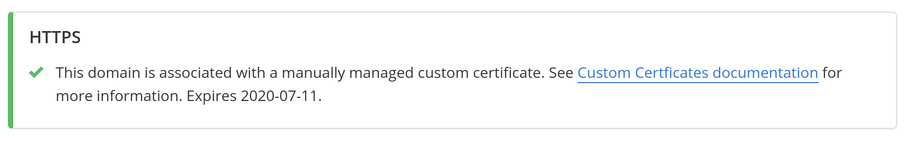

## Access

A concierge service is now available to contract customers, including Enterprise, EDU+, Pantheon One, Elite, and Resellers. For more information, please contact [Sales](https://pantheon.io/why-pantheon-enterprise).

## Manually Managed Custom Certificates

If you require a custom, dedicated certificate, you can now bring it to the Global CDN. This is a paid service that our Sales Team can help you with.

1. Please [contact sales](https://pantheon.io/contact-us) if you are not a contract customer.

1. After a closed contract, the Pantheon Onboarding Team will provide you with the CSR file, to pass on to your **Certificate Authority** (CA). See [CA Limitations](#ca-limitations) below for more information. You must use a Pantheon-generated CSR. This is a hard requirement. If you already have a certificate, it will need to be re-keyed to match the CSR we provide.

1. Once you have a set of certificates from the CA, send us:

   - The end-client certificate
   - Any intermediate certificates provided by the CA.

  Be sure to send these as separate files, not a "chained cert".

  <Alert type="info" title="Note">

  When adding the domain to your environment, you may be presented with the option to **Verify your domain to provision HTTPS**. You can skip this step by clicking **Skip to updating DNS**.

  </Alert>

1. Once the certificate is in place, you will see under **Details** for your domain(s) the following:

  

1. [Test Before Going Live](#test-before-going-live) (optional, recommended)

1. [Disable Let's Encrypt by adding CAA DNS records](#disable-lets-encrypt-with-caa-records-required).

1. Update `A` and `AAAA` records provided by Pantheon Support. Note that even for subdomains, `A` and `AAAA` records are required. Do not use a `CNAME` record.

## Test Before Going Live

Test production domain(s) before updating DNS by overriding DNS on your local computer from your local `hosts` file:

<Partial file="_hosts-file.md" />

For non-production domains, test on any environment (Dev, Test, Live or Multidev), just make sure to include the non-production domains on your certificate. We are happy to provide a new CSR if your original CSR and certificate did not initially non-production domains.

## Disable Let's Encrypt with CAA Records (Required)

A **Certification Authority Authorization** (CAA) record is used to specify which certificate authorities (CAs) are allowed to issue certificates for a domain. In order to ensure your custom certificate is served for all traffic, you must prevent Let’s Encrypt from issuing certificates. You have two options to prevent Let’s Encrypt from issuing certificates for domains on your custom certificate:

- An empty CAA policy,
- CAA records permitting your CA, but not Let’s Encrypt.

To help generate CAA records, please see the free online tool: <https://sslmate.com/caa/>

CAA records configured for the root domain (e.g., `example.com`) are inherited by subdomains (e.g., `www.example.com`, `blog.example.com`, etc.). Disabling Let's Encrypt for the root domain will disable subdomains.

<Partial file="tables/https-specs.md" />

## Frequently Asked Questions

### Do I need a separate certificate for each site in my organization?

Nope! You can use the a single certificate to cover multiple domains spread across various environments or sites. This capability is enabled because the Global CDN uses a technology called Server Name Indication (SNI), which automatically matches inbound requests with an appropriate certificate, including custom certificates.

### How long will it take to load my certificate into Pantheon?

Please allow two business days to get a CSR and load the certificate.

### How do I renew or replace my custom certificate?

45 days before your custom certificate expires, Pantheon will open a ticket with your team with a new CSR. You can send that CSR to the Certificate Authority to generate new certificates (as described above for [bringing a custom certificate](#option-2-manually-managed-custom-certificates)).

To update a certificate with additional domains, [contact support](/support) with the following details:

- The current common name (CN) and any SANs
- A colon-separated list of domains the certificate is valid for
- The updated certificate attached

It may take up to two business days to process the request.

### What about sites purchased online?

Custom certificates are available for contract customers (e.g. Elite, Enterprise, EDU+) and we have no plans to offer it for Basic or Performance sites purchased online. If bringing your own certificate for non-contract site is a requirement, please see suggestions on [how to terminate TLS through a 3rd-party](/https/#can-i-bring-my-own-certificate).

### Will custom certificates be self-serve?

We have no current plans to offer a self-serve option. The concierge service is designed to quickly guide you through the steps required to deliver HTTPS on the Global CDN using your custom certificate, and we may follow-up with a self-serve option in the future.

### Which certificates do I submit?

Include the end-client certificate for your named domains, as well as the intermediate certificate, in separate files.

### What is the maximum number of SAN entries?

For the broadest client compatibility we recommend limiting the number of Subject Alternate Names to 100.

### Are private keys available for export?

Private keys are just that, private, and not available for export. They are stored securely, server side, and it’s a security best practice to not share private keys among different deployments. If you manage multiple domains, with some on Pantheon, and some outside of Pantheon, then we recommend using separate certificates, and we are happy to provide you with a new Certificate Signing Request (CSR) so we can deploy a certificate on Pantheon that only has the domains served on Pantheon.

### What are the Global CDN IP addresses?

The Global CDN currently has 4 offsets. After certificate deployment, we will provide DNS information so you can upgrade. In the examples below, `X` will be replaced with a value of `1`, `2`, `3`, or `4`:

A record: `23.185.0.X`
AAAA record 1:  `2620:12a:8000::X`
AAAA record 2:  `2620:12a:8001::X`

**Note:** `AAAA` records are not required, but recommended as a best practice for performance, especially for mobile devices. See [Introduction to Domain Name Services](/dns/#what-are-aaaa-records-and-do-i-need-them) for more information.

### What if my DNS manager doesn't support CAA DNS records?

CAA records are required  to [prohibit Let's Encrypt from issuing certificates](#disable-lets-encrypt-with-caa-records-required). If your DNS provider does not support CAA records, consider one that does. If using a DNS provider that supports CAA records is not possible, please inform your Engagement Manager, as our [Professional Services](/guides/professional-services) team can help.

## Caveats / Known Issues

### Let's Encrypt Certificate Served Instead of Custom Certificate

If a Let's Encrypt Certificate is deployed before the CAA record preventing it, [contact Pantheon support](/support) for assistance. Please allow at least 3 business days for Pantheon to resolve the Let's Encrypt Certificate.

### CA limitations

Your CA must accept the CSR Pantheon provides. If your CA fails to accept our CSR, you will not be able to use it to generate a certificate. The CA GlobalSign does not currently meet this requirement. The workaround is to simply use another CA.

### Downgrading a Site that uses a Custom Certificate

Since all sites require an encryption certificate, to downgrade a site that uses a custom certificate, use Pantheon’s [Global CDN](/https) to enable Let’s Encrypt. Alternatively, you can use another CDN like [Cloudflare](/cloudflare).

## See also

- [Pantheon Global CDN](/global-cdn)
- [HTTPS on Pantheon's Global CDN](/https)
- [Introduction to Domain Name Services](/dns)
