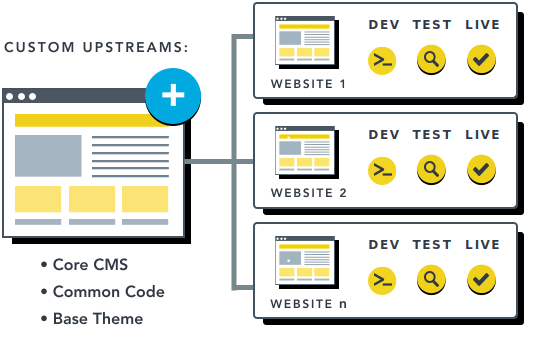

<TabList>

<Tab title="Overview" id="overview" active={true}>

As site numbers grow and demands become more diverse, the choice between enforcing standards and allowing individual sites flexibility to meet unique goals can become a real struggle. Custom Upstreams allow control over site standards, while still allowing customization when needed, all without introducing any single points of failure.

Custom Upstreams act as a scaffold for new sites, allowing developers and site owners of any skill level to kickoff projects at warp speed.

Instead of repeating the same technical work on each individual site, you can build and maintain a common user interface with unified branding and functionality once, in a single source.

</Tab>

<Tab title="Features" id="features">

* Quickly build new sites per your predefined standards
* Standardize design functionality across many sites
* Simplify the updates of multiple sites

*Manage Custom Upstreams from the Dashboard*

*Add a Custom Upstream*

</Tab>

<Tab title="Requirements" id="requirements">

* Gold, Platinum or Diamond Account Tier
* Create or manage upstreams: Administrator or Owner
* Change or deploy upstream: Administrator, Team Member, Developer

</Tab>

<Tab title="Resources" id="resources">

## Documentation

* [Custom Upstreams Guide](https://docs.pantheon.io/guides/custom-upstream)

## Learning

* [Custom Upstreams Training](https://learning.pantheon.io/page/catalog#topic_custom-upstreams)

## Support

* [Users with a Pantheon account](https://dashboard.pantheon.io/workspace/support)

</Tab>

</TabList>
