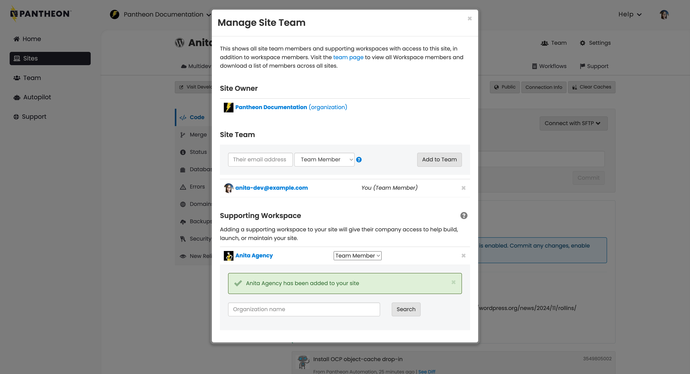
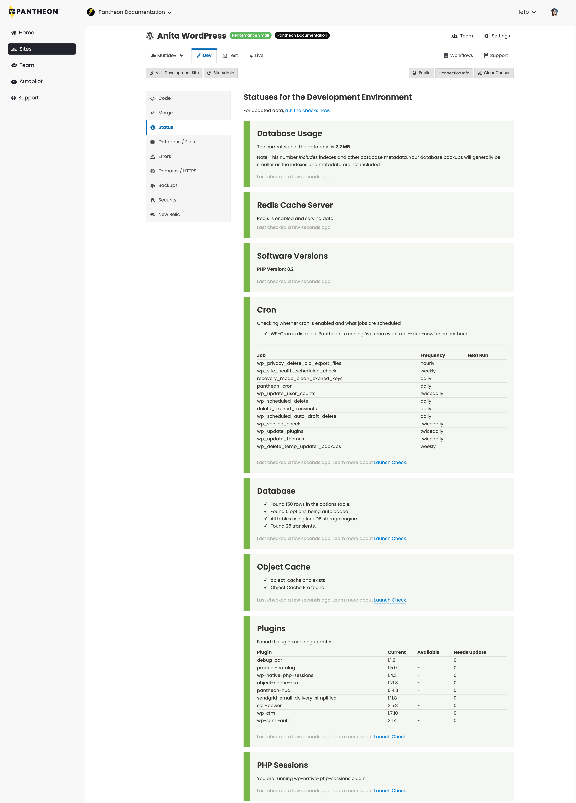

<TabList>

<Tab title="Overview" id="overview" active={true}>

Easily visualize and manage sites, users, traffic, metrics, visual regression testing (VRT), and everything else needed to keep your WebOps experience smooth and uneventful.

Our site dashboard provide a real-time interface into Pantheon. It includes everything you need to build, launch, and run sites. Create new projects, manage team access, interface via SFTP or Git (version control), and track miscellaneous tools like backups. It also allows you to deploy and scale your sites.

</Tab>

<Tab title="Features" id="features">

* Manage users
* Manage invoices and billing
* Test sites
* One-click updates to Drupal core and WordPress
* Site crash reporting with backtraces
* SFTP development controls, including Git commits
* Add and configure New Relic monitoring

*Manage Team*

*View Site Status*

*Manage Backups*

</Tab>

<Tab title="Requirements" id="requirements">

- Must own the site, or be invited to the site by an Administrator

</Tab>

<Tab title="Resources" id="resources">

## Documentation

* [The Site Dashboard](/site-dashboard)

## Learning

* [Getting Started with Pantheon Overview](https://learning.pantheon.io/getting-started-with-pantheon-overview)

## Support

* [Account holders](https://dashboard.pantheon.io/workspace/ee3995c4-652e-44a0-b00b-0085e92d78da/support)

</Tab>

</TabList>
