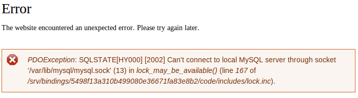

There is an issue connecting to the Pantheon database if your site suddenly reverts to `install.php`, or you see database connection errors like the following:



```sql
Can’t connect to local MySQL server through socket '/var/lib/mysql/mysql.sock'...).
```

There are two common causes: overwriting core or using non-standard bootstraps.

## Overwriting Core

### Drupal Pressflow Core

Pantheon provides Pressflow core as the underlying basis for all Drupal sites. This is important for performance reasons, but also to take advantage of the ability to load configuration out of the server environment. You can run Drupal on Pantheon with no `settings.php` file, though there are still plenty of great uses for this file.

However, if you overwrite the Pressflow core — most commonly by unpacking a tarball from drupal.org "over" your Git checkout and then pushing the change, or updating core via Drush — your site loses the ability to read the environmental configuration.

To see if this is the case, examine your `includes/bootstrap.inc` file, and verify that you see code in the `drupal_settings_initialize()` function which loads data from `$_SERVER['PRESSFLOW_SETTINGS']`.

If you don't see that, look in to recent changes and revert or remove whatever overwrote your core.

### WordPress Core

Apply one-click updates within the Site Dashboard on Pantheon or via [Terminus](/terminus). Do not update core using the WordPress Dashboard or WP-CLI; you will overwrite your core. For additional details, see [Scope of Support](/support/#scope-of-support) and [WordPress and Drupal Core Updates](/core-updates).

## Drupal Non-Standard Bootstraps

Some modules, like the **domain.module**, change Drupal's standard bootstrap process. They typically require you to add an include file to the end of your `settings.php`, which causes an escalated bootstrap earlier than normal so they can perform some higher level functions like checking to see if a user has access.

However, because the Pantheon environment data is not loaded at this time, any bootstrap to the database level will fail since there is no valid connection information. In this case, include a snippet in your `settings.php` _before_ the module's include call. For example:

### Drupal 6 Style

```php
$settings = json_decode($_SERVER['PRESSFLOW_SETTINGS'], TRUE);
  $info = $settings['databases']['default']['default'];
  $db_url = sprintf("%s://%s:%s@%s:%s/%s",
                    $info['driver'],
                    $info['username'],
                    $info['password'],
                    $info['host'],
                    $info['port'],
                    $info['database']);
  $conf = $settings['conf'];
  # Include any other settings.php magic here.
  include './sites/all/modules/domain/settings.inc';
```

### Drupal 7 Style

```php
# Include any other settings.php magic here.
  extract(json_decode($_SERVER['PRESSFLOW_SETTINGS'], TRUE));
  include './sites/all/modules/domain/settings.inc';
```

You can also use the above to develop Drupal 8 on Pantheon.

<Alert title="Warning" type="danger">

If you use any other advanced `settings.php` tricks (e.g. enabling Redis), you will need to do this <em>before</em> the snippet in D7, or <em>after</em> in D6 to insure you have a consistent `$conf` array.

</Alert>

## Base Table or View Not Found

This error may occur during a database clone, restore, or import. A standard MySQL import happens sequentially and in alphabetical order from A to Z. If you access the site before the operation is complete, Drupal will try and bootstrap, and the MySQL import may only be at the table letter G. The result is the "semaphore does not exist" error.

Once the process is complete, Drupal will be able to bootstrap correctly. In other words: no need to worry! Just wait for the process to complete and the error will disappear. If the site is locked down from web visitors, there may still be a backend process such as our healthcheck process pinging the database trying to obtain a lock via the semaphore table.

This error shouldn’t cause any issues for your site:


```sql
Uncaught exception 'PDOException' with message 'SQLSTATE[42S02]: Base table or view not found: 1146 Table 'pantheon.semaphore' doesn't exist' in /srv/bindings/xxxxxxxx-xxxx-xxxx-xxxx-xxxxxxxxxxxx/code/includes/database/database.inc:2171 Stack trace: #0 /srv/bindings/7xxxxxxxx-xxxx-xxxx-xxxx-xxxxxxxxxxxx/code/includes/database/database.inc(2171): PDOStatement->execute(Array) #1 /srv/bindings/xxxxxxxx-xxxx-xxxx-xxxx-xxxxxxxxxxxx/code/includes/database/database.inc(683): DatabaseStatementBase->execute(Array, Array) #2 /srv/bindings/xxxxxxxx-xxxx-xxxx-xxxx-xxxxxxxxxxxx/code/includes/database/database.inc(2350): DatabaseConnection->query('SELECT expire, ...', Array, Array) #3 /srv/bindings/xxxxxxxx-xxxx-xxxx-xxxx-xxxxxxxxxxxx/code/includes/lock.inc(167): db_query('SELECT expire, ...', Array) #4 /srv/bindings/xxxxxxxx-xxxx-xxxx-xxxx-xxxxxxxxxxxx/code/includes/lock.inc(146): lock_may_be_available('schema:runtime:...') #5 /srv/bindings/xxxxxxxx-xxxx-xxxx-xxxx-xxxxxxxxxxxx/code/includes/bootstrap.inc(433): ...
```

## See Also
- [Troubleshooting MySQL Connections](/mysql-access/#troubleshooting-mysql-connections)
