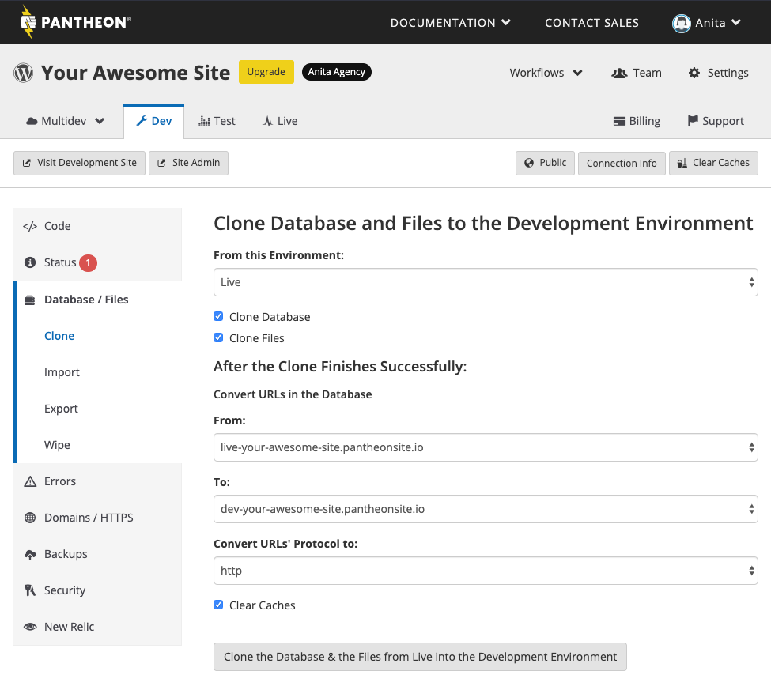

The Pantheon platform provides each site environment with a dedicated MySQL container running [MariaDB](https://en.wikipedia.org/wiki/MariaDB) that can be maintained remotely or locally. For a comprehensive list of MySQL settings, [access your database](/mysql-access/#database-connection-information) and use the [SHOW VARIABLES](https://dev.mysql.com/doc/refman/5.7/en/show-variables.html) statement.

Using the tools in the Database / Files tab, you can overwrite the databases on your site's Dev or Test environment with the database on your Live environment, allowing you to pull content from Live in to other environments.


<Alert title="Warning" type="danger">

Pushing content up to Live should almost never be done to a launched site, as it can overwrite the environment configurations. See [Using the Pantheon Workflow](/pantheon-workflow). 

</Alert>

## MySQL Clients
You can use any number of MySQL clients such as [MySQL Workbench](https://dev.mysql.com/downloads/workbench/), [Sequel Pro](https://www.sequelpro.com/download), [Navicat](https://www.navicat.com/download), [PHPMyAdmin](https://www.phpmyadmin.net/), and others to  administer your site's database
and [manage configurations](/pantheon-workflow/#configuration-management) as needed.

## Cloning the Database
Cloning relies on mysqldump, which needs a point-in-time snapshot. We recommend using the `--single-transaction` flag, which will use transactions to get a point-in-time snapshot without locking the DB. However, only the InnoDB database engine supports transactions. On MyISAM, the table needs to be locked. On small DBs this is not an issue, but could be for larger DBs. We also use the `--quick option`, which reduces the time it would take for large tables. For more information, see [Converting MySQL Tables From MyISAM to InnoDB](/myisam-to-innodb) and [Run MySQL Dump Without Locking Tables](https://stackoverflow.com/questions/104612/run-mysqldump-without-locking-tables).

## Wipe Database and Files
Use this tool if you need to completely wipe your database and files for a single environment. Wiping completely resets the database and files, and you will lose all content for that specific environment. For example, if you wipe the Dev environment, Test and Live are not affected. You will then need to import the database and files from a backup, clone them from another environment, or re-install Drupal or WordPress for that environment.

Learn more about the [Pantheon Workflow](/pantheon-workflow).

## Troubleshooting

### WordPress Content References the Wrong Domain After Cloning

<Partial file="search-replace-domains.md" />

### Base table or view not found

Database errors may occur during a database clone, import or while wiping the environment. In most cases, the error contains `semaphore' doesn't exist` and is generated because the site is accessed before a certain database operation is complete. Simply waiting for database operations to complete resolves the error.

However, Drupal 7 sites using the configuration override system to enable CSS aggregation and compression (`$conf['preprocess_css'] = 1;`) will see the following error after wiping an environment:

```sql
Additional uncaught exception thrown while handling exception.

Original

PDOException: SQLSTATE[42S02]: Base table or view not found: 1146 Table &#039;pantheon.variable&#039; doesn&#039;t exist: SELECT 1 AS expression FROM {variable} variable WHERE ( (name = :db_condition_placeholder_0) ); Array ( [:db_condition_placeholder_0] => drupal_css_cache_files ) in variable_set() (line 1265 of /srv/bindings/xxxxxxxx-xxxx-xxxx-xxxx-xxxxxxxxxxxx/code/includes/bootstrap.inc).

Additional

PDOException: SQLSTATE[42S02]: Base table or view not found: 1146 Table &#039;pantheon.variable&#039; doesn&#039;t exist: SELECT 1 AS expression FROM {variable} variable WHERE ( (name = :db_condition_placeholder_0) ); Array ( [:db_condition_placeholder_0] => drupal_css_cache_files ) in variable_set() (line 1265 of /srv/bindings/xxxxxxxx-xxxx-xxxx-xxxx-xxxxxxxxxxxx/code/includes/bootstrap.inc).
```

You can fix this issue by wrapping the configuration logic within a conditional statement in `settings.php`:

```php
if (!function_exists('install_drupal')) {
  $conf['preprocess_css'] = 1;
}
```

### "Connection to server closed by remote host" notice when running search-replace

Sites with large databases may encounter a timeout when trying to run `terminus wp search-replace` on all tables. This is due to the [idle timeout limit](/timeouts) on SSH connections.

You can avoid this by configuring your local machine to send an SSH keepalive packet every 60 seconds. Add this to your `$HOME/.ssh/ssh_config` file:

```ini
Host *.drush.in
  ServerAliveInterval 60
```

## See Also
- [MySQL Troubleshooting with New Relic Pro](/debug-mysql-new-relic)
- [MySQL Slow Log](/mysql-slow-log)
- [Converting MySQL Tables from MyISAM to InnoDB](/myisam-to-innodb)
- [Database Connection Errors](/database-connection-errors)
