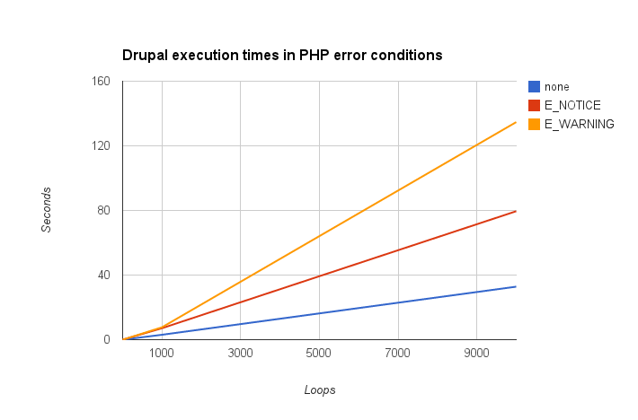
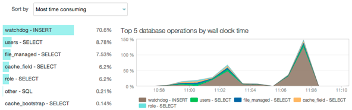
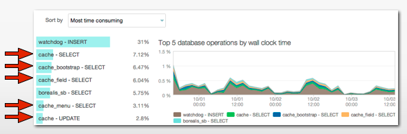

This article covers the most common causes for performance problems, demonstrates how to diagnose bottlenecks, and provides actionable solutions for developers.

## PHP Errors Slow Execution

An often ignored cause of bad performance is [PHP errors within site code](/php-errors), as every single PHP error will slow your site down, including both notices and warnings that don’t crash your site.

Here's an example of how PHP errors can slow down a site. This benchmark was performed with Drupal's [Generate Errors](https://drupal.org/project/generate_errors), with a TRUNCATE of the `watchdog` table before each test to avoid tainting results from the aggregate. The results are equally applicable to WordPress or any PHP-based project.

Each loop executed user\_load(1, TRUE), then triggered the error. Times are rounded to 2 decimals.

|               | 1 time | 25 times | 50 times | 100 times | 1,000 times | 10,000 times |
|:------------- |:------ |:-------- |:-------- |:--------- |:----------- |:-------------|
| **none**      | 0.00s  | 0.08s    | 0.17s    | 0.30s     | 3.04s       | 32.81s       |
| **E_NOTICE**  | 0.01s  | 0.16s    | 0.34s    | 0.71s     | 7.10s       | 79.52s       |
| **E_WARNING** | 0.01s  | 0.16s    | 0.33s    | 0.70s     | 7.67s       | 134.68       |

Turning off error reporting suppresses the symptom, not the problem, and **PHP execution will still be slow as long as there are errors**.

PHP errors are not always obvious at first glance, so don't ignore error messages in your development environment. Do what it takes to fix them, including the notices.

## Drupal Note Regarding Watchdog
Compounding the issue, writing those errors to watchdog takes time and is a blocking operation - other queries can’t happen until the write is done. The bigger the table, the longer the write will take.

Don’t shoot the messenger—disabling dblog will not fix bad code.

As an example, if your slowest database operation is an INSERT to watchdog, then you should fix the PHP errors that are causing the writes. Notice that watchdog INSERTS is taking 70.6% of the execution time.

Learn more about [Log Files on Pantheon](/logs).

## Too Many Database Queries
The next performance killer is an excessive number of database queries per request. You can see that in the [New Relic&reg; Performance Monitoring dashboard](/new-relic) by going to the Map tab, which shows  how the various low-level components in your application are performing together.

 

Looking at an example, the average number of queries per request is shown in the lower-left, which in this case is 110 queries - a bit high. In the upper-right, the average query duration is shown and is actually very respectable.

Therefore, with an average of 110 queries taking 1.19 milliseconds means on average, each request spends .132 seconds in the database. A second example with the same query duration, but with 239 queries per request, means .28 seconds in the database. A final example with 421 queries per request averaging 2.66 milliseconds equals **1.1** seconds per request in the database—monstrously slow.

Query count matters, so keep it low through caching and avoiding queries in loops.

## Not Caching

Non-optimized caching also is a huge problem. If you're not caching anonymous pages, anonymous traffic performance will be bad. Varnish respects the Cache-Control headers the site is sending it, which won't be set if anonymous page caching is turned off.

If the cache lifetime is set to something that doesn't make sense for your traffic pattern (e.g. it only gets one hit per hour yet it's set to have a 5 minute cache), that's not enough to help.

### Drupal Note
See our [guidelines on Drupal's performance settings](/drupal-cache) for more details.

Other caching systems that aren't on by default that should be enabled include [block caching](/drupal-cache), [Views](https://drupal.org/project/views) result and query caching, and [Panels](https://drupal.org/project/panels) caching.

### Using the Database to Cache in Drupal
By default, Drupal uses the database as a caching backend. This is an example of a fairly high traffic site, and as you can see, database cache hits are the vast majority of the slow queries.

 

Also note the impact of watchdog INSERTs; this is why you should fix your PHP errors.

One of the services Pantheon offers is an [Object Cache backend](/object-cache), which is a key-value store and is optimized for this type of work.​

### WordPress Caching Note
There is no built-in caching in WordPress. Pantheon offers Varnish in front of all sites - WordPress and Drupal - to cache content and improve performance. The [pantheon-cache plugin](https://github.com/pantheon-systems/WordPress/tree/master/wp-content/mu-plugins/pantheon#edge-cache) is included within the `mu-plugins` directory of our repository, which helps the edge cache (Varnish) communicate with WordPress. Most WordPress caching plugins will be ineffective on the Pantheon platform. They should not cause any problems, but they will most likely not speed up the site and may even slow it down.

## Not Enough Traffic
The next problem is when a site doesn't have enough traffic, which may seem paradoxical.

Cache misses are by nature slow - if something needs to be cached it's performed and the cache is populated, which is slower than just returning the value from cache.

There are a large number of caches involved in every single request, including:

- [Pantheon Global CDN](/global-cdn-caching) - Spread out across multiple servers, and the cache is not shared between servers.
- [APCu](/apcu) - PHP has its own user-level cache, which is not shared between application containers.
- [Drupal](https://drupal.org/node/326504) and [Redis](/object-cache) - Shared between your servers, but caches do expire and will need to be regenerated. Therefore, more traffic means more cache hits and faster performance, given the number of components involved.

## Too Much Traffic
Of course, too much site traffic can be a problem if you just don't have enough resources.

If your site is already optimized to the best of your knowledge, including eliminating PHP errors, leveraging caching like Redis and caching things like blocks and views, and your database response time is responding quickly to a reasonable amount of queries, then you might be a victim of your own success.

If you've reached this point, it's probably time to consider [upgrading your site's plan](/site-plan). We have a number of self-service options for scaling to your needs, but if you've already maxed out a self-service plan, then [Elite](https://pantheon.io/pricing#elite) is a good option.

## Running Cron Over Web Traffic

Both Drupal and WordPress rely on running regular maintenance tasks via a cron system that usually gets executed at the end of a request. The user is thus forced to wait for the cron to finish before they can actually see the page. Depending on what the cron is doing, this can be a short or extremely long wait (e.g. if the cron is calling external services to import content). As you can imagine, this is not desirable.

For Drupal sites, Pantheon executes the cron every hour via Drush regardless of the site's cron settings. There are various other configuration schemes you can use, as described in [Cron for Drupal](/drupal-cron).

This functionality doesn't exist for WordPress sites, but there are a multitude of different configuration options available that allow for more flexibility when configuring cron. The entire list of options can be found in [Cron for WordPress](/wordpress-cron).

## External Call Timeouts

Calling external services during regular requests can be a performance problem. The time it takes to initiate the request then send and receive data is time spent waiting by visitors. Since PHP executes instructions sequentially, no other operation can be executed while the external connection is active. Also, if the external service goes down, your site will go down along with it.

Sometimes these are necessary (e.g. getting a Twitter feed). The recommendation here is to avoid making external calls during regular requests as much as possible. As an alternative, you can make these calls via cron and store them in the database. The data can be refreshed with the desired frequency. The advantage is that even if the external service is slow or goes down your site won't be affected.

## Memory Errors
An *Allowed memory size of <bytes\> exhausted* or *Out of Memory* error means that the application's PHP Memory Limit is trying to allocate more memory than the maximum amount of memory any single PHP request can utilize. Memory limits vary between [plans](https://pantheon.io/plans/pricing-comparison), so sites that handle complex or large data sets, use many modules or plugins, or use memory-intensive features will need to plan accordingly and obtain the proper plan to avoid memory overruns. Exceeding this limit will kill the process, resulting in a failed request from the user's perspective.

Debugging memory issues can be challenging. Here are some things to consider when addressing memory issues:

- Look at the stacktrace provided along with the error to see if there's a module or plugin that is identified
- Debug code locally using a PHP extension (like [Xdebug](https://xdebug.org/) or [XHProf](http://php.net/manual/en/book.xhprof.php)) or to help refactor code that could be leaking memory
- Enabling [Redis](/object-cache) could boost site performance by providing an in-memory backend caching
- [Update PHP version](/php-versions)
- In case the source of the high memory usage is unclear, it might be helpful to use using a memory profiling module / plugin on the production site temporarily. Note that memory profiling most often has a performance overhead, so keep a close eye on the site while profiling. Usually a few hours will provide enough data.

Please note that memory issues caused by custom code fall outside our [scope of support](/support/#scope-of-support).

### Drupal
Disabling modules that are unneeded will help reduce memory usage. The [Memory profiler](https://www.drupal.org/project/memory_profiler) module can help troubleshoot issues by logging peak memory usage.

GD Image library and UI modules such as Views UI, Feeds UI, etc are known causes for high memory usage. 

### WordPress
Refer to [Debugging in WordPress](https://codex.wordpress.org/Debugging_in_WordPress) from the WordPress.org Codex for information on debugging common issues.
