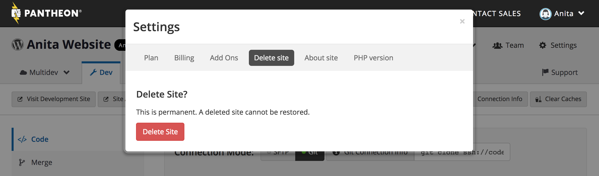
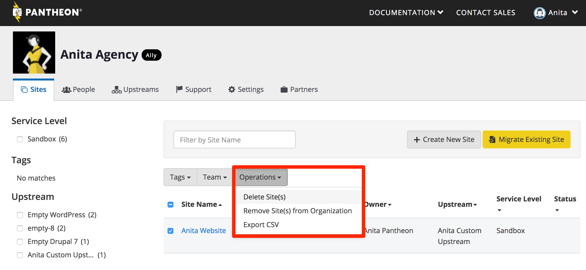
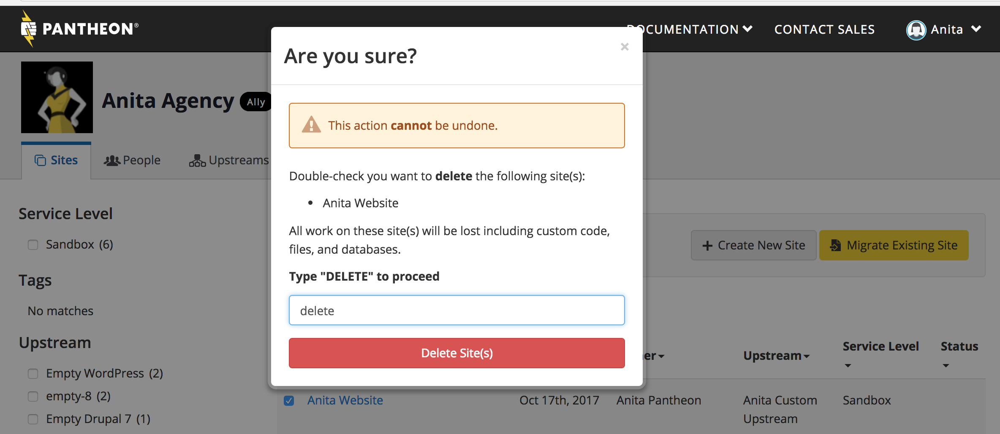
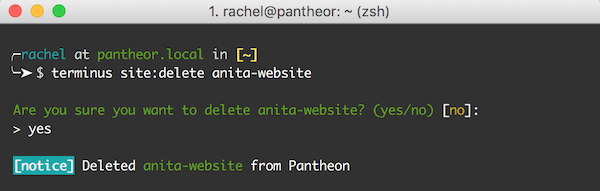

At some point, you may need or want to delete one of your sites on Pantheon. The number of free sites you can create is increased after a free site is deleted, or after it has converted to a paid plan.

Only the site's "User in Charge" or "Owner" can delete a site. See [Roles and Permissions](/change-management#roles-and-permissions) for more information.

<Alert title="Warning" type="danger">

This action is permanent and irreversible. Export any needed content, code, or files from the site before starting this operation.

**Before you delete a site**: Downgrade the site plan to Sandbox. See [Manage Site Plans](/site-plan) for more information.

**After you delete a site that had a live domain or subdomain**: Update the DNS records so that they don't continue to point to the deleted site.

</Alert>

## Delete a Site Using the Pantheon Site Dashboard

1. Select **Settings** > **Delete Site**.
1. Click the **Delete Site** button.

  

1. Enter the site title; this ensures you're aware of the site you're deleting.
1. Click **Delete**.

  

## Delete a Site From the Organization Dashboard

1. Select the checkbox next to the site you want to delete.
1. Click **Operations**, and select **Delete Site**.

  

1. Type **Delete**.
1. Click **Delete Site(s)**.

  

## Delete a Site with Terminus

Run the following [Terminus](/terminus) command:

```bash{promptUser: user}
terminus site:delete <site>
```

<Alert title="Note" type="info">

Replace `<site>` with your site name. You can see a list of all your sites by running `terminus site:list`.

</Alert>

  

## Delete a Multidev Environment

Refer to the [Delete a Branch Environment](/multidev#delete-a-branch-environment) section of our Multidev guide for more information.
