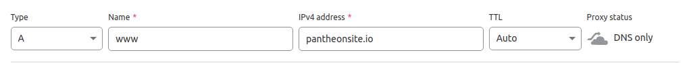
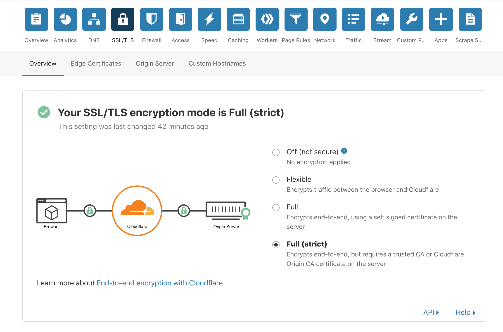
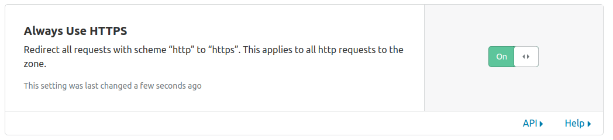
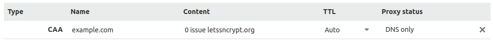

You can use Cloudflare for DNS only or stack it as a CDN on top of Pantheon's Global CDN. We recommend using Cloudflare for DNS only. If you have a paid Cloudflare plan to use features like their WAF or have custom Cloudflare configurations (e.g. many page rules) you'd like to keep, however, then ensure you follow the guide below to enforce HTTPS to prevent any issues.

## Before You Begin
Be sure that you have a:

- Domain name using Cloudflare to host DNS
- [Paid Pantheon plan](/guides/launch/plans)
- [Domain connected](/guides/launch/domains) to the target Pantheon environment (typically Live)

## Locate Pantheon's DNS Values

1. [Go to the Site Dashboard](/guides/account-mgmt/workspace-sites-teams/sites#site-dashboard) and select the target environment (typically <Icon icon="wavePulse" /> Live) then click **<Icon icon="global" /> Domains / HTTPS**.

1. Click the **DNS Recommendations** button next to the `www` domain and copy the A and AAAA values (e.g. `23.185.0.2`, `2620:12a:8000::2`).

1. Login to your [Cloudflare account](https://www.cloudflare.com/a/login) in a new tab before you continue.

## Pre-Provision SSL Certificate on Cloudflare (optional)

Though optional, pre-provisioning Let's Encrypt SSL certificates ahead of a planned launch can prevent a gap in SSL service immediately after updating DNS on launch date.

1. Click **DNS** on the Cloudflare menu bar.

1. Click **+ Add record** and then select **TXT** from the **Type** drop-down menu.

1. Enter the `TXT Name/Host` in the **Name** field and the `TXT Value` in the **Content** field.

  You can find both values in the Live environment of your Pantheon Site Dashboard under **Domains/HTTPS** for that domain.

1. Select your desired Time to Live (TTL) and then click **Save**.

1. [Go to the Site Dashboard](/guides/account-mgmt/workspace-sites-teams/sites#site-dashboard).

1. Navigate to the Live environment and click **Domains/HTTPS**.

1. Click the **details** button next to the domain and then click the **Verify Ownership** button.

  The process to provision certificates will begin after domain ownership is verified, and you will receive the following notice:

  <Partial file="notes/https-info.md" />

  Both the bare domain and the www domain will be accessible over HTTPS after the HTTPS status turns green (which may take up to an hour):

  <Partial file="notes/https-success.md" />

1. Repeat the steps above for all domains (www and non-www).

## Configure DNS Records on Cloudflare

### Option 1: Use Cloudflare for DNS Only (Recommended)
This configuration routes traffic to Pantheon's Global CDN exclusively. Unless you're paying for advanced Cloudflare features or if you have custom configurations (e.g. many page rules) you'd like to keep, turn off Cloudflare's CDN so that only DNS hosting services are used:

1. Click **DNS** on the Cloudflare menu bar.
1. Click **+ Add record**.
1. Select **A** from the **Type** drop-down menu.
1. Enter `www` in the **Name** field and paste the IP address value provided by Pantheon (e.g. `23.185.0.2`) in the **IPv4** field.
1. Select a desired Time to Live (TTL).

  <Accordion title="Learn More" id="ttl" icon="info-sign">

  #### Time to Live (TTL)

  The TTL dictates the lifespan of a DNS record; a shorter time means less time to wait until the changes go into effect. TTLs are always set in seconds with a few common ones being 86400 (24 hours),  43200 (12 hours), and 3600 (1 hour).

  When you make a change to the TTL of an existing record, you need to wait for the old TTL time to pass - that is, if it had been set to 86400, you would need to wait a full 24 hours for the new setting to begin propagating everywhere.

  </Accordion>

1. Disable Cloudflare's CDN by clicking the cloud icon (should be gray, not orange).
1. Click on **Save**.
1. Cloudflare Page Rules will not work when Cloudflare is used for DNS only. Instead, redirects are handled by adding redirect logic to the WordPress `wp-config.php` file or the Drupal `settings.php` file. See [Configure Redirects](/guides/redirect) for more information.

Repeat the steps above to create an **A** record for the bare domain, using `@` as the **Name** and the same IP address, then repeat again for the **AAAA** records.

### Option 2: Use Cloudflare's CDN stacked on top of Pantheon's Global CDN
You can configure Cloudflare's CDN as an additional layer on Pantheon's Global CDN service. You must use this option if you have a [Front-End](/guides/decoupled/overview/#what-is-a-decoupled-site) site.

1. Select **SSL/TLS** from the Cloudflare menu bar and set SSL mode to **Full (Strict)**.

  

1. Navigate to the **Edge Certificates** page on the sub-menu and enable **Always Use HTTPS**

  

1. Scroll down and enable **Automatic HTTPS Rewrites**

1. Remove existing redirects [configured via PHP](/guides/redirect#redirect-with-php) in `settings.php` or `wp-config.php` that you no longer need, and update any still required to point to the domain managed by Cloudflare. You can also set the [Primary Domain](/guides/domains) from the Site Dashboard.

1. Proceed with DNS configuration as described in Option 1, but make sure the cloud is toggled orange, not gray:

   

#### Restrict Content Based on Geographic Location

If you're using Cloudflare's IP Geolocation feature, you will need to read the `CF-IPCountry` header and set `Vary: CF-IPCountry` on all responses.

#### Access to the /.well-known Path Is Needed

If you're using Cloudflare's services to control or block traffic, an exception must be made for the `/.well-known` path in Cloudflare's config. If the `/.well-known` path is not accessible, Lets Encrypt may not be able to issue a certificate.

#### Cache Invalidation Best Practices

Cloudflare allows you to turn on caching. However, no cache invalidation hook is fired when you make content changes if you have Cloudflare caching turned on. This means that Cloudflare will be unaware of your changes and persist with stale cache.

We recommend that you turn off Cloudflare caching until the `pantheon_advanced_page_cache` module/plugin is extended to send API calls to Cloudflare.

## CAA Records (Optional)

A **CAA Record** specifies which certificate authority (**CA**) can issue HTTPS certificates for a domain.

1. Click **DNS** on the Cloudflare menu bar.
1. Click **+ Add record**.
1. Select **CAA** from the **Type** drop-down menu.
1. Enter the bare domain (`example.com`) in the **Name** field.
1. Keep the **Only allow specific hostnames** tag selected. If you are *not* stacking Cloudflare's CDN with the Pantheon Global CDN, enter `letsencrypt.org` as the value:

  If you *are* using Cloudflare's CDN, they will [automatically add](https://support.cloudflare.com/hc/en-us/articles/115000310792-Configuring-CAA-Records-) CAA records for their CA providers when Universal SSL is enabled. Do *not* add a record for `letsencrypt.org` in this case.

1. Select desired Time to Live (TTL).

  <Accordion title="Learn More" id="ttl2" icon="info-sign">

  #### Time to Live (TTL)

  The TTL dictates the lifespan of a DNS record; a shorter time means less time to wait until the changes go into effect. TTLs are always set in seconds with a few common ones being 86400 (24 hours),  43200 (12 hours), and 3600 (1 hour).

  When you make a change to the TTL of an existing record, you need to wait for the old TTL time to pass - that is, if it had been set to 86400, you would need to wait a full 24 hours for the new setting to be in place everywhere.

  </Accordion>

1. Click **Add Record**. Your record should look similar to the following once it has been created:

  

1. Repeat this process for the `www` subdomain.

## Next Steps

- [Launch Essentials: Domains & HTTPS](/guides/launch/domains)

- [Launch Essentials: Redirect to a Primary Domain](/guides/launch/redirects)
