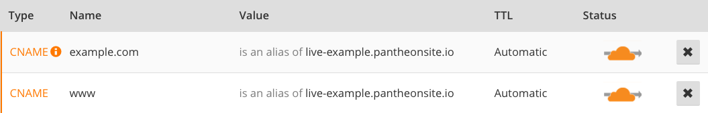

You can use Cloudflare for DNS only or stack it as a CDN on top of Pantheon's Global CDN. We recommend using Cloudflare for DNS only. If you have a paid Cloudflare plan to use features like their WAF or have custom Cloudflare configurations (e.g. many page rules) you'd like to keep, however, then ensure you follow the guide below to enforce HTTPS to prevent any issues.

## Before You Begin
Be sure that you have a:

- Domain name using Cloudflare to host DNS
- [Paid Pantheon plan](/guides/launch/plans/)
- [Domain connected](/guides/launch/domains/) to the target Pantheon environment (typically Live)

## Locate Pantheon's DNS Values

<Alert title="Note" type="info">

The following recommendations differ from those shown in the Site Dashboard. This is because Cloudflare supports **CNAME Flattening**, which prevents association with a single IP address. Ignore the DNS values provided in the Site Dashboard for A/AAAA records.

</Alert>

1. Navigate to the Site Dashboard and select the target environment (typically  Live) then click ** Domains / HTTPS**.
2. Click the **DNS Recommendations** button next to the `www` domain and copy the CNAME value (e.g. `live-example.pantheonsite.io`).
3. Login to your [Cloudflare account](https://www.cloudflare.com/a/login) in a new tab before you continue.

## Configure DNS Records on Cloudflare

### Option 1: Use Cloudflare for DNS Only (Recommended)
This configuration routes traffic to Pantheon's Global CDN exclusively. Unless you're paying for advanced Cloudflare features or if you have custom configurations (e.g. many page rules) you'd like to keep, turn off Cloudflare's CDN so that only DNS hosting services are used:

1. Select **DNS** from the Cloudflare menu bar.
2. Select **CNAME** from the dropdown menu.
3. Enter `www` in the **Name** field and paste the CNAME record value provided by Pantheon (e.g. `live-example.pantheonsite.io`) in the **Domain name** field.
4. Create a **CNAME** record for the bare domain (e.g. `example.com`) using the value from the previous step (e.g. `live-example.pantheonsite.io`).
5. Select desired Time to Live (TTL).

  <Accordion title="Learn More" id="ttl" icon="info-sign">

  #### Time to Live (TTL)

  The TTL dictates the lifespan of a DNS record; a shorter time means less time to wait until the changes go into effect. TTLs are always set in seconds with a few common ones being 86400 (24 hours),  43200 (12 hours), and 3600 (1 hour).

  When you make a change to the TTL of an existing record, you need to wait for the old TTL time to pass - that is, if it had been set to 86400, you would need to wait a full 24 hours for the new setting to begin propagating everywhere.

  </Accordion>

6. Disable Cloudflare's CDN by clicking the cloud icon (should be gray, not orange).
7. Click **Add Record**.
8. Cloudflare Page Rules will not work when Cloudflare is used for DNS only. Instead, redirects are handled by adding redirect logic to the WordPress `wp-config.php` file or the Drupal `settings.php` file. See [Configure Redirects](/redirects/) for more information.

### Option 2: Use Cloudflare's CDN stacked on top of Pantheon's Global CDN
You can configure Cloudflare's CDN as an additional layer on Pantheon's Global CDN service:

1. Select **Crypto** from the Cloudflare menu bar and set SSL mode to **Full (Strict)**.

  

1. Scroll down and enable **Always use HTTPS**

  

1. Scroll down and enable **Automatic HTTPS Rewrites**

1. Remove existing redirects configured via PHP in `settings.php` or `wp-config.php`.

1. Proceed with DNS configuration as describe in Option 1, but make sure the cloud is toggled orange, not gray:

   

## CAA Records (Optional)

A **CAA Record** specifies which certificate authority (**CA**) can issue HTTPS certificates for a domain.

1. Select **DNS** from the Cloudflare menu bar.
2. Select **CAA** from the dropdown menu.
3. Enter the bare domain (`example.com`) in the **Name** field then click to configure the record value:

  

4. Select **Allow wildcards and specific hostnames** for the record's tag. If you are *not* stacking Cloudflare's CDN with the Pantheon Global CDN, enter `letsencrypt.org` as the value:

  

  If you *are* using Cloudflare's CDN, they will [automatically add](https://support.cloudflare.com/hc/en-us/articles/115000310792-Configuring-CAA-Records-) CAA records for their CA providers when Universal SSL is enabled. Do *not* add a record for `letsencrypt.org` in this case.

5. Select desired Time to Live (TTL).

  <Accordion title="Learn More" id="ttl2" icon="info-sign">

  #### Time to Live (TTL)

  The TTL dictates the lifespan of a DNS record; a shorter time means less time to wait until the changes go into effect. TTLs are always set in seconds with a few common ones being 86400 (24 hours),  43200 (12 hours), and 3600 (1 hour).

  When you make a change to the TTL of an existing record, you need to wait for the old TTL time to pass - that is, if it had been set to 86400, you would need to wait a full 24 hours for the new setting to be in place everywhere.

  </Accordion>

6. Click **Add Record**. Your record should look similar to the following once it has been created:

  

7. Repeat this process for the `www` subdomain.

## Restrict Content Based on Geographic Location

If you're using Cloudflare's IP Geolocation feature, you will need to read the `CF-IPCountry` header and set `Vary: CF-IPCountry` on all responses.

## Next Steps

* [Launch Essentials: Domains & HTTPS](/guides/launch/domains/)
* [Launch Essentials: Redirect to a Primary Domain](/guides/launch/redirects/)
