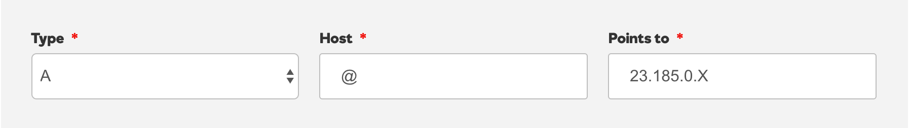
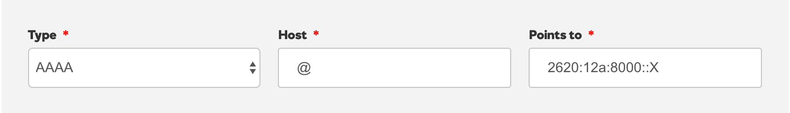

## Before You Begin
Be sure that you have a:

- Registered domain name using GoDaddy to host DNS
- [Paid Pantheon plan](/guides/launch/plans)
- [Domain connected](/guides/launch/domains) to the target Pantheon environment (typically Live)

## Locate Pantheon's DNS Values
Identify DNS values to point your domain to Pantheon:

1. Navigate to the Site Dashboard and select the target environment (typically  Live) then click ** Domains / HTTPS**.
2. Click the **Details** button next to your domain.

Keep this page open and login to your [GoDaddy account](https://godaddy.com/) in a new tab before you continue.

## Configure DNS Records on GoDaddy

### A Record

1. Click your GoDaddy profile in the top right menu bar and select **Manage My Domains**.
2. Click the down arrow to the right of the domain you want to point to Pantheon, then click **Manage DNS**.
3. Click the **Add** button and select **A** from the type dropdown menu.
4. Enter **@** in the **Host** field and enter the A record value provided by Pantheon in the **Points to** field.
5. Select desired Time to Live (TTL).

    <Accordion title="Learn More" id="ttl" icon="info-sign">

    #### Time to Live (TTL)

    The TTL dictates the lifespan of a DNS record; a shorter time means less time to wait until the changes go into effect. TTLs are always set in seconds with a few common ones being 86400 (24 hours),  43200 (12 hours), and 3600 (1 hour).

    When you make a change to the TTL of an existing record, you need to wait for the old TTL time to pass - that is, if it had been set to 86400, you would need to wait a full 24 hours for the new setting to begin propagating everywhere.

    </Accordion>

6. Click **Save**.

### AAAA Records

1. Click the **Add** button and select **AAAA** from the type dropdown menu.
2. Enter **@** in the **Host** field and enter the first AAAA record value provided by Pantheon in the **Points to** field.
3. Select desired Time to Live (TTL).
4. Click **Save**.
5. Repeat steps 1-4 for the second AAAA record value provided by Pantheon. There are two AAAA records for improved uptime and reliability.

### A Record for subdomain
An A record is required to configure a subdomain (e.g., `www.example.com`).

1. Click the **Add** button and select **A** from the Type dropdown menu.
2. Enter **www** in the **Host** field and enter the A record value provided by Pantheon (e.g. `23.185.0.2`) in the **Points to** field.
3. Select desired Time to Live (TTL).
4. Click **Save**.

## Troubleshooting

### The specified record already exists
If you receive an error message that says `The specified record already exists`, click **Cancel** and select **** next to the existing record. Replace the value in the **Points to** field with the record value provided by Pantheon, then click **Save**.

## GoDaddy Docs

[Manage DNS](https://www.godaddy.com/help/manage-dns-680)

## Next Steps

* [Launch Essentials: Domains & HTTPS](/guides/launch/domains)
* [Launch Essentials: Redirect to a Primary Domain](/guides/launch/redirects)
