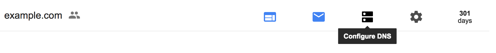
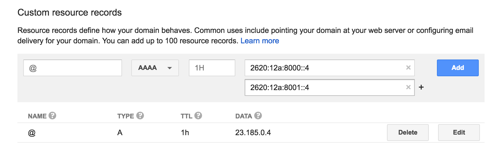

## Before You Begin
Be sure that you have a:

- Registered domain name using Google Domains to host DNS
- [Paid Pantheon plan](/guides/launch/plans)
- [Domain connected](/guides/launch/domains) to the target Pantheon environment (typically Live)

## Locate Pantheon's DNS Values
Identify DNS values to point your domain to Pantheon:

1. Navigate to the Site Dashboard and select the target environment (typically  Live) then click ** Domains / HTTPS**.
2. Click the **Details** button next to your domain.

Keep this page open and login to your [Google Domains account](https://domains.google.com/registrar) in a new tab before you continue.

## Configure DNS Records on Google Domains

### A Record
1. Select the **Configure DNS** icon within the Google Domains interface:

  

2. Scroll to the **Custom resource records** section.
3. Enter **@** in the **Host** field and provide the A record value provided by Pantheon in the **IPv4** field.
4. Set desired Time to Live (TTL).

    <Accordion title="Learn More" id="ttl" icon="info-sign">

    #### Time to Live (TTL)

    The TTL dictates the lifespan of a DNS record; a shorter time means less time to wait until the changes go into effect. TTLs are always set in seconds with a few common ones being 86400 (24 hours),  43200 (12 hours), and 3600 (1 hour).

    When you make a change to the TTL of an existing record, you need to wait for the old TTL time to pass - that is, if it had been set to 86400, you would need to wait a full 24 hours for the new setting to begin propagating everywhere.

    </Accordion>

5. Click **Add** to create the record.

### AAAA Records

1. Within the same section (**Custom resource records**), change the record type from **A** to **AAAA**.
2. Enter **@** in the **Host** field and provide the first AAAA record value provided by Pantheon in the **IPv6 address** field.
3. Click the **+** icon to the right of the IPv6 field then enter the second AAAA record provided by Pantheon in the **IPv6 address** field.
4. Set desired Time to Live (TTL), then click **Add** to create the record.

### A Record for subdomain
An A record is required to configure a subdomain (e.g., `www.example.com`).

1. Within the same section (**Custom resource records**), select the record type **A**.
2. Enter `www` in the **Host** field and enter the A record value provided by Pantheon (e.g. `23.185.0.2`) in the **IPv4** field.
3. Set desired Time to Live (TTL), then click **Add** to create the record.

## Next Steps

* [Launch Essentials: Domains & HTTPS](/guides/launch/domains)
* [Launch Essentials: Redirect to a Primary Domain](/guides/launch/redirects)
