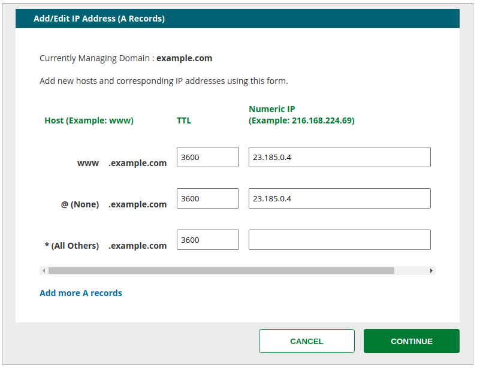
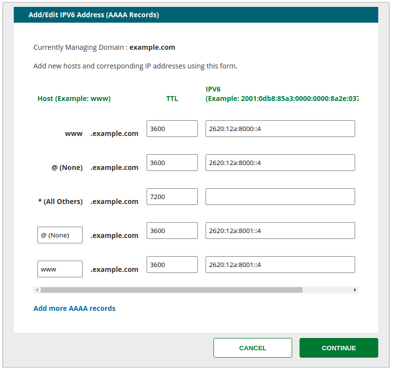

## Before You Begin

Be sure that you have a:

- Registered domain name using Network Solutions to host DNS
- [Paid Pantheon plan](/guides/launch/plans)
- [Domain connected](/guides/launch/domains) to the target Pantheon environment (typically Live)

## Locate Pantheon's DNS Values

Identify DNS values to point your domain to Pantheon:

1. Navigate to the Site Dashboard and select the target environment (typically  Live) then click ** Domains / HTTPS**.

1. Click the **Details** button next to your domain.

Keep this page open and login to your [Network Solutions account](https://www.networksolutions.com) in a new tab before you continue.

## Configure DNS Records on Network Solutions

### A Record

1. Navigate to **Account Manager** > **My Domain Names**

1. Select the domain you want to point to Pantheon, then click **Manage**.

1. Click **Change Where Domain Points**, then select **Advanced DNS**.

1. In the IP Address (A records) section, click **Edit A Records**.

1. The domain likely has a few default values for `www` and the bare domain. Paste the IP address provided by Pantheon in the Numeric IP field for the existing `@ (None)` record, then delete any default records like so:

  

1. Select desired Time to Live (TTL).

    <Accordion title="Learn More" id="ttl" icon="info-sign">

    #### Time to Live (TTL)

    The TTL dictates the lifespan of a DNS record; a shorter time means less time to wait until the changes go into effect. TTLs are always set in seconds with a few common ones being 86400 (24 hours),  43200 (12 hours), and 3600 (1 hour).

    When you make a change to the TTL of an existing record, you need to wait for the old TTL time to pass - that is, if it had been set to 86400, you would need to wait a full 24 hours for the new setting to begin propagating everywhere.

    </Accordion>

1. Click **Save Changes**.

1. Once changes are saved, the section of the Advanced DNS interface for A records should look like this:

### A Record for Subdomain

An A record is required to configure a subdomain (e.g., `www.example.com`).

1. In the IP Address (A records) section, click **Edit A Records**.

1. Edit the **www** record field and enter the A record value provided by Pantheon (e.g. `23.185.0.2`) in the **Numeric IP** field.

1. Select desired Time to Live (TTL).

1. Click **Save Changes**.

### AAAA Records

1. In the IPV6 Address (AAAA Records) section, click **Edit AAAA Records**.

1. For each domain hosted at Pantheon, enter the AAAA record value provided by Pantheon in the **IPv6** field:

  

1. Enter the desired Time to Live (TTL).

1. Click **Continue**.

1. Review the information on the confirmation page, and then click **Save Changes**.

## Network Solutions Docs

- [Managing Advanced DNS Records](https://knowledge.web.com/subjects/article/KA-01111/)
- [Adding an IPv6 AAAA record](https://knowledge.web.com/subjects/article/KA-01111/en-us#IPV6%20Address)

## Next Steps

- [Launch Essentials: Domains & HTTPS](/guides/launch/domains)
- [Launch Essentials: Redirect to a Primary Domain](/guides/launch/redirects)
