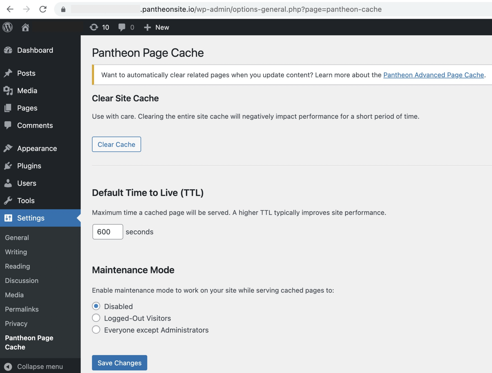

This self-referencing document can be used as a starting point to write your own new doc for Pantheon. Start with an overview of the topic, which may include a summary of what will be accomplished after following the instructions.

See our [Style Guide](/style-guide) for reference on our usage of Markdown and custom JSX components.

<Alert title="Note" type="info">

For optimal use of this document, consider viewing the markdown file and rendered page in Gatsby side-by-side. Any important points the customer needs to be made aware of can be put in a note like this.

</Alert>

## Before You Begin
Here's a list of prerequisites or technical requirements a user must have or understand before starting the task. This is a good place to use:

 - A bulleted list
 - Links to local software needed first
 - Links to any Pantheon docs readers should read or comprehend the concepts of before starting this one.

The steps of your guide should be broken into sections. Particularly long sections should be broken further into subsections. Read on for examples.

## First Major Step
Because this section will have its own subsections, a line or two to briefly describe the goal of this main section should go here.

### First Subsection Step
1. You shouldn't need to drill down any further than this. You'll also notice no need to preface the section, we can begin with instructions.

1. For sections with several steps, be sure to use numbered lists. Each step should be prefixed with `1. `. Gatsby will number the steps, making it easier to add or remove steps later.

1. To show you how we're spacing ordered steps, here's the previous two steps in code block form.

   ```markdown
   1. You shouldn't need to drill down any further than this. You'll also notice no need to preface the section, we can begin with instructions.

   1. For sections with several steps, be sure to use numbered lists. Each step should be prefixed with `1. `. Gatsby will number the steps, making it easier to add or remove steps later.
   ```

  The codeblock above was created using a code fence. While Markdown support indentation to create code blocks, we avoid this when we can to better nest content.

### Our Second Subsection
1. This section may reference concepts already described above easily in each step with `in-line code snippets`.

1. If new concepts or ideas are introduced, we'll use **bold** to emphasize it.

1. Finally, let's some code block examples, with a more interesting syntax to highlight.

   ```bash{outputLines: 2-7}
   git clone --depth 1 git@github.com:pantheon-systems/documentation.git
   Cloning into 'documentation'...
   remote: Counting objects: 41601, done.
   remote: Compressing objects: 100% (137/137), done.
   remote: Total 41601 (delta 83), reused 0 (delta 0), pack-reused 41463
   Receiving objects: 100% (41601/41601), 112.21 MiB | 5.91 MiB/s, done.
   Resolving deltas: 100% (31995/31995), done.
   ```

   ```bash{outputLines:3}
   cd documentation/
   git checkout -b update-template
   Switched to a new branch 'update-template'
   ```

Notice that in this example we've used `{outputLines}` to specify which lines are output. Doing so adds a prompt symbol (`$`) to the remaining lines, without making it part of out actual code block. This symbol won't be copied with the command itself on click-and-drag.

## Second Major Step
If you're looking at this document as generated by Gatsby, you'll notice by now that the table of contents (**TOC**) has expanded to show all the previous subtopics. As we move further down it will retract the sections of [First Major Step](#first-major-step), and highlight the current section. If you need to refer the reader to another section in the guide you can use an **anchor link** as we just did.

Now let's look at some of the commonly used Markdown syntax in the docs.

## Images
Images are a great way to show what the user should be seeing in a graphic user interface (**GUI**) environment, like the WordPress Admin Dashboard:



<Alert title="Warning" type="danger">

Images of terminal output is frowned upon. When small changes are required to comply with software updates, replacing a few characters is much easier than generating a new screenshot.

</Alert>

## Other considerations
 - [Avoid be verbs](http://writing.rocks/to-be-or-not-to-be/)
 - Avoid colloquialisms and personal opinions, feelings, or anecdotes.
 - Only assume as much knowledge from the reader as specified in [Before You Begin](#before-you-begin). Otherwise explain everything.

## See Also
If you can, end your doc with links to external resources that can be used to improve the reader's comprehension, or to guides on logical next steps in a common development workflow.

 - [An internal guide with a relative link](/get-started)  
 - [An external guide with a full URL](http://writing.rocks/)
